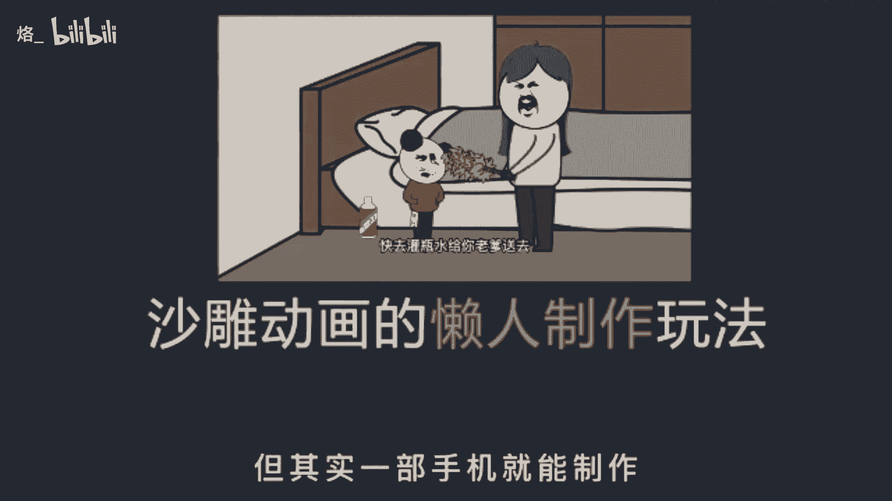
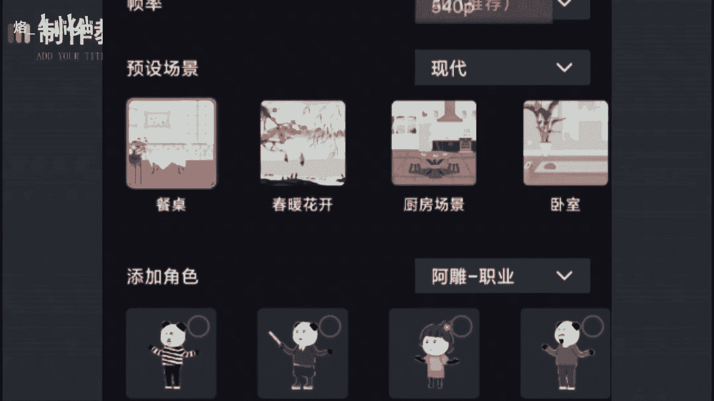
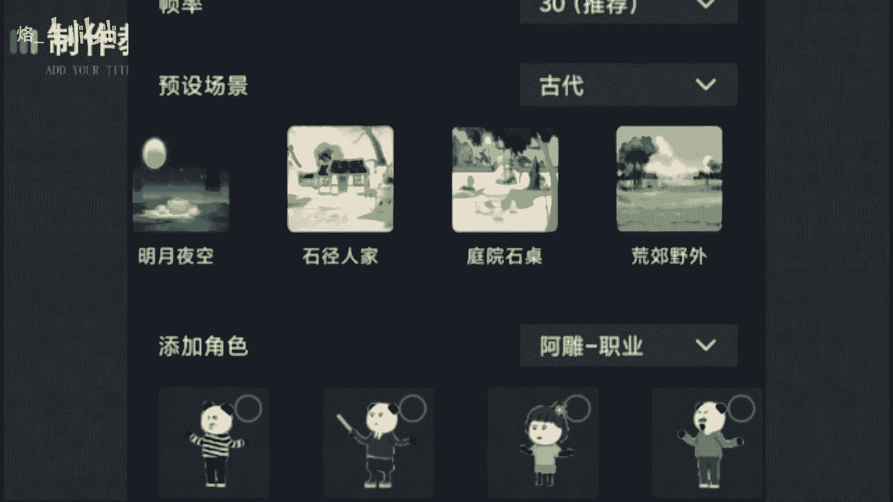
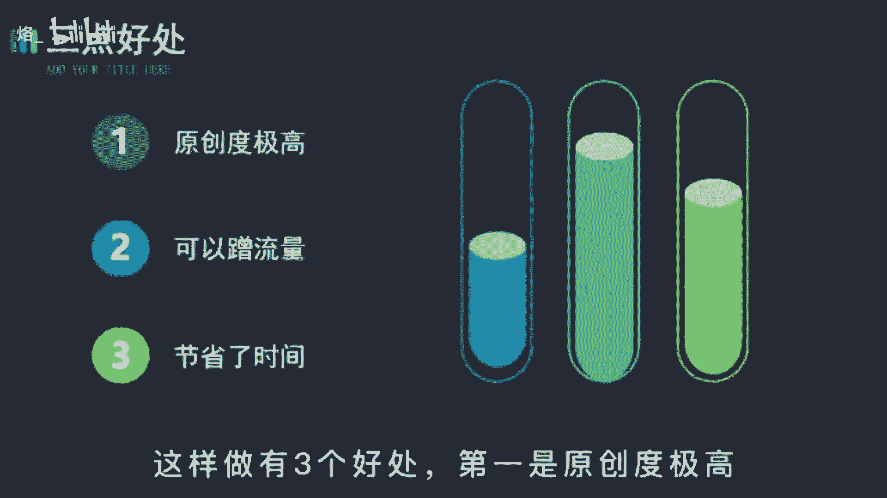
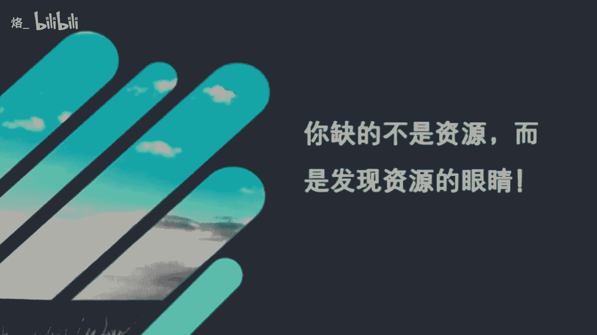

# 【2024版抖音运营教程】全B站最良心的新媒体运营高阶教程合集！抖音运营 起号真的不难！ - P29：抖音沙雕动画玩法 - 烙_ - BV1Uz421S7cY

这种沙雕动画的懒人做法只有少数人才知道，不需要你会任何技术，也不用你编段子配音就能让作品自带流量，虽然它看起来挺复杂的，似乎不是一个人就能完成的东西，但其实呢一部手机就能制作。

在制作上，你只需要打开这个软件，选择合适的比例，抖音呢九比16西瓜，16比九分辨率选1080P会清晰一点。

帧率不动，场景里有四个bug，比如选个古代。

再往右一拉就能看到这个板块下全部的场景，角色也是一样的，分类里有很多的角色模型，有沙雕的，武侠的斗罗。

大陆的奥特曼，非常丰富，当我们把这些都选择好后，就可以开始制作了，它的操作方式啊，跟手机剪映差不多，我们点击角色选择添加动作，点击播放，看一下人物啊，就会动了，如果不喜欢这个动作。

你还可以更换动作角色啊，也可以再添加，用来丰富情节，然后导入音频就可以合成出完整的动画，是不是很简单呢，接着再说一下配音，这才是沙雕动画的灵魂，教你一个懒人玩法，不需要自己编段子也能活。

还有收益吃这个方法呢就是拍同款，有一些聪明的博主已经开始用这个方法，你就去找一些搞笑的博主，直接用他的原声配音沙雕视频，这样做有三个好处，第一是原创度极高。

不会卡你的播放收益，第二就是你可以蹭这个大博主的流量，有些人啊就喜欢到原神里看看别人的模仿视频，有多好笑，这就给你带来了曝光，第三呢是省去了你的脑细胞，不用自己编段子去配音了，有的时间有了效率。

你就能多制作一个账号，是两个号的流量索引，所以有时你缺的不是资源，而是发现资源的眼睛好了，今天的课程呢就到这里结束了。

