# 【2024版抖音运营教程】全B站最良心的新媒体运营高阶教程合集！抖音运营 起号真的不难！ - P8：1如何被用户记住 - 烙_ - BV1Uz421S7cY

好吧，那么接着我们再往下讲下一遍啊，就是我的账户搭建出来的哦，我的商业定位，有的内容定位就定了，可是我要怎么才能让我的用户记住我呢，有同学说老师我的这个行业竞争实在太大了，就像刚才我们看到的那个鹤鸣九。

他是一个唱歌的，他歌唱的也不错，他的作品完成的也很用心，可是他不涨粉丝啊，那我要去做的话，我怎么才能让我的用户记住我，爱上我，关注我，对不对，那这个呢就涉及到我们的超级符号了。

那关于超级符号这块呢，给大家看几个案例好了。

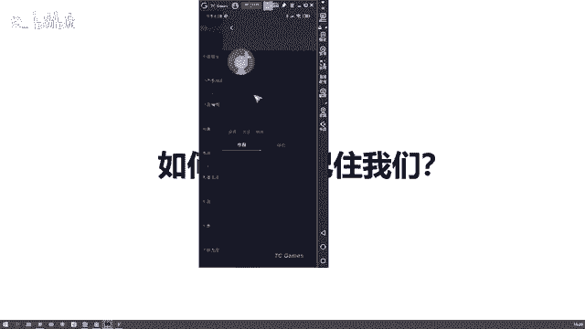

这个木鱼医生呢他是一个风湿病科，感染的感染科的一个主任。

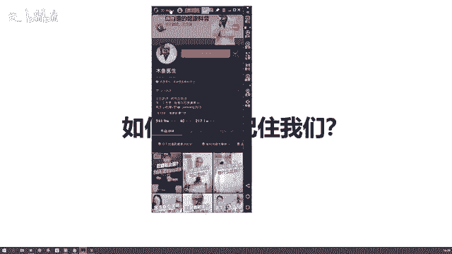

然后我们可以看一下他的一个作品。

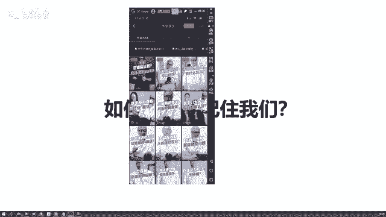

好了大家应该能看得清楚吧，不可以扣肚脐眼，大部分人的肚脐眼都有所谓的利益不破，不要用力的用手抠啊，因为肚脐很脆弱，你抠的时候一不小心太用力了，就可以抠破，导致感染，严重的会导致腹膜炎，那怎么办呢。

清洁肚脐的正确方法，思源棉签沾一点点木叶叶水的稀释物，轻轻的擦拭，用手抠抠肚脐的点赞区，集合好，我们再来看另一个买贵的要好还是便宜的要好，维生素C两块钱长这样，98块长这样，活动的200块钱的事。

要么准治好，98块钱的事实，准治好两种，出去申诉比较实用，相声这些也健康，食品添加剂效果并没有差别，多出来的96万是你的智商得受罪了，为什么店员推荐98块钱呢，是一名两块钱的维生素戏，没什么利润啊。

什么时候该吃维生素C，我们现在也是克拉缺乏维生素，如果你的生活不缺麻药等，都是一种玩具，甚至会造成热烈的影响，人生菌剂会有加大对胃的刺激，而且长期过量吃维生素片还会导致一些疾病，比如说家属不满。

引爆我们食品中富含维生素，如猕猴桃橙子，有这闲钱去买点水果吧，买醉好了，我们就看这个木鱼，一生的两个作品啊，那么我们会发现他在这个啊，就是讲知识的过程中，他有一个习惯性的动作。

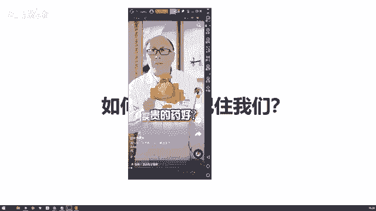

或者是一个标志性的动作是什么，就是他的手里有一个木鱼。

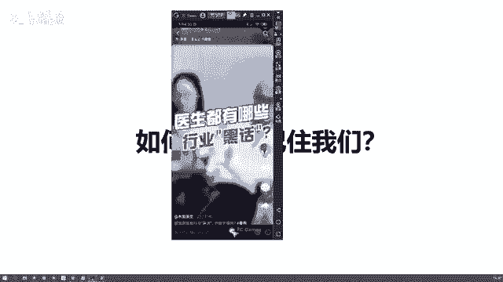

你看他的手里会有一个木鱼，然后他每次说完一段话的时候，会用手敲一下木鱼，然后呢才开始说话，而且配的这个音效里面也有这个敲木鱼的声音，非常大声，我们都能听到，对不对，那么这个的话呢我们叫做啊超级符号。

我们叫做木鱼医生的一个超级符号，就是敲木鱼的动作，敲木鱼的动作是什么，是一个行为，对不对，是一个行为的超级符号，也就是说他这个行为呢，只是木鱼医生标志性的动作，而我们啊当我们看不到它的时候啊。

如果说听到了这样的一个敲木鱼的声音，我们会在脑海里想，哎我在哪看过这个事情，我在哪看过这个视频，哎好像是一个叫做木鱼医生的，对不对，他通过这样的一个行为，让我们把它记住了，甚至把这个行为跟木鱼一生。

就完全的结合在一起了，只要听到这样的声音，我们就会想到诶，对这个就是木鱼医生他一个标志性的行为动作，对不对啊。

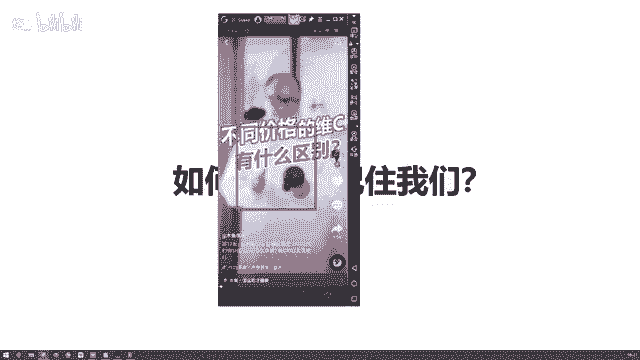

那么接下来我们再看一个比较典型的案例，我们看李佳琦。

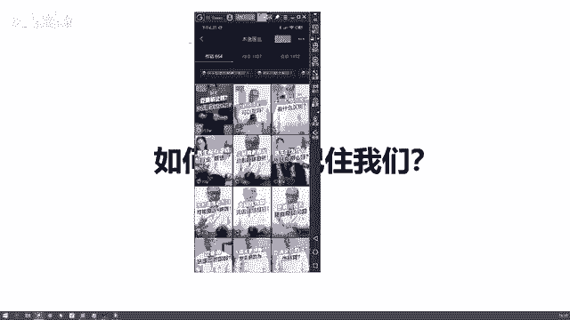

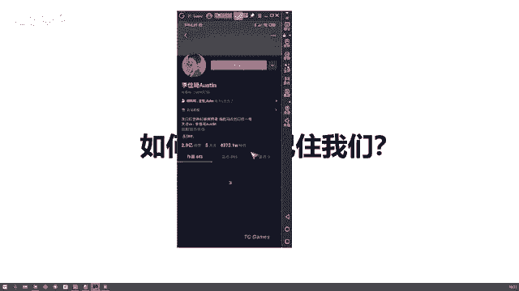

新品我要召唤我自每晚08：15分找他。

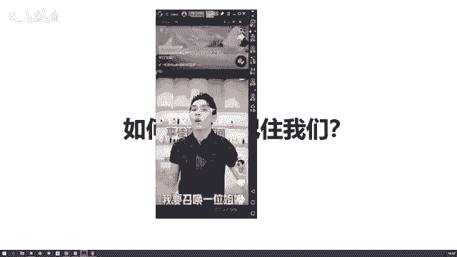

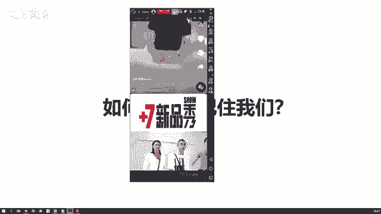

比较典型的作品啊，哎这个限量版糖果还。

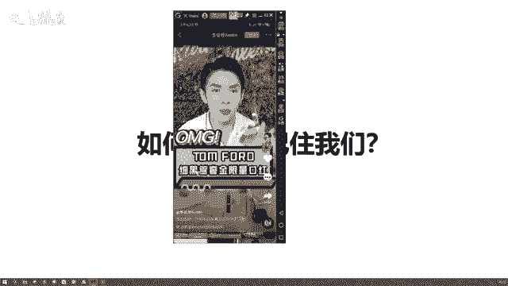

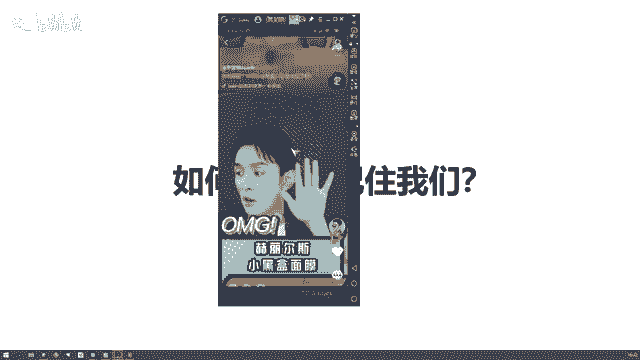

美们家就是夏天大家都很喜欢的好啊。

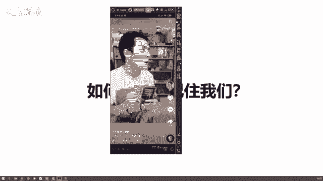

哥哥哎，李佳琦说，oh my god的视频去哪里了。

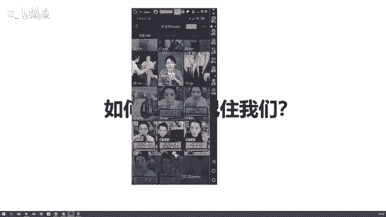

听清楚了，来所有女生选。

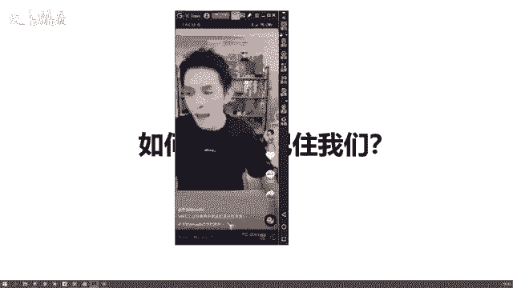

你们准备好了没有，老美们做的是白雪公。

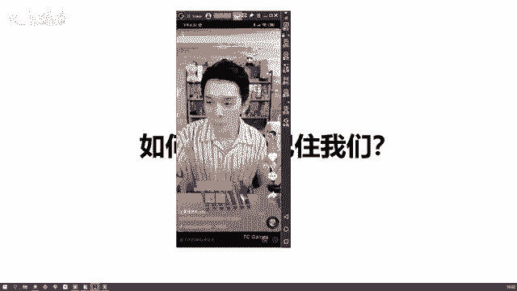

他来了他来了他来了，哎我找不到他的这个作品了哈，我找到他的作品了，但是我们刚开始去认识李佳琦的时候，他一个标志性的话啊，不用我说，大家都知道是什么，Oh my god，对不对啊，Oh my god。

然后什么他来了，他带着什么什么低价走来了，是不是他通过这样的一个oh my god，然后他去吸引到了这些女生，那包括说可能有些男生啊，他不太买口红，他可能不太认识李佳琦这个人。

但是呢他可能在跟别人介绍的时候说，哎那个谁谁谁在直播呢，哎到底是谁啊，就是那个经常说oh my god的那个人啊，是不是我们经常会用这种方式去想起诶，我们曾经有过印象的那个人，包括说你在上学的时候，诶。

隔壁班的那个谁下课的时候啊，就是碰了我一下，然后你同学问是谁呀，哎呀我想不起来了，就是那个胖子，对不对，那这个胖子其实也是属于一个什么呀，我们的超级符号胖嘛，对不对，它是一个看起来视觉效果。

那这个oh my god呢，它就是一个呃就是叫什么理念啊，或者说说出来的叫做话啊，对不对，话语那刚才的木鱼呢叫做行为，对不对，那可能还有就是什么视觉上的啊，比如说他经常戴帽子，对不对啊。

呃我们就是再举个例子，就是我们还是同学说隔壁班的那个谁谁谁，他总我是戴着一个帽子，诶，他叫什么了啊，我忘了他叫什么，他经常戴那个样子的，你忘记了吗，哦我想起来了，好像就是那个人，但他叫什么。

你其实不知道，你记住的是他经常戴帽子的这个行为，对不对，记住的是你看到的那个视觉效果对吧，所以我们把这些东西无论是视觉上的，我们是听觉上的，然后就蔡老师这样说，OK不对，好的不是不是，或者说宝贝。

这个也是我经常会说的话，可能你们想起来啊，宝贝或者OK不然你就能想起来我对吧，这个是我们经常说的超级符号，而这个超级符号的存在啊。

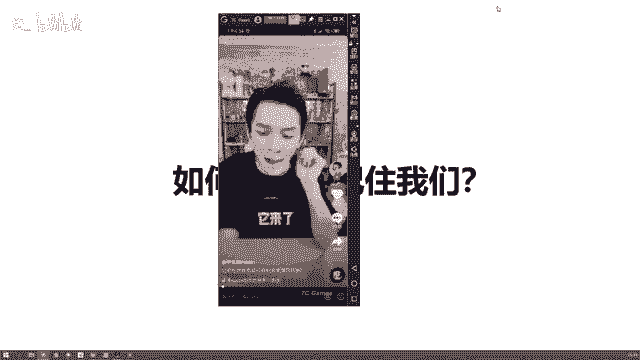

他就是为了能够让别人快速的记住我们啊，比如说最开始的时候啊，那个李李雪琴大家都知道吧，啊李雪琴经常在在录视频的时候，第一句话说的是啊，大家好，我是李雪琴啊，这是马云你好，我是李雪琴啊，是不是王思聪你好。

我是李雪琴，这是他的一个什么呀。

就是标志性的话啊。