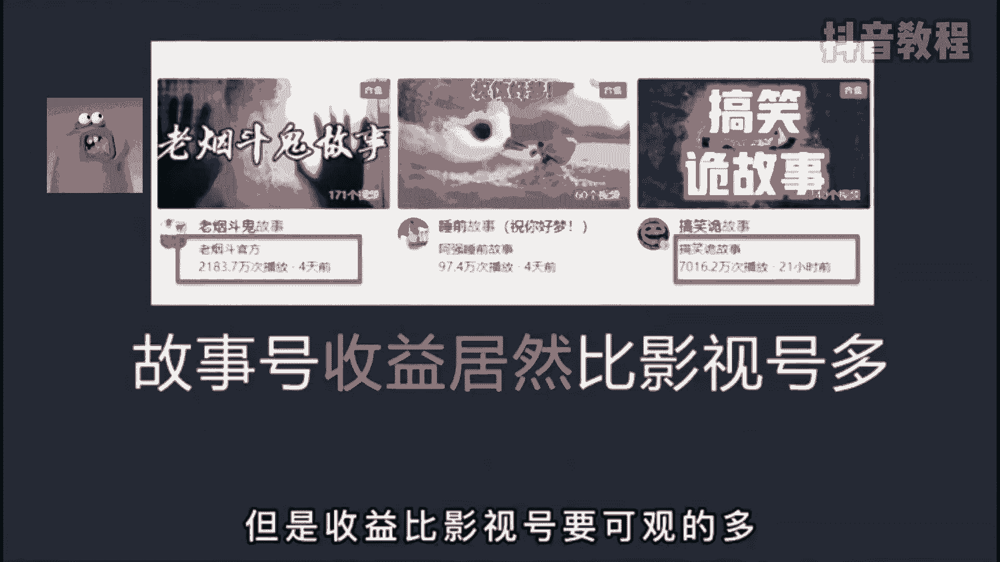
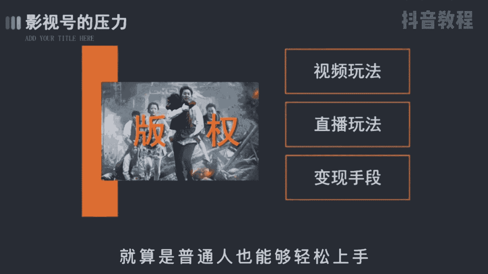
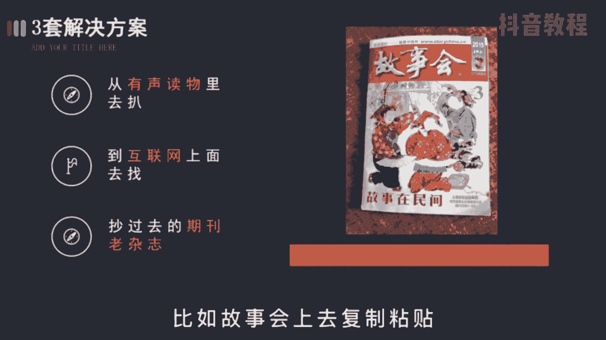
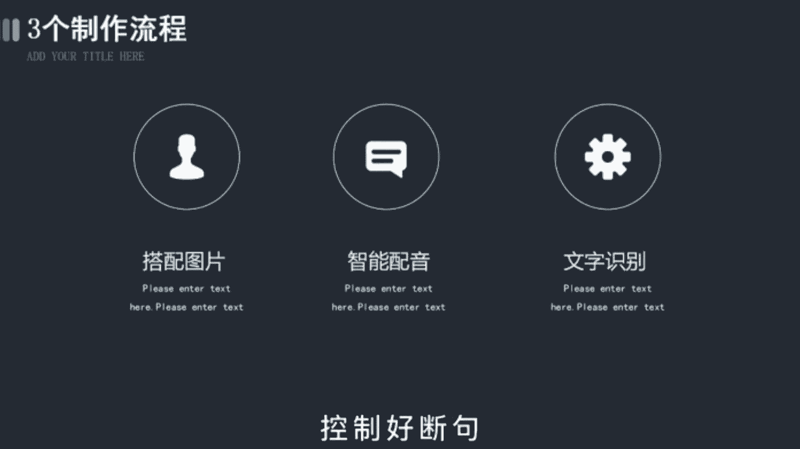

# 【2024版自媒体运营教程】全B站最良心的新媒体运营高阶教程合集！自媒体运营 起号真的不难！ - P23：变现篇丨抖音故事号要怎么做 - 好久不见鸭一 - BV1PvYNecEEt

故事号是最近比较火的一个项目，类似于之前的影视号，但是收益呢比影视号要可观的多。

影视号因为版权的问题，部分人啊面临着转型的压力，另外平台给予的流量也越来越少，所以清爽去做故事号会是一个很好的契机，接下来呢我将分成三期视频，把故事号的短视频和直播的玩法，以及变现的手段都拆解给你。

就算是普通人也能够轻松上手。

首先啊这个项目的入行门槛极低，只需要一部手机和一点时间即可，内容上呢就是简单的图片加文字加配音，图片甚至不用动，唯一动的只有字幕，不信的呢可以去搜一下讲故事，括号收图。

在用户里面啊，全是这类账号，那为什么这类账号既容易吸粉，又容易变现呢，要知道人类之所以能够发展进步，就是因为有想象力，故事呢就是由想象而产生的，当人们听一个故事时，就会想象画面。

这可比实际的影片更有看头，任何一个导演都导演不做你的版本。

回到项目本身，要怎么作为一个能变现的故事号呢，首先你需要解决故事的问题，这里呢给你三套解决方案，第一是从有声读物里面去扒，就是有些人啊听小说的地方，各种类型的情节都有很方便，第二呢是互联网上面去找。

各路大神曾经编过的故事，保质保量，童叟无欺，第三呢是从过去的老杂志期刊上，比如故事会上面去复制粘贴。

看过的都说好，那前两种方法的好处呢，是可以通过文章的阅读数点赞，判断哪些是观众爱听的东西，减少试错成本，另外呢过去发表的杂志，比如公会，那可是被市场验证过的产物，多少人的青春都被他吸引过。

不过呢这里要注意的是。

文章啊要尽量替换一下地名，人名等容易出现的第一点，不要直接照搬，有能力的呢最好洗一下稿，这样能最大限度的避免未来的一个。

侵权风险的发生，当故事解决后，接着你就要去找与内容相匹配的图片，比如民间故事就用农村的图片，其次呢是配音，现在啊有好多智能配音工具，比如配音加很简单，你直接用就行了，最后呢是字幕。

把做好的音频直接用简易进行文字识别，控制好断句，这样呢就省去了打字和排版的时间。

而视频的发布时间，一般是在中午的12点和晚上的十点以后，因为这个时间段一般是大家休息的时候，会更需要我们的故事来打发时间，值得注意的是，故事后的受众一般是中老年人，所以字幕音量都尽量大一点。

不要用浅色的字体配音呢，保持沉稳缓慢清晰即可，这些细节会帮助你更快地吸引粉丝的喜爱。

