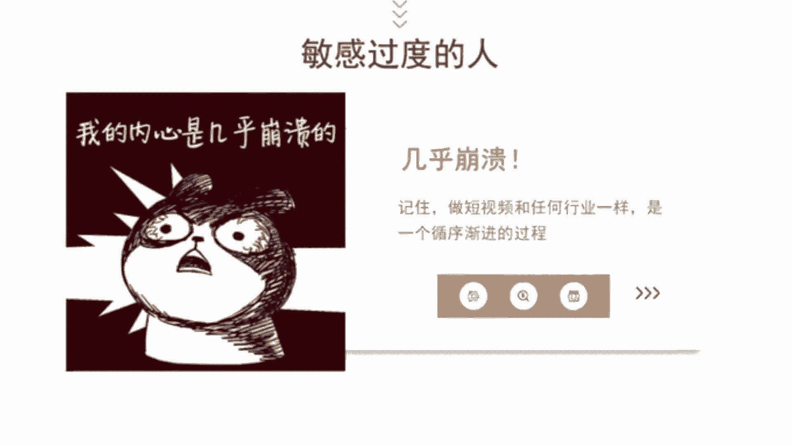
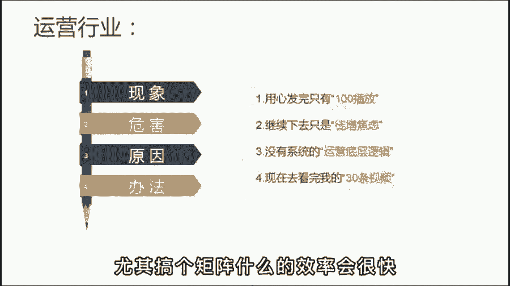

# 【2024版自媒体运营教程】全B站最良心的新媒体运营高阶教程合集！自媒体运营 起号真的不难！ - P31：基础篇丨爆款文案套路 - 好久不见鸭一 - BV1PvYNecEEt

给你们揭秘一个爆款文案套路，各行各业谁用谁火，在这个内容为王的时代，运营者必须要具备一定的脚本创作能力，而想要拥有创作能力，我们首先要弄清楚什么是好文案，其实啊就一点记好了，要让对方认为与自己有关。

也就是所谓的引起共鸣，如果你说的我都不关心。

怎么可能会有人看呢，那到底是明白了要怎么做呢，给你一个万能公式，现象加危害加原因加解决办法，怎么理解呢，现象筛选用户关系与你有关，就会停留危害，负责放大情绪，不让你五秒划走，原因引导继续观看。

提高完播率，最后呢给出解决办法，鼓励点赞，提升互动率，那举个例子来说，比如服装行业，梨形身材的女孩儿太难买裤子了，挑错了样式显得腿又粗又短，但梨形身材呢是天生的，很难改变，而这三种裤子不仅显瘦。

还显腿长，穿上第二天就被小哥哥搭讪了，姐妹们赶快收藏起来吧，你看这段短文案是不是完美契合了这个公式，开头一句话就把目标客户给锁定了，然后不断购入，他看完视频，有了这样的精准粉丝，后面变现起来也很容易。

我们再来个运营行业，每天啊用心制作短视频，但发完只有100播放，继续下去呢只是浪费时间，徒增焦虑，这跟你啊没有系统的运营底层逻辑有关，现在呢去看完我的前三条视频，不花一分钱也能学会运营知识。

还不快快行动起来，懂了吧，用好这个套路，不管什么行业往里套肯定没问题，都是不足30秒的短文案，后边派遣起来呀也轻松，尤其搞个矩阵什么的。

效率会很快，但以上呢我已经举一反二了，至于反三就交给你了，你可以根据你的行业特性，把你的思考过程发出来。

