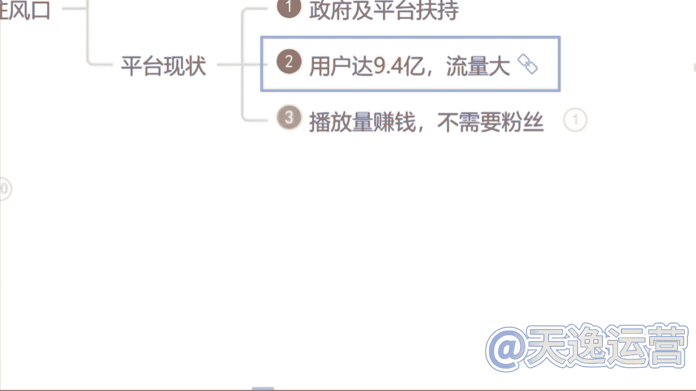
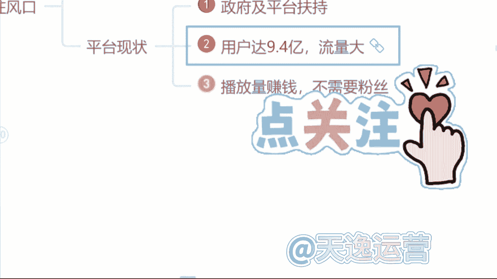
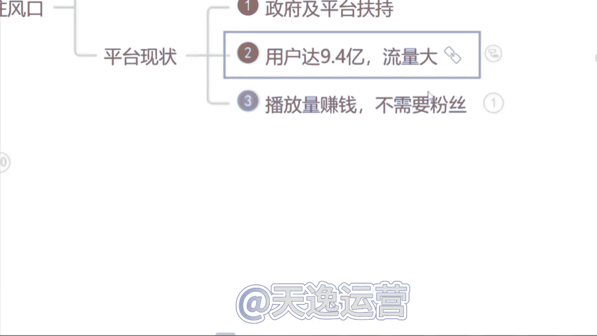
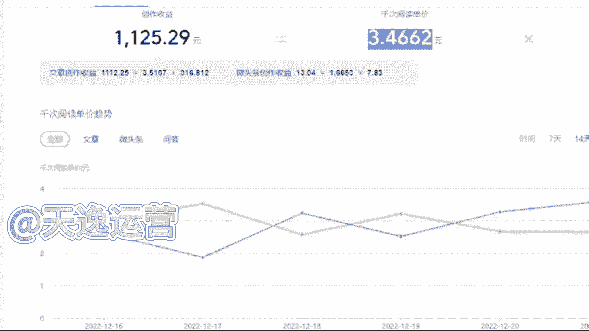
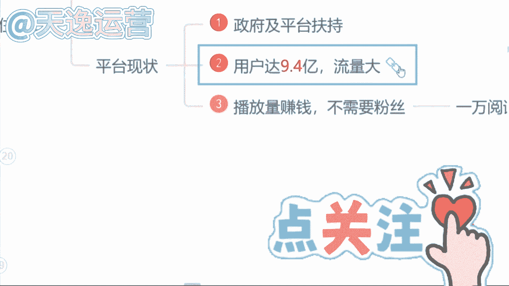
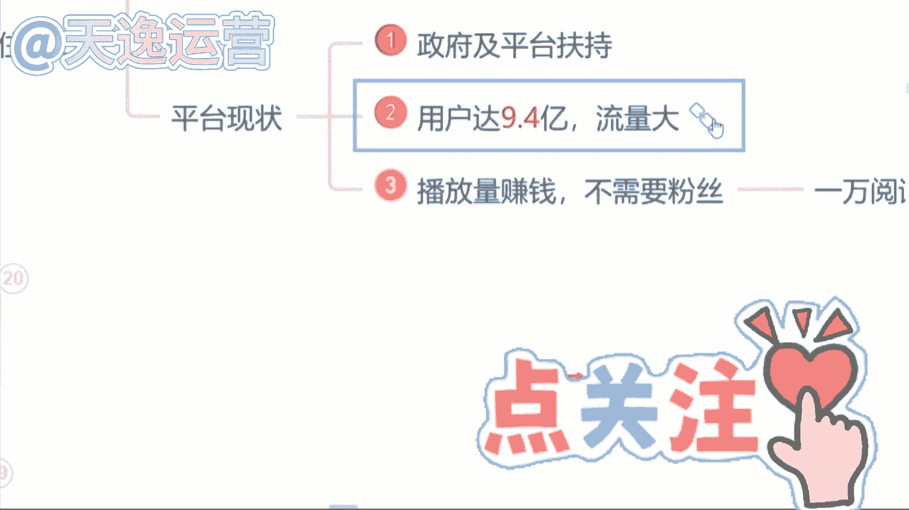
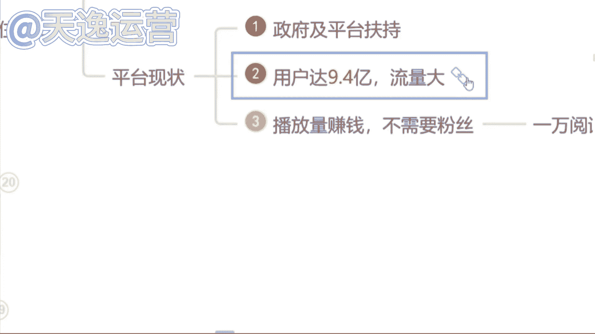
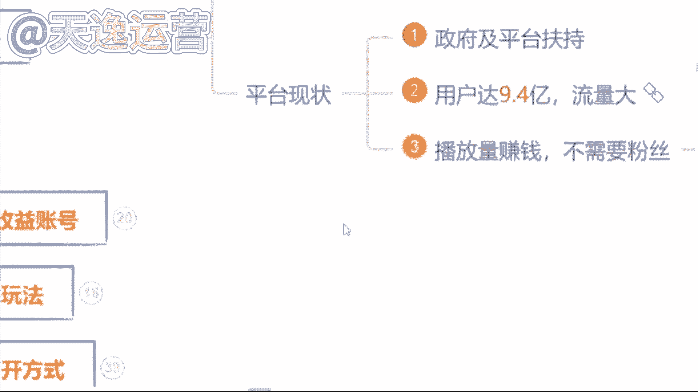

# 【2024版自媒体运营教程】全B站最良心的新媒体运营高阶教程合集！自媒体运营 起号真的不难！ - P40：3.播放量赚钱，不需要粉丝 - 好久不见鸭一 - BV1PvYNecEEt

那除此之外呢，现阶段我们自媒体这个行业呢，最大的一个优势就是我们去做，不需要我们有任何的一个粉丝基础，那我们只用靠这个播放量就能够赚到钱，但是我们呃说到这里哈，很多同学会有这样一个问题了，艾森老师。

我们去做视频，但是我们没有粉丝，这个播放量是哪里来的呢，就有没有这样疑问，我去做视频是吧，没有粉丝，那这个视频的播放量是哪里来的呢，首先要告诉大家，这个播放量是平台扶持的流量，刚才我们讲到了。

国家支持它的文件，已经有了平台，它是会扶持我们去做视频的，就看你作品的质量如何了，就可能同学们现在了解到的平台自媒体平台哈，可能更多的要么就是抖音，要么就是快手，是不是就平常刷视频用的最多的。

是不是抖音和快手这两个平台，我们都知道，抖音这个平台在前两年他短视频最火热的时候。

就他在抖音直播带货最赚钱，但是我们都知道你想要去这个带货，你必须要有粉丝基础吧。

你没有粉丝基础，你去带货谁来买呢，是不是，那除此之外呢，我们自媒体平台跟抖音，它是有一个本质的区别的，我们只需要去这个平台上面去做视频，有人观看，我们就能够靠这个播放量去结算收益的。

我们只需要了解一点什么呢。

1万的播放量他能够拿到多少钱，很多同学会问了，曾老师为什么不是以千为单位呢，是以万为单位呢，当然有啊，有1000阅读量的单价，但是只有我们拿到1万阅读量的收益的，这个播放量的时候，我们才能够去结算收益。

才能够把这个收益提现到我们的银行卡里面来，我这样讲能明白吗，就我们去看一下。

这个1万的播放量的单价到底是多少啊，首先呢我们这边可以看见一个千字的阅读单价，能看见吗，千字的阅读单价是多少钱，是三块四毛钱，看见吗，这是1000的啊，就是1000的阅读量，我们能够赚到三块钱。

那1万的阅读量又有多少呢，我们乘以1万嘛，就是34块钱，这个单价你们要记清楚，这个就是我们未来能够揣在自己兜里面的钱啊，等一下曾曾老师会问的这11万的阅读量，单价到底是多少呢是吧，这个要记住好吧。

那我们现在知道了这个单价了。

很多同学会说诶，曾老师反正他都赚钱是吧，那我现在不做，我以后再来做吧是吧，反正他都赚钱，反正他都赚钱是吧，这个行业我现在不做吧，我以后再来做，有没有这样想法的，有的你就打个友字就说到这里呢。

问同学们这样一个问题，就是如果说这个未来自媒体行业，它发展成为像这个9年义务教育一样，所有人都能来做的时候，你觉得你还能不能做起来，就未来我们这个自媒体行业，国家说诶同学们朋友们。

我们现在已经把它纳入到这个，9年义务教育阶段了，你全都在做，还能来做起来吗，有的说能，有的说不能，就问同学们这样一个问题吧，就是这个呃，就跟原来这个18年的抖音是一样的道理哈，18年抖音刚出来的时候。

他是最火的时候，刚刚站在风口上面是吧，那个时候选择做抖音的人，他是最赚钱的，他也赚到钱了，但是现在你再去做抖音，你还能做起来吗，现在你再去做抖音还能做起来吗，就做不起来了，对不对，是一样的道理。

每一个行业它都有相应的一个风口存在的，这个机会放在这里，他是不会等着你来选他的风口，他是会过去的，你就不能来做了是吧，如果说未来你去大街上面随便拉一个人问他，你知道自媒体吗。

他说哎我知道那个时候我就劝你不要来做了啊，因为你就需要花更多的时间，更多的精力，你才有可能能做起来。

包括我们刚才说到的这个行业的一个，市场报告啊。

就调查的这个报告是今年9月9号来发布的，说明我们是了解到这一个信息的第一部分人群。

我们刚刚站在这个行业的风口上面。

小米创始人雷军曾经说过哈，站在风口猪都能起飞，就看咱们要不要去做一只风口上面的猪是吧。

这个就是我说到的一个行业的风口啊，就看你自己愿不愿意来选择了，那说到这里问一下同学们，你觉得这个自媒体行业它值得你来做吗，你觉得它值得咱们来做嘛是吧。

