# 【2024版自媒体运营教程】全B站最良心的新媒体运营高阶教程合集！自媒体运营 起号真的不难！ - P44：7.视频剪辑实操（下） - 好久不见鸭一 - BV1PvYNecEEt

啊记住了对吗，好来接下来一样的右下角对勾点起来好，这个比例我们弄好了，弄好了过后呢，来接下来第二点，我们每一个视频呢，它毕竟不是一个原有的视频，不是一整个每个视频呢大概在十秒钟左右对吧。

那这个视频之间呢它是必须要有衔接的，我们必须要添加这个转场的视频，就我不知道同学们有没有，这个在看视频过程当中，有没有看到过一些转场，就比如说呃有的这个视频看完了之后。

中间会给你添加一个不属于这个视频当中，任何一个片段的搞笑的界面，有没有看到过，有，对不对，为什么要添加转场呢，我们要让用户明确的知道，它每一个片段的内容是不一样的，而是不一样的。

如果说每一个片段不一样的情况之下，你不添加转场，他在看第二个视频的时候，心里会咯噔一下，诶，这个视频的片段怎么长得不一样了。

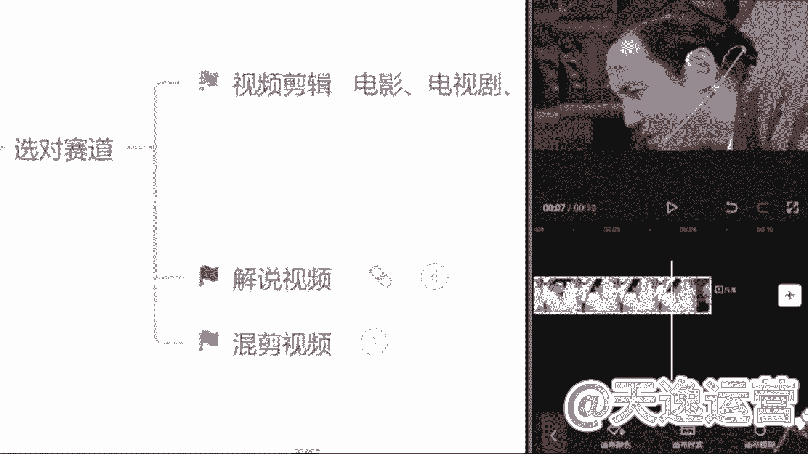

视频内容怎么不一样呢，往往有这种情况的时候，我们会做出什么一个动作呢，退出去看一下我今天看的这个视频是什么，如果说他有这个退出去这个动作了。

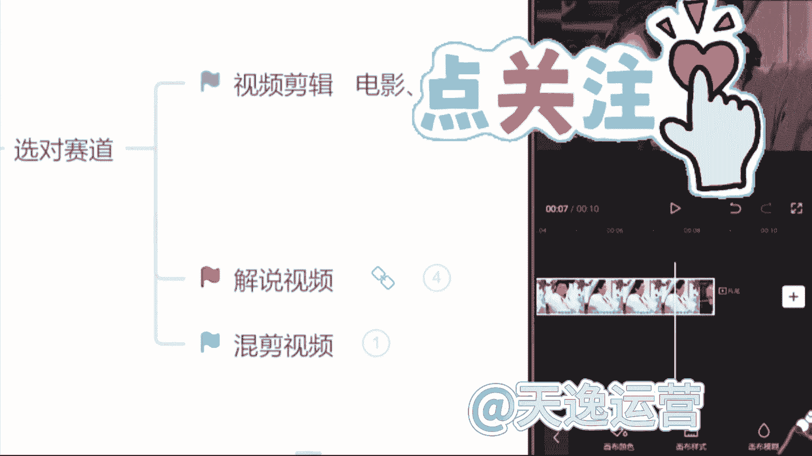

我们的视频完播率它会直线下降，完播率是会影响到我们整体的单价和收益，结果的，所以说转场必须要添加，那该怎么去添加这个转场呢，来一样的这个视频轨道，右边有一个加号的位置。

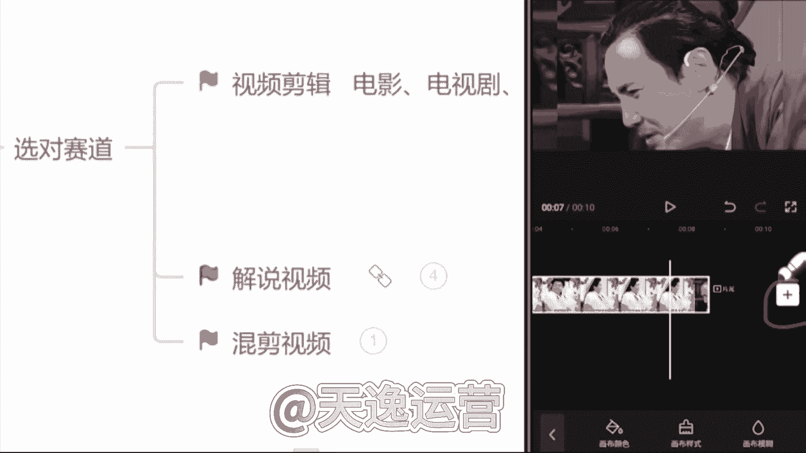

看见了吗，我们用它的机会是非常多的，点击这个加号一样的选择谁呢。

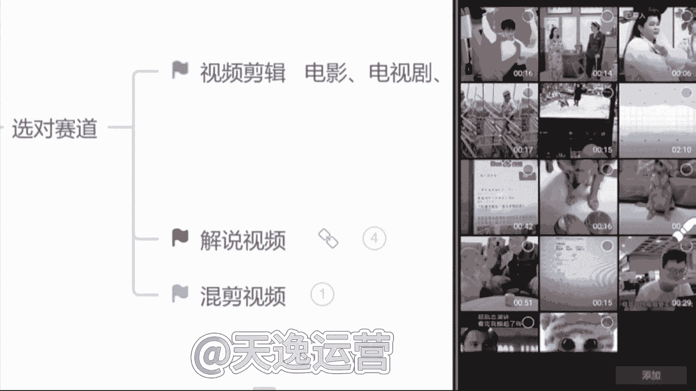

选择这个素材库啊，我们一样去找到这个素材库。

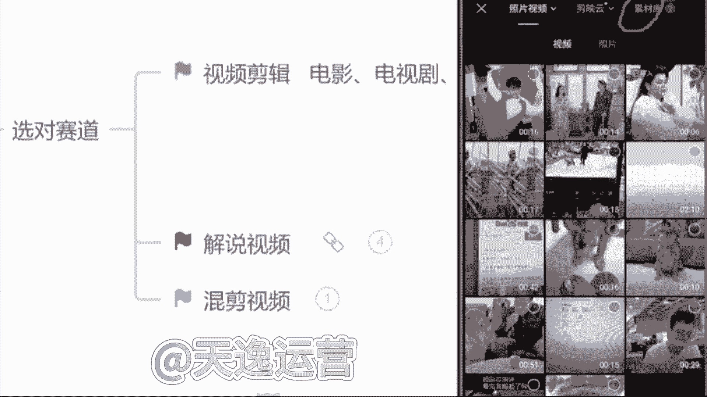

点击它在这个热门里面非常多的一个这个转场，包括像这种的这种的，包括这种的熟悉吗，同学们这种转场是不是看的非常多。

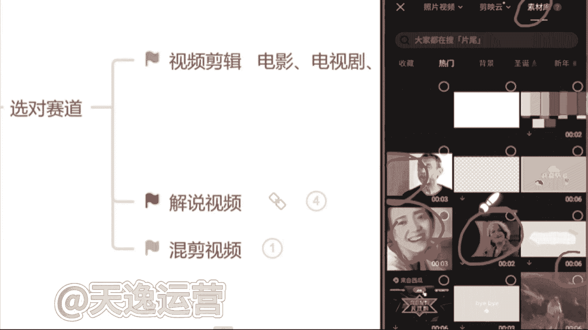

包括现在所有做的视频，只要是添加了转场的转场，基本上都是从这个简易里面找的，你们都可以去用啊。

这个没有什么问题的，那在找转场过程当中呢，强调一点，我们不要去找太长的，像这种16秒钟的不要去选啊，不要去选，因为太长了，我们没有任何一个人会把不重要的东西，我们有耐心看完的没有，所以说我们选择。

尽量保持在3~5秒钟的一个转场。

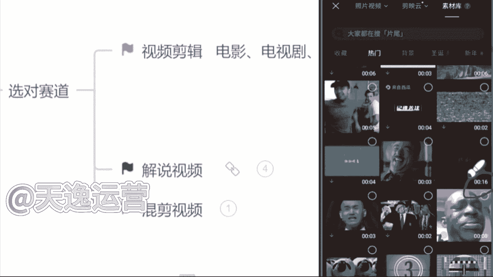

那最合适的我们选择一个三秒钟的来，我们给它添加进去啊，这个转场我们添加完了过后来看一下。

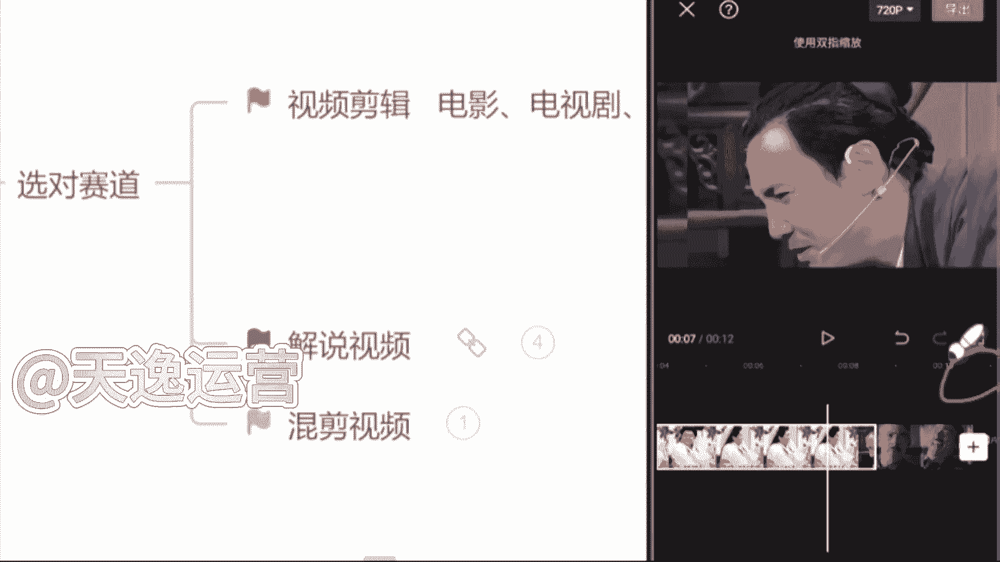

一样的，也要强调一点，转场的视频，它也必须跟我们所有的一个视频比例保持一致，什么呢，16比九，那这个视频我们出来了过后，右下角直接会有一个画布模糊，画不模糊这个选项啊，直接找到它，点击第一个清晰的画面。

这个背景它就是一个16比九的一个横屏了啊，现在要记住，我们找到这个画布模糊之后呢，依然右下角的这个对勾点起来啊，点起来啊，一样的，我们这个视频的比例呢，它做完了这个步骤有没有记住啊。

我们该怎么去做这个视频能听懂吗。

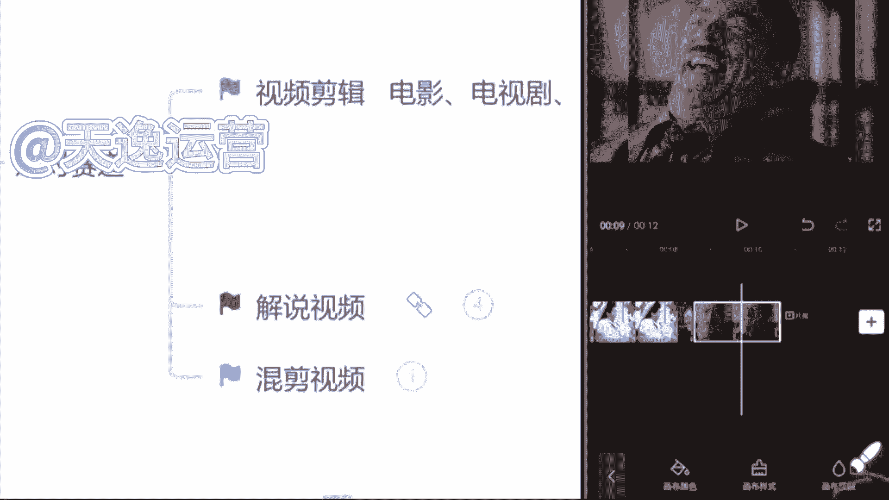

这个步骤啊，我们该怎么去裁剪这个比例，该怎么去添加这一个背景的主题，能是不是好的好的，那么这个视频能做到，现在来，接下来，下一步我们要去添加我们这个视频的文案。

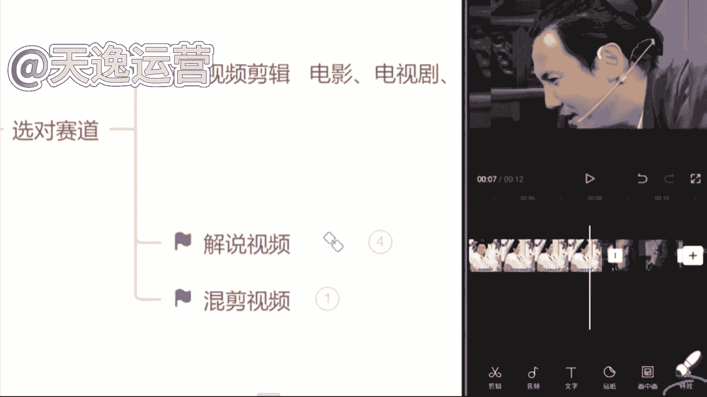

就是字幕，我们该怎么去添加呢，依然找到我们手机左下角这一个文字的选项，来点击它一下，我们新建文本右边有一个什么呢，有一个识别字幕，看见了没，直接点击这个识别字幕，然后我们选择这个开始匹配。

它就会自动去给我们识别这个音频当中，或者说这个视频当中人物所说的话，给我们形成一个字幕来，看见了吗，字幕现在出来了，稍微调整一下，怎么调呢，放大一点，就这个字幕文本框的右下角看见没，给他往右边拖。

那现在放大了过后，整体把这个文本框，拖动到视频最下方的一个位置，现在看起来是最舒服的，就你调整完了一个字幕过后。

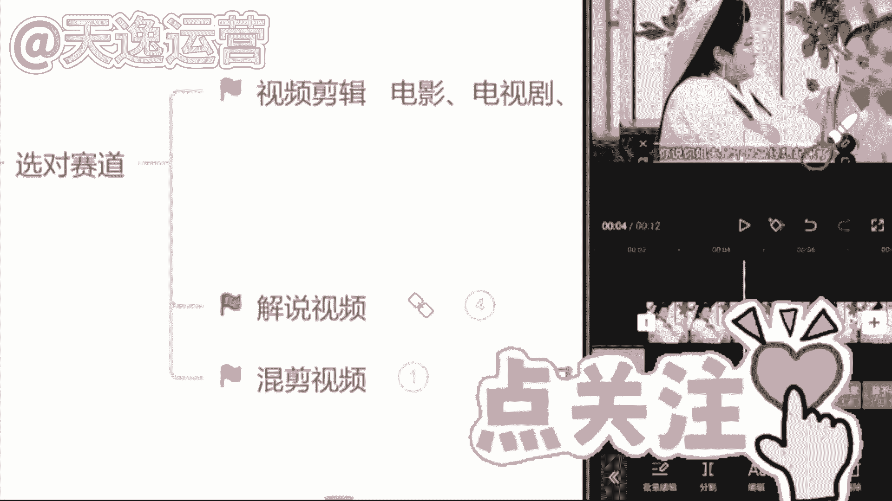

第二个你就不用调了，因为它都会随之来调整啊，这是最方便的，现在这个视频该怎么去做啊，该怎么去剪这个视频，这个视频我们该怎么去做，知道了吗，我们一定要按照这一个比例，或者说按照所有的一个步骤找素材。

也是严格的去做，阿班不要去找太长的一个视频，到时候平台在这个审核的过程当中。

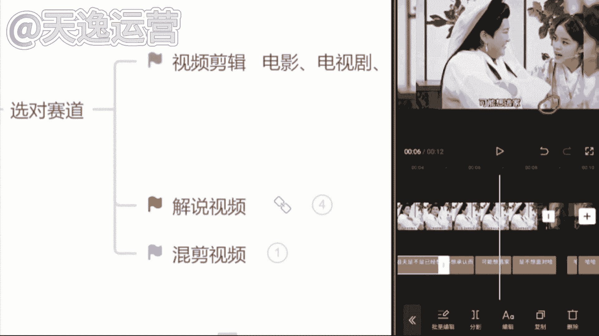

那要不然他就不会给你通过了，知道这个视频做起来难不难，同学们其实不难，对不对，好很多同学呢在这过程当中也会说到了。

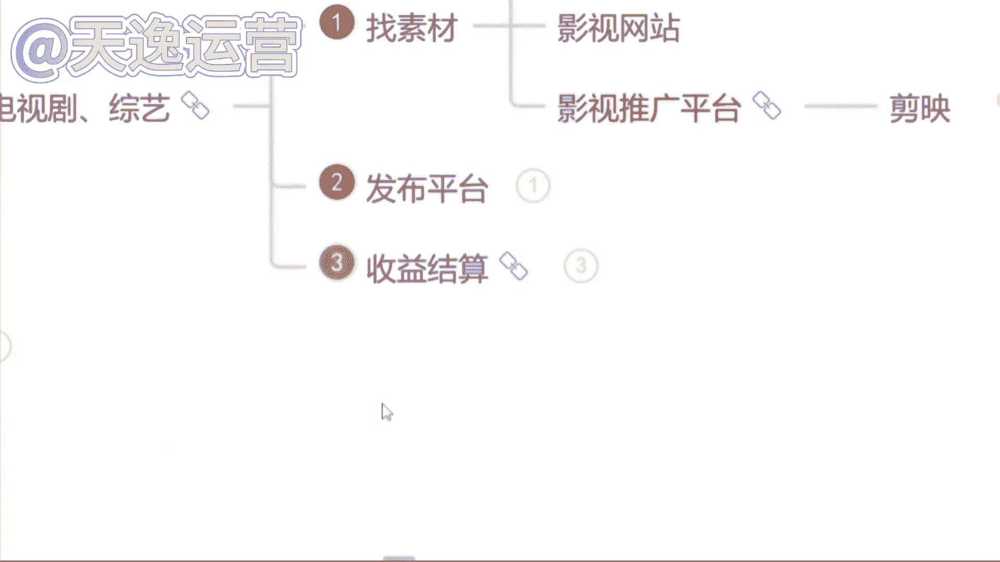