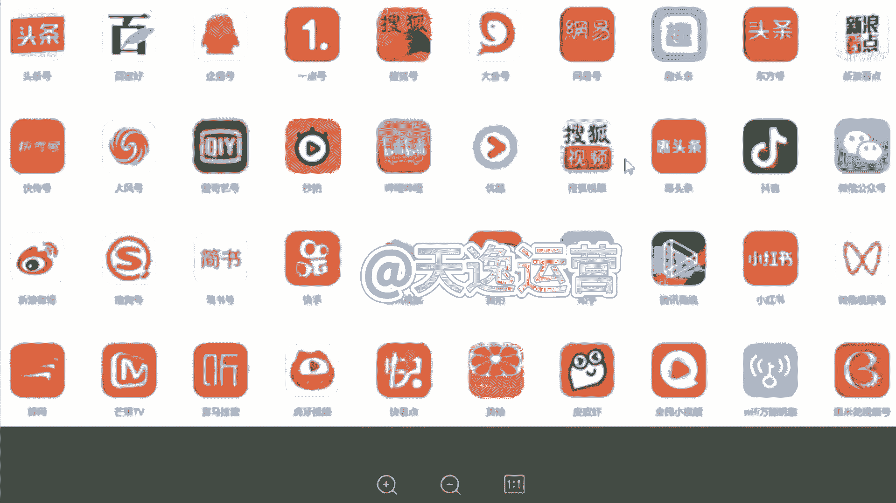
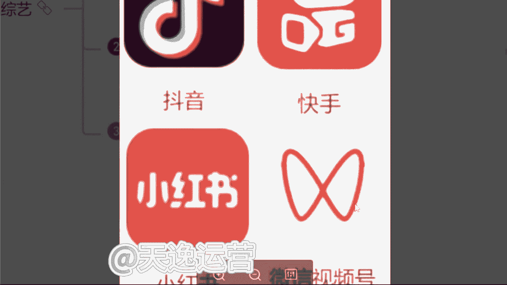
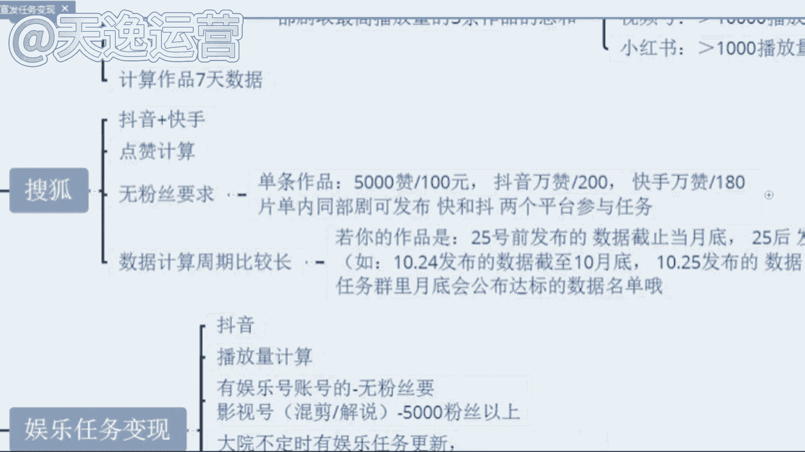

# 【2024版自媒体运营教程】全B站最良心的新媒体运营高阶教程合集！自媒体运营 起号真的不难！ - P45：8.影视推广平台 - 好久不见鸭一 - BV1PvYNecEEt

那很多同学呢也说到曾老师，那这个视频一样的，我如果说想要去发到这个抖音，或者说这个快手上面，我们该怎么去结算这个收益呢，这个曾曾老师要给你们讲到哈，我们这些视频呢它发到其他的一个平台上面去。

如我刚才所给你们讲到的这个视频。

我们剪完了过后发到这30多个自媒体平台，就除开抖音和快手，其他的平台呢，我们都是可以靠这个视频本身，给我们的一个播放量去结算收益的，这是可以的。

但是抖音和快手这两个平台呢，就像我刚才讲到的这个视频，发上去最多最多他可能只能增长粉丝啊，这个就是我所要强调的，就有没有同学，你们是只想去做抖音和快手这两个平台的，就只想去做自己熟悉的平台，抖音和快手。

曾老师，我想去做这两个平台，但是我同时去做呢，不光想涨粉，但是我也想靠这个播放量去结算收益的，有没有有的在公屏上打有字吧，那我刚才所讲到的这个所有的一个视频的话呢。

他发布的平台呢你们就可以去这个抖音快手，小红书以及微信视频号上面去发，就这四个平台熟不熟悉，同学们熟悉吗，就我们平常会用到的，对不对，这个小红书呢包括很多这个呃，可能女性或者稍微年轻一点的。

九五后可能用小红书这个平台呢，可能用的比较多一点，像微信视频号呢，如我们人手都有一个微信，微信里面有一个这个小程序，就叫视频号，我们可以去发布这几个平台啊。

这几个平台发布了过后，我们通过什么样的途径呢，我们去通过这个视频就是影视推广这个平台，我们去做任务，然后我们通过这个任务去结算奖金，我们可以看一下素材的话呢是非常多的，包括这个红字的部分。

你们就可以看一下，包括爱奇艺的任务，搜狐的任务，这个呢就是所有影视剧的名字，看见没，影视推广是什么意思，知道吗，同学们，影视推广是什么，知道吗，就影视推广的话，就是每一个电视剧，或者说每一个电影。

或者说每一个综艺，他都会涉及到宣传，按宣传就很多，这个现在很多广告商呢就是因为很多明星也好，或者说很多网红也好，我们拍完了这些电视剧或者说短剧之前，因为疫情的原因，没有办法到线下去这个宣传。

他们都会运用到这个影视推广的平台，就我们去做视频，帮他去推广，我们就可以靠这个播放量，去让他给我们结算奖金，包括每一个这个视频，就每一个电视剧，这个视频我们做完了之后。

我们是需要贴去这个提交一个这个任务的，这个回填链接的，因为我们要去报名，因为我们要填写自己的微信号，账号昵称，或者说我们自己抖音或者快手的id，包括我们自己做的是哪一个电视剧，我们要添加清楚。

包括这个电视剧这个作品的链接，你是发到哪个地方的，你要粘贴上去，发布的时间是哪一天，包括你要把这个视频的播放量的截图上传上去，到时候我们这个回填链接填完了过后，我们就会给你结算收益了。

这个就是影视推广哈，就我们也可以看一下这个影视推广的话呢，它的这个收益呢，会比纯播放量的一个收益会更高一点，就现在给你们看一下，啧，看见没，包括短句的话呢，其实是非常多的，短剧的话呢。

就是现在很多这个不是很多传媒公司嘛，就有很多网红他们会自制一些短剧，短句话呢，就是他没有办法自己去做一些这个广告的宣传，他就会让我们自己来做这个视频，发布到抖音小红书。

视频号认为这三个平台都是可以去发布的，然后呢根据播播放量的这个要求去计算，我们的收益没有粉丝要求的啊，对于我们自己的账号是没有粉丝要求的，你有没有粉丝跟他没有关系啊，我们一部剧呢。

最高播放量的三个作品加起来的总和，去给你结算，包括这个总和该怎么去计算呢，看一下抖音这个平台，1万的播放量奖金是50块钱，就最开始我给你们算的那个单价，还记得是多少吗，就1万的播放量单价。

这1万的播放量单价是34块钱，那个是头条号34嗯，对34就那个呢是头条号，他这个播放量的一个单价的收益，像这个抖音的话，你明显的感觉到这个1万的播放量奖金，收益收益更高一点的，因为抖音的话呢。

他这个每天的日活跃用户接近10亿了，非常庞大的啊，非常庞大的，那第二个视频号的话就是微信视频号，你发上去1万的播放量奖金是十块钱，为什么他的单价会低呢，是因为我们每一个人都有微信啊。

每个人都有微信都会去看这个视频号的，所以说他单价呢会少一点嗯，会少一点，像这个小红书的话，那单价是最高的啊，小红书的单价是1000的播放量，奖金是30块钱1000嗯，就我们叠加起来呢，每一个这个呃视频。

就如果说我们去结算这个收益过后，每增加1万的播放量，到时候还是会有奖金的啊，这个就比较可观了是吧，除此之外呢，像一些搜狐的短剧，搜狐视频的话，就是现阶段我们可能看见的是比较少了。

就我们原来看的时候呢会更高一点，就是搜狐视频，搜狐视频呢他也买了很多视频的版权，但是因为这个本身这个视视频，他的这个知名度可能不是很高，嗯可能不是很高，所以说他很多短句呢，没有办法去拿到一个好的评分。

或者说更高的一个这个播放量，但是会拿过来给我们去做的，像这个抖音和快手，这是需要两个平台都去发的啊，抖音加快手让他按照什么结算呢，点赞计算也是没有粉丝要求的，就单挑作品，如果说有5000个赞是怎么的。

就是我们抖音和快手，我们右边他是会看什么，就会看那个点心心，知道吗，那个人就点赞，5000个赞是100块钱，抖音的话，如果是1万个赞是200块钱，快手1万个赞他是180，他给的单价是最高的啊。

这个搜狐的短剧单价是最高的。

