# 【2024版自媒体运营教程】全B站最良心的自媒体起号运营高阶教程合集，自媒体涨粉 起号真的快 - P1 - 炙烤鱿鱼 - BV1uD421V7dK

Yeah。趁年轻的时候。🎼多学点技术啊，啥也不会年老了，吃亏呀。我的天哪，千万别滑走。因为接下来我要分享的内容可能颠覆你对中视频的认知。我们已经跑通了一个方法，就是中视频可以用AI工具，全自动的创作。

那么跑通的第一时间呢，我就赶紧过来给大家分享一下，这就相当于中视频可以帮助你全自动的搞钱了，你先别着急质疑，看完我这个视频啊，你一定会被震撼到，那么有的朋友可能会疑问了，凭借AI全自动创作的中视频。

它能够通过中视频计划吗？它能够有很好的播放量吗？它能够通过平台的审核吗？答案是可以，在分享具体操作方法之前呢，我问大家一个问题，就是平台他喜欢什么样的中视频作品，毫无疑问。首先你视频的文案要足够的优秀。

其次你的画面要高度的吻合高度的相关，而且呢要有一定的精彩程度这。

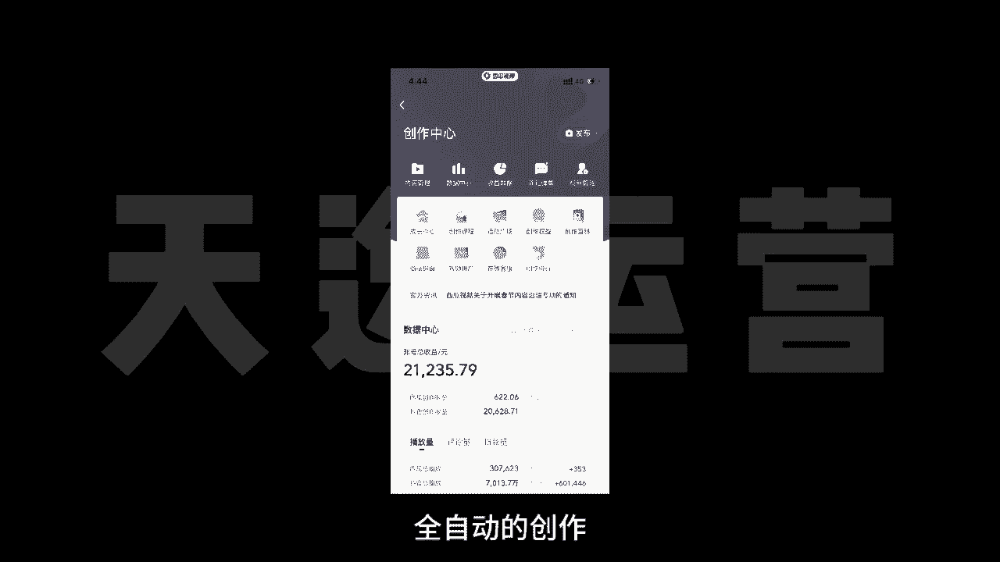

🎼的视频才能够获得平台的青睐。好，那么知道这些之后呢，我们要用到三个工具。第一个就是文案创作的神器。最近火遍全球的chatGPT可能有的朋友还不太了解。我简单介绍一下这款人工智能的创作工具。简单来说呢。

它不是专门用于文案创作的，但是他的文案创作能力确实是现在最强的chatGPT的推出呢甚至引起了很多人的恐慌。因为很多专家学者对他深度考察之后呢，他发现chatGPT它不仅仅是一个人工智能的工具。

他甚至拥有了人的思维，人的情感。因为他回答你的问题也好，写出来的东西也好，你明显能够感觉到这不像是一个机器人写出来的东西，它里边是有丰富的情感的，能够感受到他写东西的一种情绪，这就非常的可怕了。

但是我们做中视频计划，恰恰需要这样的一款神级的工具。那么有了高度原创，而且。🎼非常优质的文案之后呢，我们需要把这个文案进行配音，这一步就比较简单了。我们用到AI配音的工具。比如我们可以用配音神器。

这样的话我们就根据文案把配音搞定了。接下来最后一步是我们要根据配音和文案来匹配高度相关的画面。而且呢这个画面质量不能太低，不能用剪映里边的一键成片，那个东西啊，很多人教给你们。但是呢它不好用。

跟你匹配一大堆静态的图片轮番播放这样的一种形式，肯定是不行的。这里边呢我给大家推荐一个工具就是33搜真，它会根据你每一句的文案去跟你匹配高度吻合的动态视频画面非常给力。那么结合这三个工具。

我们就能够实现中视频AI的全自动创作。接下来我给大家演示具体怎么操作。建议呢点赞收藏一下干货非常多。首先就是chatGPT那么有的朋友可能会说啊，chatGPT我不会用，也没有账号这。🎼没有关系啊。

我在视频的结尾会给大家一并分享。你先知道怎么用就可以了。比如说呢我们拿历史故事为例，我在chatGPT上给他提一个问题，就是说我需要一份1000字左右的中国历史故事，你帮我写一下。

大家可以看一下右边我截的这张图就是他给我的答案，差不多1000字左右，写的是曹操和华佗的故事。当然我只是演示啊，大家可以发挥自己的脑洞，你想让他写一个什么的故事，他就会帮你自动写出来。

比如说你可以让他写一个民间故事，你还可以加上定语。比如说你给我写一个湖南地区的民间故事，或者你给我写一个偏门冷门的民间故事，他都能够帮你写出来。因为我是演示，所以我说的比较笼统。你提问的问题越精细。

他给你的答案也越精细化。而且呢你提完了要求他给你的答案，如果你不满意的话，你还可以追加条件。比如说在刚才他回答的这个曹操和华佗的故事里边，我想让他再加。🎼加入一个人物。然后呢我就跟他说了。

我说你说的故事啊挺好的，但是呢我还想要更多的人物加入到这个故事里边，而且故事的字数不要变。哎，他就把寻彧这个人物加进去了。故事一下看起来就没有那么的大众化了。

可能还真的有很多人不知道他们三个人发生的这些故事。那么有了高度原创的文案之后呢，接下来我们就要给这个文案啊进行配音了。我们打开配音工具，然后呢点击制作配音。

把刚才呢我们得到的这个高度原创的文案呢给他粘贴进去，然后呢点更多主播，在里边呢可以选择很多主播的风格，我们选择一个自己喜欢的主播风格。然后呢让他进行配音。最后呢我们选择保存作品就可以了。

我们得到配音文件之后呢，最后一步呢就是我们要找到高度匹配的视频画面。我们用到的工具呢就是三3搜帧。这个工具呢能力特别强大。你只要输入你想找的视频画面，它的大概意思，你点。

🎼搜索它就会自动帮你找出来很多相关的画面，而且呢都没有版权都可以拿过来直接用。基于这样的一个功能呢，它还有一个特别强大的功能，叫AI合成视频，你只需要导入配音文件，它就会自动帮你匹配画面。

我们回到33搜真的首页，然后呢点合成视频。点击之后呢，他会根据你的台词跟你匹配N多个相符合的画面。我们选择好匹配的画面之后呢，拉到最底下有个生成视频，就能够生成这种高质量的原创视频啊。

我们一起来看一下效果，康熙皇帝的五皇子应期非常有实力。为什么没有参与夺嫡。康熙的皇子很多，龙椅却只有一把夺嫡成功的概率不大，失足的可能不小。作为皇子只要不捅出篓子，在身份待遇上一般都不差，怎么样？

还不错吧。好了，那么关于以上提到的三个工具，以及他们使用的具体方法，我也给大家整理好了，你可以到我的回复中视频全自动就可以拿。

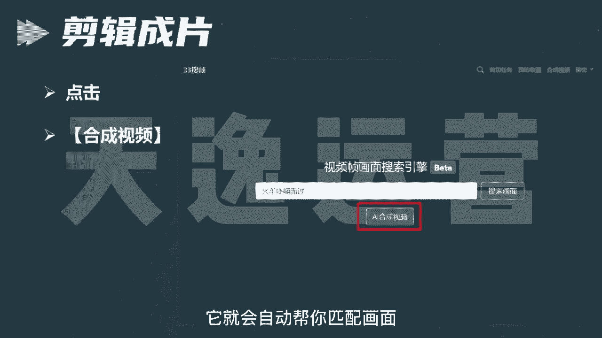

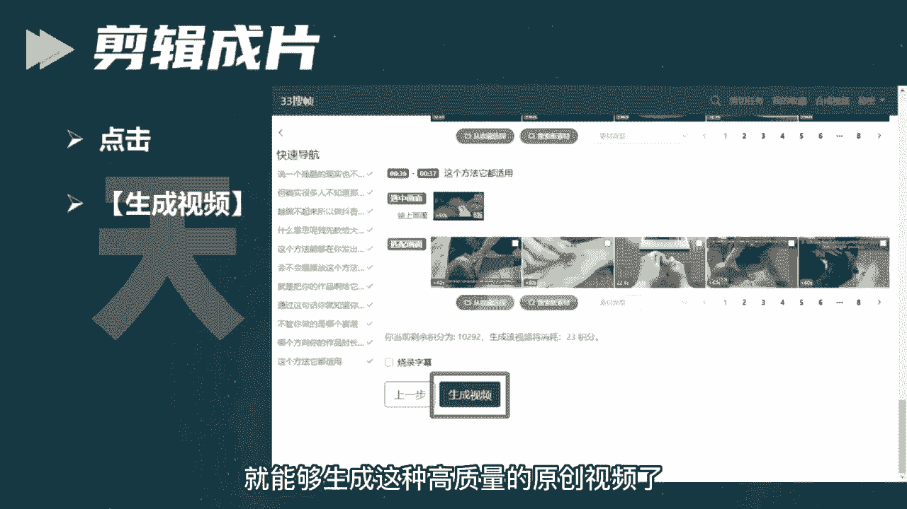

看到啦。首先第一个板块呢就是自媒体它的一个现状和前景。就是无论我们做任何一个行业哈，无论是做前置也好，还是兼职也好，我们得清楚这个行业，它的一个现状和前景。我们去做，对于我们来说有一些什么样的好处呢？

那到底可不可以去做呢？是吧？我们了解清楚了过后，我们再去上手。我们才能更放心一点。那第二个板块呢就是零基础的同学，我们如何去打造一个高收益的账号，就很多可能了解一点自媒体的同学。

或者说你是有做过自媒同学可能都知道哈呃我们这个视频发出去，要么它是零播放量，要么你去抖音和这个快手上面，你去做视频，啊，靠这个播放量没有人来给你结算收益的这是为什么呢？那这个板块当中呢。

我会教大家怎么去选择这个平台，怎么去选择领域和这个渠道，我们才能把这个收益赚到手。那第三个板块呢就是一个亿万流量的一个多种变现玩法，就是很多同学了解自媒体呢可能都知道我们自媒体呢。

就是我们做视频或者是文章发到。😊，这个平台上面去有人观看，我们可以靠这个播放量去结算收益。那除了这个之外呢，还有很多种玩法，都适合我们零基础同学去上手的那这个板块呢我会给大家讲的。

那第四个板块呢就是我们自媒体变现的一个正确打开方式啊，是怎么说呢？就是如果说你是听完整堂课，你觉得这个自媒体比较适合你的。

你也有时间来做的那我会教大家怎么去规划我们自己的账号以及系统性的把这个钱赚到手啊，这是我今天内容板块的一个划分。那么首先呢先来了解一下到底什么是自媒体呢？自媒体的话呢，我用大白话给大家讲吧。

就是我们今天打开我们自己的手机百度去百度上面搜索一个自媒体平台。然后去这个平台上面注册一个属于我们自己的账号，在我们自己这个账号上面去发布我们自己做的文章，或者说视频啊。

我们有人观看就可以靠这个播放量去结算收益，这个就叫做。🎼自媒体我这样讲能不能明白？那我们了解了一下到底什么是自媒体。那我们得清楚这个行业它的一个平台现状如何呢？是吧？到底可不可以去做呢？

就是我不知道同学们在这之前有没有了解过这样一些新闻哈，就现阶段呢，我们整个社会呢，它是非常浮躁的，就很多人都想赚钱。就是在这之前呢就原来很多人想赚钱的时候。

但是采取了一些不合法的手段去到缅甸这样地方被干腰子了的新闻，这样新闻有了解过嘛？有的来打个有字吧，就这个呢就是不合法的，国家呢它已经明令禁止了的，我们不能去做，因为我们去做。

对于我们来说没有任何的一个好处嘛，对吧？那么现阶段呢自媒体行业是属于国家支持的那国家支持呢，它现在已经把这个文件已经下达到了各个地方政府，包括你们现在看见这个呢是一个荆州市的六项措施啊。

助力自媒体以及新媒体高质量发展的一个文件。包括这个文件呢是今年6月2号人社局来发布的人社局。😊，国家单位包括这个文文件当中呢也指出了，我们要加大政策宣传力度，有力支持自媒体以及新媒体行业的蓬勃发展。

包括你们也可以来看一下有没有你们自己的那一个地方，包括往下边看，这个是这个是那个广西壮族自治区的，看见没？都是新媒体的，包括这个四川省人民政府的新媒体。

包括这个浙江省人民政府的以及杭州市人民政府和这个江西省赣州市人民政府都发布了相应的一个政策性文件。包括这个文件当中呢也知道了啊也说到了，说我们要坚持正确导向内容为王，什么意思呢？

就是我们未来作为这个自媒体创作者，我们创作的这个文章和视频，它才是结算收益最重要的一个方式和途径。我这样讲能明白吗？就包括你们听到这里，你觉得这个自媒体行业它可以来做吗？就是国家现在支持的。

因为他已经把这个政府文件下达出来了，你觉得他可以来做吗？可以是吗？对了，那除此之外呢，就现在政策性文件也有了是吧？来支持我们去做视频。那我们自媒体平台他也得响应国家的号召，他出钱让我们来做视频。

那他出多少钱呢？来我们去看一个视频来了解一下。我们希望接下来能够帮助更多的中视频创作者成为职业创作人。

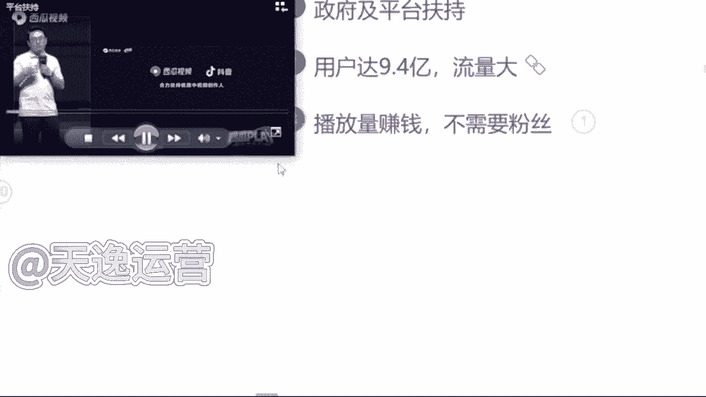

职业创作人的意思就是以创作视频为职业，并且通过创作视频就可以过上更好的生活。那为了实现这个目标，未来一年，西瓜视频决定将额外拿出20亿元补贴中视品创作人。我想强调两点哈。😊，第一。

这是真金白银的20亿元，不包含任何的商单、直播和电商的收入是纯补贴。我们也会积极探索保底将分成的模式，助力创作人职业化。这可能也是行业首创。第二，20元只是保底上不封顶。啊，说到这里呢。

我想起了一件事情。好，同学们从这个视频当中了解到了一个什么关键的信息呢？就这个平台，他给到我们多少钱去做视频，多少钱呀？20亿元对不对？包括刚才这个创始人。

他也提到了这20亿元它不包含任何的商单直播以及电商的收入，这什么？是纯补贴，就是我们未来去做视频，我们就能去拿到这20亿元里面的收益，这个就是我们未来能够赚到钱。那除此之外呢。

现阶段我们自媒体行业呢有一个优势，就他的用户数量非常庞大的，有多少呢？接近9。4亿了。包括今年这个2022年这个中国研究生网站啊，也出台了相应的一个自媒体行业的市场调查以及发展前景的分析报告。

这个报告呢，今年9月9号来发布的这个报告当中指出了我国现阶段中国网民规模多少人是9。4亿人，接近10亿了，这9。4亿人呢？就是看视。

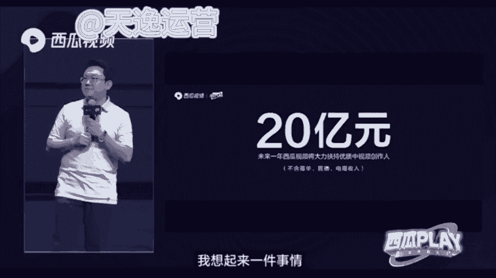

频的人，他有手机有这个视频平台，每天都会去刷视频。那看视频的人有这么多了，做视频的人肯定也有吧，有多少呢？来往上边看，截止去年为止，我就我国全职从事自媒体的是370万人，兼职从事自媒体的是600万。

就加在一起，一共做视频的人才970万人，我们应该算个整数，我们算1000万，好吧，就有1000万的人，他在做视频，有10亿的人，他在看视频，这个相当于什么呢？相当于100个人里面只有一个人在做视频。

问一下同学们，我一个人做的视频够不够，你们100个人去看我一个人做视频的速度能不能赶上你们看视频的速度。😡，其实是什么呢？其实是不够的，对不对？为什么呢？

这个就是我们国家为什么支持我们自媒体行业发展的一个原因。因为我们国家未来的一个发展趋势一定是在这个互联网行业当中啊，是从哪里可以看出来的呢？就是从我们小时候啊看的是这个黑白电视。

就我们长大了之后看的是彩电。那包括到现在呢，我们自己家的电视上面都能连接wifi了。这以后我们做的视频，我们自己家的电视上面它都能够看见，你可以思考一下这个用户数量是多么的庞大了。对。

包括我们的用户人群呢也不断的在扩张。那除此之外呢，现阶段我们自媒体这个行业呢最大的一个优势就是我们去做，不需要我们有任何的一个粉丝基础。那我们只用靠这个播放量就能够赚到钱。但是我们呃说到这里哈。

很多同学会有这样一个问题了。艾森老师，我们去做视频，但是我们没有粉丝，这个播放量是哪里来的呢？😡，就有没有这样疑问我去做视频是吧？没有粉丝，那这个视频的播放量是哪里来的呢？首先要告诉大家。

这个播放量是平台扶持的流量。刚才我们讲到了，国家支持它的文件已经有了平台它是会扶持我们去做视频的，就看你作品的质量如何了，就可能同学们现在了解到的平台，自媒体平台哈可能更多的，要么就抖音，要么就是快手。

是不是就平常刷视频用的最多的，是不是抖音和快手这样个平台，我们都知道抖音这个平台在前两年他短视频最火热的时候，就他在抖音直播带货最赚钱，但是我们都知道你想要去这个带货，你必须要有粉丝基础吧。

你没有粉丝基础，你去带货谁来买呢？是不是？那除此之外呢，我们自媒体平台跟抖音它是有一个本质的区别的。我们只需要去这个平台上面去做视频，有人观看，我们就能够靠这个播放量去结算收益的，我们只需要了解一点。

什么呢？一万的播。😡，放量他能够拿到多少钱？很多同学会问了，曾老师，为什么不是以千0为单位呢？是以万为单位呢？当然有嗯有1000阅读量的单价但是只有我们拿到1万阅读量的收益的这个播放量的时候。

我们才能够去结算收益，才能够把这个收益提现到我们的银行卡里面来。我这样讲能明白吗？就我们去看一下这个1万的播放量的单价到底是多少啊，首先呢我们这边可以看见一个千次的阅读单价能看见吗？

千次的阅读单价是多少钱，是3。4块钱看见吗？这是1000的啊，就1000的阅读量我们能够赚到3块钱那一万的阅读量有多少呢？我们乘以1万嘛，就是34块钱，这个单价你们要记清楚。

这个就是我们未来能够揣在自己兜里面的钱啊，等一下曾总老师会问的这11万的阅读量单价到底是多少呢？是吧？这个要记住好吧，那我们现在知道了这个单价了。很多同学会说，哎，曾老师。😊，反正他都赚钱是吧？😡。

那我现在不做，我以后再来做吧，是吧？反正他都赚钱，反正他都赚钱是吧？这个行业我现在不做吧，我以后再来做有没有这样想法的，有的你就打个有字，就说到这里呢，问同学们这样一个问题。

就是如果说这个未来自媒体行业，它发展成为像这个九年义务教育一样，所有人都能来做的时候，你觉得你还能不能做起来。就未来我们这个自媒体行业，国家说哎同学们朋友们。

我们现在已经把它纳入到这个九年义务教育阶段了，你全都来做还能来做起来嘛？有的说能有的说不能就问同学们这样一个问题吧，就是这个呃就跟原来这个18年的抖音是一样的道理哈。18年抖音刚出来的时候。

他是最火的时候，刚刚站在风口上面，是吧？那个时候选择做抖音的人，他是最赚钱呢，他也赚到钱了，但是现在你再去做抖音，你还能做起来吗？现在你再去做抖音还能做。😡，起来嘛，就做不起来了，对不对？是一样的道理。

每一个行业它都有相应的一个风口存在的。这个机会放在这里，它是不会等着你来选它的。风口它是会过去的，你就不能来做了是吧？如果说未来你去大街上面随便拉一个人问他，你知道自媒体吗？

他说哎我知道那个时候我就劝你不要来做了啊，因为你就需要花更多的时间更多的精力，你才有可能能做起来。包括我们刚才说到的，这个行业的一个市场报告啊，就调查的这个报告是今年9月9号来发布的。

说明我们是了解到这一个信息的。第一部分人群，我们刚刚站在这个行业的风口上面，小米创始雷军曾经说过哈，站在风口，猪都能起飞。就看咱们要不要去做一只风口上面的猪。😡，是吧这个就是我说到的一个行业的风口啊。

就看你自己愿不愿意来选择了。那说到这里问一下同学们，你觉得这个自媒体行业它值得你来做吗？你觉得它值得咱们来做吗？是吧？这个风口嘛，就看你自己要不要去选。😡，好，那除此之外呢，有很多同学也会说到了是吧？

好，曾总老师，我觉得可以做是吧？我觉得能赚到钱也值得去做了。但是为什么我发的这个视频发出去，它永远都是零播放量呢，要不然只有几百甚至1000多的播放量，是不是这个平台他不喜欢我，他看不干我。

所以说他不给我推送流量啊，其实不是的，是因为我们自媒体平台呢，它总共有30多个啊，这30多个平台呢，同学们全部截图保存啊，这30多个平台我们未来都能够用到的，今日截图啊吧，因为这30多个平台呢。

它每一个平台结算收益的方式适合的领域都是各不相同的。同学们熟悉嘛？对他们了解吗？其实不太了解，对不对？那首先我们来看一下，其实每一个平台他适合的领域都是各不相同的。包括给你举个例子吧。

比如说今天啊我说我要做一个这个今日头条这个头条号，我说我要做那我先把这个平台账号注册好那。😊，注册好了过后，我去选择一个适合B站去做的舞蹈领域，我能在这个头条上面做起来吗？觉得能做起来吗？

我去做的是头条号这个平台，但是我偏偏就选了一个适合B站去做的领域。为什么呢？这个就是很多这个自媒体嗯呃这个人没有做起来账号的原因。你连平台以及领域都没有选择对这个平台，他凭什么给你推送流量的。

他不会把这个流量浪费在你的身上的，他是会去扶持适合他这个平台，适合用户去观看的领域的。这个呢我到时候送给大家好吧，这个领域的区分，到时候我送给大家啊，让你们有一个领域区分的地方。

但是呢我得看你们的表现好吧，谁今天啊互动性是最强的，是真正想要学习到这个知识的，我就送给你们啊，因为曾老师特别喜欢这个爱学习的同学，好吧，看你们的表现喽。😡，那除此之外呢。

这30多个平台呃30多个平台里面我们该去选择什么样的这个内容，我们来做视频呢？是吧？那首先问一下同学们，平常在这个刷视频的过程当中，我们刷什么样的视频，刷的是最多的，你看什么样看的视频看的最多。

是影视的呢？解说的呢是吧？单视频剪辑的呢，还是说游戏的呢综艺的呢，动漫的呢搞笑的呢，你看什么看的是最多的，美女。😊，好的好的，我知道了哈。那喜欢看美女的同学非常的不错呀。曾的老师也喜欢看美女啊。

但是我们把看美女的时间，我们去做一个美女的盘点视频，它可能赚钱会更快一点，是吧？影视的是萌正能量的、搞笑的。还有呢其他同学呢看什么样的视频看的是最多的。😊，还有没有其他的？基本上都是影视了，是吗？

好的好的，我知道了。影视呢在所有的平台上面确实扩散量是最大的啊，军事的也有是吗？军事的它在我们国内的平台是可以做的。但是涉及到一些呃会比较外网的平台，它是做不了的。嗯。

像现在的那个ttok它就做不了这个是吧？那首先呢在这个平台上面，我建议同学们哈一定要去选择对赛道。我刚才说到了，你赛道选择对了这个平台它才会给你推送流量。我建议你们去做的话，就以这三个类型的视频为主。

首先第一个视频剪辑类的。第二个解说视频类的，第三个混剪视频类的，这三个类型的视频是现在所有平台，大数据分析之下，用户的点击量阅读量以及完播率是最高的三个领域。大数据是什么意思，知道吗？

同学们大数据比如说我举个例子吧。😊，比如说我们平常就很多同学呢会说看的东西是比较多的，就刷到什么看什么。比如说呃这这一类型的视频的话，就是我们所有同学说不知道的也是啊一样的，就平常刷到什么，看什么。

你在所有的类型的视频的这个停留时间它是一样的。但大数据呢，就是如果说我们今天选择抖音这个平台，我今天刷美女刷的时间更长，从明天开始这个平台，他给你推送美女的视频绝对是最多的。

如果说你看美食类看的是最多的那从明天开始这个平台他给你推送美食类相关的视频，它就是最多的。有没有这样的情况，是不是这样子的，这个叫大数据啊，大数据呢。

它现在可能比我们自己的爸爸妈妈还要了解我们知道我们到底喜欢什么样的内容，什么样的东西。跟着大数据去做视频啊，你的这个播放量呢，它才会更高。😊，🎼啊，那首先呢。我们先来讲第一个视频剪辑类，好吧。

视频剪辑的话呢分为很多都可以去做这个视频剪辑。比如说首先第一个就是这个电影的，就影视的剪辑嘛。电影的啊除此之外呢，像这个电视剧的或者说综艺的啊。

这个都是这个视频剪辑类的那如果说我们想去做这个视频剪辑类的呢？我们首先要去干嘛，要去找素材，对不对？那这个素材我们该怎么去找呢？找素材呢，我们先从这几个平台去找。首先第一个所有的视频平台。

知道视频平台有哪些吗？啊，那现在不知道的同学来看一下，这个就是我刚才让你们截图保存的这30多个自媒体平台，现在不知道的同学在截图保存一次啊。

这30多个自媒体平台呢都是我们能够找到素材的地方啊这30多个自媒体平台呢，我们都能找到素材，那除此之外呢，第二个我们可以去一些影视网站里面去找，我不知道同学们有没有了解过哈，影视网站。

比如说我举一个例子，就原来我们所说的这个豆瓣电影。这样子的呢都是这个影视的网站。包括我自己呢整理了将近有这个50多个啊影视的一些网站，这些网站里面所有的一个影视素材，它全部都是没有版权要求的。

这个呢我到时候也可以送给你们。除此之外呢，这个平台呢就这些网站呢，它是关于影视类的，就很多同学说哎，曾老师那我不想做影视类的是吧？我想做一些其他的什么动漫的综艺的搞笑的，我想做一些这些类型的O也可以啊。

我自己呢也整理了将近有60多个这60多个网站呢里面除了影视类的。像这个旅游的啊这个图片类的啊音效类的评论的体育的美食的动漫的综艺的搞笑的或者说各个国家的境内境外的视频素材。我们都是能找到的啊。

都是能找到的这个呢我后边也送给你们好吧，让你们能有一个找素材的地方。那除此之外呢，第三个就是我所讲到的这个影视推广的平台。就影视推广的平台呢，现在他可能做的更多。就是我们在这个抖音或者说快手上面。

我们很多同学都知道哈，你去抖音或者说快手上面做视频有做过的来，就是去这个抖音或者说快手上面发过视频的。有没有就我们都知道啊，就抖音和快手这两个平台，你去发布视频，最多最多。

可能只能达到一个涨粉的作用是吧？这个播放量它是变不了线的那如果说我们去做这些影视推广平台里面的这些影视素材啊，我们是可以靠这个播放量去拿到奖金的啊，这个平台呢，等一下我会着重奖啊，我会着重奖。

那么首先呢如果说我们要去做这个视频的剪辑，我们素材该怎么去找呢？比如说我给你举个例子吧啊吧我们今天打开我们自己手机的百度啊，我们先打开这个百度打开了过后呢，我们随便去搜索一个自媒体平台吧。嗯。

用这个西瓜视频。😊，我们搜索一下这个西瓜视频，然后点击百度。我们打开它的网页。比如说我今天举一个例子，我想要去做一个这个关于综艺类型的是吧？我想要找一个人，比如说综艺类型的就是他跟娱乐是相关的。

就同学们平常看直播吗？直播看不看就像一些网红的直播，什么大杨哥，小杨哥是吧？比如说我们想要找一些这一类的素材，我们直接去搜索他们这一个关键词就可以了。什么关键词呢？就直接搜名字啊，大洋哥。小杨哥。

我们直接搜索关键词，然后点开搜索，我们就能找到非常多的一个素材了。现在我们按照这种关键词的方式去找素材，能不能找到？但是在这个找素材过程当中，我得给你们强调一点，我们正确找素材的一个方式。

不是让你们把这个视频直接下载下来。就很多同学我不知道同学们有没有听到过这样一个词语，就你们可能听过课程的哈，有的老师叫你去做搬运有没有听过的，或者说有没有做过搬运的。如果说你直接去把这个视频下载下来。

它跟搬运就没有什么区别了啊，搬运的内容，现在平台95%的人，你去做都通过不了审核。所以说告诉你们正确找素材的一个方式，就是我们要从这么多的这个视频当中去找到符合我们自己视频主题的视频片段。

就每一个片段呢大概保持在10秒钟左右啊，10秒钟这个数字，你们要记住，到时候。我们找到素材，我们去做视频，平台在审核的过程当中才能给你通过，是不会有违规存在的。这个记住了吗？记住了公屏上打一啊。

10秒钟左右，每一个素材片段，就按照这个这个时长去找就可以了。那除此之外，再举一个例子，比如说我们今天想要做一个沈腾的是吧？沈腾明星明星网红它都是自带呃这个热点的啊，热度的，你去做它不缺流量啊。

不缺流量的那一样的。我们打开一个。关键词直接搜索，就你们能找到素材呢是非常多的啊是非常多的那现在我们素材能找到了吗？那如果说我们这个视频素材我们自己能找到了。

那我们想要去做视频OK那我们是必须要用到什么呢？用到剪映这个软件的。做视频的话呢，问一下同学们用哪一个软件用的是最多的。手机还是电脑你用哪个我等一下就用哪一个给你们实操好吧，根据你们的一个要求来。

都是手机啊，没有一个打电脑的吗？好的，我知道了，就你们打手机的，这个速度就让我感觉到，生怕我看见电脑是吗？好的，稍等一下，我投个屏好吧，我投个屏。😊，啊，那我们今天呢如果说我们要做视频哈。

我们首先呢要确定一个什么呢？主题。比如说我举个例子吧，我说我们今天去做一个综艺类型的，我们就要确定一个人物什么人物呢？我们今天去做一个这个呃沈腾的搞笑名场面吧，就这一个视频的主题，我们的主题确定了。

那这个视频的素材当中必须要有沈腾这个人啊，这个是主题，到时候你们要记清楚。好吧。那现在同学们能看见我的手机了吗？能看见我的手机了吧。那么首先呢在我们自己的手机上面找到一个剪映的软件啊。

就这一个剪映的话呢，它这个手机端和电脑端图标找的都是一模一样的啊，没有什么区别。我们找到这个软件过后呢，直接点开它，点开了过后，我们可以看见一个加号的界面，就是开始创作这个界面。

我们直接点击这个加号的位置，然后把我们自己找的一个视频素材，先给它添加进去一个，那么这个视频素材添加进去了之后呢，首先讲一点，我们自己做视频的话呢，素材它是能找到的。但是我们要做的这一个视频的主题背景。

它是找不到的，只能我们自己去制作。那怎么做呢？首先我们要找到这个视频轨道有右边有一个加号的位置，看见了吗？直接点击这个加号的位置，然后我们找到这个手机自带的素材库，啊，这剪映自带的，看见没？素材库。

我给你们圈出来，找到素材库了过后来直接点开。我们在热门里面就可以看到非常多的一个背景主题非常多。包括我们用的话呢，像这一类型的，或者说这种的这种的包括这种的，我给你们圈出来这种背景呢，它都是可以用的啊。

都是可以用的。但是我更建议你们呢去选择一些简单明了的，就是用户点进来一看，我就知道你做的这个视频是什么主题，就是黑白色的这个背景，我们就选择一个黑色的背景添加进去吧。啊。

那这个背景添加进去了过后来首先背景有了，我们得添加主题吧。那这个主题该怎么去添加呢？来左下角有一个文字的选项，直接点击文字然后点击最左边这一个新建文本啊，看一下文本框出来了。

那现在我们要打我们自己做的这个视频的主题，我们刚才说到的，我们今天要做的这一个视频的主题人物，他是谁是谁呀？这个我们一定要记住哈，我们的主题人物，如果说明确了你找的视频素材当中必须要有他啊，必须要有他。

如果说没有这个素材，我们就用不了，是谁还记得吗？我们刚才说到的，我们刚才说到的是谁来着，我们今天要做一个沈腾的搞笑名场面啊，沈腾这个人，你们是必须要记住的，这个沈腾名字确定了。

我们所有的这个素材当中必须要有他出。线啊，如果说没有，到时候这个素材用不了，重新找好吧，这一点是要记住的哈。那么首先呢先来打两个字，就是谁呢？就主题人物沈腾。沈腾的什么呢？沈腾呢他有自己的综艺场面。

也有自己的影视场面。如果说你找的素材是跟影视相关的。你就打影视啊，如果是跟综艺相关的，咱们就打综艺，好吧，这个咱们区分开来。沈腾的综艺报笑名场面。O这个名字我们确定了过后。

但是我们看一下是不是非常白白色的文字，我看起来不太好看，不太好看是吧？我们所有人呢他都喜欢一些色彩鲜艳的东西，这是比较抓人眼球的。那接下来呢我们也不要去选择什么样式和花字了。

不用我们直接去选择右下角这个文字模板，我们直接往上套啊，这样是最方便的。那么这个文字模板呢，根据你自己的实际情况来，它有收费的，有免费的啊，我们自己去选就可以了。我们随便选择一个模板来看一下。

同学们觉得这个模板可以吗？觉得这个模板可以用吗？我觉得还不错啊，这个模板我们找到了过后呢，来直接选择右上角的这一个对勾。OK我们的主题背景有了。那我们选完之后呢。

直接手动的选择整体这个文本框的右下角给它放大一点，好吧，让我们这个文本看起来更清晰。好，这个文本就这个背景我们制作完了过后，OK名字是有了，但是我们不能让用户点进来看什么看哑巴电视吧，不可以。

谁都喜欢有声音的东西。那问一下同学们会配音吗？同学们会配音没会配音的，你打会字吧，不会的，你打不会，如果说会配音的同学，咱们自己就打开自己手机里面的录音机，我们把这个名字自己念一遍就可以了啊。

如果说不会的，没有关系，我们直接选择右下角这个文本朗读，我们直接往上套就行了啊，这个是比较方便的。我们选择文本朗读了过后，来，你看一下，就是特别多的声音，什么方言音啊，什么男生喜欢的萝莉音啊。

什么女生喜欢的这个男士的播音腔O都有的。但是我更建议同学们去使用一些这个方言音啊，就方言音在现在所有平台，它上面的一个呃运用率它是比较低的，它是比较有吸引力的，你们去做，它是比较能够吸引到人的。

像方言的。😊，话呢我最近呢比较喜欢一些广西的方言，因为我觉得很有意思，也没有广西的同学，我觉得很有意思。好吧，我们就先来听一下这个方言音。😊，神腾中医爆销名场面。沈腾中艺爆笑名场面。沈腾中医报效名场面。

深腾总一保小命昌面。沈腾总艺包厢明唱面。沈腾综艺报效名场面。深圳中医报销名场面是不是非常多的方言音啊，咱们自己去选就可以了。那我就选一个广西的方言。那我们这个方言音，我们选择完了过后。

直接点击右下角有一个对勾。OK它就会自动的去下载这个音频。那这个音频下载完了之后，我们从头来听一下。整腾中医报销名场面OK现在声音呢它是有了。那我们现在呢手动的选择这个黑色的背景。

你直接点击它一下就可以了。那点完了过后呢，我们自己手动的来给它缩短一点，让它能够音化同步。那这个主题的背景我们制作完了过后来，紧接着重要的来了。就我们本身视频的本身，首先我们来看一下。

有没有沈腾这个人O有那这个素材我们就能用。我们刚才讲到的，如果说这个里面没有沈腾，那咱们就用不了啊，这个你要记住，那首先呢在讲的过程当中，我边讲边给你们讲细节。首先第一点我们要做的这个视频。

它必须是16比9的一个横屏，这是所有平台，它硬性的一个标准，如果不是这一个比例，O平台的审核是不会给你通过的一定要记住这个比例啊，我给你们打在公屏上了。那除开这个呃抖音啊，除开抖音，因为抖音的话。

它是需要9比16的竖屏啊，除了这个抖音之外，其他平台都是16比9的一个横屏。这两个咱们记住，咱们把区分开来，到时候做视频的时候，比例要选择。对那这个比例呢，首先我们来看一下该怎么去做啊。

就像我们这个视频一样，它明显不是1个16比9的横屏，我们该怎么去调整呢。来，首先最简单的一种方式，我们找到这个手机下方有一个比例的选项，直接选择它来，现在我们看见有1个16比9的横屏的选项。

没给你们圈出来，看见了吗？就是这个找到了过后直接点击它我们现在就来看。这个素材视频它到底动还是没动，如果说它动了，okK它就可以用这种方式去做比例的调整。那如果说像这个视频一样，它移动也不动。

那该怎么去调呢？我们自己手动调，该怎么调呢？这样可以增加我们使用素材的这个几率啊，就是我们能够用到素材就更多了。首先呢我们选择左下角有一个剪辑的选项，找到剪辑，然后选择里边有一个编辑的选项，看见了吗？

直接选择编辑，然后我们自己来干嘛？裁剪这一个画面，那裁剪过程当中呢，首先强调一点哈，所有的这个视频当中原有的这个字幕，咱们不要留，直接给它裁掉，我们等一下自己做就可以了。那在这个裁剪过程当中呢。

包括这个边框，到时候你们少给他留一点啊，少留一点边框，到时候留多了过后，它会有一个黑色边框会不好看，少留一点就可以了。这个画面我们裁剪完了过后，直接点击右下角的对勾。OK来看一下这个比例是不是调整了。

视频它明显的放大了，但是它也不是1个16比9的横屏，如果是的话呢，它就不会有这个黑色的背景了。那接下来该怎么去调呢？找到我们手机右下角有一个背景的选项。在这里看见没？背景直接选择它。

然后右下角有一个什么呢？画不模糊，看见吗？直接选择画布模糊。我们调整到第一个清晰的画面，现在你也再来看一下这个是不是就是1个16比9的横屏了呀？同学们这个步骤要记住啊。啊，记住了，对吗？好。

来接下来一样的右下角对勾点起来啊，这个比例我们弄好了弄好了过后呢，来接下来第二点，我们每一个视频呢，它毕竟不是一个原有的视频，不是一整个每个视频呢大概在10秒钟左右，对吧？那这个视频之间呢。

它是必须要有衔接的，我们必须要添加这个转场的视频。就我不知道同学们有没有这个在看视频过程当中有没有看到过一些转场。就比如说呃有的这个视频看完了之后，中间会给你添加一个不属于这个视频当中任何一个片段的。

搞笑的界面，有没有看到过有，对不对？为什么要添加转场呢？我们要让用户明确的知道它每一个片段的内容是不一样的啊是不一样的。如果说每一个片段不一样的情况之下，你不添加转场。他在看第二个视频的时候。

心里会咯噔一下，因这个视频的片段怎长得不一样呢？视频内容怎么不一样呢？往往有这种情况的时候，我们会做出什么一个动作呢？退出去看一下我今天看的这个视频是什么。如果说他有这个退出去这个动作了。

我们的视频完播率它会直线下降。完播率是会影响到我们整体的单价和收益结果的。所以说转场必须要添加。那该怎么去添加这个转场呢？来一样的，这个视频轨道右边有一个加号的位置，看见了吗？我们用它的机会是非常多的。

点击这个加号，一样的，选择谁呢？选择这个素材库啊，我们一样去找到这个素材库，点击它在这个热门里面非常多的一个这个转场，包括像这种的这种的包括这种的熟悉吗？同学们这种转场是不是看的非常多。

包括现在所有做的视频，只要是添加了转场的，转场基本上都从这个简易里边找的，你们都可以去用啊，这个没有什么问题的，那在找转场的过程当中呢，强调一点。我们不要去找太长的，像这种16秒钟的。

不要去选啊不要去选。因为太长了。我们没有任何一个人会把不重要的东西，我们有耐心看完的。没有。所以说我们选择尽量保持在3到5秒钟的一个转场那最合适的我们选择一个3秒钟的来我们给它添加进去啊。

这个转场我们添加完了过后来看一下一样的，也要强调一点，转场的视频，它也必须跟我们所有的一个视频比例保持一致，什么呢？16比9那这个视频我们出来了过后，右下角直接会有一个画布模糊，画布模糊这个选项啊。

直接找到它点击第一个清晰的画面。这个背景，它就是一个16比9的一个横屏了啊，现在要记住，我们找到了这个画布模糊之后呢，依然右下角的这个对勾点起来啊，点起来啊，一样的，我们这个视频的比例呢。

它做完了这个步骤。有没有记住啊，我们该怎么去做这个视频能听懂吗？这个步骤啊，我们该怎么去裁剪这个比例，该怎么去添加这一个背景的主题能是不是好的好的，那么这个视频能做到现在来接下来下一步。

我们要去添加我们这个视频的文案就是字幕，我们该怎么去添加呢，依然找到我们手机左下角这一个文字的选项来点击它一下，我们新建文本，右边有一个什么呢？有一个识别字幕，看见了没？直接点击这个识别字幕。

然后我们选择这个开始匹配，它就会自动去给我们识别这个音频当中，或者说这个视频当中人物所说的话，给我们形成一个字幕来看见了吗？字幕现在出来了，稍微调整一下，怎么调呢？放大一点，就这个字幕，文本框的右下角。

看见没？给它往右边拖，那现在放大了过后，整体把这个文本框拖动到视频最下方的一个位置，现在看起来是最舒服的。就你调整完了一个字幕过后，第二个你就不用调了，因为它都会随之来调整啊，这是最方便的。

现在这个视频该怎么去做啊，该怎么去剪这个视频，这个视频我们该怎么去做，知道了吗？我们一定要按照这一个比例或者说按照所有的一个步骤，找素材也是严格的去做好吧，不要去找太长的一个视频。

到时候平台在这个审核的过程当中，那要不然他就不会给你通过了。知道这个视频做起来难不难，同学们其实不难，对不对？好，很多同学呢在这个过程当中也会说到了。哎，曾老师。

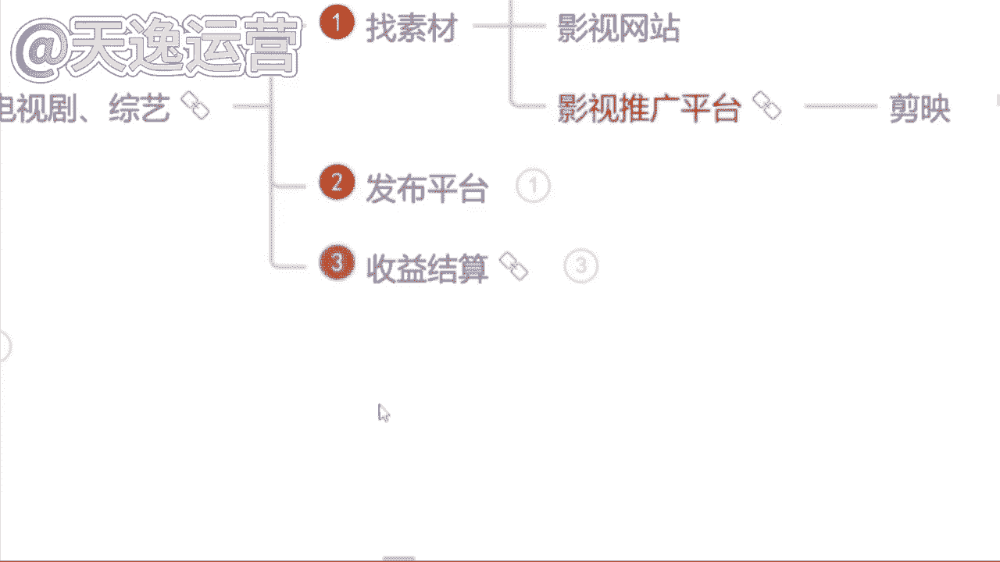

这个视频确实不难是吧？

那很多同学呢也说到曾老师，那这个视频一样的，我如果说想要去发到这个抖音或者说这个快手上面，我们该怎么去结算这个收益呢？这个曾曾老师要给你们讲到哈，我们这些视频呢，它发到其他的一个平台上面去。

如我刚才所给你们讲到的这个视频我们剪完了过后，发到这30多个自媒体平台，就除开抖音和快手。其他的平台呢，我们都是可以靠这个视频本身给我们的一个播放量去结算收益的这是可以的。但是抖音和快手这两个平台呢。

就像我刚才讲到的这个视频发上去最多最多，他可能只能增长粉丝，啊，这个就是我所要强调的，就有没有同学你们是只想去做抖音和快手这两个平台的，就只想去做自己熟悉的平台。抖音和快手。曾老师我想去做这两个平台。

但是我同时去做呢，不光想涨粉，但是我也想靠这个播放量去结算。收益的有没有有的在公屏上打有字吧。让我刚才所讲到的这个所有的一个视频的话呢，它发布的平台呢。

你们就可以去这个抖音快手小红书以及微信视频号上面去发，就这四个平台熟不熟悉，同学们熟悉吗？就你平常会用到的对不对？这个小红书呢，包括很多这个呃可能女性或者稍微年轻一点的95后，可能用小红书这个平台呢。

可能用的比较多一点。像微信视频号呢？就我们人手都有一个微信，微信里面有一个这个小程序就叫视频号，我们可以去发布这几个平台啊，这几个平台发布了过后，我们通过什么样的途径呢？我们去通过这个视频。

这个影视推广这个平台，我们去做任务，然后我们通过这个任务去结算奖金，我们可以看一下素材的话呢是非常多的，包括这个红字的部分，你们就可以看一下，包括爱奇艺的任务。

搜狐的任务，这个呢就是所有影视剧的名字。看见没？影视推广是什么意思，知道吗？同学们影视推广是什么？知道吗？就影视推广的话，就是每一个电视剧或者说每一个电影或者说每一个综艺，它都会涉及到宣传啊。

宣传就很多这个现在很多广告商呢，就是因为很多明星也好，或者说很多网红也好，我们拍完了这些电视剧或者说短剧，之前因为疫情的原因，没有办法到线下去这个宣传。他们都会运用到这个影视推广的平台。

就我们去做视频帮他去推广。我们就可以靠这个播放量去让他给我们结算奖金。包括每一个这个视频，就每一个电视剧这个视频，我们做完了之后，我们是需要添去这个提交一个这个任务的这个回填链接的，就我们要去报名。

就我们要填写自己的微信号账号昵称，或者说我们自己抖音或者说快手的ID包括我们自己做的是哪一个电视剧，我们要添加清楚，包括。这个电视剧这个作品的链接你是发到哪个地方的，你要粘贴上去，发布的时间是哪一天。

包括你要把这个视频的播放量的截图上传上去。到时候我们这个回填链接填完了过后，我们就会给你结算收益了，这个就是影视推广哈。因我们也可以看一下这个影视推广的话呢。

它的这一个收益呢会比纯播放量的一个收益会更高一点。那现在我给你看一下。😊，看见没？包括短剧的话呢，其实是非常多的。短剧的话呢，就是现在很多这个不是很多传媒公司嘛，就有很多网红，他们会自制一些短剧。

短剧话呢就是他没有办法自己去做一些这个广告的宣传，他就会让我们自己来做这一个视频，发布到抖音小红书视频号，那为这三个平台都是可以去发布的。然后呢，根据播播放量的这个要求去计算我们的收益。

没有粉丝要求的啊，对于我们自己的账号是没有粉丝要求的。你有没有粉丝跟他没有关系啊，我们一部剧呢最高播放量的三个作品，加起来的总和去给你结算，包括这个总和该怎么去计算的。

看一下抖音这个平台1万的播放量奖金是50块钱。就最开始我给你们算的那个单价还记得是多少嘛，就一万的播放量单价，就一万的播放量单价是34块钱。那个是头条号34啊，对34。就那个呢是头条号。

它这个播放量的一个单价的收益。像这个抖音的话，你明显的感觉到这个一万的播放量奖金收益收会更高一点的。因为抖音的话呢，它这个每天的日活跃用户接近10亿了，非常庞大的啊，是非常庞大的那第二个视频号的话。

就是微信视频号，你发上去一万的播放量奖金是10块钱，为什么它的单价会低呢？是因为我们每一个人都有微信啊，每一个人都有微信都会去看这个视频号的，所以说它单价呢会少一点啊，会少一点。像这个小红书的话。

单价是最高的啊，小红书的单价是1000的播放量，奖金是30块钱1000啊，就我们叠加起来呢，每一个这个呃视频，就如果说我们去结算这个收益过后，每增加一万的播放量到时候还是会有奖金的啊。

这个就比较可观了是吧？除此之外呢，像一些搜狐的短句。搜狐视频的话就是现阶段我们可能看见的是比较少了，就我们原来看的时候呢会更高一点。就是搜狐视频。搜狐视频呢他也买了很多视频的版权。

但是因为这个本身这个视视频，它的这个知名度可能不是很高啊，可能不是很高，所以说它很多短剧呢，没有办法去拿到一个好的评分，或者说更高的一个这个播放量，但是会拿过来给我们去做的。像这个抖音和快手。

这是需要两个平台都去发的啊。抖音加快手让他按照什么结算呢？点赞计算，也是没有粉丝要求的，就单条作品如果说有5000个赞是怎么的？就是我们抖音和快手，我们右边他是会看什么，就会看那个点星星，知道吗？

那个是点赞5000个赞是100块钱，抖音的话，如果是1万个赞是200块钱，快手1万个赞，它是180，他给的单价是最高的啊。这个搜狐的短剧，单价是最高的，就这一个有没有兴趣的。Okay。

因为这个影视推广的话，它收益结算的话呢，是一个月结一次啊，是一个月结一次，这个能接受吗？就我们是月底结算的，这个收益结算的话呢，就按照播放量计算。我刚才说到的，每一个这个短句呢要求是不同的。

我们按照他的一个要求来就可以了。像这个呃呃除此之外，就如果说同学们做这个影视的推广。除了这四个平台之外，你们可以靠这个播放量去结算这个奖金。如果说在这个基础之上，你们还愿意去添加解说的。就我们一个作品。

一个视频，你是可以获取双份收益的，什么意思呢？就除了刚才我们讲到那四个平台之外，你可以发布到其他平台，你是同时还是有这个什么呢？还是有版权的。你可以去做影视的解说一个视频，我们拿双份收益。

包给你看一下吧。就我之前有一个小伙伴也是。这个就这个小伙伴呢之前做的就是这一个影视的推广。你你们看一下这个收益吧。当时这个小伙伴他是自己有想法的，他对抖音这个平台是比较喜欢的。

但是看中这个抖音的一个带货能力。但当时呢他自己的账号粉丝也很少，他想要去做带货。但当时呢他说先积累粉丝，后期呢他是想要带货的，做的就是影视推广，因为影视推广的话，当时他问我可不可以朝这个方向发展。

我说可以呀，当时我直接把那个回填链接发给他了，报名的渠道，我说每一次你去做之前，你先把这个报名渠道填完填完了过后做了视频，你要去填那个回填链接，就我刚才给你们看见的那个账号的ID你是必须要写清楚的。

到时候要不然到时候这个抖音就结算不了哈。这个当时我给他看的就是因为最开始呢他做的是什么呢？做的是短剧，因为短剧的话呢，他是这个推广的渠道是很少的。如果说我们去做这个播放量的这一个收益呢，他是会更多的。

当时他做了第一个短剧，这个短句的话，要求是发三个视频。😊，就每一个短句他会有不同的要求，他让你发三个，你必须要发3个，他让你发10个，你就必须要发10个啊，这个我们得按要求做事情的。

要不然到时候他是会给你下架处理的。当然他这个视频做完了之后呢，播放量是很高的，186万。因为短剧嘛它是比较能够贴近现实的，就比较能够抓住我们用户的一些心理啊，所以说他这个播放量呢是比较高的。

他也觉得很恐怖。但是就是这些短剧呢，他只是说我们平常看的比较少而已。就所以说这个话题度是很不错的当时呢他这个短剧186万的一个播放量结算的话呢，差不多在500左右，结算是结算这么多。

但是如果说后期每增加一万的播放量，我们还会给他添加10块钱的这个奖金，这机会是很好的。但是这一个那做的第二个短句呢就是效果就没有这么好了。因为第二个短句呢。

他选择这个短剧呢可能就是本身的话题度就不是很高。但是呢呃它的单价会更高一。啊，这个就是有不同的一个选择了嘛。当时他这个短剧的话呢，过程当中是1。4万的一个播放量啊，1。4万就很低。

但是呢单价的话是给到了150的，所以说单价不同，他给的这一个收益呢也是不同的。当时这个过程当中的话，他是做了将近一周的时间7天，因为一个月结一次嘛，刚好碰到月底的时间了，结算收益的话。

当时官方系统那边给我结算的。因为他是第一波做这个影视推广的人啊，所以说结算给我的。如果说后期的话呢，我们全部走这个对公账户啊，全部是走对公账户。因为系统那边要核销的那结算的话，四个短剧，一周7天。

他做了4个。第一个短句的话是在那个186万的基础上面，后面又正增加了1个6万的播放量，叠加是60，总共结算是580。第二个播放量不高，但是结算了150块钱还是可以的。第三个呢就是因为他没发快手。

这个是很可惜的。因为那一个作品要求发抖音和快手，他只发了抖音，没发快手，所以说只给他结算了一半的收益是120块钱。第四个呢，因为本身任务的单价是比较低的，只结算了45，当时总计的话是895块钱。

这一周的收益这个还可以嘛？满足了嘛？就7天的时间啊做了4个短句。当然这个根据咱们自己的实际情况来，你有更多的时间你就可以做更多的短句，然后去填回填链接，一个月给你结算一次，还可以的。这个收益还可以了吧。

7天的时间啊，这个呢后期全部走这个对公账户。但是呢过程当中得给你们强调一点，这个渠道是我给你的，你做的视频呢是必须要发给我的，我审核通过了之后，你才能去发，要不然直接给你下架掉啊，直接给你下架了之后。

你就没有办法去靠这个播放的结算收益了啊，这个要给你讲清楚就是这个渠道的话那就很多同学会有这样一个疑问，说哎曾老师，为什么他们自己不去发广告呀，要把这一个。视频就这个影视推广拿给我们去做呢？

有没有这样疑问的？而曾老师，他为什么不自己去做宣传，发广告呢？他要让我们去做这个影视的推广。😡，有没有这样疑问的？因为我不知道同学们有没有了解过这样一些信息哈，就每当一个这个影视作品或者说制片方出品人。

他们去发这一个广告，他们的费用不知道你了不了解哈，就低的话呢？基本上每一个这个广告低的话是10万左右，一个广告，他可能发的地方呢是比较少的，多呢？他是100万起步的，这个广告的费用。

你是觉得他把这个影视的这个推广拿给我们去做给我们结算的这个奖金，他花的钱多，还是他们去发广告花的钱更多呢？你觉得是哪一个，你觉得是推广花的钱多，你打推广你觉得他自己去发广告，花的钱多，你打广告。

你觉得是哪一个他花的钱更多一点。😊，是不是他自己发广告花的钱更多，是不是？这个就是为什么他要把这个影视推广拿给我们去做。因为我们人多力量大，我们去做视频，它的这个扩散度是更高的。包括因为这个疫情期间哈。

这个机会呢，它原来是没有的，是因为现阶段的疫情它真的放开了之后可能会更加的这一个扩散度会更庞大了，所以他们不会选择去线下宣传，基本上都是拿给我们做这个影视的推广的这是一个机会啊。

就看你自己愿不愿意去做这个了。😊，那除此之外，就问同学们一下，有没有想去做解说的啊，你说曾老师，我就想做这个影视的这个推广是吧？我在这个基础之上，我还是想想去添加解说。我也想要去争这个双份的收益的。

有男有子吧，有想要去做解说的，是吗？好的好的，我看见了哈。在这个影视解说的话呢，就很多同学在选择这个解说之前，有问同学们这样一个问题，你在没有来听我的课之前，有没有听到过这样一句话，就很多老师告诉你。

哎，同学们不要去做解说了，解说他已经赚不到钱了。😡，有没有听到过这样言论的？没关系。如果说有听过的呢，我们就不要去信。好吧。如果说没有听过的呢，咱们就不要去听了啊，因为影视解说或者说解说的视频。

它是我们所有的视频领域当中最赚钱的一个领域，赚钱的东西，我们为什么不去做呢？只是说在这个过程当中呢，我们一定要选择好赛道。因为我刚才讲到的影视解说呢？它不是不可以做，它是可以做的，只是说不太好做而已。

不好做是在哪里呢？很多同学如果说你没有版权的情况之下，当然我们就没办法去做。因为影视版权它是会非常重要的。但如果说你去做这个影视的推广，你去做解说它是有版权的，它就对于我们来说就比较好做了。

那如果说很多同学你不想做这个影视推广的同时呢你想去做这个解说的视频。我们就去选择一些跟这个教育类相关的。教育类相关的呢，就有很多，就现在呃社会当中有句话说的是非常好的，就很多人都。说 it。我们所有人。

包括我们自己也好，我们的父母也好，在这个教育这个领域当中，这个行业当中花的钱是最多的。这句话认可吗？认可的来公屏上打个认可两个字吧，认可吗？就这句话，就很多人在教育这个行业里面花的钱是最多的。

我们做视频，我们就去贴合教育这个领域去做，我们做解说一样的，我们就选择教育相关的动物类的纪录片类的科普类的，就包括我们小时候也是一样的哈，我们在家里面的时候，我们放假的时候，我们爸爸妈妈也好，是吧？

我们的爷爷奶奶也好，从来不希望我们在这个家里面去看一些什么动画片啊，是吧？或者说什么动漫呀，不希望我们看这些没有营养的东西，我们可以看什么呢？动物世界，有看到过吗？动物世界有看到过吗？

就我们小时候肯定都会看的哈，包括这个动物的纪录片的科普的。😊，现在国家都比较支持这些行业啊，这个领域为什么呢？是因为我们所有人在观看这些视频的过程当中，它是可以获取一些不同的社会常识的。

就对于整个社会来说，它是有用的，这个我们就可以去做。因为平台给的扶持流量，它是会高于其他领域的啊，就这几个领域。当然我在讲这个解说之前呢，一样的，得给你闭个坑什么坑呢？就很多老师给你们讲解说的时候。

他会教你们说以同学们我们不会写这个文案没有关系，我们可以去找素材来用，你们找什么样的素材呢？我们直接去做洗稿，有没有听过洗稿的，有没有做过洗稿的，有没有听过的，或者说有没有做过洗稿的，有是不是？

那首先你们强调一点啊，洗稿的内容不要去做了啊，这个国家都是发布了文件的，明令禁止不能去做洗稿内容。你想一下国家都发了文件的内容，你去做这个平台审核能通过吗？通不过的，就很多同学可能没了解过的。

给你们讲一下洗稿什么意思。😊，这个坑你们必须要避开，就有很多人呢他确实想做解说的视频，但是呢自己不会写文案，或者说自己不想写文案，直接把人家的这个解说视频下载下来，通过工具把它的这个解说文案。

就文字全部提取出来，然后再通过洗稿的工具，或者说自己手动的方式把这一个文字颠倒顺序。然后我们拿过来使用，这个就是洗稿了啊，这个就是洗稿，现在不能做平台明令禁止了的。然后我做过这个视频的人肯定都知道。

你这个视频呢发出去，永远在一个小时之内，它的播放量就已经到达上限了。这样子的视频你就思考一下，它一定是重复度过高了。因为如果说我们视频的重复度达到了60%到85这一个阶段的，基本上平台审核。

你们是通不过的。因为近6年期间我也在审核很多作品，我跟这个字节跳动出有合作的。就我在审核作品的过程当中，我觉得很可惜的一点是什么呢？就很。很多人都想用这个呃这个自媒体来赚钱。

但是确实采取了一些不合法的手段，就不对的方式。你去做这个解说洗稿，我想给你通过，但是没办法，规则是放在那里的，我是不能给你通过的，要不然对其他的人他是不公平的。就包括现在你们看见这个。😊。

啊，这就是每个平台审核它的一个机制。如果说这个内容你发出去重复度过高了，就为我刚才讲到了60%到85%，平台审核是不会给你通过的。如果说你恰恰踩在了这个50%的一个重复度。这个地方啊。

你成为了那个漏网之鱼，你发视频的时候，这个平台呃是会给你通过审核的。但是你这个视频永远在一个小时之内，你的播放量就已经到达上限了，平台就不会再给你推送流量了。有没有这样情况的啊。

这个就是我们俗称的重复度内容有的有重复度内容的这个作品，我们不会给你推送很多的一个流量。如果说你的内容不重复。我们才会给你推送更高的一个流量池，就我不知道同学们有没有看到过这样的视频。

就有的视频我在月初的时候，我能看见它。但是我在月末的时候，我依然能够刷到它。有没有看到过这样子的，这就是我们俗称的。优质的作品啊，这个质量比较高的内容没有重复的，我们会愿意给他推送流量。

就我们会持续给他推荐一天一周，甚至一个月。就这一个月里面，哪怕你不做视频了，哪怕你去玩了。你这个视频在这个平台上面，我们持续去给你推荐流量。这个叠加的流量，你们都可以去结算收益的啊，有这样情况。

是不是这个就是我所说到的啊，质量好的作品，没有重复度的，他没有做洗稿的一个内容，这个首先给你逼一个坑啊，讲到这里呢，还是那句话，就你听完这堂课，无论你跟我学还是不跟我学。

我都希望你们做的是一个正确的事情，不要去浪费咱们自己的时间啊，不值得，它也不划算，是不是？所以说洗稿内容不要去做。我今天也不会给你们讲。

那么们在讲解说之前呢，我们首先先去看一下什么样的视频，它叫做解说是从哪几方面来组成的。先去了解一下。

🎼真的抗打，胡子哥的胜利来之不易，比赛竞级，大家请勿模仿，如果给你一个机会，你愿意参加这种比赛吗？

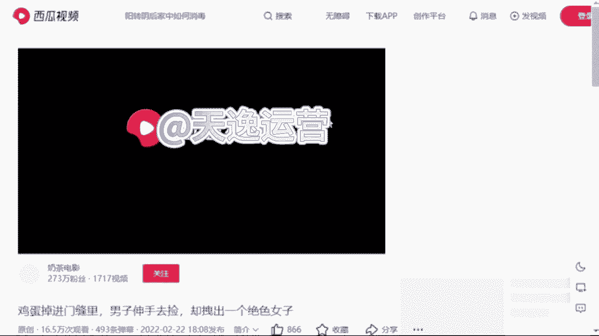

就我们刚才看见这一个视频呢，这个视频呢就是非常典型的一个这个解说类的视频了。三方面组成的哪三方面呢？包括给你们放小一点，我们可以再看一下，首先第一个呢就是这个画面啊视频。那第二个呢就是有这个文案看见没？

有这个文案的情况之下呢，还是会配音的啊，就有这三方面去组成的，包括你们现在看见这个呢是一个这个国外综艺的解说啊，因为国外综艺呢，现在走的真的非常的野啊，除了你们现在看见这个什么扇耳光的也好，是吧？

经常刷视频的人应该都有看到过一些奇奇怪怪的就是什么掰腕子的呀，什么真心话大冒险的呀，包括这个国外不是走这个开放嘛，是吧？什么这个综艺里面穿什么比基尼的呀，这样的视频真的特别多啊，特别多。

不过现在呢就可能这个也比较抓人眼球啊，未来你们可以去做这样的视频，国外的一些那今。😊，天呢我可能不会给你们讲啊，因为这一个国外综艺的话呢，它是会涉及到一些国外的平台和国外的素材。

今天自己官方的人员在听我的课啊，所以说如果感兴趣的同学下课之后，你可以加我的微信来问我，我教你怎么去做好吧，我们刚才讲到了解说呢就三方面组成。第一个画面，第二个文案，第三个配音。

那如果说我们不会自己写文案的同学，或者说自己不想写的那我们就去找素材来用。说到找素材呢，我要问你们一个问题了。😊，就我们本身做的是一个视频的解说，你找素材还能不能去找视频的文案来用，同学们觉得能吗？

就我刚才讲到的不能。哎呦说能的，这么问肯定不能。😊，可以呀，上道了是吧？对，不能啊，打能的同学嗯先给自己一巴掌啊，打能的同学先给自己一巴掌。我刚才说到了。😊，我们本身做的是一个视频的解说。

你还要去找这个视频的文案来用，它跟洗稿就没有什么区别了啊，就没有什么区别了。首先它是不能的啊是不能的对了，那我们找素材呢，我们要学会什么，我们要学会逆向思维。什么思维呢？我们本身做的是一个视频。

我们就不要去找视频了，我们可以去找文章或者说音频来用啊，因为我们所有的一个平台我是非常清楚的，它文章和视频是分开审核的，不会有任何内容重复度的一个出现。我们可以去找文章或者说音频来用。

这个小窍门呢是我自己的一个独家小技巧哈，就原来我做这个自媒体的时候，我不光在做视频，我也在写文章的，就最开始呢我自己的文章是我自己纯原创的，我自己手动去写的。😊，就最开始这个文章的话呢，当时做的人很少。

我做起来了过后呢，我的账号就越来越多了。到那时候我账号多了之后，我就明显能感觉到我自己写不过来了，就很多账号我发不过来了，当时我就在思考，哎，我说我能不能去通过一些什么样的方式，去增加一下作品的数量。

同时不会去增加这个内容的一个重复度呢。当时我写文章，我当时用的就是一些音频，就音频嘛非常多，像什么喜马拉雅呀、企鹅FM呀，这样的音频平台，我当时是把他们的音频提取出来的啊，文字我拿了过来当文章用的。

当时呢我自己主账号呢就主要做的就是文章类的，我给你们看一下吧，就这个收益的话真的还不错。😊，这还可以，你们看一下，我给你们刷新一下，你们就可以看一下，每天他这个文章和视频的收益，你可以看一下谁更高啊。

同学们是文章吗？对了，这个文章呢每天的收益会更高一点。你为什么呢？因为我堆量也是堆上去了的。我每天文章呢差不多在12篇左右啊，12篇文章，我数量也够了的，所以当时结果还不错。

那我最开始后边做这个视频的时候，我当时也在思考，我说我可不可以用这种方式我也去堆一下量呢？当时试了一下，结果还不错啊，所以说这个方式呢交给你们可以去用的。😊，🎼那么们今天找素材的话呢。

我们就要用到一个小白神器，一搜猫的一个素材库。要找到我们自己的微信啊，然后小程序里面就有一个一搜猫啊，就是这个小程序找到了过后，首先来讲一下我们该怎么去用。那第一个视频的资源呢。

就是我们所有平台上面的视频，所有我们想要做的这个视频主题的视频，我们都是能找到的。比如说举个例子吧，就我们按照沈腾来是吧？就是搜索一下。😊，我们直接搜索这样的一个关键词。

所有平台的一个关于沈腾的视频我们都是能找到的。看见吗？这是视频资源。那我们今天找素材呢，我们要用这个自媒体资源，这就是文章了啊，我们点开这个自媒体资源。上边这个领域的话呢，就是我们自己做的是哪个领域。

你自己随机去选就可以了啊，我们选择领域了过后呢，下边有个来源，就是所有的一个自媒体平台都在上边，我们自己去选啊，我们就选择一个百家号来看一下，是吧？这就是所有的一个文章，这就是我们找素材的一个来源了。

该怎么去找呢？来我找一个就是最近我们比较熟悉的。😊，我们看一下哪个文章我们能用。非常多，嗯，我们都可以来看一下是吧？包括我们就看这个吧，最近这个胡歌演的电视剧是吧，县委大院在县委县委大院儿不是比较火嘛？

你就根据这个来，我们要做解说视频。首先第一步我们要去找一个视频的素材，视频素材我们该怎么去找呢？就根据它这个主题来是吧？热播剧县委大院，我们直接把这一个名字复制下来，然后打开我们自己手机上边的西瓜视频。

啊，我们直接去找西瓜视频，然后在这里搜索这一栏，我们直接去搜索这一个电视剧名字，什么呢？县委大院儿。😊，来直接搜索就可以了。来看一下我们这个视频资源素材能不能找到了。现在能的来打个能字吧。

视频素材能不能找到了？一样的啊，在这个找素材过程当中，我还是强调那一点，你们不要紧着一个人的去用，好不好？不要直接去下载啊，我们刚才说到了每一个视频片段你保持在10秒钟左右，这才是我们能够用的视频素材。

现在能不能找到了，能是不是啊？这个视频的素材我们能找到了。OK那下一步文案是从哪里来的呢？文案就从这个文章当中，我们去提取出来的文字啊，这个文字我们有了文案有了配音会吗？同学们自己会配音的。

自己会配音吗？因为我刚才讲到的哈，咱们手机里面有录音机这个东西吧，有没有有吧，录音机我们打开，然后我们自己把这个文字念一遍，我们自己去配音，到时候呢人家想把你的这一个文案，或者说这个。😊。

和视频搬都搬不走啊，这是我们自己纯原创的一个内容，就不会配音的同学，是不是害怕自己普通话不好啊，是不是担心自己普通话不好？如果说担心自己普通话不好的同学，我们就可以用方言啊。方言就现在方言音呢。

刚才我也讲到了，所有平台方言音它运用的是比较少的，它是比较有创新度的。比如说举个例子吧。😊，这同学们是哪个地方的人呀？比如我是四川人，你就来听一下我的四川方言跟我们自己说的这个普通话，它明显的不一样啊。

比如说我们四川话说什么嗯，这个包ber啊乖乖呀，这样听起来是比较好听。第三就你这样一听，你就会觉得我的四川话是不是更亲切一点是吧？一样的，因为我们人与人之间我们看视频的话呢，它也是有这个地域差异的啊。

你们去用这个方言音呢，它是比较有亲切感。就你的这个视频，但是比较有吸引力的啊。这个同学说把死的一样的啊，我们就可以用方言，但如果说你连方言你也不想去用的。你说晚说我不想自己配音的，没有关系。

我们直接把这个文字复制下来，复制下来了过后点回一搜猫的首页位置，我们可以看见左下角有一个智能配音的选项，看见了吗？直接点开它，把这个文字粘贴进去，然后选择右边呢有非常多的一个。😊，这个声音。

什么这个邻家小姐姐呀，什么可爱宝贝的呀，萝莉音御姐音都在上边，咱们自己去选。选择完了过后呢，这个语速我们给它调快一点，音量放大一点。选完了之后，我们直接点击左下角的试听配音，我们就来听一下。😊，好。

现在合成了来听一下林志伟张新城市到光明县参加工作后的第一天，没有人理会他的时候，他就想方设法的与同事进行沟通。当镜头给到江霞的时候，我以为他们俩会是走到最后的一对，可能是最这个声音还可以吧？这还可以吧。

是不是这个文案也不用自己写了，这个视频素材也不用我们自己去找了，是吧？这个配音还一键给我们配的，方便吗？这样方便能大方便吧？嗯，当然如果说你不想用这个一搜猫的呢？嗯。

可以打开我们自己这个微信上面有个小程序叫配音神器，啊，配音神器，你们也可以记一下，他就是也是一个专门配音的一个软件，我记得配音神器，好像一个月是29块钱的会员29块钱愿意去花嘛。

就我们得记住这一句话叫什么呢？叫这个小投资大回报啊，我们一万的播放量，它的单价呢都不止29块钱了是吧？就如果说你不想使用的，你就会去那个配音神器，如果说你不想。😊，去用这个配音神器也可以是吧？

这个一搜猫的会员呢，如果说我们后边有缘分，我送给你们啊，我送给你们使用这个一搜猫没有多大问题的。就除此之外呢，很多同学说哎曾老师，我不想用这个一搜猫的素材库了是吧？那怎么办呢？有没有其他方式呢？

当然可以啊，是吧？我自己呢也是有一个解说文库的啊，我自己有一个解说文库的，就是所有的一个文案呢，是我自己纯原创的内容。这个呢我可以送给你们来使用。这个没有多大关系的啊。纯原创的。

我现在包括我自己所有的一个小伙伴都会实时更新的。每一个文案的话呢，大概两三千0字左右。你只需要根据我的文案去找视频来合成就可以了啊，找找这个视频就合成就可以了，这是比较方便的一种方式。😊，就除此之外呢。

有很多同学说哎，曾老师我也不想啊，我也不想用你的，我也不想用一艘猫的，问一下同学们有没有想自己写纯原创文案的。那个你告诉曾老师说，哎，曾老师，我就想自己写纯原创的文案，有没有我之前真的就遇到过啊。

那个同学告诉我，那，曾老师，我就想自己写纯原创的文案。😡，真的特别的。😡，有底气是吧？我就喜欢这种人。如果说想自己写纯原创文案的，我支持你。因为纯原创的文案，他比我们找来的素材，播放量的收益。

单价都会高出两倍的。啊，单价都会高出两倍的，这是有优势的。因为我自己呢是有一个这个文案课程的，就包括我自己写文案也好，或者说我自己小伙伴写文案也好，都是从这个课程里面来提取的。

就很多同学说总么说不想自己写文案，我害怕，就是不是觉得这个文案是一个非常专业的一个东西呀，是不是觉得他是一个非常专业的，像写作文一样的，其实不是的，如果说想写文案的同学害怕写文案同学记住我这一句话。

我们的解说文案说人话就可以了，什么意思呢？大白话就是口水化的意思。比如说呃给你们举个例子吧，就是我们把一件事情讲清楚，就我们平常给我们自己的爸爸妈妈或者说朋友们我们安利一个电视剧的时候，你要告诉他。

你看这个电视剧。😡，多么的精彩，你想让他也来看的时候，你一定不是这样说的吧，什么还有一个头头尾尾的，什么还有个开头过程，还有个结尾的，妈妈，我今天看了一个电视剧，我觉得很好看。嗯。

你说这个电视剧名字叫什么是吧？他是哪个导演来拍的啊，他是哪个时间上映的，这个男主角叫什么名字？这个女主角叫什么名字？第一集发生了什么？第二集发生了什么？第三集发生了什么，你一定不是这样说的是吧？

你一定是妈妈，我今天看了一个电视剧真特别好看，怎么好看呢？那个男主角真的超级帅气，那女主角也真的超级漂亮的，因为他们好般配呀，发生了一件什么样的事情呢？这两个人是吧？相爱十年了，马上就要结婚了。

但是那个男的这个婚前出轨了，是吧？女的知道之后去捉奸，找到之后删了那个男的一巴掌说离婚吧，我不跟你结婚了，你一定是这样说的，是不是这个就是我们俗称的口水话，不是像什么写作文一样的，还要有个星期级。

这一天是这个哪个导演出现发生了一件什么样的事情，不这样子的，如果你这样去做，谁还来看你的影视解说呀，谁还来看你的解说视频呢？我都去看电视剧了是吧？这让我们最。😊，最典型的一个例子是什么呢？

是原来这个甄嬛传有看过吗？就非常典型哈。原来甄嬛传真特别好看，我也喜欢看甄嬛传。但是我有时间我能看第一集，那没时间的时候，第二集我看不了第三集的时候，我就已经看不懂了。😊。

是不是当时非常多的人做这个甄嬛传的影视解说是绝对赚钱的啊，包括这个影视当中还有一些什么文言文，谁的学历有这么高啊，我还能把这个文言文看懂，是不是当时做影视解说的人，他就是说的大白话。

你让我知道这个故事当中这一集发生了一些什么事情就可以了，是吧？是不是包括呢我自己的所有小伙伴当中做这个视频解说的人是最多的啊，最多的做解说的人，为什么？就因为这个影视解说或者说这个解说视频。

他是最赚钱的给你们看一下是不是做解说的人真的特别多。😊，美纪录片的解说的，包括这儿有个综艺解说的，那没？这是电视剧解说的。包括这儿动物解说的、电视剧的科普解说的历史解说的、动漫解说的非常多。

是不是为什么他都要去做解说呢？就是因为解说它并不难，而且它也是最赚钱的一个领域，包括给你们分享一个吧。我们分享一个动物解说吧。就如果说你们现在想要去做解说视频的。一、你要做这个影视推广。

你就可以去做这个影视解说，它是有版权的啊，是能起到一个决定性作用的那如果说不想做影视的，我就建议你们去做这个动物的解说。因为动物解说现在在平台上面做的人是比较少的。平台的扶持流量是最庞大的。

你们可以去做。😊，包括像我们这一个小伙伴的话，当时他是一个五金店的小老板啊，有没有自己家里面开店的？他就是嗯当时他自己是有一个五金店的，但是他当时跟我学的时候呢，他稍微有一点基础。

他跟其他自媒体老师就其他机构老师有学过的，这也是非常典型的一个例子，他当时做或者当时学学的就是洗稿的内容，确实是他当时做洗稿的话，做了一个月。😊，但是一个月期间呢，赚到了100多块钱。但是一个月之后呢。

平台直接把他账号给他封掉了啊，所以说他觉得这个洗稿不能做。所以当时报名的时候，他给我打了半个小时电话，他只问了我一个问题。他说老师我就想自己写纯原创的文案，你能不能把我教会我当时听见他这个问题的时候。

我直接斩钉截铁的告诉他我说你想做，我一定让你拿到这个结果，但当时呢他心里面也有特别多的傲气，因为小老板嘛就原来也赚到过钱所以说过程当中呢，我们的沟通呢，还是出现了一点小插曲的。

他虽然是一个这个五金店小老板，但是呢当时也是处于一个欠债的状态，就因为疫情的原因嘛，就是自己的这个五金店收益不是特别好，当时呢一度也是面临倒闭，但他找亲戚朋友们借了很多钱，在这店里面垫了很多钱。

后边疫情呢也是反反复复没有一个很好的结果。当时呢他做这个呃自媒体的时候做洗稿赚到了100多块钱，他觉得这个行业是可以的。当时就跟我做，就做的就是纯原创内容嘛。😊，他赚钱的欲望真的特别足。

你从他这句话当中就可以看出来，他一定必须成功，没有撤退可言。我说我就欣赏这种人是吧？我说你有这种动力，我就一定能把你带出结果。我当时特别欣赏他。但是当时呢我给我所有的小伙伴说的是。

我说你们的视频必须要全部发给我审核通过了之后，你们再去发布，但他没有他当时觉得自己可以做。😡，他直接把这个视频做完了之后，直接就去发了。发了之后呢，他给我看。他说老师你给我看一下。

他说我当时做的是这个影视解说发的王牌特工二的，让我给他分析一下不好的地方，问题出在哪呢？问题出在他当时做第一个视频之前，我当时正在给他对接这个影视推广。我正在给他对接版权，他还没有拿到手。

他直接去做这个影视解说，当时出现一个什么问题呢？那当然流量特别少啊，因为影视解说如果说没有版权的话，他会有重复度，甚至说这个版权的要求的。平台在审核的过程当中会给你降低这个流量的推送。

当时有这样一个问题，啊，当时问题是什么呢？就是当时他这个视频做出来了之后，2万的一个播放量赚了1。99块。😊，嗯，当时他直接问我，老师这个单价怎么这么低呀？😊，我说单价低两个原因。

因为你自己版权没有拿到嘛，剩余的就是你这个视频发出去播放量时长低了。什么意思呢？如果说你做的是一个两分钟的视频，用户点进去看了之后，他只看了十几秒钟20秒钟是吧？他这个单价这个播放量时长低了之后。

会有影响到我们单价，也会影响到我们整体的一个收益结果的。我当时给家讲，那第二个呢就是很多用户他反复的去点你的视频，他又不看完，因为重复的播放量他是不会计算在这个单价里面的。所以当时他这个单价是比较低的。

收益也很低。当时我直接问他，我说现在呢我先让你不要去做这个影视解说。我说你为什么还要去做呢？他说我有点不甘心。他说原来我做洗稿的时候，我还赚到了100多块钱，我说你等一等，我说把这个版权我给你了之后。

你再去做都可以的。我当时建议他先做的是什么呢？建议他做的就是这个动物的解说，因为当时做动物解。😊，说人真是少之又少。我说你去做这个流量，我们一定能拿到手的。当时我给他这样说的，我说你做嘛？他说可以。

我当时建议他做动物的时候，我说这个视频方面呢，我们就去找一些国内外的保护动物，就像现在什么意大利的。😡，这个大街上面养袋鼠的是吧？家里面养黑熊的动物袭击人的事件真的特别多。

我说你拿过来给我们国内的用户做个普及，是吧？引起一下用户的共鸣。他是具有科普作用的。这样的视频是比较有吸引力的。当时他做的就是这一类，这过程当中的话呢，是因为稍微有一点基础。

所以说我们做这个纯原创内容的时候呢，发布平台也是非常多的，像什么B站、皮皮虾视频还有多多视频、快手、百家企鹅、西瓜抖音，每个平台他都在做，当时呢我稍微有一点点担心，因为平台太多了，我怕他一个人顾不过来。

但是当时呢他这个赚钱欲望很足，我也没拦着他，他说我就想把这视频横竖频都发一次，因为抖音是需要视频发放的，有这样一个规则。当时呢呃他说没办法，为了申生活全身心都在上边了。

我说我能理解你我说你先跟你老婆一起顾一顾，因为他和他老婆一起在做的，两个人都在做这个视频，人很不错。当时呢我说一旦过程当中有这个播。😊，播放量降低了，或者说这个单价降低的情况出现了。

或是你立马先停掉两个平台。我先我们先把我们能够抓住的这个收益，我们先赚到了再说，那吧尽力而为嘛。包括当时的话也是文案是自己纯原创的，当时他给我发了一个快手的截图啊。

就他快手的当时老师一个热门就200块钱，我能不发吗？我说发呀，能赚钱为什么不去发呢？当时快手的话，热门就是每隔一天就会有一个热门出现。你可以看一下，这个播放量42万的，56万的，听见没？

59万的100万的，包括这个71万的这个63万的播放量真的还可以吧。这个热门的收益就一个热门是200块钱，他跟这个播放量单价是另算的啊，是另算的不会很合成在一起的那收益呢虽然可可可观的。

当时给我说到一个星期就这个热门的收益保底都是630块钱。😊，这个收益还可以吧。当时呢他快手也报了一个作品，1143万的那老师这个作品还没有评奖，我不知道拿多少。就是我们把我们视频的作品质量估好了。

你能够变现的途径是很多的这个奖金。如果说他能够评到奖奖金起码都是3000左右的这是非常可观的。当时呢也是这个过程当中呢，我觉得他特别优秀的一个点，就是过作品当中啊过程当中我们做视频，他有了这个播放量。

有了这个收益过后，他依然会去顾质量，他不会去要求数量的。当时我说我们的账号是需要有一个稳定期的。我每天先把这个账号活跃度提起来。后边我们的对这个平台给我们推送流量的时候。

就会慢慢的去增加我们的这一个扶持流量了。当时他说我不追求数量的，做一个是一个每天必须有一个不会做多，这是我最欣赏他的一个地方，思路是非常清晰的。当时过程当中呢也是说到了，当是没办法，如果说做了没有结果。

不是我的风格。我当时也说到，我说如果说我带你没有带出结果，这也不是我的风格。啊，当时他做这个视频的话呢，做将近一个半月的时间。结果真的还可以，你们看一下。😊。

那没播放量1288万的视频的收益22616块钱，这是一个半月的时间。当时还没有到这个月的15号，所以大概也就一个半月，这个收益满足嘛，你觉得还可以吧。这个收益对你来说，你觉得满足了吗？

当时一个半月的时间，2万多块钱。那真的当时给我打电话说自己自己差点差点跳起来，因为真的特别高兴，我也真的特别开心，过程当中呢，还是按照我的要求去做的。我给你们看一下吧。

当时他第一个爆款视频你们也可以看一下，他到底做的怎么样？😊。

Yeah。🎼的绝杀时刻，一只狮子在这里拦截迁徙的角马家族群，他先是漫不经心的驱赶角马群。一看他就是狩猎经验丰富。为了捕捉猎物，他耐心的观察，不急于出手，他终于发现了适合的角马，就全力加速追赶过去。

角马们吓得四散而逃，他的奔跑速度，惊人让狮子感觉有点棘手，他果断放弃，快速转向另一只比较弱的角马，他说真是来的早不如来的巧就是你了。狮子把角马驱赶进了草丛里，这样可以减缓角马的速度，他一个腾空飞跃过去。

就按住了角马，混乱中死死的咬住他，还抱着不撒手。角马腾突万分，可还是毫不畏惧，他一心只想甩掉狮子的束缚，急的是原地转圈圈，他们都觉得是展现自己实力的时候到了，他们不肯认输，又来到了空旷的草地上。

想要一征高下，双方一追我赶搞的是不亦乐乎。角马今天如有神助一样越战越勇，把狮子一顿无情的驱赶狮子也猛圈了，心里在想，你这小子今天是抽什么风，昨晚是不是喝多了，他一连去的腾挪躲避后，忽然在地上。😊。

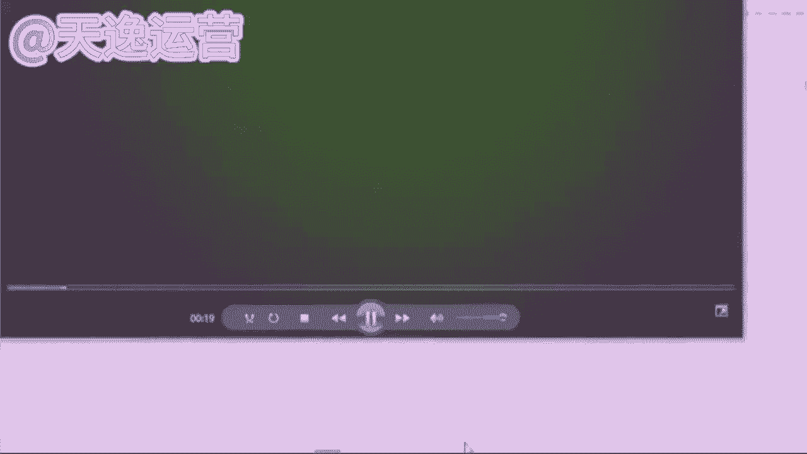

🎼滚了一圈，然后出其不意，就跳过去抱住了角马的头。这操作绝了。角马说，你小子净耍花招，反正我是见招拆招，他顺势就把狮子放倒在地上，而狮子也毫不示弱，仅仅抱住了他的头，还用他全身的力量往下拉。

可狮子这样就变成了肚皮朝天，把自己最柔软的部位赤裸裸的露了出来。角马一看反击时候到了，他快速将狮子压倒在身下好，这些视频我们先看到这哈，同学他一视频做的怎么样？你觉得还可以的，来666打起来。

你觉得可以吗？这是当时第一个视频的话，做的结果还不错？当时播把这个爆款的播放量的话是51。1万的，你们也可以看一下他这个解说文案当中哈，使用的就是一些口水话，包括说什么？嗯你小子是不是昨晚上喝醉了。

你抽什么风是吧？这操作绝了，这样的话，你们平常会说嘛？这样的话，我们平常应该都会说到，是不是你小子抽什么风，是不是昨晚上喝醉了，这就是我们用户想要听到的口水话，我能听懂的语言。😊，是吧有趣有梗的语言。

就是你平常都会说为什么不拿来放到自己的解说文案当中呢？是不是这才是我们用户想要听到的想要看到的解说文案，不要觉得它特别难，其实非常简单的啊，就除此之外呢。就很多同学你们就可以思考一下了，是吧？

我讲到这儿，你们到底想要去做这个解说呢，还是想要去做这个影视的推广呢？是吧？我们自自己一定要有一个想法的啊，我们自己一定要有想法，我们再去做，我们才能够更快的去上手的。😊，🎼那除此之外呢。

第三个我要给你们讲到的就是这个魂剪视频了。混剪视频的话呢，讲之前也跟你们讲一句啊，就这个混剪视频，它是我们所有的视频领域当中最难的一个最难的一个。就我最开始呢自己有手动剪过这个混剪的视频。

就给你们说实话，我也不怕你笑话哈，就我们我最开始手动剪的时候，给我一度自己做到崩溃，为什么呢？真的特别浪费时间如果说我要做一个5分钟的混剪视频，我起码要剪100个视频片段。

我能我才能够去组成一个这个呃合适的一个时长的混剪，当时越剪越生气。这过程当中，因为我自己做的账号也特别多，我也在运营公司的账号，包括解说我也在做，包括视频剪辑，你面推广，我也要去做，包括这个混剪。

我也要做，我当时就越剪越生气，我说真的特别浪费时间，我就是找我们老板，我说老板，我真不想做这个了。我说真的浪太浪费时间了。我说我顾不过来。

但是我说我们公司这么多这个技术部门的小伙伴就不能让他们做一个软件。😊，出来嘛是吧？拿来我堆量也好呀，当时我特别生气，因为我老板听了呢也笑了笑，没说话。

但是我们公司呢也是浪花了4年多的一个时间给我们研发出来了一个这个软件啊，就叫批量剪辑的软件。我现在去全靠它来堆量的。所以今天呢我就教你们怎么去用这个工具去做一个混剪的视频，后期可以帮助我们去堆量。

拿这个播放量的收益的当然这个呢是我的一个知深法宝啊，这个法宝名字呢，它就叫批量剪辑，嗯，名字就叫批量剪辑啊，我们不搞那些花里胡哨的东西，我们能听懂能用就可以了。好吧，那这个批量剪辑的话呢，就混剪的视频。

我们要去区分领域的，什么样的领域最好做呢？首先第一个就是影视方面的？就影视方面呢，它是最好做混剪的国内外的这一些电影，同学们看不看。😊，看得来公屏上打一个看字吧，就同学就国内外的这个电影。

你们平常会不会看？就像我们国外的什么哈利波特呀是吧？或者说什么漫威呀，或者说什么速度与激情呀，这样的影视他最好做混检的那除此之外呢，像一些我们国内的什么。😊，这个什么武打片儿，就像这个枪战片这一类型呢。

它是最好做魂检的。除此之外呢，像一些这个美食类的。啊，美食类的也可以做混剪。除此之外呢，像一些动漫的，就国漫呀，或者说日漫，我们中国自己国产动漫、日本动漫就是一些特效场景。

它也是比较容易做这个混剪类型的。就做影视的话呢，同样的啊如果说你去做这个影视推广，到时候版权拿到手了之后呢，随你做啊随你做这是比较有优势的啊，首先我们要去找素材的话呢，我们换一个吧。

我们最开始用的是西瓜。现在我们换一个平台。我们去用B站吧，B站什么哔哩哔哩就这个平台知道吗？同学们这个平平台哔哩哔哩啊，我们平常一搜索网页都会有的，我们直接点开这个搜索栏。

我们今天就去做一个我最喜欢的一个这个国外大片，哈利波特有看过吗？有的来公屏园打有字吧。就哈利波特，我们就去做一个哈利波特的文简，一样的，我们点开搜索这一栏，我们直接去搜索哈利波特。😊。

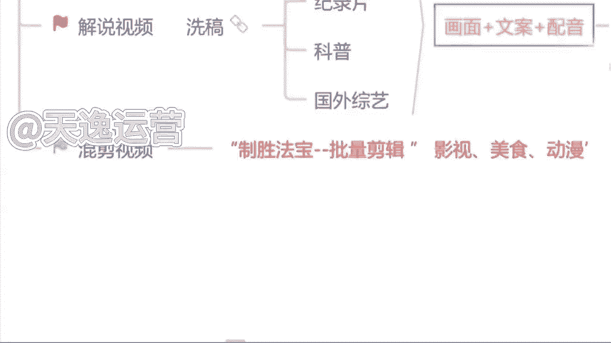

这样的一个关键词就可以了啊，搜索完了之后来直接点开。现在我们可以看一下，这就是全部都是哈利波特的视频。我们随便点一个来看一下。

Your attention， please。Let the feast。Begin。🎼First things first。🎼must say all the words some my。啊。

这个视频呢它就是哈利波特的哈那如果说我们想要去用这些素材呢，就是任何一个平台都是一样的。西瓜视频也好，B站也好，或者其他的视频平台。我们想要去下载这个素材呢，你可以看一下。

下方没有任何一个选项是可以来下载的那怎么办呢？我想用这个素材来，我们直接找到我们手机上边有一个这个网页的链接，看见了吗？我们手机上边都有的，我们直接去把这个链接复制下来，复制下来了过后。

找到我们微信小程序一搜猫。我们可以看见左下角有一个视频下载的一个选项，直接点开它，然后把这一个链接点进去开始解析。那这个视频呢我们就能下载了啊，这是比较方便的一种方式。当然这也是单个下载的一个途径啊。

但是我们要做这个批量的一个文剪的话，我们肯定是要下很多素材的，不止一个了。那怎么办呢？😊，一样的，我们去找到这个链接，同样的去复制它。然后我们就可以看见跟它同样长度的视频是有非常多的。来。

我们随便去复制一个那复制完了过后呢，我们就来搜索一下啊，看一下有多少个这个步骤呢，到时候你们可以记清楚啊。因为我们后边也会用到的来看一下有多少将近20多个视频，我们直接复制。

然后我们要用到一个批量下载的软件啊，这个名字呢也叫批量下载，也是我们公司自己研发的，后边呢我可以送给你们使用啊，这个没有问题的，我们直接点击这一个粘贴，然后所有的一个视频链接呢，它会自己去解析啊。

然后自己去下载，可以看一下，是不是哈利波特的是不是自己就会开始下载了。

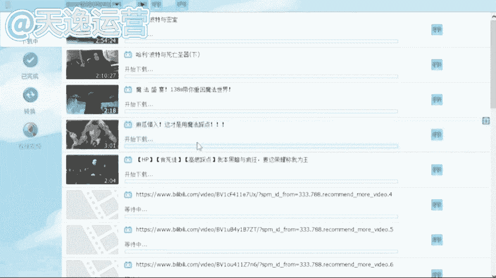

那在这个下载过程当中呢，我们必须要用到一个批量剪辑的工具。这就是曾曾老师说到的知撑法宝了。首先来看一下该怎么去使用。那首先第一个呢，分割提取就是无论你做的是这个。解说还是视频剪辑，还是说批量混剪。

我们都可以用到它。就这个我们只需要把这个链接粘贴进去，然后呢，干嘛？我们只需要去调整一个时间参数就可以了。就右边每段的时长，我建议你们每5秒钟为一个片段，这是最好的也是最精彩的一个片段。

我们直接去调整就可以了啊，5到10秒钟10到15秒钟这样去调就可以了。那么今天要用到的呢就是这个超级混剪多视频混剪这一个选项了。首先第一点就把你们自己下载的一个视频素材全部添加进去。然后这个魂剪的话。

它是肯定需要音乐的。我找了一个音乐给你们听一下，你们来听一下它合不合适，好不好？来听一下这个音乐。Like。🎼不是为。啊，那么首先呢我们这音乐添加完了过后来左下角我们要去添加第一个什么呢？

就有一个生成单个视频的时长。我们刚才说到了哈，就如果你要做的是一个一分钟的是60秒。如果是一个2分钟的是180秒。如果是一个3分3分钟的就是180秒。我按照这样的一个时长去调啊。这个调整完了之后。

左下角有一个单个视频片段随机抽取这个按照我刚才说的来，每5秒钟去调整一个片段，它是最精彩的啊，15秒到20秒或者说20秒到25秒钟，我们就选择中间的这一个片段，它是最精彩的。

我们可以去用那这个调整完了过后呢，右下角有一个生成的视频数量。就你想要做多少个，你要做10个，你就添加10个，你想做100个就添加100个。这个根据我们自己呃下载这个视频素材的数量来啊。

我们今天呢先做一个为了更快的去看见这个成品。这个数量我们添加完。😊，过后只需要点击左下角的开始，然后他就会自己去执行任务，抽取音频，采取这一个视频的片段，这个他就会自己去做一个这个混剪的视频。

我们只需要稍等一分钟啊，这一分钟呢让他去剪，我们来唠一个嗑对吧？那这个呢我也给你们讲清楚这个工具呢，它毕竟是工具，如果说你想让它剪出来的视频，跟我手动剪的一样的好，它达不到啊，它达不到。

这个得给你说实话，就这个视频呢，它剪出来这个混剪视频，工具剪出来的每一个呢它能达到一个正常推流机制，就是每一个在5000左右的一个播放量，就问一下同学每天半个小时时间有没有就半个小时。

我们就花半个小时时间啊，我们去剪多少个视频呢，我们就剪10个嘛，就是我们最开始也说到了一分钟呢，它就能剪一个视频，半个小时肯定不止剪10个，我们就按照最低的一个标准来算。10个视频。

一个视频5000的一个播放量。这播放量是多少了？5万了，我最开始算的一万的播放量的单价还记得吗？还记得来，你把这个单价打出来，就我最开始算的啊，单价多少？1万的播放量。😊，1万的播放量是34块钱。哎。

对了，34块钱我们就来算一下吧一万的播放量是34，5万的播放量乘以34。来看一下，我们做10个视频，170块钱的收益。😊，满不满足就170块钱10个视频，我们一个月呢，我们也不说多了。

我们周末呢也休息一下，我们按照正常的一个工作日来算，我们一个月做24天的视频啊，我们乘以24啊一个月我们就靠这个工具，我们每天去堆量4000块钱，能不能接受能的来公屏上大能子吧，这个收益能接受吗？

如果说你觉得这个收益你满足不了，你接受不了的，O那你就花更多的时间更多的是精力，把这个量你俩堆上去啊，我是按照最低10个标准来算的，你就去做20个，做30个啊。当然这个过程当中呢，我们的账号它也要多。

我们才能够平平均每一天去发布的啊。这个我要提前给你们讲的，因为我自己所有的小伙伴当中呢，做这个批量剪辑的人真的不是很多啊，不是很多，就是他们都在做批量剪辑，但是不是主体在做的啊每一个呢要么在做解说。

要么在做盘点辅助工具是这个。呃，混剪的工具，他们拿去堆量的。我还记得有一个主要在做这个批量剪辑，我看一下。对，就这一个。因这个同学呢，他是一位宝妈啊，当时给主要做的就是这个批量的混检。

就只做了一个批量的混检。当时呢他是呃因为自己过程当中家里面有孩子就没办法自己出去工作，所以当时呢想来做自媒体，就有没有宝妈的，有的来公平上打柚子吧。因没有宝妈同学，他当时就是他有三个孩子。

当她跟我说的时候，我都特别惊讶，我说你这么年轻，有三个孩子了，他说是的，当时呢他也特别想出去工作，但是因为孩子的原因呢，没办法，她放心不下，就过程当中呢，他跟我说她她跟自己有公婆住在一起的。

就因为公婆的关系不是特别好。当时呢生活费是每个月她老公发了工资，😊，她去要才会给的。当时就有这样的一个情况。当时呢因为孩子要这个呃开学了，想给孩子买一些这个开学的新衣服，新文具。我觉得这是一个好事嘛。

对不对？当时他说她婆婆知道了，她找这个老公要钱，她婆婆给直接把那个生活费抢过去了。给他说那你天天在家里面是吧？又不挣钱，还要花我儿子的钱，他说我儿子的钱是大风刮来的嘛，当时我听的时候真的特别惊讶。

我说是真的吗？他说是真的，我说我以为电视剧里面才有这样的情节，但说当时我也觉得特别生气，他说我过够了这种手心向上的生活，我也是自己有能力的，他说如果不是我是吧？他的这个我老公怎么能安心出去赚钱呢，是吧？

他说这一切好像也应该是我换来的吧，他时特别生气，但说我就想让他们来看一看，我是可以靠自己的能力赚到钱，改变自己的生活，给我孩子一个好的教育条件的，当时他特别硬气，但是呢随之而来了一个问题。

他当时时间真的特别少。😊。

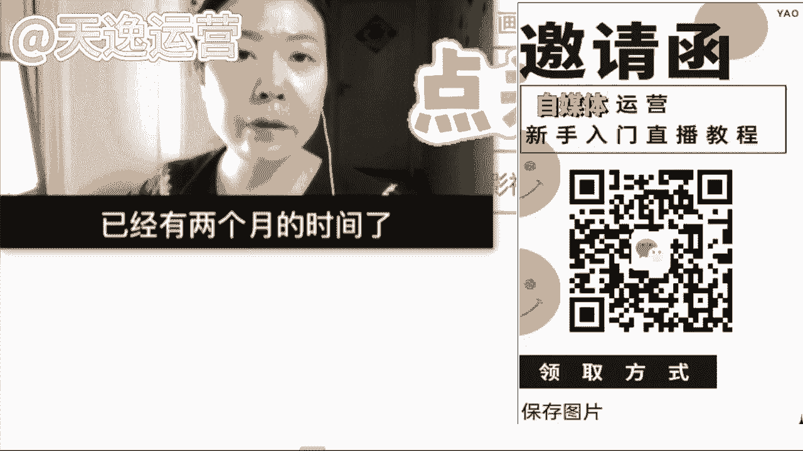

每天要照顾孩子，每天最多最多。他跟我说，老师，我每天最多能给你挤出半个小时的时间。我当时听了之后呢。😊，其实还是有点为难。我当时给他说，我说那你就先做这个批量剪辑吧。我说后边孩子上学去了之后。

我们再去拓展一些其他的领域去提升一下收益。当时呢他做了两个月，其实结果还可以给你看一下。😊，有两个月的时间了，从一开始的什么都不懂，到现在这个月收入已经到1300了。

非常感谢我们这些宝妈提供的这个学习平台，还要特别感谢我的解答老师，细心耐心的给我解答和指导，才让我有了这么好的成绩。下面呢我给大家看一下我后台的收益数据。😊，Yeah。给大家看一下。

这个是我这个月的总收益13338。看一下收益数据。

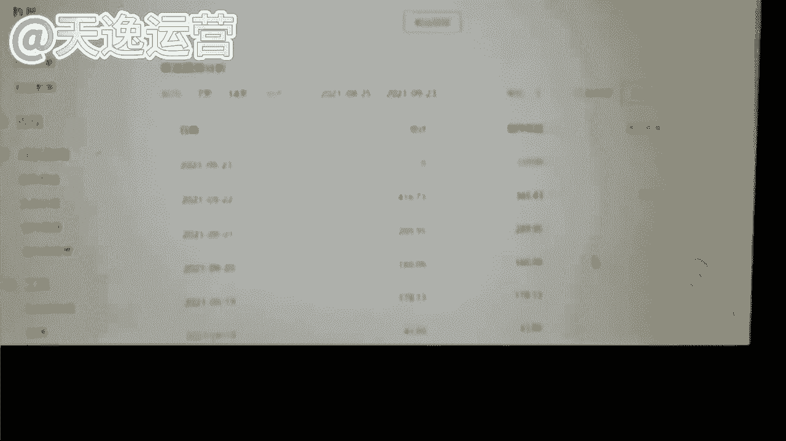

从第一页。第一页。25号这都是每天100多几十300多。300多100多、200多、500多的。还有一页，这这边中间就有几个爆款了，900多1000多2500的，然后100多100多200多100多。

然后这几天也有一个爆款。100多600多、200多、400多。昨天有一个爆款还没出来数据呢。好了，这都是我的收益。这就是我这两个月的收益情况。现在我每天的收益都很稳定了。就算没有爆款的时候。

每天也有100多。我觉得吧做这个自媒体就是要耐着性子坚持不断更，肯定就会有不错的收获啊，后面的收益也会越来越稳定的，最后还要感谢老师们和我的解答好，这个视频呢我们就先看到这里哈，啊。

这个宝妈呢刚才也说到了，如果说呢每天没有爆款的情况之下，收益呢也在100多左右啊，这是一个稳定的收益，当时呢呃两个月差不多1300的一个收益。我觉得这个结果呢是因为过程当中，他自己的时间呢慢慢的有增加。

当时他把这个作品的数量也是提升了的。包括他讲的一句话是我最认可的，就做自媒体就是要坚持不断更。为什么呢？因为我们需要活跃，自己的账号，你的账号越活跃，平台给你的扶持流量才会越多。

这也是很多人自媒体没有做起来的原因，因为他坚持不了，同时觉得你自己能坚持吗？😊，是吧确实啊说实话，现在很多人呢也做不到这两个字啊，我的要求是你们可以期一周7天的时间，不用每一天都去发。

但是至少要保证你发的时间要多于你休息的时间是吧？一周7天你发4天，你休三天都可以啊，你每隔一天去发也可以，你不要发一周，第二周我不发，这样是不可以的啊，这样不可以的。

平台他有计自有一个计算方式的这样的方式，我们的账号它才会更活跃。😡，是吧包括呢到现在我们一个一分钟时间也到了，我们来看一下他这个视频剪完了没有？好，这个视频呢它剪完了，那没？执行完毕了。好。

那我们就来看一下这个工具剪的视频到底怎么样呢？它能不能配得上这个5000的播放量，我们来看一下。😊。

🎼Just like that。🎼打开。🎼愛して。🎼不是为。🎼就是。🎼我知道。🎼愿你我。Bur it up the way。

 fucking let the world up for just one day， watch this man this colorful cha no。🎼Anyway， just like。

🎼风远。🎼给来。🎼不是为。🎼在这。Just like that。🎼走开。🎼This man。

🎼你我。🎼你我。Bur up the way， I let the world up for just one day。 watch this man this colorful cha。

Just like。🎼天了。🎼不是飞。好，这个视频我们先看到这儿哈。同学们你觉得这个视频做的怎么样还可以吗？这个工具剪的我说实话哈，虽然说它真的没有我自己手动剪的好。

但是它绝对比大部分做自媒体视频的人要好的多啊，这个是实话。这个5000的播放量它能配得上的吗？是不是包括我讲到现在哈同学们就可以思考一下，你自己想要做混剪呢，还是想要做解说呢？

还是想要做这个影视的推广呢？你想要做哪一个？如果说你现在已经有想法了。同学啊，你可以自己思考一下，但是呢我所讲到的哈，这三个领域呢，你不能每一个都想做啊，我们最开始呢肯定要选择一个领域，我们去专攻的。

我们有了这个收益结果，我们慢慢的再去拓展一些领域啊，因为我们没有人能够一口气吃成个大胖子的啊，不可以，所以说你们一定要对自己要做这个领域，我说这个视频的这一个类型，你一定要有想法的，有想好吗？

同学们做解说的人。😊，我最喜欢的，因为我自己最擅长的就是这一个呃文案的这个写作。那我这是我最擅长的。所以说你如果说跟着我去做这个呢，你一定能够拿到一个很好的结果。包括我刚才讲到这三个领域的视频呢？

这是我所讲到的我们自媒体行业当中最基础的一个变现方式叫什么呢？内容变现，按内容变现。😊。

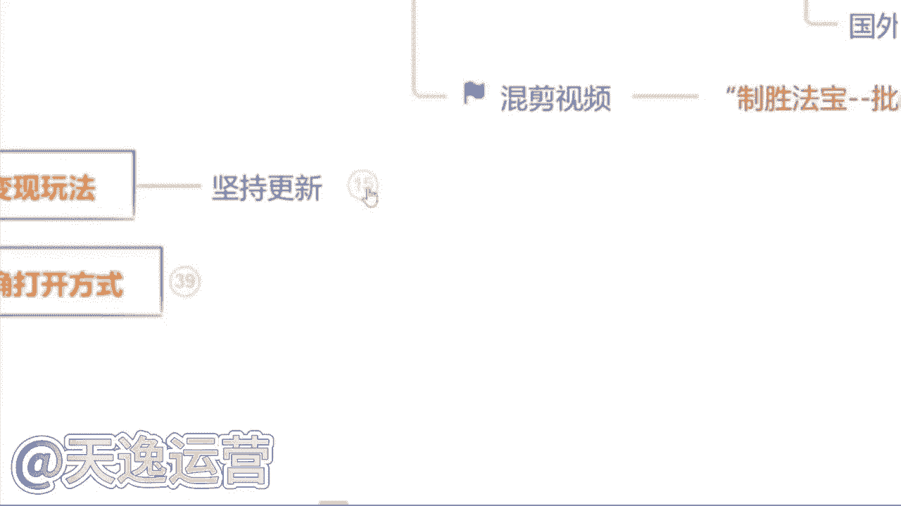

这个内容变现的话呢，就是如果说我们能够做到坚持啊这两个字你去实时的去发布作品，每天都能去发这个播放量的要呃这个播放量的收益呢肯定是会更高的，包括这个内容解说呢，他也是我们零基础同学最稳定的一种变现方式。

包括你们现在看见这个呢是我们刚才那些同学今年的收益啊，刚才那些同学今年的收益。因为我每年只会带一批学生，所以说你们最先看到呢是他们去年的，他们今年的收益呢，我也找他们要了。

当时啊他们这个同学这个收益的话是我们这个呃刚才那一位宝妈就做批量剪介那个同学，他今年的收益。因为今年的话他开始陆陆续续的去接触了一些这个盘点的视频，我说也在做这个影视的推广，所以说收益的话呢。

这个播放量的收益是比较高的啊，你可以看一下400多600多的，都是有增长的。包括像这个同学是吧？每天的收益当天的。1000多的2000多的这个给你们说实话，它肯定不止一个账号了啊，它有4个账号。

就每天的话呢，他靠这个批量剪辑堆量，他也能有一个不错的结果啊，这个给你们讲清楚。除此之外呢，像这个。就每天你们想要啊就是拿到你们这个这个单价能够达到像这个3000的、5000的、7000的，这个是全职。

🤧嗯。啊，这个是全职给你们讲清楚。就是他自己呢呃这个同学他有自己的5个账号。除此之外呢，他就每天也在做视频，他不是在做视频，就是在做视频的路上，他把所有的时间都花在这上面的。所以说他的是这个收益的话呢。

是比较稳定的啊，这是全职。包括像这个给你们看一个非常典型的一个同学。当时这一个小伙伴呢就是当天的收益，最高的一天13000。当然这个也是个例啊，这也是个例。当时呢因为这个同学他也是全职。当时正值节假日。

节假日的时间呢就每天都在做视频，做完了之后，他是累积到一天去发的。因为他自己的账号也特别多啊，这是个例了，1万多的收益，平常的话也就稳定在过程当中是57000左右的啊，包括每一个平台。

他结算收益的一个时间，你们也要记清楚。像头条他这个平台是呃月底的那一周，周一和周四啊，是结算收益的，像大于和百家。😊，啊或者说其他的平台基本上都是月初体啊，就是这个月月末结算好了之后，下个月月初体现啊。

每一个平台它是不一样的。像我们这一个小伙伴的话。这也是全职了啊，这也是全职了。这个小伙伴当时嗯一个月的一个提现金额是78000。当时他主攻的呢是因为过程当中做了一个中视频计划啊，中视频计划的话呢。

是一个视频这三个平台同时都会给你结算收益的。所以他的收益呢是比较可观的啊，这个过程当中呢，他能做到现在呢真的过程当中他家人的支持也是非常重要的。这个小伙伴当时他自己做的过程当中，他老婆也特别支持的啊。

我觉得这个信任的力量是非常庞大的，所以他结果是最好的。包括当时如果说你们每一天哈能够稳定在像这个小伙伴一样，每天能有200多这样的一个单天收益，其实你们的播放量呢其实已经差不多了啊，其实已经可以了。

如果我们能有这样播放量的时候，我们就自动解锁。第二种变现方式叫什么呢？叫广告变现。广告变现就像我们这个玩游戏是一样的，是吧？通关了第一关通关了，第二关自动解锁。😊。

这广告变现是因为所有的平台上面都有广告商就有有没有了解过的广告商，比如说像我们举个例子，像这个什么小红书上面啊是吧？都有非常多的什么美妆的什么临食的，或者说美容方面的是吧？非常多广告商都在上边。

当然他不会让你知道他是谁哈，他会主动来找你的。因为你有播放量啊，他会来亲自给你对接这个广告会给发私信，说哎，我是做什么的？我今天想要跟你对接一个这个呃视频挂链接，还说视频带货，这个是两种不同的方式。😊。

就未来有没有想进行这个视频带货的？就未来如果说你们想要去做这个视频带货的，想朝这方面去发展的，后边呢也可以给你对接这方面的资源啊，像什么千万级粉丝的一些这个带货视频直播回放都可以对接给你们。

你们直接去减，然后挂小黄车都可以的啊，不需要自己囤货，这种方式也是比较可观的。就这个视频带货的，就是视频挂链接的话，讲一下，他是都是按单条计费的啊，每一条算价，视频挂链接呢。

每一条这个单价底价是1000底价是1000块钱。就如果说呃你后边会对接到这类似的广告的话，到时候你也可以跟我说一下，我来给你把控这一个对接的这个价格合作的价格，当时这个小伙伴呢。

他成交了一条这个视频挂链接，成交价格是200，但是最开始报没有报这么高，广告商只给他报了1000块钱，当时呢他来找我，他说曾老师说可以接嘛？我说可以啊，但当时我多了多问了一嘴，我说你播放量大概多少了。

他说我最近的话。

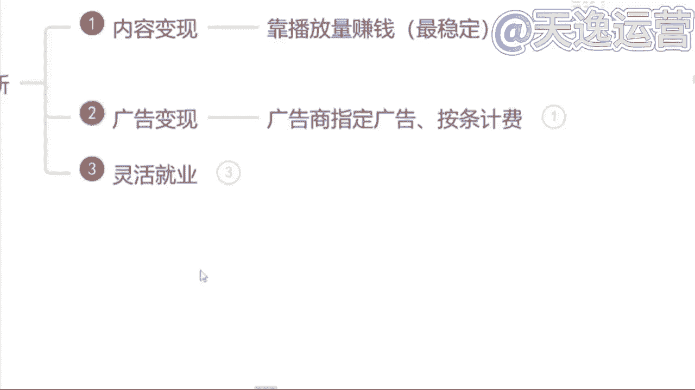

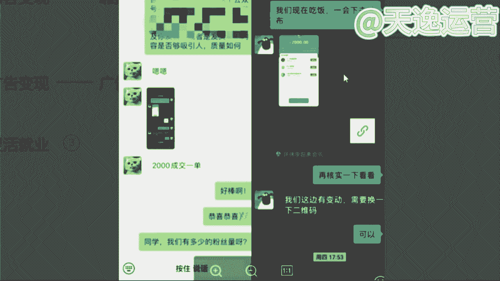

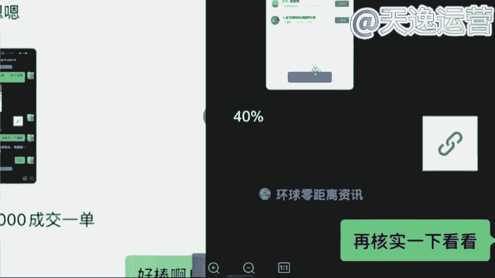

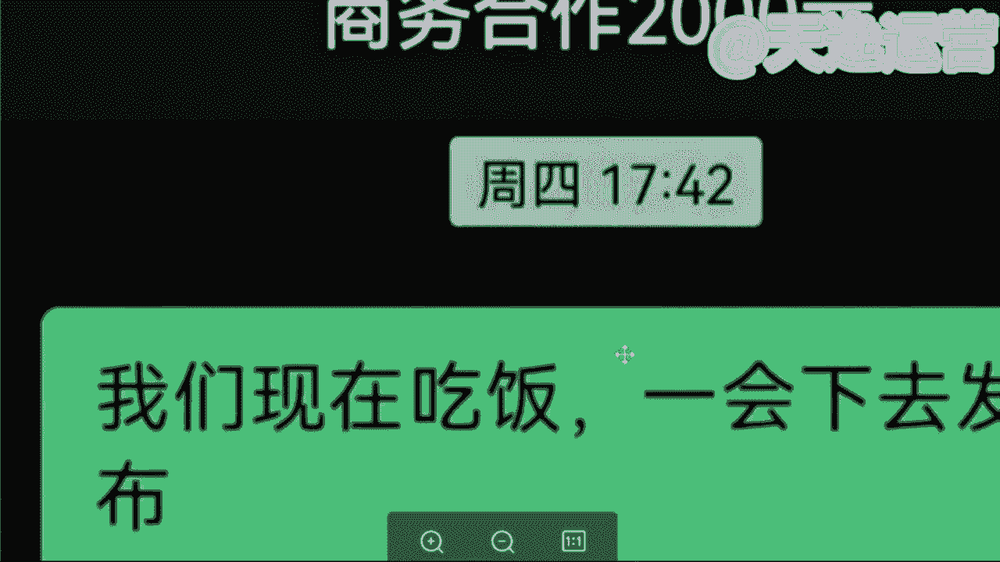

也能稳定在将近8万左右。这不错了，这个播放量当时我给他说了一件，我说你先跟那个广告商周旋一下，跟他砍砍价吧。我说你说你这个合作价格成交价你要2000块钱，我当时直接让提的。

当天确实这么提的2000块钱但当天没有答应啊，广告上没答应，因为他也非常尖，思考了一天，第二天晚上答应的。但是当时呢提了一个要求，在他作品里面去放了一个商家的二维码啊，就这个要求。

当时呢成交价格就2000块钱。当然如果说是视频带货的话呢，它单价很高了，单价每一条大概是在5000左右啊，这也是底价，你的播放量越高，他的这一个呃成交价格也是越高的。后边我们可以来呃这个了解一下是吧。

😊。

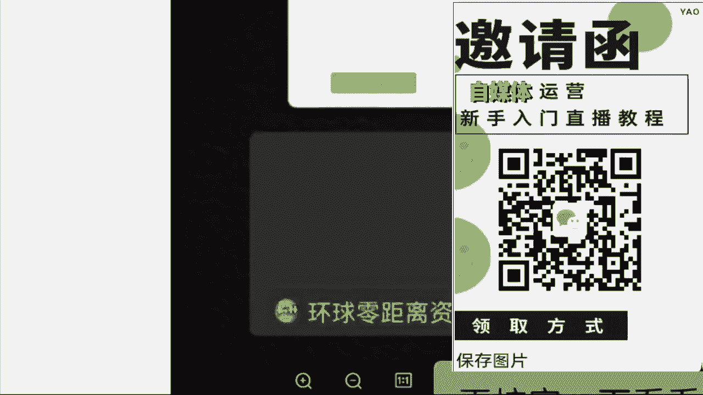

那除此之外呢，就是你做自媒体，你也可以考虑一下来进行灵活的就业。就这个呢比较适合于一些嗯现阶段就是临近大学毕业了，马上要去社会上就业了，不知道哪一个行业有这个发展前景的，你可以考虑一下自媒体。

就也适合于一些就是现阶段。自己本职的这个工作，他已经没有很好的一个升值或者涨薪的空间了。你想要转行这个互联网行业的。这分同学呢也可以来考虑一下自媒体。因为现在自媒体的教学。

或者说这个专业的自媒体运营师运用的行业也非常广泛的。像现在的话就是每一个行业他都会运用到宣传这两个字，什么宣传呢？就像这个无论你是做餐饮的，还是说做传媒的，还是说做教育的，一定会涉及到宣传啊，发广告嘛？

就现在我们很少能够在这个大街上面看见什么发传单，发这个小卡片的了吧，很少能看到了，他们不做宣传了吗？他们要做去哪里做呢？转战互联网平台了啊，这个就是我们未来这个自媒体运营师工作范围之一啊，像现在的话呢。

国家也是把这个全媒体运营师纳入这个国家职业分类的啊，去年2月份纳入的，这是一个合法的职业。包括像现在的话，这个boss直聘上面给到底薪，真的非常的可观啊，这又是零经验的。

从来没有做过这个自媒体运营的人给到底薪，看见没？5000到8000的5000到7000的7000到8000的真的还可以了吧。就问一下有没有想转行的小伙伴啊，有没有想转行的，想未来做这个互联网行业的。

就如果说你。😊，🎼未来真的想要做做这个转行，做这个互联网行业的，你可以考虑一下啊，来到曾尊老师的这个团队里面，跟我一起共事。包括给你们看一下吧。我们公司的话呢，现阶段是在这个江西省赣州市啊。

恒客产业园里面，我们是政府园区，邀请我们进去办公的。包括像我们这个业务知持中心的话，这是我们前端的部门，就为我们后端所有的这个呃部门去做扶持的。除此之外呢，像这个课程研发中心，这个我重点讲一下，好吧。

因为这个是我现阶段主要在负责的一个部门，就无论是这个平台的更新还是这个课程的更新，全部是由我全权在把控的。如果说未来你真的考虑转行，我欢迎你来到我这个团队，好吧，我也是比较惜才的哈。除此之外呢。😊。

🎼像我们公司也是有这个流量中心的这流量中心是干嘛的呢？就是现阶段主要负责给我们自己内部的学员对接官方的流量的啊，包括像一些什么这个影视的宣传推广，就是影视推广平台，除此之外呢。

像这个什么抖音的直播切片啊，挂小黄车这样的一些这个千万级访网红的一些视频，我们都是会来对接的啊，这就是流量中心要做的事情。除此之外呢，像这个VIP服务中心。这个呢就是我们学员进来了过后。

我们后端的一些扶持了。那你一定会涉及到素材不会涨，或者说这个视频不知道该怎么去做的。我们的老师呢都是通过一些语音视频或者说远程操控的方式去帮助你解决这些问题的。

有一个呢就是你可以看一下我们后端的这些VIP老师长得真的都非常的好看啊你可以考虑一下是吧？除此之外呢，像我们的话也是比比较注重这个内在的啊，除了像这个平常工作之外，像我们也会有读书会呀。😊。

🎼如我们也是拥有这个咖啡厅的，或者说这个影音室健身房，我们都是有的啊，因为是希望我们所有的伙伴们能够在这个工作过程当中开心的去工作，开心的去挣钱啊，这个你们可以可以考虑一下阿班。

如果说未来你们是真的考虑转行的小伙伴，你可以来找我。但是呢说到这里得提一嘴，我们是真的肚子里面有墨水的，你再来阿班，咱们是有这个技术傍身的。因为我要对我自己的团队和未来的学员去负责的啊。

到时候你可以来找我，就讲到现在问一下同学们，我讲的这些内容对于你来说有收获有帮助的就我们自己花了时间来听的东西来学的东西，总得带点回去是吧？不要浪费咱们自己的时间嘛。😊。

就是大家是19年用小红书还是20还是2122，还是23年才用小红书，还是没用小红书，可以告诉我一下。然后我针对大家的情况来决定说我的内容的一个速度啊，现在是8点16分啊，我们预计一个小时可以讲完。

然后剩下的时间啊，我们进行一些简单的答疑。OK好，有19年有2有22202223年的啊。OK好，50%的人啊应该是用完小红书有一段时间的啊。啊，也有刚开始用的啊。好的，我大概大概清楚了一个情况。

那我简单的做个自我介绍吧。呃，我的。我用的网名啊叫福克斯装修笔记，是某top一电商平台的一个认证讲师。那我应该我相信大家应该也猜得到top一是哪个电商平台啊，因为我们自己出去讲课的话。

正常来说是要报备的。然后这一次呢我们去组织咱们的这一个小红书的一个淘金互助计划呢，也是属于一个临时起义，就觉得说市面上有很多那种打韭菜的是吧？卖个9991299啊，包括1个chedGDP啊。

卖个2000多，我们觉得反正这不是我们的风格吧。然后。这一次组织啊，我们是相当于说是无组织无预谋的。就是大家觉得说可以去给大家做一点事情。因为不管是我也好，还是戴老师也好，还是大一老师也好。

我们其实三个人都是在不同的城市，而且有自己不同的公司，而且是纯实战派的。呃，我上一次分享是什么时候呢？是。上一次我去带这种带队去做这种新平台研究，是20年的时候做视频号。那个时候有一个学员叫小七。

他后来成为了视频号保险行业的一个扛把子也是非常不错的那我跟大家分享一下，就是在我上一次带队20年带队的这个过程中，呃，我最后的一个感受啊，就是往往能够出结果的人。

是他提前就有自己的变现方式或者说商品的人。因为他自己有变现的产品，他对自己的产品足够了解，他对这些东西呢。就有更强的一个欲望和目标去做。但是呢针对咱们啊有一些小白的这个同学是吧？

可能之前没有在电商上去卖过东西，或者说没有在自媒体去做个账号，没有赚过钱。那么对于你们而言，我说真心的啊，我觉得就是说可以降低一下咱们的一个目标。因为我们看到的就是说像以我为例啊。

我可以用二十几篇笔记做出1万粉丝的账号，这是基于我十年来的一个内容积累。就是我可以很快的去了解到一个平台，他要什么。我可以很快的去判断这个类目能不能做要怎么做谁做的方式离钱更近。这都是需要基本功的。

所以说接下来呢那我就不浪费时间了啊，马上进入正题啊，感觉大家进来的差不多了。那么我们今天讲的主题是小红书运营的一个底层逻辑。我们怎么样从0到1来做出1万粉的账号？那么先是我们来看一下啊。今天讲4个。

大块。第一个是了解小红书的一个平台。第二个是小红书平台的一个底层逻辑。第三个是小红书用户的一个使用逻辑，以及我是怎么样从零起号月破百万的啊，我是大概是平均去年应该是做了将近1000万的一个线下的成交额。

那今天我会弱化这块部分会主要跟你们讲账号和平台怎么去做。然后整个的这个内容绝对是纯一线的实战干货。我敢说这个东西你们在外面应该是很难很难听到的。因为大部分就是说公司比较大的话。

这个老板他不会是自己一线的操盘手，他操盘有别人，而我的账号是我自己从选题到内容到全流程，是我一个人独立完成的。虽然公司有人，但是我做小红书是属于2019年是属于先行研究。

所以我是没有用用任何公司资源做出来的。那我们先了解一下小红书的一个平台啊，就是说先看一下小红书平台的一个官方定位啊，这这张图是小红书官方的图片，它的描述什么？是生活方式平台和消费决策的入口。

凭借真实向上多元的社区氛围，小红书已成为年轻人不可。替代的啊入口。所以小红书给自己打的标签真实是排第一的，向上啊社区以及消费者决策入口。那这个第二个呢它是讲到了高净值啊，高净值人群。

超1亿的月活用户70%的一线和这些一些东西啊。但这些数据是中间的。我们把官方的这个资料说成人话是什么意思呢？就是在目前现阶段的这个网络平台当中啊，我们可能会刷抖音，可能会刷快手或者B站知乎啊，甚至微博。

那我们会在这些平台上去接触很多很多的信息。那我们小红书和他们之间是发生什么关联的呢？就是因为他们从这些平台上啊，从这些平台上收获到信息之后，他们。在穿梭到小红书来进行一个研究，通过小红书进行浏览啊。

然后进行一个影响决策。要么他们会在小红书进行打扫。因为小红书它自己有官方商城啊，要么他们会直接在其他的平台进行一个购买，这是小红书的一个决策时刻。好，那我就跟大家用说人话讲啊。

就是小红书这个平台它到底是怎么火起来的呢？其实它是经历了抖音的一个4近将近4年的一个增长。因为抖音在它这个四年的一个野蛮生长时期，它的变现方式其实是经历过N种样式的迭代。我不知道你们有没有人刷到过啊。

最开始的抖音快手变现，他们是主播只要有粉丝，你在直播间你开直播就有几千几万人在线，这个时候就已经开始有商家。比如说比如说啊比如说你们是主播，你们的直播间有几千人上万人，而我是一个卖面膜的商家啊。

我就会告诉大家，我非常非常的喜欢你很喜欢看你的内容，我的这个面膜，在天猫旗舰店卖199啊，在京东卖199，但是针对你直播间的粉丝，我拿出几百单来做福利，只要多少钱，只要39。9块。

那个时候是抖音最开始的一个变现模式，就是商家直接打版，打版之后直接卖货，然后。主播给这个商家挂人，我想问一下，大家有经历过这个时刻的人吗？有经历过的打个有好吗？有经历过这种卖货的吗？叫打连麦卖货。

那再往后走，抖音开始推出一个小黄车，就可以进进行一个通过小黄车去购物。那这个时候它是什么玩法呢？他们就有很多的人啊跑到这种源头的水果产地啊，大爷大妈啊，下贵说求求大家了，我的苹果直销啦，橘子直销了呀。

就用感情牌啊，用视频去吸引大家去下单啊，但是这些东西现在是不被允许了啊，那么再往后走，像一些美妆的，他们又研究出一个什么样的一个玩法呢？就是一次性投放上百个达人账号。比如说啊我老婆她买的那个酒酿面膜。

我记得买过酒酿面膜，买过那个薏米茶，买过那个号称是协盒的美白，美白的那个小瓶瓶的，后面都上新闻了啊，协盒说根本他们就没出过这个产品。那么这个操盘的打法，就是可能你通过一个博主，对吧？

你说这个美白能这个东西能美白，可能你不信，那O我买通100个博主甚至几百个博主，我让你9点钟刷视频，A说它有用。B也说它有用，C也有用，刷的越多之后就造成一个从重心理最进行一个收割。而这一系列下来啊。

就有不少人收到货之后，他就会发现什么，就会发现自己踩坑了。然后也就开始变得谨慎。那怎么样防止大家上当呢？所以这个时候其实小红书的价值就开始体现了。因为小红书它的定位是种草的一个分享社区。

而且它的算法对普通人很友好，有大量心地善良的人在里面分享，包括面膜的使用感受啊，防晒刷的一个真实效果对比图啊等有效信息。所以小红书就相当于它为大众提供了一个产品好坏的一个体验的一个分享平台。

你们如果片面点的去理解，也可以理解为它是一个避坑平台。但是然后又由于前期有很多的海外购物经验分享。小红书它的前身是做海外购物分享的。积累了一批高素质、高学历、高消费能力的用户，高素质高学历。

就决定了他们的语言表达会更加的客观。他们拍照的能力和展示的能力都更强。所以他们给用户的感觉，会比商业的博主要更加的真诚啊，可信度更高，也就慢慢积累下一批女性用户为主的用户。那么抖音和小红书如果。

我说在我的视角里，我们去做一个对比，就是抖音，现在是专业的玩家居多，里面呢鱼龙混杂啊，有正有正向的啊，也有玩套路的，而套玩套路的是层出不穷，而小红书呢，它更倾向于普通人真诚分享的平台。

里面信息的密度是比较大的，你可以筛选出有用的避坑指南生活方式，所以其实就让我想到啊，就像我们以前用淘宝是吧？最开始我们在淘宝上买衣服啊，可能只需要有衣服在上面挂着就会有人去买。

那再往后唉商家觉得说好像好评这个东西对消费者决策起到关键的作用。那可能他们就会在好评上面啊，比如说我搞100个买家秀自己弄100个账户去。说这个衣服有多好看，穿上去效果有多好，但是消费者他也不傻呀。

他发现说唉我买回来衣服和好评里面的衣服不一样，怎么办啊？消费者就开始不看好评，我们开始看差评啊。那有的商家又变聪明了，你看差评是吧？那我就在差评里面去做文章，通过差评去让你认可我的产品品质。

比如说啊比如说一个一个一件卖一件衣服是吧，他可能说给的是一个差评，但他说虽然衣服质量还可以，价格也合适，但是配送太慢了，这个差评我给定了。像这种的语句，看似它是一个差评。

实际上它还是向你传递了用户的真相认可。所以商家和消费者他一直在博弈。而大部分人我们在抖音如果说去买到了这种不好的商品，你去曝光它，其实拿到的流量是很有限的。而小红书这个平台不一样啊。

如果说你在上面买了什么不好的产品不好的体验，第一，素人的流量权重和大大的博主可以说几乎没有太大的区别。第二，小红书他有搜索流量，因为我们是基于什么基于我们在某些短视频平台刷到了这个产品。

比如我刷到一个是吧？这个又刷到一个什么面膜啊，号称能够美白。那这个时候因为我之前上过当了。所以我这一次我就希望说我在小红书平台再去搜一下。而这个时候当他搜这个面膜的时候，可能他就进来一个测评的帖子。

那测评的帖子可能就告诉他这个。面膜不如另外一个面膜啊，然后这个消费者的心质就被影响了。所以小红书它基本上就是给我觉得片面的理解啊，就是避坑平台，它的内容就类似于说豆瓣的电影评分啊。

以及大众点评的一个美食评分一样。那虽然到今天为止啊，平台里也会有很多的素人分享，但是同时也参杂了很多的这个商家啊冒充信息。但是这个平台整体来讲还是非常有这个使用价值的。那小红书平台的一个底层逻辑啊。

就是我在做小红书平台的时候的底层逻辑。首先我们去做一个东西，一定要了解一个平台他要什么平台要的东西，你给他他自然就给你流量。那么我想问大家一个问题啊，假设现在你们啊是一个开淘宝开天猫旗舰店的。

现在你手下有5个有5个客服来回复这个客户的咨询，你店里有2000，现在每天有2000个咨询啊。你会怎么去分配，是平均分配2000个除以5个人，每个人平均分配400个，还是怎么分配，还是说不平均分配。

你们可以告诉我吗？你们思考一个问题啊，现在你们的身份是天猫旗舰店的一个老板，你有5个客服啊，然后有2000个客户咨询，你们怎么分配是吧？这同学很配合啊，这者是平均分配。这个其他的啊其他的朋友啊也可以啊。

继续去多互动。因为我知道你们的水平就决定了我后面讲的一个东西的重点和速度。啊，有人说不理能下单的不会多问啊，这个兄弟，你在跟我开玩笑，你一个开天猫旗舰店的，你说2000多个客户咨询，你有5个客服。

你跟他跟我都不理啊，有人说按需求比例，有人说按能力分配，有人说平均分配。好的，那如果说这五个是新人的话，那基本上来说的话，第一轮肯定是先平均分配。但是你们往后走，你们会发现一个结果。

就是每个人的能力是不一样的那我们可以看到，那通过一个星期的数据下来，那我们现在发现了张三他的成交是4000块钱，李四是3000块钱，往五是8500块钱。赵六是6500，孙七是1000。我想问一下你们。

接下来你们准备拼怎么分配呢？我相信啊。假设你们是一个老板的话，你们是不是会希望王五能够拿到更多的客户？因为王五的销售额是8500元。他是詹三对吧？和李四的double。所以。

这就是我们啊假设我们开店的一个商业逻辑。那。到了小红书平台，你们就去思考小红书平台。其实对于小红书而言，我们他手上拿到的东西是什么？他手上拿到的是访客，对吧？我们打开手就变成访客了。然后呢。

他手上会有多少呢？会有新增笔记。那你觉得他分配笔记怎么分配呢？他就像我们去开店铺一站。他前期比如说我们现在同一时刻这一分钟有500篇笔记，新的诞生了，他一定是给这500篇笔记啊。

一个平均的一个初始流量值。然后通过初始流量值的一个数据表现，再次再去决定二次分配和三次分配。所以那我就想问一下大家第二个啊问题就是小红书平台它最想要的东西是什么？你们有想过吗？

是用户停留还是新增还是成交额？你们可以在评论区啊可以在评论区。告诉我。你们觉得小红书平台最希望要的是什么？我来看一下啊，这道题这道题挺有技术难度的。所有打停留的啊停留的是正确答案停留的是正确答案。

因为我现在用的词是什么？是最希望要的是什么？为什么我告诉你，用户停留是最关键的啊。因为不管是小红书也好，抖音也好，快手也好，微信也好，他们都在干一件事情，就是要争取用户的时间。为什么？

因为你后面所有的成交额，你的这个电商的变现，广告的变现都是要基于用户在使用你这个软件。包括你们所说的用户新增，新增看上去很重要。但是你要明白，当我们愿意用1个APP，愿意一。新增只是早和晚的问题。

如果1个APP你一天只用2分钟，或者说你一个星期你都不想打开一次，你觉得这样的新增有意义吗？所以我们就想到以前是吧，我们以前看电视的时候。还记得吧？以前电视台的核心关键数据是要啥？是要收视率，对不对？

收视率电视台有了收视率，它就可以去插播。广告植入对吧？可以接一些大品牌的一个广告。所以对于。这种平台也好，其实不管小红书、抖音、微信、淘宝，他们都是希望有用户停留，有用户停留才有一切可能。

那这里又有一个问题就是。我们希望用户停留。那就需要有好的内容让用户去停留下来。但是小红书的平台它是一个机器。如何让机器去判断内容的好坏呢？啊，我们都说内容为完，你们有想过没有？

如何让机器去判断这个笔记的好坏呢？如何让机器去判断笔记的好坏？机器一篇笔记灌输下去，其实它是没有办法啊，算法机器是没有办法完全去识别出内容的好坏的，它只能通过一些数据。

所以我们能够看到的点赞、收藏、评论、转发。这四个东西其实就是一个用户的反馈。对于机器而言。系统推荐。两篇笔记啊，A笔记和B笔记各500个。曝关A笔记获得了100个点赞，B笔记获得了10个点赞。

那机器就有理由判断A笔记更受用户欢迎，能理解吧？我相信你们都能理解的。好，所以说整个来讲，小红书平台它其实就是基于。用户停留的需求啊，用户时长的需求通过机器去判断你的内容是否是用户喜欢的。

能够让用户留下来的。因为我们自己是不会在我们不喜欢的内容去浪费时间的。所以那整个来讲的话，大的方向啊我跟大家分享一下，就是小红书平台现在有哪些红利呢？第一个是流量红利。

因为小红书目前的月活应该是两个亿左右啊，我估的。然后23年刚刚上线了网页版。这个流量红利就意味着说，如果小红书未来的月活能够在接下来23年、24年达到5亿的话，它有两倍的流量buff。

就是你做相同的事情，它是有两倍的流量buff。如果小红书能够到7。5到8亿的用用户，就有3倍的buff，是你做相同的事情。这也是为什么我会去在。119年去做抖音，我们做11抖音是19年6月份。

我做小红书是21年10月份，我永远因为作为一个老互联网人，我永远是要抢平台的前瞻视角前这个流量加成的。所以说抖音我我们现在有在做，我们还会接下来还会去做。但是现在的抖音的流量已经见顶了。

所以我们其实早做和晚做同样的一个项目，差距不大了，没有流量红利了。那第二个点，我们讲的是素人红利，就是小红书平台对于素人笔记的其实很友好的。而且最近小红书平台，他把这个广告的门槛。

从1万粉下调到1000粉也可以开通。这是你能感受到它不是去捧这种大博主的一个心态。第三个叫搜索红利。就是笔记在小红书的笔记它可以获得长期且持续的搜索访问量。3000小眼睛的笔记拿到100万。小眼镜。

这是我实际的我的后台数据。这个等一下你们后面呃可以给大家看一下啊。第四个就是电商红利。小红书今年对于电商有很多的动作，类似于早期的小红车的推出，包括最新拿到的信息，小红书的这个本地团购也在内测了。

就是你通过笔记可以直接上架本地的一些优质商家。所以我觉得就是说对于一些小白而言啊。你这一次可以把你的目标定到，你知道怎么样去做内容，做有效的内容。然后电商这个东西你可以。

就是说你不要把自己的要求拉太高啊，在这一次，因为后面还有本地团购等着你。这个你们可以看一下，我有一个习惯，就是我会统计我每一篇笔记，每一天的一个最后的一个数据。这一篇的话是截取的一个曲线，它是从。

这应该是几百的播放，到了几万多多播放。而且这张图是我应该是去年截的，现在应该还是继续往上走的。这个我没有去拿数据最好的图片。所以说小红书最牛逼的地方是什么？就是它的长尾流量是我见过最牛逼的。

查尾流量是我见过最牛逼的，没有之一。包括你们可以看到右边啊它的搜索我的笔记，我的搜索量是77，所以都是搜索进来的，搜索流量就越的精准。那么总总结一下，就是小红书平台，快手他们的差异在哪里呢？快手抖音啊。

我觉得它可能更倾向于之前的优酷土豆是用户一个欣赏观看视频的一个工具。而小红书呢，它有点类似于百度加知乎的一个结合体。我们在百度可以查到怎么去。一些比较啊更深入的东西。比如说iphone怎么去拆机。

而小红书它有百度加知乎的一个这种调性的一个感觉。我们接着往后走啊，那么小红书我们要去做的话，我们了解了平台之后，我们要还要了解用户的一个使用逻辑。可以看一下这张图啊。

这张图是我去研究用户的一个一个流程图，我们可以发现说小红书平台，你打开之后，对吧？它给你推荐的是4篇笔四篇笔记啊，四个封面，对不对？四个封面，那么我们的行为轨迹是不是要么你就有有兴趣，你就点进去。

要么你没有兴趣，你下滑了。而点进去的里面，要么就是看完所有内容啊，要么你就是看完离开了，是不是？那还有第三个什么思考一下思考一下，动一下你们的大脑。我们打开小红书，啊。

我们小红书给我们推送了4篇四张封面，我们要么点进去看完，要么我们看完离开了，还有一个选项是什么？有没有人能够想得到啊？今天的内容，你们能够动起你们的脑子。我相信会让你们可能是今年收获最大的一个小时。

看一半啊，这个这个朋友没有名字，但是我觉得回答的很漂亮。就是还有一个选项就是没有看完离开了没有看完离开了。没有看完，你开了啊。所以说看完所有内容之后的路径，他又选择没有互动离开，以及有互动离开。

以及进入个人主页。啊，以及接下来的路径。所以这是我去研究用户，其实我就是研究我们自己。那你们有没有这样的一个思维是吧？我们再往后走。那么小红书平台做账号和抖音它到底有什么不同呢？

第一个就我们刚刚所说到的啊，它的其实是属于信息的推荐方式就已经不同了。因为抖音打开软件，它是直接推送一条内容并自动播放的。你们不感兴趣，你们就会去刷到第二条。而小红书打开软件，它是推荐4条内容。

它没有自动播放的。你们不感兴趣就直接下一条了。所以就意味着是什么？说明抖音的开头很重要，因为抖音是自动播放，而小红书的封面标题非常重要。如果你的封面标题不行，对不起，我我一一个我都不会点进去看。

我直接下面四个了。所以说小红书的标面标题封面非常重要，大家现在应该能。这个解这个拆解，你们应该能意识到封富标题的非常重要性啊。那么你们去思考一下，或者说啊你们有女朋友的，有男朋友的对吧？或者你们的同事。

你们去研究一下你们的同事，他在刷小红书的时候。给他四篇笔记，他是怎么样去阅读的一个顺序。他是从一看到二看到三看到4，还是他打开手机扫一眼啊，直接滑了，还是说打开一眼扫一眼直接点呢。就我个人而而言。

这四篇笔记我是不会按顺序1234去看的，我是扫一眼的，扫一眼也就意味着说。一秒钟的时间，4篇笔记，其实每一篇笔记连半秒都不到。所以说这个封面标题非常之重要。那么小红书平台啊做和抖音还有一个什么区别？

其实他们的账号的运营方法也是不一样的。抖音平台，你们去运1个IP，其实主要还是要去博这个系统的一个推荐流量啊，用想办法去破圈。而小红书它是因为社群属性和搜索流量大，它还可以通过账户笔记为形象展示。

去他人评论去吸引目标用户啊。像右边这个案例啊，是我前几天刷到的，就是这个人。在这篇笔记啊这篇笔记讲的是啥呢？这篇笔记讲的是。就是没有听妈妈的话，拿着家里的钱去开店就压力很大啊。他就在评论区说。

我也是对家里报喜不罢忧。开奶茶店最多负债500万，不敢跟家里说，每次问只能说还行，因为奶茶店太卷，最后去做压，结果没想到一年把负债还清，还把生意发展到全国，就意味着他这个其实传递了一个什么信息，一年。

他是负债500万一年还清，就意味着说什么说他一年赚了500万。然后下面还有一条评论，不过你们家味道确实不错，就是价格高，不知道是不是一样，对吧？还有一个用户好评。看到没有？所以如果说我想问一下大家。

如果是你们。看到了这一个人，你们会不会点他的头像会打会好吗？不会打不会。如果这篇笔记是你们刷到了，你们会不会点他的头像去看一下，因为他负债500万。啊，一年还清会对不对？那我想问一下你。

你们点了他的头像，进了他的主页和他发一篇笔记，你们看完了进他的主页是不是达成了同样的一个目标，就是把你吸引到了他们的主页里面去。是不是？所以这就是小红书的一个魅力。它可以通过评论区去吸引用户。

不是只能够通过内容去吸引用户。啊。那那也就意味着说对不对？比如说是不是就我以服装举例啊，我们用服装举例，我们换位思考一下。假设这篇笔记它讲的不是开店亏钱的事啊啊，或者说我还是开店开店亏钱啊，就是呃。

找爸妈借了10万块钱啊，开开童装店。啊，看不下去了。会不会小红书会不会有这样的笔记，肯定会有，就是那些开童装店开不下去的。那么是不是可以在评论区去说。现在实体店的东西卖那么贵，怎么可能开得下去？

我在我在朋友群里买的一件小朋友的T恤，才6。9块钱，而且跟实体店29。9块的质量差不多。谁还愿意去实体店买东西？我想问一下大家，这一句评论区有没有杀伤力？是不是你们就可以理解啊。

同样的小红书他现在还干了一个什么事情。今年啊我发现他把群聊的一个这个好友数就是一个人可以进群的上限。已经我现在已经建到15个群了，之前我只能建5个群，现在能建15个群，那也就意味着说。

他的这个玩法会更加的多样化了，包括他还可以他还他有一个官方页面招募群友，你建群之后，他还他给你提醒你，你可以发布笔记招募群友。所以这个玩法就有很多种方式了。好，那我们就问那么接下来我们的问题就来了。

那我们的笔记封面如何脱颖而出呢？已经知道每次打开推荐四篇笔记，我们怎么样把封面做到超越他人呢？尽可能高的拿到点击呢？啊，这里我插一个问题啊，我插一个问题，就是平台能够给你们的给普通人的唯一的一个。

数据你们知道是啥吗？就假设啊我们200个人全部发笔记，他能够唯一给的东西是啥，你们知道吗？他能够唯一给的东西叫这个。叫报关。啥意思啊？就是把我们的笔记推送到别人的手机上面。这个动作让你的手机。

看到这四篇笔记，这个动作叫曝光，就是平台唯一能做的，就是让你们的笔记出现在别人的手机屏幕上面，他只能做到这一步，他没有办法让。看到你这个笔记的人点进去，他也没有办法让他点赞。

所以很多时候你们的小眼睛是由什么决定的？是由你们的点击率决定的。假设平台给这四篇笔记都给一000的报关。都给一000的报关。假设这篇笔记1000的报关里有200个人看。

就会显示你们的左下角就会显示小眼睛。其实这个叫。小眼睛它是属于阅读数，但是平台给你的不止200，他可他可能给了你1000，明白吗？明白吗？同样的，这只猫它可能也给了1000个曝关。

但是因为这个猫比较吸引人，所以它有300个小眼睛，那就是30%的点击率。所以你的眼睛只有200，你的眼睛，别人有300，不是说平台给了它300给了你200，而是你的点击率会影响。好啊，那我告诉大家。

我是怎么样去提升我的封面呢？接下来的这个方法，如果大家看了有用，就在评论区回复有用，好不好？我的选择是啊，这是我的一个封面。我的选择是我做出来我的封面之后，我把很多个封面放到一起，我把我的放上去。

看我是不是最能跳出来的那一个。我把我的封面放在这个手机的示意图上，看下跳能不能跳出来。我把我的封面放在这四个里面，能不能跳出来。有用答有用好吗？有用答有用。因为我跟大家说了。

我们这一次的三位老师全是实战派老师。我不会去跟你们说什么啊，标题的三个方法啊，这个吸引人的三个方法，我讲的就是我在用解确实有用的东西。接下来还有更多的干货啊，咱们继续。啊，大家也可以在去。继续啊。

咱们继续。好，那么问题来了啊，就是笔记封面我们如何脱颖而出呢？啊，这是我今天从网页版上啊截图的十几个。那么。划重点来了，就是在之前啊在在今今年啊网页版推出来之前，我们要思考的是啥？

我们要思考的是四篇笔记啊，我们要思考的是四篇笔记，我们怎么脱颖而出。但是网页版出来之后，网页版的推送是是多少？是是这样推送的，是我是黄红框里面的一个推送啊，我是把两个拼到一起了。

那就意味着说每如果说你要考虑到小红书后面的流量，它如果是手机端进入，你是四进一，它如果是网页版刷的话，你是十五进一，是不是对你的封面要求更高了。那么这一张图，我为什么截给大家看啊，我想跟大家讲一个点。

改一个点。就是。以网页版的一个阅读质感。我把这个。同样啊这种在备忘录打字啊，这种算很简单一个展现形式，这篇笔记算一号笔记，这一篇算2号笔记，这一篇算3号笔记，这一篇算4号笔记。

你们认为1234里面哪一个是如果你们选择这种表现形式会会认可的方式？1234，你们更认可哪一种方式？2、对不对？为什么？因为二不仅它的标题更加的显眼，它还画了一个红圈做视觉引导。而一是吧，一的字。

三的字啊都是属于字都有点看不清了。四还好一点。在网网页版的视角里，四的字还是比较清晰的，而二的标题更加的清晰，而且它还用了这个用了这个红色，对不对？这就是我们把就是东西好坏是怎么来的？我告诉你们。

封面好与坏，标题好与坏。就像什么？就像我们。😡，给我们的对象拍照一样。你拍一张照片可能就只能拍出50分。那我们怎么样保证自己的对象能够选出好看的照片，是不是咱上来先给他干个100张。

是不是你在100张里面选，你总能选出好看的嘛？所以我们去做小红书，做封面。😡，我们。😡，两种方法，一种是我们去看100个封面，找出我们觉得好的去学习，还是我们做100个。去选一个呢，肯定是看嘛，对不对？

然后。讲到这个服装啊，我今天还去找了一下服装的例子，就是我们如果去研究账号啊，我们要去向有结果的人的学习。因为我已经告诉大家，标题和封面非常的重要。那什么叫有结果的人呢？

我觉得第一个你要看他的数据是否稳定啊，像这个账号。他前前面的数据还是比较稳的啊，点赞都在100以上，可能最近的流量不行，但是它能够连续几篇拿到100点赞的这种账号，它其实一定是对平台有内容理解的。

如果一个人对平台的内容不理解，他的数据就会变成什么？可能突然他有一条100点赞1000点赞的。但是再往后他无法连续，他无法连续，就是优秀的人他的下限是更低的。

就是我们没有人能够说我一定能写出1万点赞的笔记，但是优秀的人他的下限可能就是100。但是如果说你对平台没有那么了解，那你的笔记完全就是开概率。那这个账号他的特点在哪？因为你们要讲要可能有人会选择做服装。

那我给你们简单讲一下，就是。第一，它的定位，它是专门研究篮球穿搭。细分是吧？第二个。他是。小众篮球穿搭。第二个，为什么我说这个账号有用？是因为我们通过他的评论区，你去看是会有人找他要链接的啊。

求第一套裤子的链接，它不是简单的说，我给你点个赞我，点个收藏，我走了，你会在评论区看到有人要要是什么，是代表购买欲，是不是？好，那我还找了几篇其他的这个衣服去看啊。像这个账号也是比较有特点的。

这个账号它的一个拍摄角度是非常固定的，而且它的数据也很稳定。这个账号数据也很稳定啊，然后这个账号人家更直接了，蹲价格侠，价格侠什么意思呢？就是谁谁去了店铺翻到件衣服的价格，告诉我。

这个直接就是考虑到价格层面了，能考虑到价格层面，说明什么？说明这件衣服他已经心动了。那么我们再往后看第三个啊，这个账号它叫野生塔塔。这个账号它也是很固定的一个商品，对不对？我们讲了账号定位清晰。

它的账号定位是什么？账号定位就是这种它这个叫什么叫JK是吧？学生日常的这种风格，然后他的目标客户也很清晰是吧？就这种感觉很相似啊，他的效果有没有有人家会问他群子哪家的啊，他说海胆举例子。好。

那接下来问题来了。其实这三个账号，它的变现方式是不一样的，是不一样的。你们来看一下啊。这个。人家是告他是告诉别人，我的裙子在这家店铺买的这一个也是告诉别人我在哪里买的这个衣服。而，这一个呢。

这一个是发链接。谁？我先问一下大家啊，就是篮球啊和这个黑衣服。呃，这个水手服，你们觉得这三个哪个更赚钱？或者说哪个的运营水平更高。你们有这种感感觉吗？就运营水平来讲啊，是打篮球的高，还是黑衣服的高。

还是水手服的高？有人说篮球啊，有人说第二个，有人说第三个。啊，你们觉得篮球是吧？其实我我我讲我的个人观点啊，我讲我的个人观点，可能我会觉得黑衣服的高一些。就就变现手法啊，就变现手法。

这个篮球它是卖衣服嘛，是吧？它可能是没有上限的。但是就这个账号定位而言，就账号定位而言，我觉得黑衣服的。呃，段位高一点。因为第一个他的这个数据。更加的稳定是吧？篮球它是稳定稳定100家。

那也意味着黑衣服一篇是它的1篇。第二个，黑衣服的这个。质感更高级，单价应该也会更高一些。这是我我的个人观点啊，我的个人观点啊。就是黑衣服的整个调性，它就不是简单的说我要卖衣服这一件事情本身。

它是我在卖衣服的这个事情里面，我去选择更高客单，更高预算。更有钱的这个客户群体。而且我告诉你们这三个账号里面。有两个账号其实是有模板的，这个水手服，它就是在走。

就是在出快出门的这个位置拍这个黑衣服它就是在这个位置拍。而这个篮球它是户外户内，包括这个停车场都拍。所以从这个拍摄的一个。这个角度和拍摄一个成本啊，我们可能拍一条这个成本。是差不多的。

但是你做篮球的这个账号，它是一直在想我今天在哪拍，明天在哪拍。而这两个剩下的黑衣服和水手服，它是有模板的，它是我只要有新衣服，我就知道在哪拍了。而且它的这个模板是持续有数据的。

这也是为什么我说黑衣服的它这个运营水平更高。他的拍摄模板更加的明确，不用每天去抠脑袋，我明天怎么拍它的数据更加的稳定，它的质感更加的高。至于它变现手法是挂店铺也好，还是挂链接也好。

其实他有了这个运营能力，只是他自己洗，只是看他自己想怎么玩而已。他想轻松一点，他就挂店铺啊。他想复杂一点，他觉得赚钱多是卖衣服，他其实完全可以挂链接的，他的运营能力是最高的。

那么最后啊第三个板块来讲讲我是怎么样去起号去月报百万的啊，这个其实是讲的是怎么样去做成交。那可能针对大家来讲，我我因为我是擅长去往思域导的，我成交会讲少一点，我会讲这个账号的运营思路。

然后啊总共总共我分了四个步骤，第一个步骤就是我要掌握平台的规则。我第一步一定是了解平台。第二步是什么？是获取种子客户植入钩子哈，让人把别人从这个网络上调到私域里来。因为我是擅长思域啊。第三个呢是。

做成交。那第四个什么是做复购，分了四步很明确的。那么我要做这四步的时候，那我要研究我自己了。我作为一个用户，我用小红书APP的原因是什么呢？那我前面跟大家讲了是避坑啊，是查资料。

比如说小红书已经牛逼到什么程度，我告诉你，如果你是一个女生啊，她可以牛逼到你到长长沙来游玩，你去哪几个打卡点，他都给你标出来。他不是哪几个景点，他去哪几个打卡点，拍什么样的机位的照片好看。

他都能给你标出来。所以小红书它是有价值的，有干货的，有攻略的啊，这是第一个。第二个。当你看到笔记的时候，你点进去是为什么啊？这些问题比较多，我不一一展开。但是是我去做的时候会想的问题。

那么第三个就是当你看完笔记后，你点赞收藏评论的原因是什么？我会经常问自己的，比如说我一个我比如说我给这个笔记点了个赞，我想想为什么我要给他点赞。我点个收藏，我想为什么要收藏？那么再看一下数据层面啊。

其实最开始的数据我是跟大家啊，我是跟大家没啥区别的。可能一开始就10个赞，20个赞，这很容易，对不对？30个赞。然后我通过我刚刚给你们看的啊，我对封面的一个优化方法之后。

我马上把数据拉到了上百的点赞收藏，上百的点赞收藏，而且是稳定的，对不对？这个158这个191这个176这也是也是几个月前截的图啊，现在的这些数据肯定更高了。但是你们发现没有？我又从。

100多优化到了上千点赞。啊，后面我就开始上千点赞了，收藏加点赞肯定是过千的啊，这个图都是半年前的了吧，应该至少是。我做了什么，你们知道吗？我告诉大家，我就做了两个字，一件事。这个叫做迭代。

就是我没有认为自己找到了100多200多点赞的一个方法，我就觉得我很了不起。我在想办法去做的更多，所以我选择了这个方法其实我就已经有效了，但是我又尝试了这种方法，我没有要封面，我换了一个样式。

那这个样式数据起来之后，我就持继续用了数据更好的样式。那我问一下大家，你们有没有想过，为什么后面的这个会比前面会数据更高呢？你们能不能想的明白，假设你们是一个观众啊。你现在你们现在不要单子里是一个运营。

你现在就当你是个观众。为什么你们为什么后面的这个数据会比前面的会更高？告诉大家啊，我后面我去复盘，我去分析的是。后面的比前面的这种内容含量会更高。就是戴老师前几天说的一句话叫意图胜千言。

这个封面的信息量比这个封面的信息量要大。信息量来讲的话，这个是小，这个是中，这些的信息量是大，这是密密麻麻的一个表格。所以这个信息量是最大的。同样的还有一个问题是什么？是因为它的信息量非常之大。

所以它不点进去根本看不清。能理解吗？他可以看到标题，标题它可以看得清净水方案、净水器啊、浴霸，但是它看不清型号，我看不清型号，我又想知道这个东西的结果我怎么办？我是不是要点进去。能理解吧能理解吧。

因为看不清，所以他要点进去，这是我后面复盘的。所以。点赞提升的秘籍啊，我跟你说，绝对绝对只有8个字。就是真诚分享友好互动，你们自己去看小红书的这个这个官方啊，他们有很多账号就跟你讲8个字。

真诚友好分享互动啊，真诚分享友好互动。但是啊从流程上来讲，我们可以猜四个动作，分别是点赞、收藏、转发、评论。那我想问一下大家啊。你们知道点赞撬动点赞的秘诀是什么吗？你们知道撬动收藏的秘诀是什么吗？

你们知道撬动转发的秘诀是什么？你们知道评论的秘诀是什么吗？我来告诉大家。两个好不好？我跟你们说两个，你们自己带着两个回去思考。撬动收藏的秘诀是什么？你们看一下我的这个账号啊。

看一下我的账号其实有一个特征是收藏比点赞高的。你看这篇笔记啊，6800的点收藏6300的这个。点赞。包括像这篇啊，1300的收藏6660的点赞，基本上你们随便看1900的点赞3100的收藏。

你看到今天啊我的数据优化结果是什么样的，是。我的数据结果是这样子的。就是你可以看到我快速的从上百个点赞收藏，优化到大几百，直到全部啊接近很多都是上千的。数据像这一篇啊，4400的点赞9500的收藏。

你们知道收藏的秘诀是什么吗？我告诉大家。收藏的秘诀是我想问大家一个问题，两个选项。A啊A拍一个视频是他做饭的一个过程。比如说他做了一道长沙的特色菜啊。查到之他是啥呢？这个。反正有茶色菜。

我一下子没想明白啊。我想一下啊，比如说剁椒鱼头吧，香菜啊，它A做拍了一个剁椒鱼头的制作过程给你们。B。拍了一个剁椒鱼头的制作过程加菜谱，你们觉得这两个是过程的收那个点收藏的人多，还是有菜谱的收藏人多？

Yeah。그。啊，我告诉大家，一定是过程加菜谱的人多，为啥？因为制作过程我看一遍，我记住了，所以这个视频跟我以后没有关系了。但是这个菜谱他可能有多少克啊，他有更精确的一个东西。

所以说我们会有一部分人他去收藏这个菜谱。能理解吧？所以就是说你的信息量是他当时那条视频无法消化完的，所以他就要收藏。如果说这个东西它当时消化完了，对不起，它就没有收藏的必要了。听懂掌声好不好？

听懂打个掌声好不好？再讲一遍啊，你的内容如果是他看完他就知道的。比如说啊我今天告诉你怎么在支付宝上领5块钱红包，他看完他就知道的，他不会再跟你收藏了，他跟你说拜拜了。你的内容是啥？

你是支付宝一个月有5次领取红包的机会，这种东西人家就收藏了。为啥？因为他一天他记不住啊，所以他就他觉得收藏，所以收藏最后是干嘛？最后是吃灰的，但是你们就要把握收藏是怎么来的，是他单条视频，他觉得有用。

他又记不住消化不掉，所以他要放到收藏夹里去。收藏的秘密讲完了，我再跟你们讲评论的事啊，我们刚刚讲了撬动评论，我给你看一个我做的一个案例啊，这篇笔记。我置顶了一条评论啊，我这篇笔记什么时候发的？

是2021年11月份发的，2021年11月份发的。那么在2022年3月，我置顶了一条评论，是有一个观众，他看了我的笔记，然后他在说我买的这个锅炉。啊，出现了问题，商家不负责任，品牌不负责任。啊。

他问我应该怎么维权，那你看我的回复是什么？我的回复是我帮你置顶，希望后面的姐妹能帮忙顶一下，争取厂家早日帮忙处理。所以你们可以看到这一篇笔记，他的这一条的点赞有300多，剩下的只有30多。

我想问一下大家。数据是不是就拉动了？那我是不是也是在真诚的帮助别人？因为我这篇笔记每天有三四千的访问量。因为我会统计数据。所以我在真诚的帮助他，那么其他的人看到了也愿意帮助他。所以他们给他评论点赞。

这是不是拉动的数据？来，我们再来看一条。再来看一下啊，像这一篇。4800的点赞，7900的收藏。这一篇有多少评论呢？有1200条评论。是啥呢？是这一条是这一条评论。我在22年7月份的时候。

我21年发的比较，我在22年7月份的时候，我发了一条，就是说我家装修延期了。我家装修延期了。然后如果大家希望知道后面哪一台洗烘套装性价比高的话，你们可以留言。我收到再回复，为什么我会这么去说这一句话。

是因为我发现我发了这一条之后，有很多人在下面评论说蹲洗衣机蹲洗衣机，所以我把那条评论置顶了。所以如果你们可以看到他有大量的人在下面就评论一个字，就是蹲，因为我跟他们说什么，我说你们想知道我最后买了什么。

你们就在在我评论去回复一个蹲，对吧？你们评论了，我就我就告诉你，所以我后面啊也是。做到了是不是他们问我，我就告诉他们了。那我问一下大家，如果我不去把评论区，我不去做这个动作是吧？我啥也不说话。

他们会在评论区去打蹲吗？😡，我这一条笔记1200个评论蹲应该有三四百，这是不是拉动评论区的数据？能理解吧。还有其他的啊，还有其他的一些细节，我就不一一展开举例了，我们继续去讲。所以到第二步啊就是。

第二步是啥了？就是我们通过我们的内容，是不是获得了报关，我们怎么样去获取这个客户啊？第一步是获得笔记和获取报关。第二步是获取我们的目标用户去添加我们的微信啊。因为我是思域玩法，我下面讲的私域玩法。

但是同样的原理是一样的。比如说我做私域的玩法，我思考的就是。当被一篇笔记被人家被吸引了之后啊，他什么情况会进入主页场更多。然后什么样的内容跟账号，人家会认为不可信不靠谱啊。

什么样的情况你会希望和作者取得联系啊，这些问题都是在我做的过程中，我就会反推的，我会我会自己带入。就比如说我看了十篇笔记，有谁是我想关注的，有谁是我一看这个账号，我就觉得这个人靠谱可信。

有谁的账号是我一看，我就觉得这个人有可能是个骗子，不能信。像刚刚那个我问一下大家啊。你们觉得刚刚那个卖鸭脖的。😡，还记得吧？前面那个搞家加盟的，在别人评论区说自己从负债500万到赚了500万的。

你们觉得那个人是好人还是马扁，告诉我好不好？前面那个卖鸭脖的，你们觉得他是好人还是马扁，他说他自己负债500万一年赚回来。他是好人还是马扁？😊，啊，你们说的是马扁是吧，为啥呢？因为。

因为第一这个数据太浮夸了。第二，它的主页内容就是搞加盟的。加盟这个东西码扁的概率很大。是不是？所以你们就会感觉说你是会想看，但是他这种东西吧，其实对。对一些有过认知的人，或者说清楚加盟套路的人。

是会让他觉得不可靠的。好，那我们再往后思考，就是什么样的情况让你加微信，你也不会加。以及私信加微信领取资料和主页网盘置顶饭资料，你们会如何取舍？哎，其实这个其实这个问题啊和这个和这个。

我这个戴老师他的操作是一样的。如果你们当时你们有没有想过啊，如果当时你们通过他的抖音账号进了他的粉丝群，他说你们要加个人微信才能发资料，你们一定是有一些人不会去加他的。那戴老师是怎么做的？他是你们进群。

他把链接二维码对吧？发到群里面了，然后只相当于直接把资料给你们了。所以有的时候你会发现说强制别人加微信，再给资料和你只要进去，我就给你。我没有说我要强制链接你的意思，是不是后者更加让人家能够看到真诚。

是不是同样的，你们又可以带着这个思维往后面去思考什么样的情况，你去看小红书笔记的时候。你看着看着，你会打开淘宝店去搜索店铺或者关键词。是不是是吧？你像有人有有人说他说真不想嫁人，是不是？所以就是。

我们要思考的轨迹是什么？我们要思考的轨迹是人心，要思考的轨迹是人心。而不是套路。因为戴老师是真心对你们的，他压根就没想加你们，他就是觉得说我知道小红书怎么做了，我想分享他分享了。哎。

我有一些资料我可以整理给你们，我给你们了，对吧？我想去带一群人去尝试做小红书这个事情，那么谁愿意来谁就来，所以他是真心的，所以我们今天会相遇在这里。所以那到我这后面你知道做思域的话，你还会遇到什么问题？

就是那你加了人之后，你怎么做好友管理，对不对？你要不要建群，群里面的人谁是值得帮助的，每个人的想法都是不一样的。就即便是。咱们的100多个人群，对不对？你会发现啊。有人有不同的价值观的。同样的一个群。

它的利和弊是什么？啊，微信群邀集好友拒绝还是通过这些就是我在做这件事做这个事情的过程中会经常思考的问题。我之所以能思考出答案，能做出答案，是因为我先把这些逻辑想明白，想明白之后再决定我要怎么去做。

然后我再问大家一个问题啊，这三个问题会跟大家相关，精准的用户推给商家，没有成交是谁的问题。是用户的问题还是商价的问题，还是博主的问题？模组把精准的用户推给商家，没有成交是谁的问题？你们能弄明白吗？

没错啊，是山架的问题。这里我给大家分享一个事情，就是我在最开始去做这个跑模型的时候啊，就是首先啊我这个装修的过程中，我所添加的粉丝，我是真诚的对他们的。

所以我在做的事情是帮他们出找到好的产品去压了价格去给他们做成交，并且我跟他们讲的很明确，我自己的成交价，你不要问我，我肯定比你低，但是我做到一点，我不赚你们的钱。

就是比如说这个市场这个事情这个东西人家商家正价卖1万啊，我可以帮你们谈到9千009千0。但是你不要问我是多少钱买的，因为我也不想骗你，所以我对他们也是真心的那这个地方我想跟大家分享一个什么事。

就是说精准的用户给到商家没有成交，是商家的问题啊，这个大家答案都是对的，那我也不再去展开。所以如果说你们在小红书拿到了精准的流量，你挂了产品没有成交，那就一定是。产品的问题明白吧？啊，以及我要会去思考。

那装修时我们喜欢的东西跟我们想花钱买买的东西有什么区别？这句话翻译一下是啥？翻译一下，就是比如说我们现在去逛商场去买衣服买鞋子。我们最后买回来的是我们最喜欢的那一件吗？同学们。很多时候不是。

因为我们最喜欢的衣服，可能你一摸一看吊牌1500。一双鞋子你一看1200，但是我们其实是带着预算去买东西的，可能我最喜欢的是1200。但是我看到有一双鞋只要六七百，它在我的预算内。

所以我会选择买预算范围内的，是不是？所以我会深刻的去研究说我搞装修的过程中，我到底看中了什么，我买了什么，为什么？那为什么我要去思考，因为我要做的是用户成交。不是所有看上的就一定会买。

而我要研究的是成交了什么东西，为什么会成交？而那些容易被别人看上的喜欢的而又成交率很低的。那对我而言就不是好的产品。那还有一个问题啊，就是装修用户想花钱买产品。那为什么要在我推荐的商库这里买呢？

这是不是跟你们的问题有点像小红书的用户在小红书刷笔记，不是只有你们在挂车，为什么要在你们的笔记下面买呢？这个逻辑你们是要想明白的，所以我想的很明白，我告诉我粉丝群的人。我帮你们找的是好产品。

而且我把找产品的这个过程，我有告诉他们。比如说我星期一到哪里看到什么东西，我发给他发到群里，星期二我看到什么，发到群里，星期三我发了什么发到群里。然后我告诉大家，我选哪一个，以及我能拿到的价格是多少。

所以我不是说。因为装修啊跟你们卖的这些东西都不一样，它是一个非常高客单，而且非常。复杂的东西。所以我会把整个的这个选品的过程去分享给他们。然后会明确的告诉他们，这个东西A比B比C的东西它好在哪？差在哪？

然后再去告诉大家，我为什么买A，然后价格是多少？所以在这个过程中啊，像成交的突破，其实对我来说就已经很简单了啊。像这一个粉丝的话，他基本上他家里。这个这个这个这个。啊，这个应该是五六个东西。

跟着我一起买了4个东西。在我看来它是很赚的，因为他没有花任何的时间，我跑油都不知道跑了多少箱油。而且还没赚钱，他还买的比市场价低。而且这个事情我能做成，其实我还是完成了小红书的这个调性，就是真诚分享。

我是真诚的在做事情。我没有说我是因为谁给的佣金高，所以我去帮谁卖，我一定是找到好的东西。然后去告诉他们。啊。这个包括这个成交也是一样的啊，这里啊跟大家讲一个细节，就是当我在21年10月份启动账号的时候。

到22年4月份啊，我整个这个这张图这个PPT是去年4月份那个。年年审过的下个月哦呃5月18号要去杭州，是第三年了。那个展示的认证。我在2月份的时候成交了20万，我在3月份的时候成交了170万。

4月份成交了118万。这个数价我觉得不重要，重要的我觉得是这个玩意。这个玩意。为什么我要在4月份的时候去开我前面的成交证明，你们能想到吗？就是当我有了成交之后，我为什么要在4月份的时候去开成交证明。

你们能明白能理解吗？大家思考一下。为什么我会在4月份的时候去开一个成交证明？因为我要借力打力。这个其实跟你们做小红书也好，跟你们以后做任何东西都是有关联的。什么意思？其实真正的山寨不是说你拿很多的钱。

你拿很好的资源去跟别人去拼。真正的商战是什么？我们作为小白起家的，我们作为小白起家的人，包括你们你们要在这个互联网上去赚到钱。你们往往是是以小博大，你们是田忌赛马。

要在局部劣势中去战去产生战争的一个赢家，讲人话就是你要在你没有就商家是什么？他可能是你一万单，我给你多少价，你五000单，我给你多少价，对吧？比如说我们去。辛巴买榴莲是吧？你能拿100吨。

我给你多少钱一斤？比如说给你251斤，你只有11000单，那我给你28，你只有100单，我给你31斤，是不是这样的？那真正的山寨，你们要掌握到我如何只有100单的情况下，我要争取到他给我一万单的价格。

为什么要这样子？因为你只有把价格压低了，你有利润空间了，像你们做电商，你有利润空间了，你人做钱人做事的动力是跟你赚多少钱有关系的。你你一个月下来。你上班赚3000，你做小红书赚1000。

你第二个也没动力了。你一个月赚3000，你做小红书，一个月赚500，你这个月嗷嗷的。所以说真正的三战是你在用小资源的情况下去撬动商家的。好政策。所以说我去开这个证明是要给后面的商家看的。

我已经做到这个成绩，你的这个东西我预估我能做几百万，你干不干？所以说我这个门窗的价格我是怎么谈的？我上来我就跟他说，我1000个平方，你能做什么价？😡，我说我家有几套别墅，1000个平方，你给我什么价？

😡，好，他就给我一个价格，我说我告诉你，我没有两套别墅，我只有30个平方，但是我有一个小红书账号，你相信我按这个价格给我，我给你再找啊970个平方，然后给他做到了。

所以这其实是跟大家穿插了一个真正的你在落地过程中的一个商业经验。那你们去做这个小红书是不是一样的。是不是可以拿到自己的一个基础的成交，再去网上去做？那包括思域的复购怎么去做，是不是怎么去做福利真诚。

我去看工地对吧？两款瓷砖一和2就是大家会在一和二之间抉择，你可以理解为两个口红的颜色，我会去拍两个照片去分享给别人。所以人家会把我的内容分享给他妈妈看啊，把他的同事啊。

分享分享给包括我看的东西我都会做很多的东西去分享给他们，就是真诚分享，友好互动。那么最后总结一下啊，就是我觉得作为电商商家一个小红书的一个破冰流程呢，你们要明确内容是有区别的。有的内容是吸引眼球的。

有的内容是调动思维的，有的内容是有下单欲望的这是三种不同的内容。我们到网页上看一下，好吧。给大家看一下啊，客户怎么来了，给大家展开一下，好吧，这篇笔记。这篇笔记就加了。200好人。来给你们看一下。

怎么带你们看一下，记得啊内容的三种形式，内容是有吸引眼球的调动思维的和有下单域的。如果说你的目标。是去。卖货，那你就要做有下单域的内容。来，我们看一下啊。来问你们吧。像这种是吸引眼球。

这个茅台是吸引眼球的，还是调动思维的，还是下单域的？这个茅台它就两片茅台。是吧啥也没写。然后有出互动，有数据，这能水于吸引眼球，下单月。还是调动思维啊。眼球是吧，眼球思维下单这个吸引眼球的。啊，这个呢。

2。4万拿下20件家具。这个是眼球思维还是下单域？Yeah。下单吗？我想问一下大家。这个地方。哪里有下单？哪里有下单？😊，你假设你是一个读者，你从他的评论去看，哪有别人想找他下单的这个欲望。没有的。

有思维，就是人家会去看他里面的东西，有字啊，比如说618双十一的一个购买时间，但是没有找他下单的。是不是他的评论区你们可以看吗？没有没有人找他买。这个是思维，这个是没有下单的。

就是用户对于这个作者来说是没有下单的。这个啥眼球思维下单月。给他找一个。找一个这个有下单域的啊。啊，这种这种这个这个是啥眼球思维下单域。这个啊第一次退茶位费成功结算，这个是眼球思维下单月。

这个是思维啊思维。就是如果你们看了这篇笔记之后，你们会去思考它的这个东西做法对不对？然后这个做法你有没有必要学，你学了有没有用，这个是思维。来，我们要找到。有下单域的东西，因为你们要卖东西。

你们要知道什么叫下单域。如果这个东西都没没有下单域，你做了之后，他没有成交，那太太正常了。看我吧，告诉你们什么叫下单域。随便看。眼球四维下单月能看见这个小字吗？我只想知道结论，长沙买哪家。

我只想知道哪里可以安装，同长沙求推荐。求推荐。求推荐。求推荐。求推荐已关注求推荐求推荐。求推荐。求分享。求推荐。求推荐。求推荐。再看这一篇。我只想知道结论，长沙买哪家。啊，这是同一篇。看这一篇好吧。

博主同长杀，麻烦拉我进群。你选好了吗？选哪家，我看吐了，拿不定主意。从长沙想进群。求笔记。再给你们看一下啊。这一篇。求推荐求推荐求推荐啊。所以你们要有意识的去区分吸引眼球调动思维和下单域。

如果说你们赚的钱，你们是要赚陌生人的钱，那你们就是下单域。如果说你们想赚粉丝的钱，那么你们需要有调动思维的力和有下单域。然后接下来你们还要干嘛？你们还要明确学习的账号，明确运营的方向和明确运营的结果。

还记得我给你们看的三个卖衣服的吧。如果不管你们自己要做什么，其实就是。四句话，找对标，拆爆款多尝试，要坚持。这12句话，我做任何一个平台，其实就是靠这12个字。先找对标。装修就研究装修。

水果研究水果衣服，研究衣服，视频研究视频拆爆款。你要去去猜到别人的这个东西为什么会爆啊，这个东西反正后面还会有老师去分享具体的东西。但是你知道就这四个是，第三个是多尝试，第四个是要坚持。

然后我想问一下大家。告诉我你们这一次的目标是什么，好吗？做出一篇100点赞的笔记，是你们这次的目标，你是小白，你就评论100点赞。如果是1000点赞就评论1000点赞啊。

你们的目标就是只要做出一篇这样数据的笔记就行了。如果你们的目标是做出100粉丝的账号就打100粉丝，10千0粉丝就打1000粉丝，做100成交就打100成交，10千成交，就做10千0成交。

100利润就打100利润，10千0利润就打1000利润，大家定下自己的目标，好吗。看一下大家的目标啊。大家都给自己定一下目标，我看一下你们的目标，然后也给后面的这个分享啊来确定大家的一个。方向嗯。

好的好的，你们打着啊，因为我到时候会去把这个数据啊，我会去分析一下这个尽量啊去帮助大家达到自己的一个目标，好吧，好吧。然后希望大家知道，龟兔赛跑赢的不是兔子，是龟。有的人他很聪明，但是他可能觉得说。

这个事情对他来讲太简单了，他不愿意去做，反而真正出结果的人是坚持不断迭代往后走的人。好，接下来问答环节。大家有问题就提问啊。我讲了75分钟。稍微差了点时。大家有问题都可提问啊。有人问啊。

怎么让人关注涨粉啊，这个问题就是说。但你的内容是对别人有价值的时候。其实这么理解吧这么理解，我这个问题我这么回答你啊，你的问题是怎么让人关注涨粉，你打开你的小红书。打开你的小红书，打开你的关注列表。

你扪心自问，你问你自己，你为什么要关注他？再看第二个人，你为什么要关注他？再看第三个人，你为什么要关注他，你把列表分析完，分析你自己，你心里会有答案。第二个是一天几篇笔记发布，这个看你自己看你自己。

就是内容的发布数量啊，我觉得这个没有固定的一个要求的。你像我如果去写这种原创内容，我基本上我真的三四篇三四天我都能干一篇出来。这个自己把控就好了。嗯。啊，有人说做了一个多月，出了三单全退了，又暂停了。

这就是我后面说的嘛。要尝试，其实很多时候。你能够出三单，其实就已经代表说你对产品对内容是比不出单的人要强的。这个时候那你要去找这个问题在哪？出三单退三单是什么原因造成的？

就我你可以看到我做这个事情全流程的过程中，我问了自己很多的问题，每个问题我心里都有答案。啊，黑梦问怎么让人产生互动性？互动信我刚刚你你如果后面来的，你看一下回放吧，我大概在五六十分的时候。

我拿我的账号说了，怎么样去调动收藏，调动评论。互动什么？互动就是点赞、收藏、评论、转发、收藏和评论，我都已经给你们看了实际我是怎么做的。啊，有人说我开店一周，现在每天还有十几二十个的赞。

浏览量也是有个几百个，但是一直不出单，不知道该不该换品。这个你就是你要去看具体的东西啊，你这个我没有看到具体的笔记，具体的商品我没办法判断，你也要去查你的这个类目，你不出单。

究竟是你的价格比别人卖的都高。还是说就是说你先确定你的产品有没有问题。如果你看了小红书，同样的产品，你觉得你的质量比它好，或者说相同质量，你的价格比它。就是合适一点，或者说价格也差不多。

你觉得你的产品没问题的情况下，那你再把你的这个报关和笔记内容放大一点。啊，有人问做人社贷的产品必须是一个行业吗？我这么回答你这个问题。对于这个东西啊，我这么回答你。看你这个人的销售能力有多强。

销售的最高境界。是别人相信他这个人，不管他卖什么产品都会去买。你就想一个道理啦。😡，不管是罗永浩也好，还是董雨辉也好，没有说他只能卖一种产品的。销售的最高境界是卖人，卖产品是前期。啊。

有人说我们卖水果怎么有那么多内容？

找对标。你在小红书，你去搜产品也好，搜水果也好，搜这个方式也好。其实你们去它是有无限种方法的。包括助理今天在群里买了，你卖水果，你只能去发水果吗？可不可以假设我是一个开水果店的，我可不可以发我的。

就是说创业日记啊，我开了一个店啊，今天卖了多少单，明天卖了多少单。可不可以发创业日记？我可不可以用另外一种形式，一种心态啊。就是不要把思维局限在啊，我是卖香蕉的，我就天天拍香蕉，天天拍香蕉。

你去小红书搜一下香蕉，你看一下什么样的东西有下单域，只要是有下单域的内容，都是你可以研究的内容。刚开始。小眼睛数多少是正常的。个人理解啊个人理解小眼睛，我觉得你新发一篇内容。200左右的小眼睛是正常的。

如果说你的东西你一发只有100个小眼睛，然后你接着发几篇就只有100个甚至40个50个。我的经验啊是这个账号的权重是比普通账号要低的。我会建议你直接注销，重新注册。因为我曾经有一个后面有一个账号。

就这样的，搞了搞了两次，就是一发就是100个、50个、60个。我注销重发注销重发。我第三次我发一篇就在这边拍了个窗户，200个小眼睛之后，我再发同样的内容，那篇笔记点赞加收藏就过百了。好。

有人说怎样找到适合自己的对标账号？我觉得你们去思考对标账号啊。第一个是。要思考几个问题。第一个是这个账号，它是否能够达到你的目标。你的目标，如果我就是100个点赞，或者说100个粉丝。

那只要他能够内容能够吸粉，能够有人互动，那就已经是属于你能够借鉴的对标账号了。如果你的内容是希望卖掉东西的那你就一定要找有下单域的账号，下单域可以从评论区可以看出来。有下单域的账号里找到之后。

比如说你找10个20个里面，再从这一20个账号里面找它的内容，你也能够创作出来的。Yeah。然后第三个是这个内容它可以持续更新的。再然后。你不是说然再然后你可以持续去。找你这个赛道的东西。

你可以去继续去迭代你的内容。它不是说你一定是固定的一个东西。怎样才能输出更高质量的内容和优化？嗯嗯。我觉得啊你能够输出更高质量的内容和优化，一定是你对用户要看什么更加。更加理解，又或者说嗯你可以去看。

比如说你要去讲一个知识点吧。嗯，举个例子的fabing这个单词FA。MI LY。那我们同样是英语老师同样是英语老师。我们去讲单词FLFAMILY。那我不管别的老师怎么讲，我会告诉你怎么去记住这个单词。

faly是家庭的意思。F代表father爸爸and motherother，妈妈，I love you。所以爸爸妈妈，我爱你，就是family家庭。Okay。

那么我用这样的一种方式去讲解family这个单词。是不是一下就比那种纯讲单词的高级多了？那这种内容就会比纯简单词接好。那我会我是怎么来的呢？是因为我看到了这一条，我当时就觉得这个老师真牛逼。

我记得很清楚，我相信我今天告诉你们，family等于father and motherI love you，你们这一辈子都会记住。😡，最好的内容就是多刷多看多借鉴。更高质量的内容啊。

如果你没有原创高质量内容的能力，你就多看看了你就有灵感。好，有人说小红书开店红利能有多久？嗯嗯。其实红利这个词呢，它是一个大盘数据，真正你能够赚到钱的人。其实红利一直存在，因为消费需求是没有改变的。

因为人永远有需求。那平台红利的话，我觉得就是到他这个日活月活见顶的时候，我自己啊个人判断，我估摸着小红说这个APP我爸妈还是不会去用的。他们虽然会用抖音会用微信还是不会去用的。

所以13亿人减去老老一辈的，我估计到六7亿的这个用户没问题。还有两倍的增长没啥问题吧，2到3倍。Yeah。有人说权重是经验吗？还能在哪里看到？呃，账号权重是这样的，不用过于神话。

我简单跟你们说一下账号权重什么逻辑啊，就是。我们大家去发内容都是正常权重。但是如果说我的粉丝，我的账号有1万粉丝，也只意味着说我的起始曝光比你们多给一点而已。但后面大家还是公平的。

但是如果说你的账号数据异常，比如说人家发都有2300个小件金，你一发就只有100个几十个，这个就属于账号异常。就这三种情况，一种是大账号有一点点基础的加成。第二个是正常账号，大家其实都没啥区别。

第三个就是异常账号，没有其他的更多的悬量了。啊，有人说听完我的接下来怎么做？接下来大义老师还会再去给你们讲详细的定位和内容啊。

我们今天讲的主题是小红书平台运营的底层逻辑和我是怎么样从0到1把账号做到永万粉丝的。啊，有人说小眼睛正常200浏览情况下是发布比就后24小时吗？对，就你发完一天有个200眼睛，你这个账号就是正常的。

然后有人说需要养号的吗？养号这个东西呢严格意义上来讲是个伪命题，但是你可以养一养养号的作用在什么？在告诉平台你要看什么和不看什么。就是比如说我们你像我我做装修。那我就会去看一些装修相关的东西。

比如说设计师，比如说设计方案，而不是去看那个。这个小姐姐是吧，你越看的越多，小姐姐，他越给你推小姐姐，就是还是要让自己在使用这个平台的过程中，自己做的这个类目还是要占据25%到30%的阅读量吧。

我觉得其他的你想看什么还是可以照照常看的。好吧。那我看大家没有什么太多的问题了。那今天的分享就到这里，感谢大家啊，接下来还会有大益老师去给大家分享账号定位以及更多的实战干货。

这一次所有的三位老师全是实战牌，没有一个理论牌，好吧，谢谢大家。