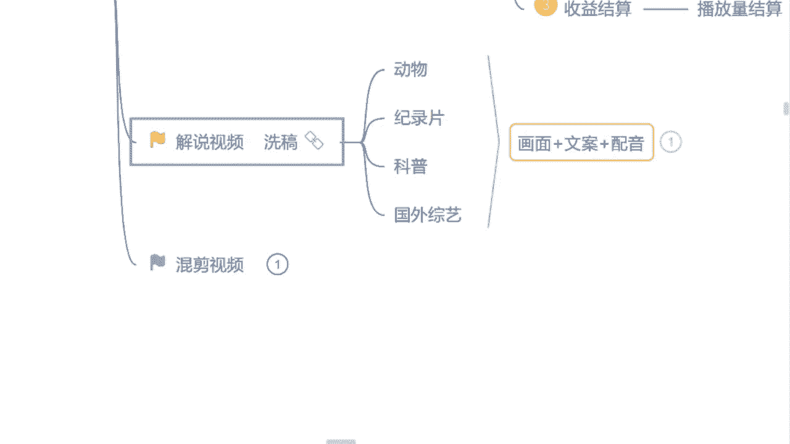

# 【2024版自媒体运营教程】全B站最良心的自媒体运营高阶教程合集！自媒体运营 起号真的不难 小白轻松上手！ - P10：10.解说视频由哪几方面组成 - 湾沚阿 - BV1tJ4m1j7qk

好不好，那包括我们想做这个解说视频呢，我们得知道它是由哪几方面组成的，我们首先来看一个视频，我们去了解一下好吧，此时也无法弃权，轮到他反击，最后明显红衣女拿下了这场比赛，两人拥抱了一下，以示友谊的。

如果是你愿意参加这种比赛吗，战斗民族最硬核的扇耳光大赛，互扇对方三个耳光，看谁能挺到最后，只要获得冠军，就能获得百万奖金，胡子哥和光头男是本局的对手，两人的体型不相上下，但冠军只有一个，你觉得谁会赢。

胡子哥赢扣一，光头男赢扣二，前排坐好，第一局，胡子哥先攻击，只见他眼神锁定光头男，手臂来回摆动，对准对方的脸，啪的一巴掌下去，光头男却兴奋了，她，面带着笑容，心想不过如此，光头男把滑石粉涂抹在手掌上。

手臂来回摆动，对准胡子哥的脸，瞄准过后，啪的一声，胡子哥这么强壮，都被扇的身体晃动，可想而知力度有多大，继续来看下一轮，胡子哥活动了下筋骨，顺了顺自己的肌肉力量，换一种发力方式来看下效果怎么样。

啪的一声果然奏效了，光头男被扇的步伐移动也好，这个视频我们先看到这儿哈，刺不刺激，同学们刺激的来公屏上打个刺激吧，这个视频还想不想继续往下看呀，有没有吸引力，这样子的视频是不是这个视频呢。

是相关于这个解说的是哪个呢，国外综艺的一个解说，这扇耳光的也好啊，或者说什么这个呃是掰腕子的呀，或者说真心话大冒险的，甚至说现在国外的一些综艺嘛走的很很开放的，什么综艺上面穿比基尼的。

这样的视频还是比较新鲜，是不是这样子的解说我们可以放到国内来做的，新鲜的东西，吸引力是非常强的啊，这个讲给你们未来可以去涉及这个东西，但是呢今天我可能不会给你讲啊，因为今天呢自己官方的人员在听我的课啊。

所以呢我只会讲这个国内的平台，如果说感兴趣的同学课后加我的微信，来问我好不好，我教你怎么去做都可以的，那首先呢我们讲到这里，我们刚才也看见了这个视频的解说，它是由三方面组成的，哪三方面呢。

第一个就是视频画面的本身，第二个就是文案，第三个就是配音，就这三方面就很多同学也会想到了，说曾老师我也感兴趣，我也想做，但是我觉得这个文案非常的难写，我不想去写这个文案的，有没有有的来公屏上打个有字吧。

因为不想写文案的，或者说害怕写文案的同学，就觉得这个解说哎呀好难呀，我觉得是不是我不能做了呀，有诶那今天你们来听课，是不是收获就非常大了呢，有是吗，好那今天我教你们一个小窍门，我们不用自己去写文案。

我们自己去找哎同事他又不会涉及到什么呢，洗稿，那首先呢就问你们这样一个问题，就我们要做这个解说是吧，我们做视频的解说，你还能不能去找一个视频的文案来用呢，你觉得能的来打个能字吧，你觉得不能打。

不能觉得能吗，我来看一看啊，有哪几个同学刚才没有认真听讲，不能打能打能的诶，那个花期已过，同学我抓住你了吧，现在是不是该给自己的手打一巴掌呢，我刚才是不是说了，不能，你要去找这个视频的文案。

看跟这个洗稿有什么区别呀，一定要记住啊，这个洗稿是不能做的，所以说不能答不能的同学是对的啊，非常的不错，那首先呢我们要强调一点，我们不能去找这个视频的文案了，那我们去找什么文案啊，我们要学会逆向思维。

我们去找文章啊，你们要清楚，现在我们自媒体平台不只是有视频的，我们还有文章，为什么呢，这是我的一个小窍门啊，你们悄悄的记下来好吧，我最开始做这个视频的时候呢，就做自媒体的时候，我不止在做视频。

我也在做文章，当然文章呢自己是我最开始是纯原创的啊，我自己在写文章，当然我写文章呢，这个账号起的速度是非常快的啊，报的也比较快，因为纯原创嘛推送流量是比较多的啊，刚开始做的时候呢，你能明显的感觉到啊。

它非常好做，但是后边呢我自己的账号越来越多了，我自己写不过来，因为我一天最多最多我纯原创的文章，我写三篇就没有了，就写不出来了，但当时我账号粉很多，我就不够发了吗，当时我就在思考。

我说我找一些什么样的小技巧呢，去增加一下这个作品的数量，去拿一拿这个播放量也可以的，当时我自己的文章找的就是音频非常多，什么喜马拉雅呀，什么企鹅FM呀是吧，非常多的音频我直接转化出来，当做文章来使用的。

因为我是非常清楚的，现在所有的平台文章和视频审核是完全分开的，不会有任何重复度的一个出现，包括给你们看一下吧，我自己的主账号最开始做文章，做的是最多的，我主账号来给你们看一下。

这个呢是我做历史类的一个这个账号啊，这是文章非常多，你们从这个名字当中你们都能看出来是吧，关于历史类的，包括你们可以看一下每天它的一个收益，那么文章更多呢，还是视频更多呢，你觉得是文章的来打文章。

你觉得是视频的打视频吧，你觉得是哪一个，是不是文章每一天都这样子的，哎没当然这个堆量堆出来的，这让我们窍门找到了，你就不能偷懒是吧，抄抄作业呢，咱们抄的速度得快一点是吧。

每篇文章呢我最少每一天起码有五篇文章，最多的时候12篇文章都是有的啊，所以说到时候这个。

