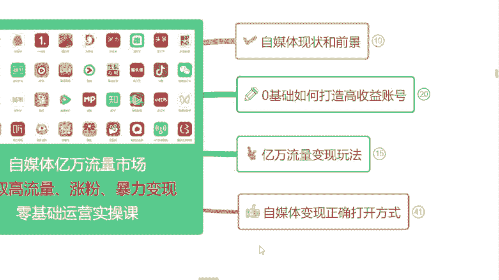
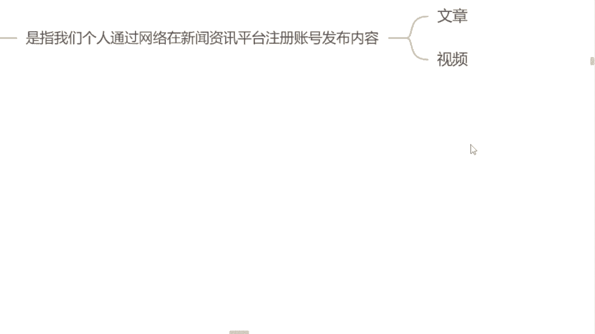

# 【2024版自媒体运营教程】全B站最良心的自媒体运营高阶教程合集！自媒体运营 起号真的不难 小白轻松上手！ - P2：1.什么叫自媒体 - 湾沚阿 - BV1tJ4m1j7qk

好吧，首先呢第一个板块呢我会给大家讲到，关于我们这个自媒体行业，它的一个现状和前景，就我们同学们来听这节课也好，或者说想做自媒体也好，一定是想要干嘛，一定是想要赚钱，对不对，咱们目的都是赚钱。

但是我们无论是想找一个兼职也好，还是说呃把它作为一个全职也好，我们得清楚这个行业他目前的一个这个现状，或者说它的发展前景怎么样呢，是不是很多人在这个网上搜索，说这个自媒体行业它已经饱和了。

到底有没有饱和呢，是不是人家说的到底对不对呢，或者说这个行业我到底是不是真的能去做呢，是吧，这个板块当中我们去了解一下，那第二个板块就是关于我们这个零基础，怎么样去打造一个高收益的账号。

很多同学呢都有做过账号的，甚至说有了，多多少少肯定在这个平台上面有发过视频的，他们会有这样一些问题，所以曾曾老师，为什么我这一个视频发出去是吧，为什么永远是零播放量呢，为什么他最多的时候只有几百甚至。

1000多的播放量呢，是不是这个平台他已经不需要拉新了呢，不需要我们新用户再入驻这个平台了呢，所以说他给我限流处理了呢，其实不一样子的啊，这个板块当中我们去了解一下，我会教你们怎么去选择平台。

以及选对领域去做这个账号，第三个板块，就是关于我们这个亿万流量变现的一个玩法了，很多同学都觉得我们自媒体除了这个内容变现，好像就没有了，内容变现是什么呢，就是我们自己去做视频啊，就是这个发出去有人观看。

我们可以靠这个呃内容，就是以他这个流量去变现去结算收益的，那除此之外呢，还有很多种玩法，都适合我们零基础的同学去做的，这个板块，我会给你们讲到啊，选择哪个变现方式，咱们可以自己选。

那第四个板块就是关于我们自媒体，它变现的一个正确打开方式，如果说你听完今天整堂课，你觉得这个自媒体比较适合你的，你有时间来做的，我会告诉你们咱们怎么样去规划我们这个账号，以及系统性的把这个钱赚到手。

好吧，首先呢我们先来了解一下到底什么是自媒体呢，这个呢我用大白话给你讲吧，就是自媒体的话呢，就现在我们打开自己手机的百度，去这个百度上面搜索一个自媒体平台，去注册一个属于我们自己的账号啊。

为什么是属于我们自己的账号呢，这个账号是需要我们自己实名认证的，问一下同学们有没有年满18岁，有的来公屏上打有字，我看一下啊，这个是一个门槛啊，没有成年的人，他做不了，有成年是吗，好恭喜你啊。

已经达到了第一个门槛了，那这个账号注册好了过后呢，需要我们在我们自己这个账号里面去发布，我们自己做的文章和视频，A首先告诉你们，是我们自己做的，不是你把别人的这个视频搬下来，发到你的账号上面去。

他就可以赚到钱的，不是这样子的啊，天上没有掉馅掉馅饼的事情，必须是经过我们自己手处理过的视频啊，首先讲到这里，这个呢就叫做自媒体。

