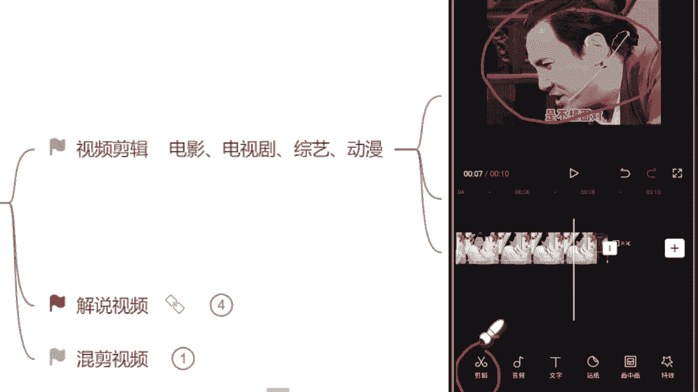
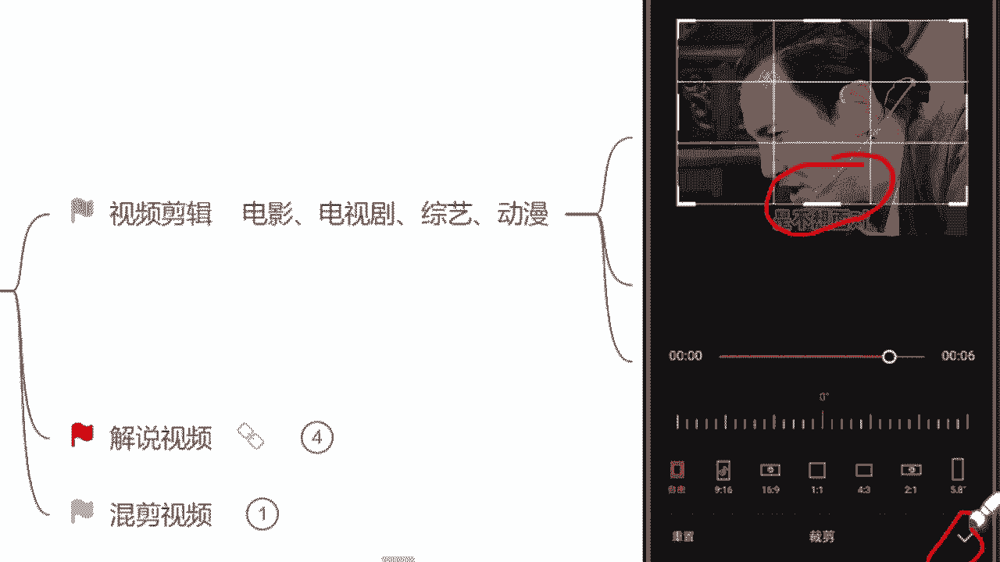
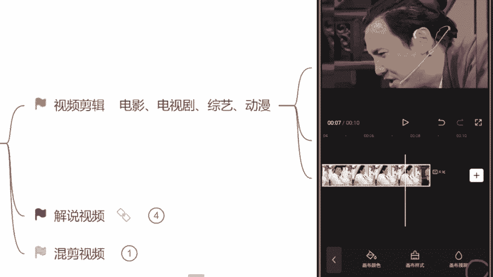
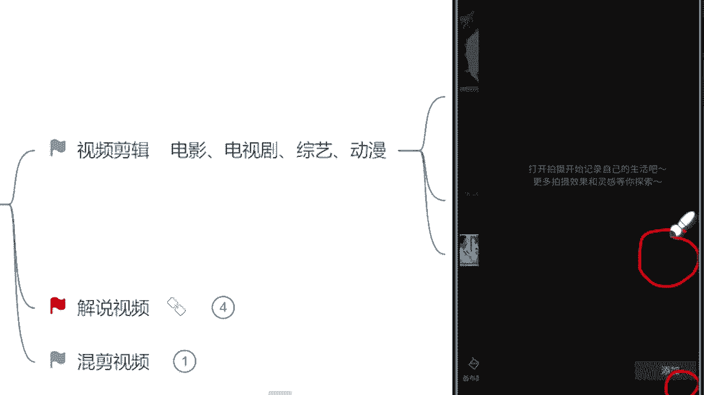
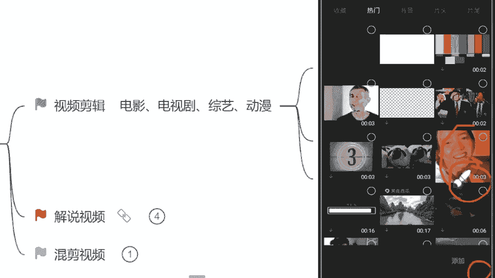
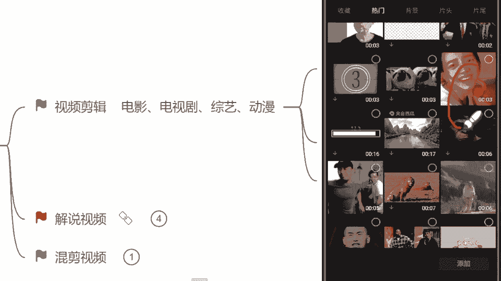
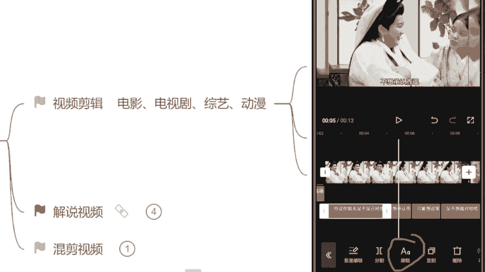
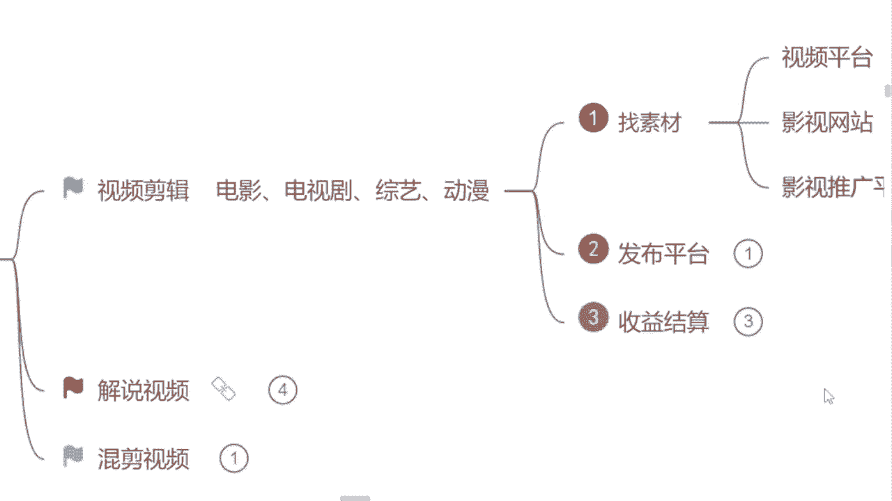

# 【2024版自媒体运营教程】全B站最良心的自媒体运营高阶教程合集！自媒体运营 起号真的不难 小白轻松上手！ - P7：6.视频剪辑实操（下） - 湾沚阿 - BV1tJ4m1j7qk

可以了，那首先呢我们来看这个视频啊，我们找素材过程当中，你找的素材不可能啊，每一个都是16比九的，那我们需要自己去调整的啊，就像我们这个视频一样，看见没，它就不是一个16比九横屏。

但这个视频我又想用怎么办呢，那来紧接着告诉你们一个最简单的方式，那么右下角有一个比例的选项，直接点击它里边会有一个16比九，九比十六两个选项，选哪一个，知道了吧，16比九啊，横屏的这一个选完了过后。

紧接着你就来看看什么，你就看这个视频，它动还是没动，如果说像咱们这个视频一样，它一动也不动是吧，我在上边讲的累累累的汗都出来了，他在上边一动不动的，那紧接着怎么办呢。

这个视频我们又想用来我们自己去调整啊，自己去调整，我们自己去剪辑这个比例，这样子的方式呢，它可以扩大你用的素材的范围啊，不用担心这个素材啊，这个素材我这个比例用不了了，怎么办呢，就没办法了吗，不是的。

来紧接着找到最左边有一个剪辑的选项，看见没选择它。

然后里边有一个编辑的选项里面裁剪，找到了过，后来强调一下，我们原本这个视频里面自带的这个字幕，全部给他裁掉啊，不要留下来，一个都不要留，裁剪过程当中你们稍微仔细一点啊，不要留这个黑色边框，留太多。

油太多了，过后呃有一个黑色背景就不好看了，那现在裁剪完了过后来右下角对勾点起来是吧。

这样子我们视频就裁剪完了，那裁剪完了过后，你再来看是不是视频画面放大了更加清晰了，但是它也不是一个16比九横屏，那怎么办呢，找到右下角有一个背景的选项，听见没给你圈出来了哈，一定要记住，找到背景。

选择右边这个画布模糊，选择第一个清晰的画面，现在来看这是不是一个16比九的横屏了呀，这个步骤有没有记住，记住了的，来公屏上打一这个步骤，记住了吗，不是16比九的横屏就出来了啊，紧接着选择右下角这个对勾。

好记住了哈，选项记住就行了，那现在我们这个比例放大了是吧，我们16比九横屏也调整完了，来紧接着要干嘛呢，要给这个视频添加一个转场，我不知道同学们在这个平常看视频的过程当中，有没有这个看到过转场视频。

就比如说举个例子吧，我们今天看一个什么盘点类的视频是吧，每一个这个视频片段的中间，它会给你添加一个搞笑的片段，但是不属于任何一个这个视频内容里面的，有没有看到过这个，有的来公屏上打游子吧。

有没有看到过这个就叫转场啊，就为什么要添加它呢，就是我们要让用户明确的知道，第一个视频看完了，第二个视频跟第一个他完全不一样，无论是场景不一样还是人物不一样，还是说视频的内容不一样。

你就要让他知道是不一样的，如果说这个过程当中我们不添加转场，第一个视频完了，第二个视频紧接着来了是吧，我们用户心里都会咯噔一下，诶，怎么这个视频长得不一样呢，是不是我看的不对呀。

对这个时候就干嘛退出去啊，再看一遍，我今天看的这个视频主题到底是什么，一旦他退出去了，这个视频他的什么完播率就会直线下降，完播率它是会影响什么呢，我们视频的单价的，所以说这个是非常重要的。

转场该怎么添加呢。

找到右边这个加号的位置，依然是它点击加号。

然后找到素材库里边，热门里边儿非常多转场。

像这种的这种的这种的熟悉吗，同学们这个转场熟悉吗，是不是看到过，现在基本上在现在平台里面，所有的一些转场视频都从这个剪映里面找的啊，你们去用啊，这个大胆的去用就可以了，但找转场的过程当中呢，强调一遍啊。

不要过长了，像这种六秒的，七秒的，17秒的什么16秒钟这一转场不要去用啊，我们尽量简短一点，因为我们没有任何一个人有耐心，他把这个过程当中一个替代性的，过渡性的东西给他看完。

没有的转场保持在3~5秒钟是最合适的，好吧，记住我们就选择一个三秒钟的给它添加进去。

好现在添加进去过后来看一下转场，它跟我们这个所有的一个视频比例，也要保持一致，什么呢，16比九啊，你选择这个视频的右下角，就会有一个画布模糊了，你直接选择它，点击第一个清晰的画面就可以了啊。

它就是一个16比九的横屏，那现在转场添加完了过后来下一步是吧，识别字幕了，那这个视频的字幕该怎么识别呢，最简单的一种方法，找到左下角这个文字的选项，看见没选择它，然后新建文本右边有一个什么识别字幕。

我们直接选择识别字幕，点击开始匹配，这个软件会自动去给你识别这个视频当中，人物所说的话啊，给你形成字幕，是不是非常的方便，字幕识别完了之后呢，这个调整一个就可以了，放大一点啊，右下角这个正方形往右边拉。

放大了过后，整体把这个字幕条给它，拖动到视频最下方的一个位置来啊，这样看起来是比较舒服的，你调整完了一个，第二个你就再不用调整了啊，因为它都会随时调整，这个视频这个背景该怎么去添加比例。

该怎么去调整字幕以及转场该怎么去添加，有记住了的同学来公屏上答一是吧，有技术的，有学会了的，我们想打一，或者说来小鲜花可以刷起来了，是不是就按照这样的一个模式去做，这既有自己的一个想法。

这个视频他这个完成度也是比较高的，问一下同学们难不难呀。

你觉得男的来公屏上打个男字吧，觉得这个不难的打不难难吗，其实不难，对不对，这个视频嘛看起来就有手都能做。

