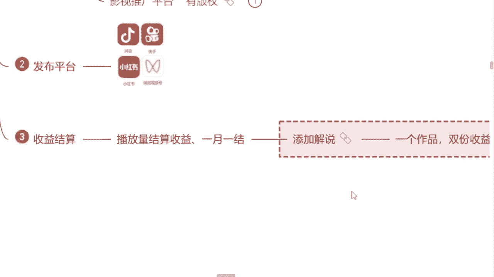

# 【2024版自媒体运营教程】全B站最良心的自媒体运营高阶教程合集！自媒体运营 起号真的不难 小白轻松上手！ - P8：8.结算收益 - 湾沚阿 - BV1tJ4m1j7qk

但是今天为什么我要讲给你们呢，因为现阶段我自己的团队也在做这个影视推广，我们每一个小伙伴手里面起码有十个账号，都在做这个，但是我们即使是批量在做这个东西，它依然也是不够的啊，依然也是不够的。

就账号呢稍微还是少了点，就这些资源我们一个团队吃不下的，所以说我今天呢会想要去找一些这个小伙伴，一起来跟我做这个东西，这个资源我可以给你对接，但是有一个要求，我让你怎么做这个视频，你就要怎么去做。

就按照我说的去做，这一点能做到吗，能的来公屏上打个能字吧，这点能做到吗，我们属于一个什么呢，属于一个合作共赢的一个过程啊，这个资源我对接给你，你按照我说的去做，你去拿这个奖金，同时以后有了这个资源。

他一样会对接给我们团队啊，我们合作共赢嘛，是不是这也是我们都想达到的一个结果，能是不是能就可以啊，能就可以，这个还是我所强调的嘛，如果说你想要在这个平台上面做起来，你就需要有一些资源和人脉。

这才是重要的，是不是就是除此之外呢，我所要讲到的，我们做这个影视推广，我们单纯的去做这个视频的剪辑，除了这个之外，如果说你还愿意在这个视频当中去添加解说的，我们一个视频可以赚取双份收益。

问一下同学们有没有听过这个中视频计划的，有的来公屏上打个有字吧，有没有听过中视频计划的，有是吗，有就好有就好，那我就简单讲一下，因为中视频计划的话呢，现在是字节跳动旗下的这个三个平台啊，这个抖音。

今日头条和西瓜视频，这三个平台统一推出的一个，这个针对于我们这个自媒体创作者，视频的创作者的一个更高，流量分成的一个机会机制，就是我们做一个视频，这三个平台同时都会给我们结算收益。

那如果说我们做这个影视推广，因为它有一个优势，它是有版权的，有版权的，你把这个视频剪出来过后是吧，我们再去这个视频当中去添加一些解说的内容，通过抖音这个平台去发放，第一这个呃系统。

它会给你结算这个播放量的奖金，第二个我们去通过这个抖音中视频计划，这个入口，其他两个平台同时给我们结算，这个播放量的收益，这是平台结算的，这是双份收益了，是不是问一下同学们有没有想做解说的。

有的来公屏上打个有字吧，有想做解说的吗，有你们是为了这个双份收益呢，还是真的想去做这个解说呢，你们属于哪一个，第一个是不是好的好的，我知道了，那首先呢要强调一点，如果说我们想要做这个影视解说A。

