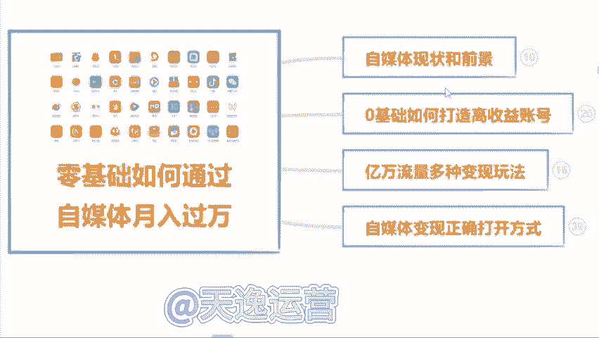
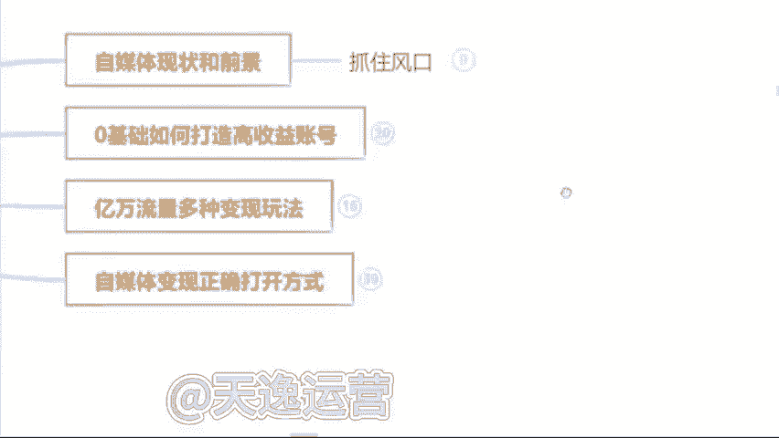

# 【2024版自媒体运营教程】全B站最良心的自媒体运营高阶教程合集！自媒体运营 起号真的不难！ - P4：1.什么叫自媒体 - 自媒_体_教程 - BV1DE1QYDEyg

首先第一个板块呢就是自媒体它的一个现状和前景。就是无论我们做任何一个行业哈，无论是做前置也好，还是兼职也好，我们得清楚这个行业，它的一个现状和前景。我们去做，对于我们来说有一些什么样的好处呢？

那到底可不可以去做呢？是吧？我们了解清楚了过后，我们再去上手，我们才能更放心一点。那第二个板块呢就是零基础的同学，我们如何去打造一个高收益的账号，就很多可能了解一点自媒体的同学。

或者说你是有做过自媒同学，可能都知道哈呃我们这个视频发出去，要么它是零播放量，要么你去抖音和这个快手上面，你去做视频，啊，靠这个播放量没有人来给你结算收益的这是为什么呢？那这个板块当中呢。

我会教大家怎么去选择这个平台怎么去选择领域和这个渠道，我们才能把这个收益赚到手。那第三个板块呢就是一个亿万流量的一个多种变现玩法，就是很多同学了解自媒体呢，可能都知道我们自媒体呢。

就是我们做视频或者说文章发到。😊，这个平台上面去有人观看，我们可以靠这个播放量去结算收益。那除了这个之外呢，还有很多种玩法，都适合我们零技础同学去上手的那这个板块呢我会给大家讲的那第四个板块。

就是我们自媒体变现的一个正确打开方式啊，是怎么说呢？就是如果说你是听完整堂课。你觉得这个自媒体比较适合你的，你也有时间来做的那我会教大家怎么去规划我们自己的账号，以及系统性的把这个钱赚到手啊。

这是我今天内容板块的一个划分。那么首先呢先来了解一下到底什么是自媒体呢。自媒体的话呢，我用大白话给大家讲吧，就是我们今天打开我们自己的手机，百度去百度上面搜索一个自媒体平台。

然后去这个平台上面注册一个属于我们自己的账号，在我们自己这个账号上面去发布我们自己做的文章或者说视频，啊，我们有人观看就可以靠这个播放量去结算收益。这个就叫做。

自媒体，我这样讲能不能明白？

