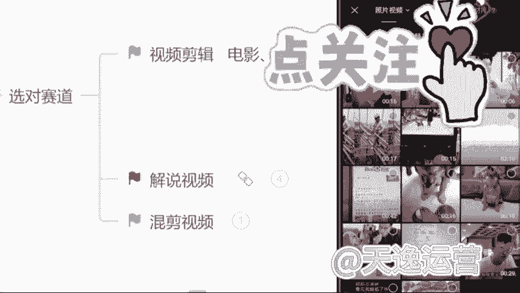

# 【2024版自媒体运营教程】全B站最良心的自媒体运营高阶教程合集！自媒体运营 起号真的不难！ - P9：6.视频剪辑实操（上） - 自媒_体_教程 - BV1DE1QYDEyg

那现在同学们能看见我的手机了吗？能看见我的手机了吧。那么首先呢在我们自己的手机上面找到一个剪映的软件啊，就这一个剪映的话呢，它这个手机端和电脑端图标找的都是一模一样的啊，没有什么区别。

我们找到这个软件过后呢，直接点开它，点开了过后，我们可以看见一个加号的界面，就是开始创作这个界面，我们直接点击这个加号的位置，然后把我们自己找到一个视频素材，先给它添加进去一个。

那么这个视频素材添加进去了之后呢，首先讲一点，我们自己做视频的话呢，素材它是能找到的。但是我们要做的这一个视频的主题背景，它是找不到的，只能我们自己去制作，那怎么做呢？首先我们要找到这个视频轨道。

有右边有一个加号的位置，看见了吗？直接点击这个加号的位置，然后我们找到这个手机自带的素材库，啊，这剪映自带的，看见没？素材库。

我给你们圈出来，找到素材库了过后来直接点开。我们在热门里面就可以看到非常多的一个背景主题非常多。包括我们用的话呢，像这一类型的，或者说这种的这种的，包括这种的，我给你们圈出来这种背景呢。

它都是可以用的啊，都是可以用的。但是我更建议你们呢去选择一些简单明了的，就是用户点进来一看，我就知道你做的这个视频是什么主题，就是黑白色的这个背景，我们就选择一个黑色的背景添加进去吧。

啊，那这个背景添加进去了过后来首先背景有了，我们得添加主题吧。那这个主题该怎么去添加呢？来左下角有一个文字的选项，直接点击文字然后点击最左边这一个新建文本啊，看一下文本框出来了。

那现在我们要打我们自己做的这个视频的主题，我们刚才说到的，我们今天要做的这一个视频的主题人物他是谁是谁呀？这个我们一定要记住哈，我们的主题人物如果说明确了，你找的视频素材当中，必须要有他啊，必须要有他。

如果说没有这个素材，我们就用不了，是谁还记得吗？我们刚才说到的，我们刚才说到的是谁来着，我们今天要做一个沈腾的搞笑名场面啊，沈腾这个人，你们是必须要记住的，这个沈腾名字确定了。

我们所有的这个素材当中必须要有他出。😊。

线啊，如果说没有，到时候这个素材用不了，重新找好吧，这一点是要记住的哈。那么首先呢先来打两个字，就是谁呢？就主题人物沈腾。沈腾的什么呢？沈腾呢他有自己的综艺场面，也有自己的影视场面。

如果说你找的素材是跟影视相关的。你就打影视啊。如果是跟综艺相关的，咱们就打综艺。好吧，这个咱们区分开来，沈腾的综艺报笑名场面O这个名字，我们确定了过后，但是我们看一下是不是非常白，白色的文字。

我看起来不太好看，不太好看是吧？我们所有人呢他都喜欢一些色彩鲜艳的东西，这是比较抓人眼球的那接下来呢我们也不要去选择什么样式和花字了，不用我们直接去选择右下角这个文字模板，我们直接往上套啊。

这样是最方便的。那么这个文字模板呢，根据你自己的实际情况来，它有收费的，有免费的啊，我们自己去选就可以了，我们随便选择一个模板来看一下。

同学们觉得这个模板可以吗？觉得这个模板可以用吗？我觉得还不错啊，这个模板我们找到了过后呢，来直接选择右上角的这一个对勾。OK我们的主题背景有了。那我们选完之后呢。

直接手动的选择整体这个文本框的右下角给它放大一点，好吧，让我们这个文本看起来更清晰。

好，这个文本就这个背景我们制作完了过后，OK名字是有了，但是我们不能让用户点进来看什么看哑巴电视吧，不可以，谁都喜欢有声音的东西。那问一下同学们会配音嘛？同学们会配音没会配音的，你打会字吧，不会的。

你打不会，如果说会配音的同学，咱们自己就打开自己手机里面的录音机，我们把这个名字自己念一遍就可以了啊。如果说不会的，没有关系，我们直接选择右下角这个文本朗读，我们直接往上套就行了啊，这个是比较方便的。

我们选择文本朗读了过后，来你看一下，是是特别多的声音，什么方言音啊，什么男生喜欢的萝莉音啊，什么女生喜欢的这个男士的播音腔O都有的。但是我更建议同学们去使用一些这个方言音啊，就方言音在现在所有平台。

它上面的一个呃运用率它是比较低的，它是比较有吸引力的，你们去做，但是比较能够吸引到人的。像方言的。😊。

话呢我最近呢比较喜欢一些广西的方言，因为我觉得很有意思，也没有广西的同学，我觉得很有意思。好吧，我们就先来听一下这个方言音。😊，神腾风衣报销名场面。沈腾中艺爆笑名场面。沈腾中医报效名场面。

深腾总一保小命昌面。沈腾总一包厢明唱面。沈腾综艺报笑名场面。深圳中医报销名场面是不是非常多的方言音啊，咱们自己去选就可以了。那我就选一个广西的方言。那我们这个方言音，我们选择完了过后。

直接点击右下角有一个对勾。OK它就会自动的去下载这个音频。那这个音频下载完了之后，我们从头来听一下。

整腾中医报销名场面OK现在声音呢它是有了。那我们现在呢手动的选择这个黑色的背景，你直接点击它一下就可以了。那点完了过后呢，我们自己手动的来给它缩短一点，让它能够音化同步。那这个主题的背景。

我们制作完了过后来，紧接着重要的来了。就我们本身视频的本身，首先我们来看一下，有没有沈腾这个人O有那这个素材我们就能用。我们刚才讲到的，如果说这个里面没有沈腾，那咱们就用不了啊，这个你要记住。

那首先呢在讲的过程当中，我边讲边给你们讲细节。首先第一点我们要做的这个视频，它必须是16比9的一个横屏，这是所有平台，它硬性的一个标准，如果不是这一个比例。

O平台的审核是不会给你通过的一定要记住这个比例啊，我给你们打在公屏上了。那除开这个呃抖音啊除开抖音，因为抖音的话。

它是需要9比16的竖屏啊，除了这个抖音之外，其他平台都是16比9的一个横屏。这两个咱们记住，咱们把区分开来，到时候做视频的时候，比例要选择。对那这个比例呢，首先我们来看一下该怎么去做啊。

就像我们这个视频一样，它明显不是1个16比9的横屏，我们该怎么去调整呢，来，首先最简单的一种方式，我们找到这个手机下方有一个比例的选项，直接选择它来。

现在我们看见有1个16比9的横屏的选项没给你们圈出来，看见了吗？就是这个找到了过后直接点击它。我们现在就来看。这个素材视频它到底动还是没动，如果说它动了，okK它就可以用这种方式去做比例的调整。

那如果说像这个视频一样，它移动也不动，那该怎么去调呢，我们自己手动调，该怎么调呢？这样可以增加我们使用素材的这个几率啊，就是我们能够用到的素材就更多了。首先呢我们选择左下角有一个剪辑的选项，找到剪辑。

然后选择里边有一个编辑的选项，看见了吗？直接选择编辑，然后我们自己来干嘛？裁剪这一个画面，那裁剪过程当中呢，首先强调一点哈，所有的这个视频当中原有的这个字幕，咱们不要留，直接给它裁掉。

我们等一下自己做就可以了。那在这个裁剪过程当中呢，包括这个边框，到时候你们少给他留一点啊，少留一点边框，到时候留多了过后，它会有一个黑色边框会不好看，少留一点就可以了。

这个画面我们裁剪完了过后，直接点击右下角的对勾。OK来看一下这个比例是不是调整了，视频它明显的放大了，但是它也不是1个16比9的横屏，如果是的话呢，它就不会有这个黑色的背景了。那接下来该怎么去调呢？

找到我们手机右下角有一个背景的选项。在这里看见没？背景直接选择它，然后右下角有一个什么呢？画不模糊，看见吗？直接选择画布模糊。

我们调整到第一个清晰的画面，现在你也再来看一下这个是不是就是1个16比9的横屏了呀？同学们这个步骤要记住啊。

