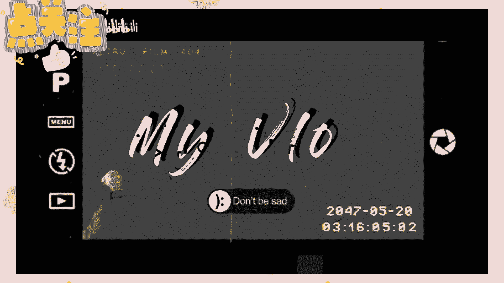
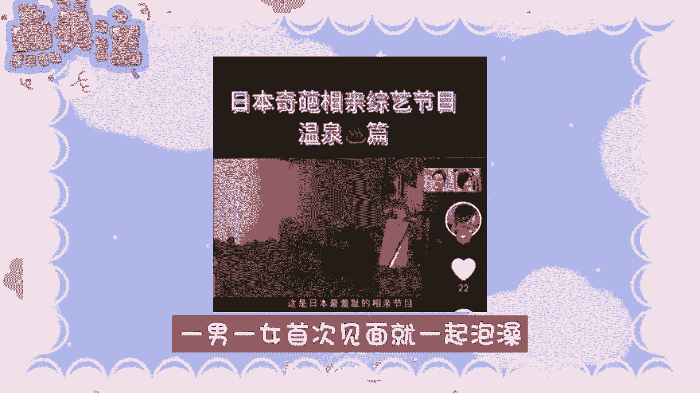
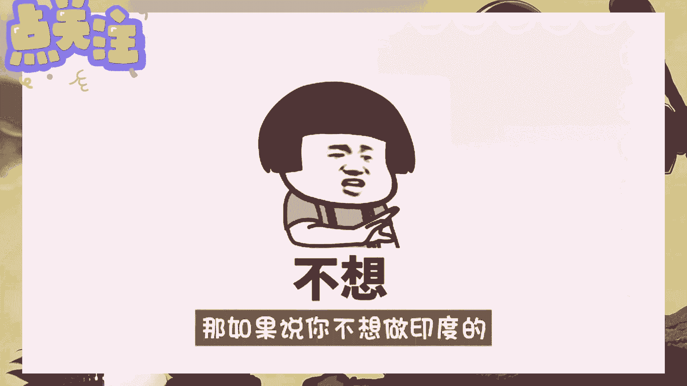
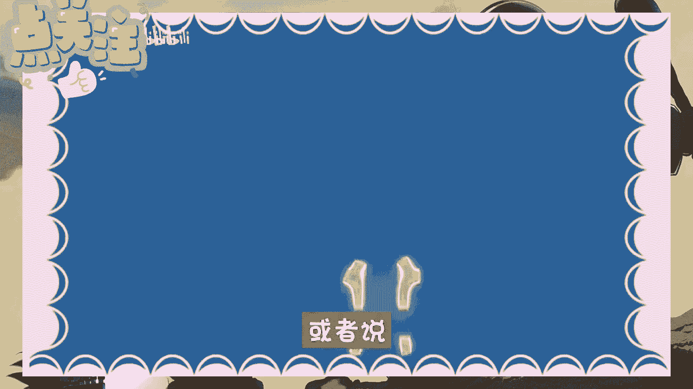

# 【2024版自媒体运营教程】分享价值3.2W的自媒体教程，全B站最良心的新媒体运营高阶教程！自媒体运营做国外视频搬运起号真的不难！ - P1 - 张天曌 - BV1XD42177Mf

靠抄袭也能玩好自媒体，那今天呢就给大家提供几个自媒体的思路玩法，个个都是冷门野路子，不过这些内容啊很干很敏感，有可能会被下架，那大家且看且珍惜吧，那我之前发布过搬运国外视频赚钱的方法。

感兴趣的小伙伴可以去看一下，那今天的话呢介绍三个，具体我们可以去做的一个领域，都是我亲身去试验过的，那这个呢是我做的一个自媒体账号，主要是做的一些综艺节目，现在去年的一个收益啊也是有18万了。

非常的稳定，但是门槛可能会相对高一点，不过我认为这是一件好事，门槛高了就意味着精神小，不然早就烂大街了，哪有你的机会呢，冷门才能让你在家闷声赚钱，首先第一个是日韩的综艺，日韩的综艺呢和国内的不太一样。

尤其是日本什么都可以不管不顾，据说是看点，倒不如说是他们丧心病狂，非常的符合他们民族的特点，比如说一个相亲节目，一男一女首次见面就一起泡澡。

简直令人匪夷所思，然而反观韩国那边就是非常养眼的帅哥美女，众多人家的游戏流程的设计也是非常有趣的，娱乐业呢也是异常的发达，那像我们国内的跑男，我是歌手，其实这些都是搬运了他们的综艺模式。

你看电视台都在搬运借鉴，说明了什么呢，就是这一类的内容啊，不仅在日韩有受众，在我们国内受众的群体也是非常大的，第二个呢就是东南亚的生活，这个呢是我个人强烈推荐去做的，他流量啊是真的非常的大。

那当初的一句干净又卫生，就火遍了整个网络，那从这里就可以看出来呀，想要上热门的一个核心要素就是反差，但是啊做这类账号，大家有一个误区，就是认为只能拍美食才可以，而这个观点是严重错误的。

但其实印度的整个生活，和我们是有巨大的反差的，比如说人家坐火车可以买挂票，骑摩托杂耍，这些都是你可以去做的，对了还有一个非常有话题的就是恒河水。

那如果说你不想做印度的，那东南亚的其他国家也是非常不错的选择，理由呢也是和印度是一样的，同样是都是生活有反差感，比如说泰国的非诚勿扰，那这个呢居然是人之间的，那这样的反差呢就让大家愿意去看你的视频。

第三个就是美国的实验室，原来这也是民族的一个特性，不仅上面的人呢爱搞生化实验，那下面的民众也是习惯了，不过呢搞这些稀奇古怪的玩意儿，比如说一套蜘蛛侠的战衣，能够喷出蜘蛛的那种。

或者说一个星球大战的同款等离子光剑。

还有啊给你三天时间不走出圆圈的挑战，最后离开圆圈的人啊，能获得50万的奖金的比赛，那当场上只剩下个人的时候啊，主办商就会不断的进行一个捣乱，那你一不小心踏出了，那你三天的努力就前功尽弃了。

那你看这些实验玩法听着是不是很刺激，非常有趣，大家能不想看吗，那么以上呢这几个比较冷门的玩法思路啊，唯一一个难点就是需要配音解说，它不像户外建造或者说解压类的视频，看着画面就能猜出来是在干什么啊。

这类内容题材对话会比较多，一般人啊真的没办法接受，所以说啊我才说他的门槛会高一些，不过而且你刷到这个视频，那我呢肯定会给你们安排的明明白白，那我这边呢有一语音解说生成工具，和一份自媒体实操直播教程。

大家可以点赞收藏起来，在评论区留言一个学习，我可以免费分享给你，那是不是很贴心啊，这期视频又是一份星巴级的教程，还不赶紧关注我，本期视频呢就分享到这里了，我们下期再见吧。

