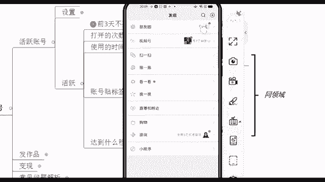
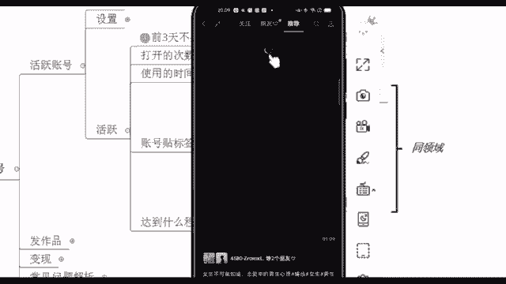
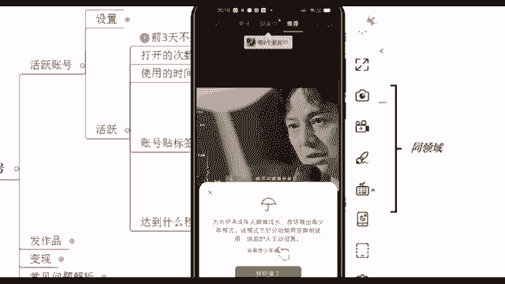
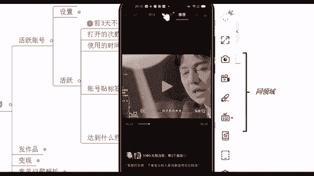
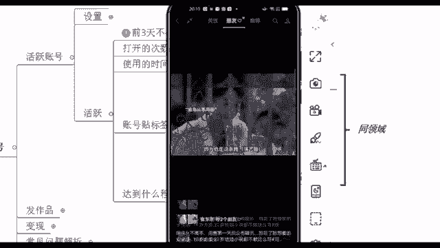
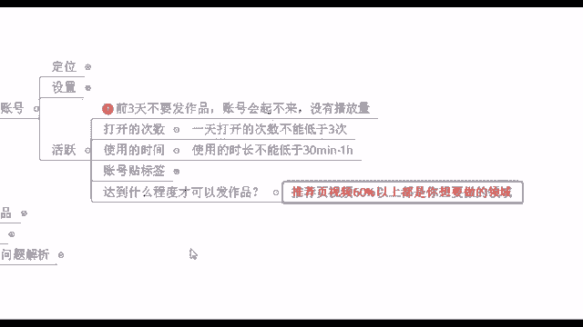

# 【2024版视频号运营教程】全B站最良心的视频号运营高阶教程合集！视频号运营 起号真的不难！ - P10：6.实操教学-视频号养号解密 - 鼓腹含和防护服 - BV1wDWheCEsK

第三步就到达这个活跃账号了，活跃账号其实讲白了，就是我前面有说到一个词语叫做养号，你们觉得养号这个东西它到底要不要做呢，你觉得要的话哪个要不要的话，哪个不要，你们觉得要不要之前有看什么呃。

其他平台的时候应该有听过这个词语吧，这个养号这个东西啊，它的话呃之前可能会有人说老师这个养号，我觉得养不养没有关系吧，是不是不养的话，好像也可以去发作品，个人会觉得痒了会比没有养好。

因为根据我自己之前的一些实操，我没有养的一些账号，我发作品的话很容易出现什么，就账号播放量不高啊，甚至我的作品怎么被吞的，我都不知道之前我踩过的一些坑啊，这就是我之前的一些经历啊。

所以我自己我个人认为的话呢，如果说你之后要去做好这个事情，你去花几天时间去养养号，这个也不难，来，我们来看一下养号怎么去养，前三天你刚开始创建这个账号的时候，不要去发作品，因为这会像我说的账号起不来。

没有播放量，以及呢我们打开的次数，您每天不要打，不要少三次就行了是吧，我每天没事，我就打开它，使用的时间不要低于半个小时到一个小时，账号贴标签，这个就是字面意思啊，非常简单，贴标签什么意思呢。

呃我问一下啊，就现场你们有没有在跟你家人啊，跟你朋友在聊天的时候，哎我今天明明聊到一个话题，聊到一个产品，感觉这个还不错，比如说我聊到某个牌子衣服是吧，或者说某个牌子的化妆品啊，啊某个牌子的这个零食啊。

结果第二天我打开其他的平台，打开淘宝啊，或者说打开微信啊，他立马就给我推荐相关的一些产品了啊，养养了权重高，对这个词语它就是非常的专业了，这就是权重，我们活跃账号，其实就是为了去提高你的账号权重。

有是吧好，所以说其实这个的话呢，就是我们现在什么账号贴标签，因为大数据它是很灵活的，大数据它会去记住你所有的一个操作，比如说你喜欢什么东西，你在这个界面停留多久，他都知道的啊。

所以说我们现在去给账号贴标签，就是告诉大数据，你喜欢这个东西，我们一定是给同领域的东西去给他去点赞，评论转发，这个就是让大数据记住你啊，同领域的，就比如说你要做影视剪辑，我就专门去点赞影视剪辑的。

你要做其他类型，你就专门给他去点赞就行了好吧，评论转发完播什么意思呢，就你看完它，你不要停留个两秒钟，我就走了啊，还有呢关注他，并且直播直播的话呢，不是说让你自自己直播啊，你去看别人直播。

现在我们看直播都是基本上都是免费的，然后现在因为腾讯，它在下半年要进入这个商业化模式了对吧，所以说我们现在去看的话，就在前两天我刚看见啊，前两天已经开始部分试水付费直播了，付费直播什么意思。

就你可以免费观看3分钟，看完之后你觉得还不错的话，哎我付个几块钱啊，我又可以观看看他整场的一个直播了，并且这个直播还是有回放的，所以说这个现在就是他在测试的一项东西啊，这个也是后面会大力去推广的。

这么一个直播类型啊，这是给账号贴标签，这个能理解吗，包括点赞，他的视频号点赞跟其他平台会有一点不太一样，给你们看一下啊，视频号的点赞，它其实更加像是微博的转发，微博的转发啊，他因为特别注重这个社交属性。

我给你们看一下，在这个发现页视频号底下。

你看我的朋友点赞之后，我都在这能够看到他的头像。

包括在中间这么一栏，全世界所有人都可以放弃你自己的人民。

千万千万一定要在自身找到无人机的山，好在这个中间你有没有看到在这个朋友这一栏。

它右边有个小星星，这个就是你朋友点赞之后，你能够去看到的这么一个东西。

所以说这是咱们这个点赞它的一个机制啊。

那他的话也非常注重这个社交属性，我在后面给你们说一下，他这个是能够给你带来一大波的流量的，这个就是我们这个账号贴标签，正确的事情重复去做就好了，能理解是吧，好来能理解我就快速过了啊。

来除了这个账号贴标签之外，我们还有提高权重的一些方法的，比如说你可以去给他评论啊，制造神评论，评论底下可以去制造神评论啊，这个制造神评论的话呢，什么意思呢，就你们经常在看抖音的时候是吧。

有一些评就是这个点赞量非常高的一些评论，有没有发现点赞量非常高的一些评论，包括就是很有意思啊，你看完之后你觉得自己笑的不行了，这个就叫做神评论，那我们的话你可以去在视频号里面，把这个操作给他做起来啊。

我去给别人评论，要是我的这个评论非常多赞的话呢，那说明你这个账号养的非常好的，唉有同学说老师我不知道我怎么去呃，制造神评论啊，我又我又不幽默，我又没有什么，我肚子里又没有什么墨水，没关系啊。

这个时候你可以去其他平台，你把人家这个比较搞笑的一些话，把它给复制下来，互联网它的一些热点，就有一些比较新潮的一些话都是共通的，你把它复制下来，粘贴到我就是要去评论的这个视频上面。

这样的话也能够去制造神评论，好吧啊，这就是非常简单的一些操作啊，贴标签包括达到什么程度，可以去发作品，当你的推荐页，60%以上都是你想要去做的一些领域，推荐页，就是我们刚刚说朋友右边那一栏啊。

那个推荐页，如果说你刷十个视频，十个视频只有一两个是你想做的啊，那还不够是吧，你这个时候再去刷一刷，再刷两天，如果说你刷十个视频，有五六个视频都是你想要去做的，这个比如说美食类的对吧好。

那这个时候说明你的这个账号活跃的还不错了，你可以去啊。

直接去发作品了，好这个就是活跃账号。