# 【2024版视频号运营教程】全B站最良心的视频号运营高阶教程合集！视频号运营 起号真的不难！ - P12：8.视频号批量去水印 - 鼓腹含和防护服 - BV1wDWheCEsK

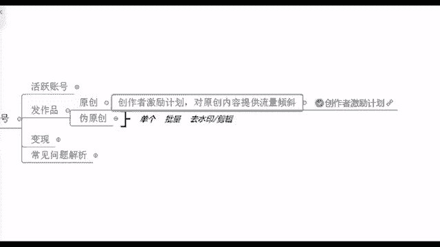

来看一下去水印专门录了个视频给你们看啊，咱们来仔细看一看怎么去去水印呢。

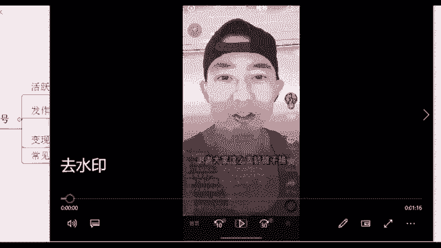

一步一步来，你看这个是，假如说我们现在我找到这个账号叫做什么啊，这个我搬了你们之后就不要去搬了啊，这个是我自己指导我学员去搬的这个作品，他已经搬过了，你不要去搬了啊，就这个宠物类的萌宠类的好。

那在这里的话呢，你看我们这个播放量其实还不错，想偷偷望呀，望一望，让她假装欣赏欣赏一瓶花，有没有看到他整体这个账号播放量还是不错的，就点赞啊，他的一个浏览量也还可以是吧。

那我坚信如果说他作品没有问题的话，我同样的放到视频号去，其实我也能够哎有这么一波流量好，那在这里的话，我们去水印怎么去呢，右下角点转发，点完转发之后，不是说你让你直接去下载这个视频，你直接下载的话。

我们在这个右视频的右下角，或者说左上角，你是能够看到什么他的一个作者的水印在的，所以说不要直接去下载啊，我们是点击右边，这个右边有一个有一个什么复制链接，我们直接去点击这个就好了，偷偷望呀，望一望崩塌。

好复制链接之后，打开你的微信，打开微信之后呢，在里面去搜索一个东西叫做快斗工具箱，快乐的快抖音的抖，这个东西它就帮助我们去去水印的啊，你看我们现在就是在抖音复制的，那我们就点这个抖音嘛。

点开之后在这个上方好，那您看一下这里有什么粘贴链接，右边有一个点击解析，我们先点左边的粘贴链接，点完之后立马点右边的点击解析就好了，也有一些广告，你直接点掉就行了啊，嗯快斗工具箱对这个就是个小程序。

你们直接先记住，然后下去之后能够搜到的啊，好你看现在就是在解析中了，我们只需要等待几秒钟，这个时候他后台就在操作，就在给他去去水印嘛，那你看好了成功，请点击保存视频，那这里我们再去点击这个保存视频。

你现在能够去下载下来的这个视频的话呢。

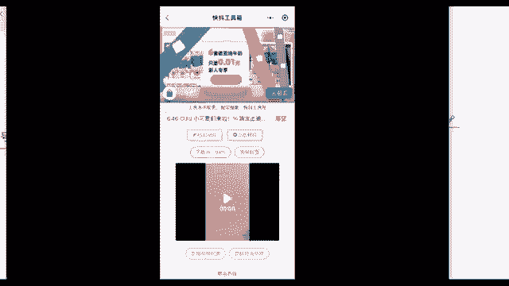

它就已经去掉水印了，保存成功是吧，已经到你的手机里面了，这里的话呢就是第一步操作叫做去水印。

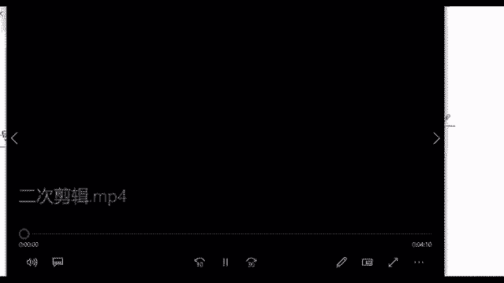

去水印，快斗工具箱啊，好那接下来我们再来看一下，在去完水印之后，我就直接发了吗，直接发也不行，平台他是管的很严格的啊，管的很严格，所以说你直接发也有可能会被发现，那我们这个时候有看到吧。

二次剪辑我又录了个视频给你们看啊，二次剪辑，去把原来的这个视频给他去稍微加工一下，给他改头换面一下，这样的话呢，我们就不容易被这个后台去监测到了，好那在这里的话呢，怎么去二次剪辑。

这里可以用到这么一个工具，叫做剪映，就这个东西这个叫做剪映啊，剪映的话就是帮助我们怎么去剪辑视频的，包括像现在微信他也有专门自己出一个软件，叫做秒剪，啊秒剪这个东西，秒剪的话也可以去剪视频啊。

我经常我自己在用的就是这个剪映啊，你们看自己操作是比较喜欢哪一款好吧，你自己去挑就行了，那这个在里面的话，我们点开剪映，然后呢。

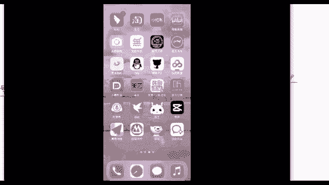

对点开剪映，然后呢我们在这个上方上方它有一个开始创作。

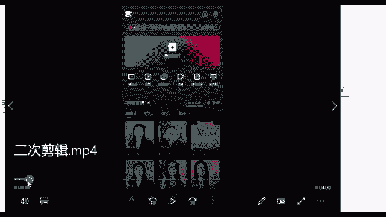

打开之后他有个开始创作，直接点击，点击之后，把我刚刚就是下载到我的相册里面，没有水印的那个视频，把它给什么加入进去。

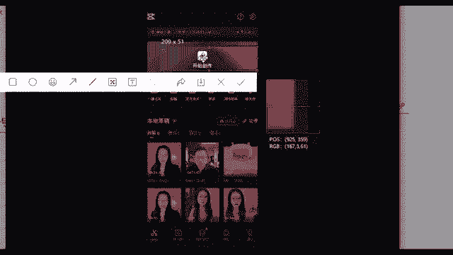

导入进去，然后我再去操作嘛，再去剪辑它嘛，我想偷偷望呀，望一望啊，这个已经添加进去了，假装心赏，欣赏一瓶花好，那我们在这里的话，你看这个是我们完整的一个没有水印的视频，左上角右下角都没有了。

诶这个右下角这个作者还留了个心眼呢，你看在这里的话。

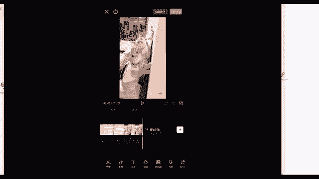

是不是它还加了一个自己的一个小小标记啊，他自己的一个小水印，那我们把这个去掉就行了啊。

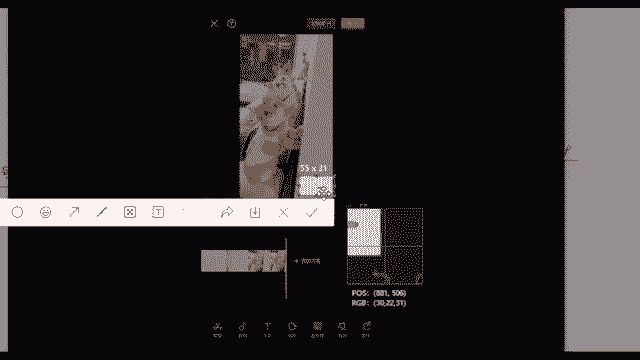

直接去掉去掉的话，我可以通过什么方式呢，我们把这个视频去二次剪辑，其实也是改变它背后的一个数据，因为每一个视频背后他其实就跟我们人一样，人的话都是有身份证的，视频背后它也有它相对应的一个代码。

程序员都会给它给它赋予一个代码，这个代码叫做MD5值啊，有没有听过这个东西的，MD5值就他的一个数值啊，这个东西的话，我们现在进行这个操作，其实就是在改变它背后的一个MD5值啊，没听过。

那我今天给你先科普一下啊，咱们先了解一下就好了，那在这里我们只需要去对它进行一个更改，改变这个数字之后，别人再去看的时候，他就不知道这个东西了呀，对不对，他就嗯觉得这个作品好像是你自己的。

对他就是你自己的啊，好就是你自己的来，那这里我们再去剪辑的话，可以通过什么方式呢给你们看一下啊，有很多的方法，比如说你像这一步，我就是稍稍的把这个画面给他放大了，有没有看见双手放大，你两个手指放在这里。

然后呢跟你放大图片一样，把它给放大就行了，放大一点点，但是其实我看的内容都是一样的，我的内容是没有任何的改变的，是不是啊，两根手指放在这去放大就行了啊，包括这个是第一个操作，第一个操作我们放大的话。

它能够把右下角这个水印给挡掉吗，嗯好，同时我们还可以去对它进行一个什么叫做，分段剪辑，分段剪辑的话在这个地方啊，有没有看到这里有一根小竖线，这个其实就跟咱们的菜刀是一个原理，你的竖线它是放在哪里的。

那这个刀它就切在哪里了对吧，你放在这，然后呢我们再去点这个剪辑切割一下诶，这里这个视频的话，左边一部分，右边一部分就把它给分开了，给它剪断了，所以说我们再去进行一个分段剪辑，这里我是分成了三段啊。

你看这里先切一刀，对不对，点分割这里再切一刀，再点个分割啊，分成三段了好，分成三段之后的话呢，我们再去对它进行一个分段加滤镜啊，或者说分段调速，我们先来调速吧，调速的话也是在下方。

你看这里你可以去尽情的去调速度，调一倍啊，或者说一点一倍，1。2倍啊是吧，你不要调太多啊，比如说调成二倍五倍十倍，那这个视频嗯本来他就只有八秒钟，你再调一下，人家看个什么呀，看个寂寞啊。

所以说这个东西你调速度可以稍微调，我们所有的数值它都是微调，你不要去大改啊，那大改了之后这个内容也不一样，你看我调都是0。9倍是吧，或者说一倍两倍好，这个是分段调速度，它的话这个操作界面都是在下方。

都是在这个底下，这个底下它有非常多的一些按钮，你可以自己去看一看啊，你看在这地方你可以给他剪辑，甚至你可以给他换个音频，我给它加一点字幕，我加上我自己的名字行，我就在这个地方我添加文字加上啊。

比如说什么什么萌宠是吧，这是我自己的账号吗，我就加个名字行不行也行啊，包括给他加个贴纸啊，加个画中画啊是吧，或者说加个特效啊，加个鼓掌的声音啊，加个比较好笑的声音啊也行。

好这个就是嗯我们去做了这么一些操作啊，好这个是分段调速，分段调速之后呢，我后面还可以通过什么，比如说分段加滤镜，滤镜的话，就跟你们平时自拍之后啊，自拍之后，很多女孩子啊可能会去给自己去加个美颜啊。

啊加个什么就是双眼放大是吧，磨个皮啊，啊这个其实就是给他去改变它背后的一个数值，除此之外呢，还有什么方式，我还可以给它调亮度，调对比度，调这个饱和度，当然调数字的话呢也不要去调太大。

它的数值最大可以调到100嘛，那我就调个123行不行啊，调一点点，但是其实调这么一点点的话，你的原视频跟我调过的视频，他基本上你看不出来你调这么一点点数值，调了跟没调一样啊，就是要有这个效果。

我就是要调的跟没调一样，因为他原来的视频播放量很高，所以说我要确保它的一个播放量，我确保这个视频的质量，我只能微调微整形一样，这个意思啊，好这就是这么一些操作，你看这里就是加滤镜了。

加滤镜呢后面的话也可以什么啊，这是调对比度，亮度以及还可以给他换音乐，好这个我们整体调完之后啊，你调完之后。

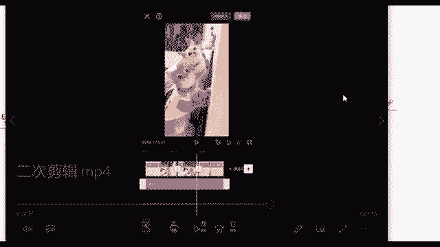

直接在这个右上右上角有个导出红色的按钮，你点击导出这个视频二次剪辑。

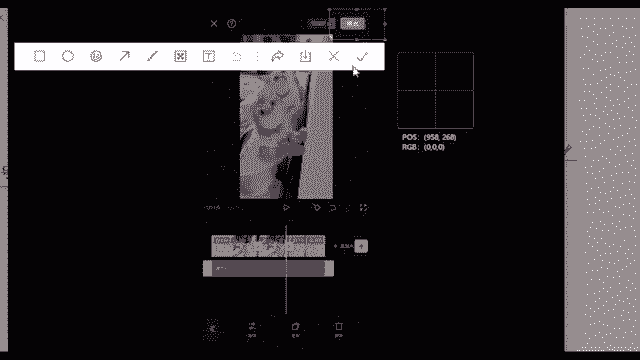

它就完成了，好吧，这个视频他就已经搞定了，来这个看懂了吗，看懂的同学你给老师打上个懂了，看懂的同学给老师哪个懂了，这个其实具体的操作的话，你们下去之后去下个剪映，下个剪映，然后操多操作几遍。

这个就会了啊，我刚刚说的一一切的类型啊，你不管是调滤镜啊，调画面啊，调音乐啊，调速度啊，这个其实都行，你根据你的喜欢的来就行了，嗯如果说还有哪部不懂的，也可以跟我说啊，我们做短视频。

你肯定要学会这么一些东西，学费了什么好，没关系啊，这个下去之后，如果说你看的不太清楚的话呢，我在下面我可以把这个视频去发送给你，好吧啊，如果说你对好简单，那说明你还是有一定基础的啊。

这个就是我们去剪辑这个东西，因为咱们好多同学也是小白，所以说我也嗯，我也是尽量就是讲细一点给你们听吧，啊懂了，那我就快速过了，然后下去之后不懂的同学，我去呃把这个视频发给你也行啊，你找到你助教老师。

我给他发好吧啊，这是二次剪辑。

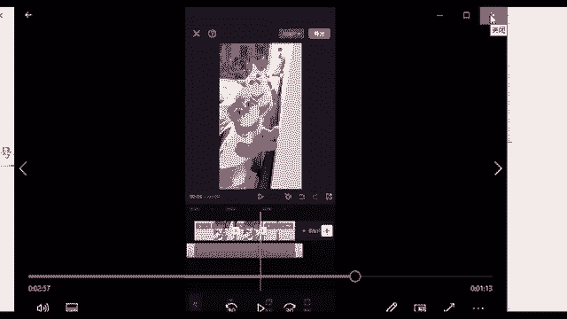

其实这个二次剪辑的话呢，就像我刚刚说的，是帮助你去把这个视频它原来的一个数据改掉，诶，那我之后我再去发这个视频，他绝对可以的啊，绝对可以爆，绝对可以火的啊，那我们在这里的话。

首先我们现在是单个去给他去剪辑，还记得吗，我刚说我们是要垂直发作品，垂直发作品一个作品的话，我可能如果说我刚开始上手慢，我半个小时花在这了，我如果说后面我剪五个视频呢，我一天我就全部在剪视频了。

那多浪费时间啊啊你想一下人家是怎么去做到，就是多个账号，一天发个四五个视频，发五六个，这个视频还能够轻松自如呢。

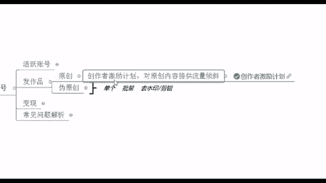