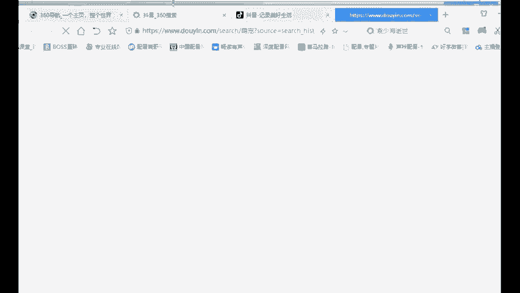
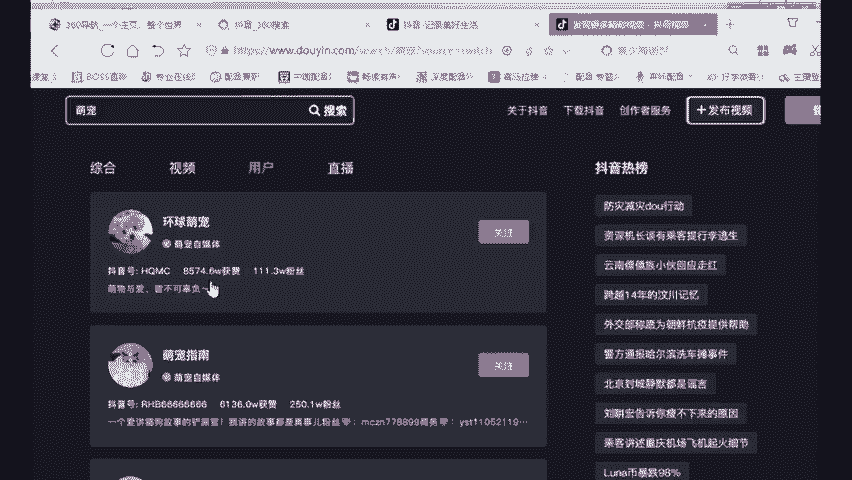
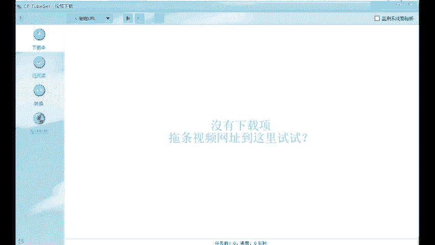
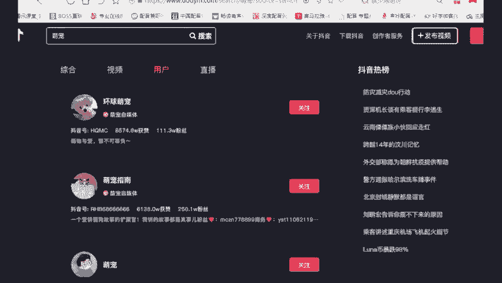
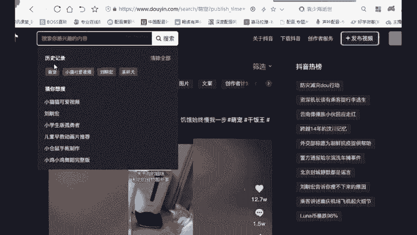
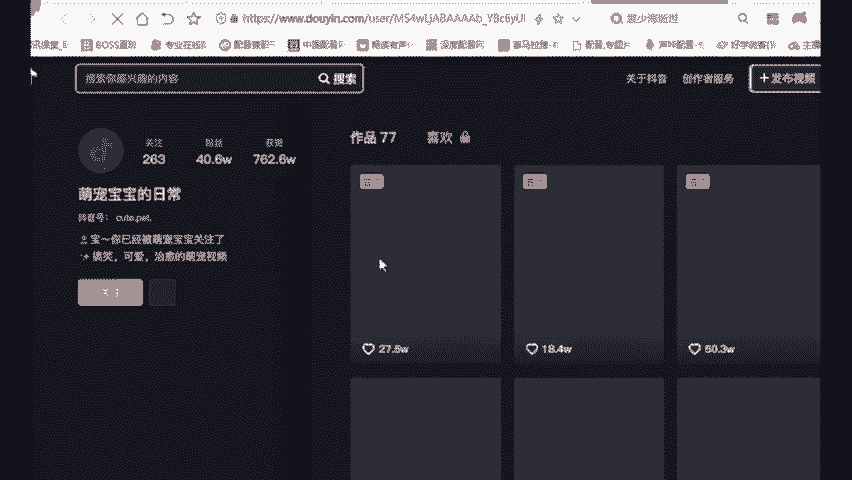
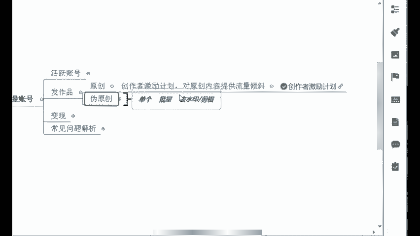

# 【2024版视频号运营教程】全B站最良心的视频号运营高阶教程合集！视频号运营 起号真的不难！ - P13：9.视频号批量剪辑 - Yooup剪辑映 - BV1XnHZecExQ

我这里给大家推荐一个叫做批量去水印的批量去剪辑的一个工具。这个软件是我们自己就是平台内部开发的。我们自己公司内部开发的啊，这个软件你们在市面上去买的话，几千块钱一个啊，几千块钱一个。

那我给你们演示一下吧，这个批量去水印，它可以一次性给我们几百个甚至几千个视频给它一下子去水印剪辑啊。这个软件长这个样子。😊，这个软件长这个样子啊，就是批量去水印，批量剪辑。

对于如果说你之后想要去做大做强的一些同学来说，非常合适，非常方便。你像这里的话，我们如果说之后去去水印是吧？我们还需要去打开快手工具箱嘛，再去一个一个复制粘贴，再去什么保存视频才有用下载。

那我们现在的话呢，你不需要这么麻烦了啊，你直接去打开抖音来，假如说我现在我要去抖音里面搬一个账号。😊，我找到这个账号，它的一个主页就行了。😊，找他的主页，我随便就挑一个啊。😊。

假如说我要搜一个萌宠类的啊，我就找一个用户就行了。😊。

啊，环球萌宠行不行？你看他的这个粉丝还是挺高的，他的货赞8000多，我看一下他的账号，他的账号主页就是这样的，这里有245个作品，对不对？好，他这个账号，如果说我感觉他这个播放量还可以。

并且我觉得还挺好ban的啊。那我现在我就先确定我要搬他的账号吧，确定好之后，我直接把这个链接给他复制下来，把他抖音主页的链接复制下来，复制好之后呢，去打开我们的什么批量去水印的软件。

点开之后直接点这个粘贴链接。😊。

差不多，我们只需要什么一两分钟，你这个视频10百什么一两百个视频，你甚至几千个视频，它都可以什么一键给你去水印了。你去完水印之后，直接点击这个地方，点击下载就好了啊，这个有点慢，我就先关掉了啊。

你别说我找一个比较少的，我看找一个比较少的吧。😊。

这个太多了，200多。

找一个小猫可爱视频。

啊，这个少一点，这个77个作品来，我就搬这个吧。😊，办这个吧，我把这个链接还是复制一下啊，重复上面的一个操作，你看粘贴。😊，对不对？哎，你看这个就快了，是不是这里我们刚刚是不是看的他这里77个视频。

77个作品啊，一下子他是不是就全部给去水印了，全部都在这了。你直接点击这个下载就好了。点击下载，你下载到你电脑里面的一些这个视频的话，它都已经没有水印了，这就是批量去水印。这么一些工具。

能够给我们带来一些什么节约效率的一些方法嘛。好，这是批量去水印。除此之外的话，我们不是还是得批量的去剪辑吗？不仅要去水印，还要剪辑，那剪辑的话，老师好麻烦，我得一个一个打开来剪吗？可以用到这个工具啊。

我给你看一下。😊，给你们演示一下。😊，这个工具也是一样的啊一样的操作。它的话其实。呃，会更加的节约你的时间。比如说你之后你做大了之后，我要去做举证，我一天我要发布呃好几个账号的作品。

可能加起来的话十几个作品，二十几个作品吧。我二十几个作品我怎么样去一下子去搬呢？来，你这里可以随便打开这个软件啊，然后我随便拖几个素材。😊，啊，拖几个猫的食频素材一样的都行啊。那我们再拖完之后。

假如说我现在我要给这5个视频一下子给它去调数值。来右边这个操作面板在这儿直接去调就行了。😊，你们看到非常方便啊，你不管是调零点几啊，调一点几啊都行，这个就是改变它的一个背后的数值了。

那我们改变之后的话啊，包括什么去头尾啊、变速啊，也可以去调速度是吧？包括加背景音乐，换个背景音乐也行。好，这里的话调整好之后，直接点击这个开始处理。点击开始处理。那你在左边的这一栏的一些视频的素材。

它就能够一键剪辑，就是批量工具，它能够给我们带来的一些好处，像音乐剪辑啊，包括影视剪辑，这些都可以通过这些去呃批量剪，那这个我就不再详细去说了啊，因为类型比较多啊，食材类型比较多。你看口播类的也行。

口播类，就是你可以去扒别人的一些爆火的文案，然后你自己去录制就好了。这个就是你要去敢于去出镜。你如果说不好意思出镜的话，你可以什么就是请别人出镜也行啊也行啊，包括影视剪辑的书单号啊。

萌宠的搞笑的娱乐八卦的，这个是非常适合去做伪原创。😊，啊，那这里的话你看我们最主要的就是根据你个人想要去卖的货啊，再去决定你的账号类型就好了。这样你的内容它一定是垂直的，垂直的就会吸引什么精准用户啊。

精准客户。那这样你就能够从中去赚钱了。好，这个就是我们的伪原创这一方面啊。呃，我想到我自己之前那个学员啊，我给你看一下。😊，先看一下。呃，像他的话，当时啊他自己本身。

你看这个宝妈同学零基础给大家看一下这个他一开始就是早期他发视频号的时候，问题是非常非常多的。你看3月29号，今天3月29号老师在吗？麻烦你帮我看一下我的视频号怎么播放量不是特别高呢，对不对？

之前一两个就是还挺高的，但是你看一下他的这个账号，这个账号，我刚给你看他那个搬运成功的，就是他的啊，你看这个的话。😊，你觉得看上去有什么样的一些问题啊，有没有什么问题。

看出问题来的同学跟老师来打在公屏上。😡，什么问题啊，砸太乱了很乱，内容不统一，是不是哎，非常好啊？你看大家还是比较能够去找到这个问题。他的作品，你看这里有一个白岩松的一个什么类型，对不对？

包括这里一个卖书的，这里一个什么情感语录吧，什么文字类的，这个又是个萌宠的，后面又是生活小技巧是不是乱七八糟的，所以说这个账号起不来，肯定是有原因的。然后你看他当时的一个后面就怎么去。

你看很明显你的作品发的有点乱，给自己账号的定位是不是是什么样的，你就要去发垂直类的，不然大数据他不知道给你贴什么标签，他从来没有做过这个东西，本身也是这个同学他当时的话呢，本身就在家里面一直在带娃。

一直在带娃。你要说这个宝妈有多么厉害，其实也没有啊，他就是广西小农村里面一个在家带娃的妈妈，学历其实不算特别高，他是初中毕业。😊，初中毕业，你想想啊，因为那个时候他是家里面比较困难，比较早期的时候。

他那个年代啊，就是他家里面让他哥哥去上学。然后他自己的话不让他去上。因为本身呃那个时候有一点点重有点重男轻女，应该都理解吧，是吧？原来呃那个年代嘛，然后孩子比较多，家里面就让哥哥去上学。

他自己没有去读书了，但他在家里面就后面结婚之后生了两个孩子啊，就当时也是一直掌心向上问她老公要钱，其实压力也大啊，两个孩子你想想又要带孩子还得被家里面说。😊，你又不去工作，你就整天在家里面问你老公要钱。

但然她老公一个月的话，可能也就是四五千块钱，就不是特别高啊，每个月就给他11000多块钱生活费，他每个月就1000多块钱顶一个月，你想想也没有说比在座各位多一个眼睛，多一只手什么的。

家庭条件也没有说比各位更加好啊，但是他那个时候他就一股劲傻傻的干傻傻的转，我给你看一下他后面这个账号，他账号后面就是找准问题，然后去纠正了之后的话呢，你看后面新开了一个新的情感账号播放量有一两个还行。

但是其他不太行，但是已经有很明显的一个进步了是吧？简介要丰富起来，这都是什么细节注意细节啊，细节决定成败。我们做账号也是一样的。你今天改正一点点，我明天再改正一点点，你肉眼可见的，你的账号。

他肯定是播放量越来越高，你的什么内容也是越来越好的。我不是说我要达到一个百分之百，我完美了之后，我再去发作品，那这个时候你就晚了，所以说一定要趁早去做这个东西啊，你不管是有没有问题，我刚开始有问题。

我找准问题，对症下药不就好了，越做越好。😊，那你像后面你看4月9号，这个是前后前面是3月29号跟他聊天，这个是4月9号，大概中间是隔了个十几天吧。😊，是吧10天11天的样子，你看他后面的一个账号。

这个数据给我发的，你看昨日数据净增关注1200，新增浏览58万，新增点赞23万。好，这就是他当时的一个什么账号的一个同揽的一个数据。😊，是吧？所以慢慢的其实人家也是把这个账号给做起来了。

他自己其实当时也是想让他的宝宝就是有更好的一个生活条件受更好的一些教育啊，所以说他慢慢的也把这个做起来了，只不过是什么时代顺势而为。他刚好是踩在时代的红利上啊。我记得原来小米的创始人雷军。

他说过这么一句话，就是什么站在风口上，猪都能飞起来。😊，有没有听过这么一句话啊？😊，其实他只不过是做了这个行业，第一批吃螃蟹的人，所以说他吃到了也赚到了这么一波红利嘛。好。

那这个就是我们这个当时的一个宝妈同学张媛同学啊，那以上的一系列操作，其实我们前面说的什么，不管你是做原创还是你做伪原创，这个都是为了流量，都是为了去赚钱嘛？赚钱的本质嘛。那我们还有哪些方法。

可以更好的去引流呢？😊。

