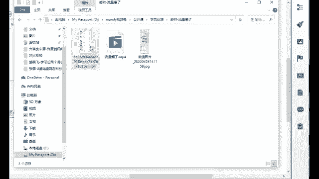
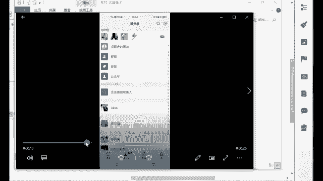
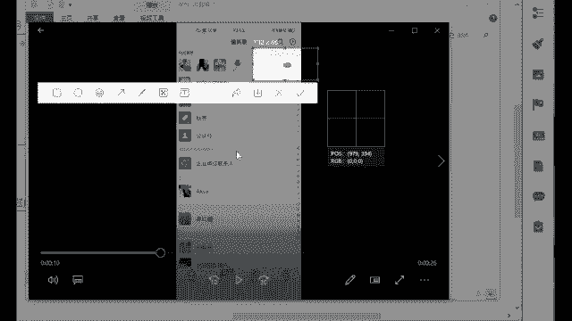
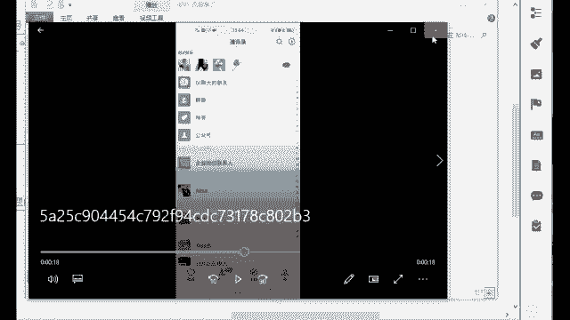

# 【2024版视频号运营教程】全B站最良心的视频号运营高阶教程合集！视频号运营 起号真的不难！ - P14：10.视频号变形模式（一） - 鼓腹含和防护服 - BV1wDWheCEsK

这个是涉及到变现的一些环节了，有哪些方法呢，来做账号的时候，我们除了发作品，还有很多高级玩法，比如说隐私域流量，私域流量就是你自己的好友数量，私域流量就相当于你自己家的一些这个资源嘛。

你自己的一个人脉嘛，这是隐私域流量啊，讲白一点就是让你的微信好友去关注你的账号，那我们隐私域流量我们可以发到哪里去，视频号，他可以发朋友圈，公众号，社群甚至红包封面可以带你的视频号。

如果说别人要领你的这个红包是吧，你可以在群里面去群发嘛，我群发一个红包，我就一分钱一个红包也行啊，他如果说要领，他必须要看完你的视频号，必须要去点进去看，所以说这里就能够给你带来你的私域流量。

那是不是可以把你的微信好友给激活了呀，平时可能不聊天，但是他可以去呃，作为你的粉丝吗，而且视频号这里啊，他有一个机制叫做买一送一模式，呃如果说我们之后去做视频号，然后呢你自己的朋友给你点赞了。

假如说现在你的朋友给你点赞了啊，他是什么机制，就长这个样子，你自己你首先你发完作品之后，你自己给自己点个赞，点完赞之后，你的朋友给你点赞了，他看到了是不是刚刚在那个地方。

你朋友点赞都是能够看到后面有个小星星的啊，那在这里他点完赞之后，如果说你自己的朋友看到了啊，然后大数据它监测到了你的朋友给你点赞了，他再送你一个，这个是他送的，这个是你自己的，这个是他送的好。

那有一个看到之后的话呢，他朋友的朋友是不是又会去点赞呢，点赞之后的话好，那这里的话又进行了一个什么二次传播好，这里的话就是什么进行了一个社交裂变了，这个就叫做买一送一。

也就是说有一个你自己的好友看了你的视频，腾讯爸爸再送你一个，有2000就送2000，有2万就送2万，厉不厉害，这个其实这一步就是他现在微信视频号，做的非常好的一个点。

这就是为什么你的账号一开始可能你会看呃，播放量不是特别高，但是后面只要你的内容是好的，它后面一定能够火起来，因为它需要一个时间的沉淀啊，那这个的话呢，这一步我们是叫做把河流里的水。

灌到你自己家的田地里面去，如果说我们后面做好的话，做成社交裂变，它是什么情况呢，社交裂变来流量报，我的这个邹帅同学给你看一下。

他当时给我发了一个视频，这是他当时就是做账号，你看后面他起来了以后。

他的账号的这个添加好友数量在这点点点是吧。

这场面啊，如果说你之后账号做得好啊，这个都是常态加上来的好友，那都是什么白花花的一些流量啊，那你想一下，如果说你是做微商的，你自己如果说是做微商，或者说你朋友圈会卖你自己家的一些产品诶。

那这个时候他们加上来，是不是有可能会去买你朋友圈的一些产品呢，这就又回到我们原来比较火的一个，什么微商时代了啊，好这个就是叫做社交裂变了。

它的一个背后的一个呃什么播放量就是这样的，所以说这个我们一定要去利用起来，它的一个隐私域流量啊，叫做把河流里面的水，灌到你自己家的田地里面去，把门口家门口的这个水先什么利己嘛。

好或者说我们也可以像其他平台一样，也可以去带货的啊，带货的话呢，比如说直播带货，它是当下最火的一个行业了，当下做的比较好的就短视频嘛，直播带货嘛啊这短视频时代就是现在最赚钱的。

当我们的目的就是为了赚钱啊，那刚开始的时候有流量，你就可以去赚钱，所以开始的重点还是要放在流量上面去，你的饭一口一口吃，路一步一步走，一口吃不成一个大胖子啊，那视频号他直播的优势呢就在于可以直播预告。

这个直播预告的话，它不像抖音快手一样，那我如果说我要看的话，我记得他多少点多少点，我还得去蹲他的直播，但是你像他的话有一个很好的点，就是他明天十点直播，你直接点击一下这个按钮，可以预约一秒预约。

预约好之后，我明天如果说他在开播，我即使我忘了腾讯，他还提醒你呢，直接就发给你呃，这个谁谁谁，你预约的谁谁谁开始直播了，快点进去看，所以说这个界面是非常非常好的啊，这个预约你以后要去直播的话。

你一定要提前去发这个预约直播，发这个直播预告啊，那我的话可以去让我的好友给他滚动起来，我先在社群里面群发一遍，让他们先约一遍，就不会说我直播的时候没有人来看了啊，这个就是他的一个优势所在。

包括知识最小化，知识分享给朋友以及支持设置状态，你的朋友是可以看到你在看谁的直播，那他看到之后他进来直播间了，哎大数据监测到了是吧，有一个又送一个啊，有两个又送两个，这是不是又开始这个就滚动了呀。

这是它的一个背后的一个算法推荐啊，要你了解它背后这个东西，包括付费直播，你看现在部分直播已经开始这个付费模式了，那你之后去做直播，如果说你的内容好，那别人会愿意为了你去买单的。

不管是卖课程还是卖什么其他的一些东西啊，啊包括直接可以带二维码，这个很香啊，你想想你在抖音快手，你去放二维码，你去放个微信的二维码是吧，本身它不是一家公司的，它是字节跳动的，字节跳动。

你去引导腾讯的这个什么流量，你去帮腾讯去赚钱，你觉得人家愿意吗，所以说你这个经常你去抖音去带二维码，你去看一下啊，如果他们有带二维码的，下一秒怎么封的，都不知道账号直播间怎么没的都不知道啊。

这个就是吧谨慎处理啊，那你像现在是明浩，他本身就在自己家，我可以直接放我的二维码啊，那这个东西就是它的一个好处嘛，本身就是它是出生就是含着金钥匙出身的啊，好，那这个是我们现在视频号。

他直播的一个优势所在了，并且呢如果说你现在有看到视频是要直播，你发现刚开始来的话，好像都是这个熟人，都是你自己的好友，但是你注意到吗，你只要坚持去直播，你坚持大概个半个小时啊。

一个小时后面的话来个几百个人，几千个人，几万个人一点都不夸张，他就真的是滚雪球一样滚动起来的，那如果说你发现这一点了，说明诶，你还是能够去了解到它背后的一个逻辑的，而且这个东西如果说他人越来越多了。

说明这个东西他很多人在看了，我们现在去视频号直播，其实就是要去抢相对应的叫做公寓流量，这个就不是私域流量了，私域流量是我们自己的公寓流量，就是属于什么，把大海里的水去灌到你自己家的田地里面去啊。

我们现在就是抢大海里的一些公共的资源了啊，所以说这个直播的话也是什么，你能做起来赶紧做起来啊，好这个东西也是抢公寓流量，直播也可以提前选好货啊，然后在直播间去上架，现在是可以什么直播卖货的。

因为像现在视频号，他官方到处都在搞这个扶持啊，他也就是在5月份，现在就是刚开始开启这个付费直播，你能够看到他的一个重视的吗，那你像现在如果说你能够留住陌生人，你能够成交，后面他会给你扶持，给你送流量券。

那让更多人来你的直播间，唉这就意味着现在他还是个红利期，只要你足够努力达到他的一个标准，这就是什么哗啦啦的免费的流量，这也是为什么就是现在普通人去做这个视频号，是最合适的原因啊，就这么一个情况啊。

如果说你前面直播了很多场，看的人越来越少，说明这个内容他是有一些问题的，嗯直播的内容不够吸引人啊，这个的话嗯，一定要去找准他现在的一个问题所在啊。

