# 【2024版视频号运营教程】全B站最良心的视频号运营高阶教程合集！视频号运营 起号真的不难！ - P15：11.视频号变现模式（二） - 鼓腹含和防护服 - BV1wDWheCEsK

那说到这个就是我们还可以什么，导流到公众号变现，很多公众号不是现在可以去付费嘛，啊如果说你内容比较不错，人家也愿意去买呀，包括知识付费，知识付费就是引流到线下去课程，你你是做这个舞蹈班的是吧。

或者说我去做什么其他的一些类型，这就是知识付费了啊，这是直播引流这一方面啊，还有没有产品卖呃，是没有产品卖是吗，如果说没有产品卖的话，我们是可以去视频带货，也可以直播带货的啊。

直播带货的话就是你可以去开通小商店，小商店怎么开来怎么开。

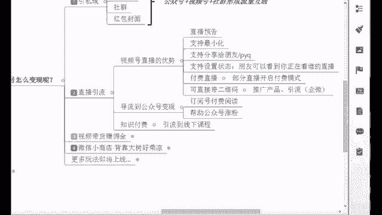

我给你看一下小商店啊，你可以直接打开你的微信，然后在这个上面直接去搜索微信小商店，直接搜索微信小商店。

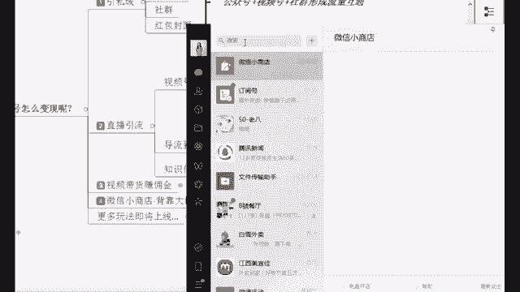

然后呢打开他的公众号，公众号就在这的话下面有一个免费开店。

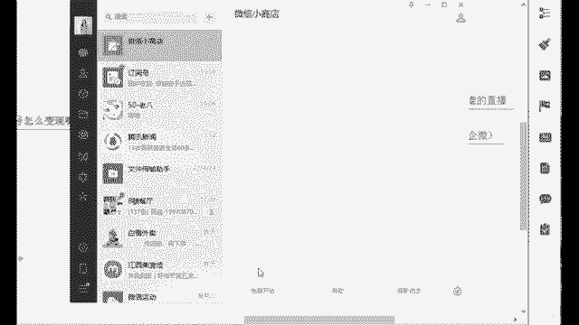

你点击这个免费开店，然后呢快速开店，他直接弹出这个小程序来了啊，那你看这零元入驻快速开店，直播带货，这就是小商店它的一个好处，你不需要花一分钱，这个我一会给你们说一下啊，这个是很香的啊。

包括你进入小商店之后。

你可以去选你要带什么货呀，那你在直播的时候也可以直接去直播带货啊，那我们重点的话还是放在这个什么嗯，直播带货是一方面啊，包括这个视频带货赚佣金啊，这个也很像来它其实就是跟视频带货。

就跟你的抖音看到的是一样的，挂链接就好了，不管你是有货还是没有货，你都可以去做，你像你今天你去发作品，你有播放量，明天你就可以赚钱了，应该还有蛮多人会去各大平台，就你们看短视频的时候。

你觉得这个作品比较好是吧，或者说我感觉这个东西还不错，小东西还不错，我可能会买一下，反正我是经常晚上买一些什么零食啊，买一些好用的一些东西啊，比如说按摩的呀，经常会去买啊，这个可能也不贵嘛。

但是感觉好用啊，就是会去买，所以现在腾讯他也眼红这个东西啊，马化腾他也是个商机，他也想要来分一杯羹，有货源的同学的话呢，你直接去，就是像我刚刚说的，开通微信小商店就好了，微信小商店他跟抖音橱窗相比。

我来说一下它的优势所在啊，他是背靠大树好乘凉，你像小商店，他是多个地方去推销产品，视频号，挂链接，公众号，社群小程序等等，都可以直接开通，直接卖货，不需要任何粉丝。

但是抖音橱窗呢唉他是需要交500块押金的，你的视频要发十条以上，你还要有1000个粉丝，1000个粉丝你才可以去开这个抖音橱窗，但是你相对比的话，微信小商店是不是更加的接地气一点呢。

能不能感觉到这个的话，就是什么人人都能开店嗯，你零基础也能开店，我即使零元我就能开店吗，刚刚有看到吧，给你们看的零元就能开店啊，好那你直接把你的货上架不就好了吗，这个你像现在疫情啊，线下难很难做的啊。

这个就是很好的一个直播卖货的方式，你可以转战线上啊，对不对。

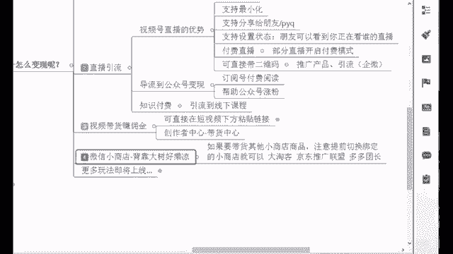

好包括像我给你看一下，我们微信小商店去上架你自己家的产品的话，就在这这个就是上架你自己家的产品，你去点这个新增商品，把你的商品的一个什么图片，或者说文字给它去编辑一下，上架就好了。

图片的话你可以去用一些美工的软件，美工的软件，比如说创客贴，还有什么美图秀秀，其实也行啊，美图秀秀现在也有这个功能啊，包括很多的一些平台啊，包括搞定设计啊，对不对。

这个的话其实都是可以帮你去把这个图做的，更加美观一些的啊，好这个的话。

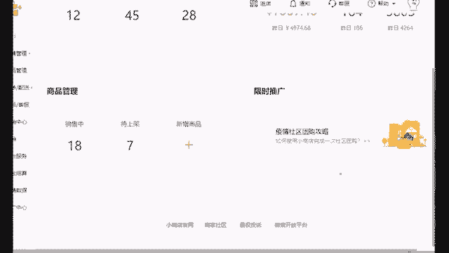

后面你们有需需要，我再给你们去介绍啊，这就是新增商品，可以在这微信小商店代理自己家的货，如果说没有货源，同学老师我没有接触过，我没有货源，我自己手头什么东西都没有是吧，我就是零啊，那没关系啊。

我们可以去也可以去看通小商店啊，开通之后我们可以帮助别人去带货，你去赚取佣金，赚取佣金，什么意思，来，我把我的手机就投屏给你们看一下，我刚刚还记得吗，在我们这个创作者中心里面，在你的账号里面点开之后。

右上角的人头人头点开之后点到创作者中心，在这个地方有一个带货中心啊，就这个地方啊，我们在带货中心里面，这里是不是有个去选品对吧，包括你在之后你去定位你的账号的时候，选品也可以从这里去看。

点进去之后的话呢，唉咱们是可以看到你看食品生鲜的服饰鞋包，各户美妆是不是非常多类型，你看神奇校车大家族，这个完全版售价460，但是呢我卖出一个去，我可以赚36块八毛四，还有这个书售价59块八。

我卖一个我可以赚27块四毛四，他什么带货首选，这个是很好的一个商品对吧，他的佣金率很高，这个小商店啊，包括他的带货中心里面的佣金率，高达50%，这个我跟大家说一下啊，抖音它是25%，30%的样子。

所以你能够感觉到他的一个好处了吗，小商店他的佣金50%高达，对不对，抖音的话才25%，也就是说同样的100块钱的东西，我在抖音去卖，我可以赚赚25块钱，但是我在小商店去卖，我可以赚50块钱。

这就是它的一个好处平台，它需要扶持，就会给到你好处啊，这是他的一个东西啊，好那除此之外的话呢，我们在这你可以去挑一些，你自己想带的一些东西啊，对不对啊，带好之后的话，我们除了这个小商店之外啊。

你也可以去扩展链接，我们去扩展链接，去带别的一些平台的货物，你像现在我刚刚说的阿里巴巴1688，还有呢大逃课是吧，淘宝的大逃课，还有呢京东的叫京东的。

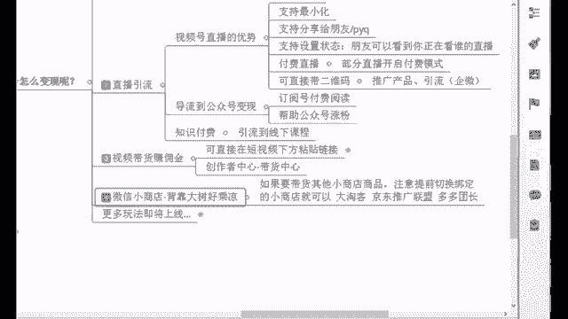

叫做京东联盟，京东推广联盟给你们搜一个吧，比如像拼多多的，拼多多的叫做多多团长，还有呢其他的一些什么电商平台，我给大家展示一个1688啊，1688就是阿里巴巴旗下的那这个什么，它的官网。

全球领先的这个购货采货平台啊。

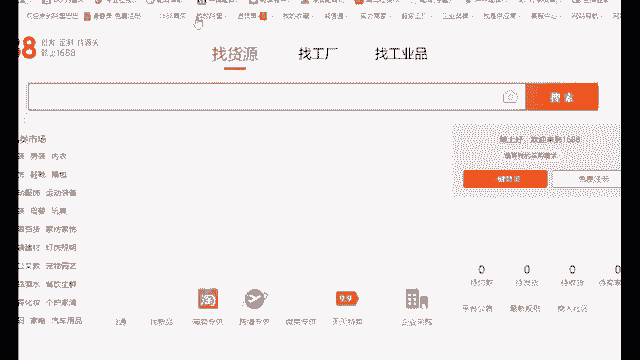

这就是什么相当于批发商啊，我们在这里你去找货源，比如说你要去卖什么母婴的产品，我发一些小朋友的一些账号诶，那我这里可以卖一个母婴的产品，这里你看有一些产品啊，都在这学步车是吧啊。

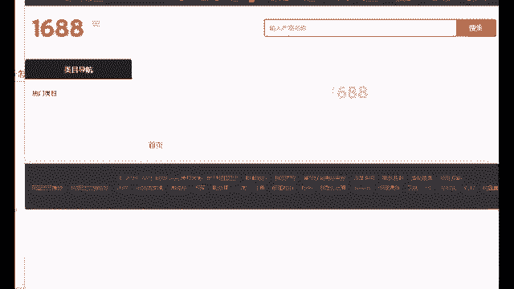

它的一个价格呀，你看155是不是我们可以看，你点进去看啊。

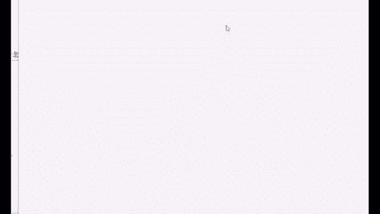

你直接去把这个链接，然后呢，我们在微信里面去打开，一个叫做扩展链接的东西，扩展链接也是小程序啊，你打开扩展链接，把这个链接粘贴粘贴进去，好，这个东西就可以直接在你发视频的这个下方去，直接去带货了。

能理解吧，我给你说一下这个拓展链接，这个也是个小程序，就你直接把对很多人在这里拿货，你把这个链接复制到这个拓展链接里面去，我们就可以直接放在你的视频下方了，就跟你的视频下方可以直接去放公众号的链接。

是一样的，对具体操作的话，如果说不太清楚的话，下去可以去操作一下啊，嗯这个就是我们能够去做的这么一个，什么叫做中间商赚差价好，所以说这个东西是很香的啊，那我给大家来算笔账吧。

其实像我们这个带货中心里面也有，非常已经有非常多了，你如果说这些都不满足，就像我刚刚说的那些平台，你都可以去挑嘛是吧，自己去挑啊，嗯给大家看一个，就像他的一个佣金率是非常非常高的。

比如说我们要找什么服饰鞋包的。

我们要卖衣服，对不对，我假如说我要卖衣服，你看他那个佣金率高的话，有1000多，1447的啊，低的呢有这个几块钱的，几分钱的也有啊，赚160亿的是吧，非常非常多好，那我这里给大家算笔账啊。

假如说我们现在呢就是你在做一个账号对吧，之后我们去做视频哈，正常情况下，我们能够在这个红利期，去获得什么样的一个收入呢，啊我们这种视频带货都是在卖货吗，那假设我们现在卖货的时候。

有100个人看过你的视频，路过你的商店了是吧，你之后带货嘛，你的小商店有100个人路过你的商店，有一个人买了，那你的转化率是多少，1%啊，对1%啊，所以说1÷100嘛，只有一个人买了对吧。

其实剩下99个都没有买，这个就是之一对这个是卖得非常差的情况下，就1%啊，那正常情况下，只要你的作品是垂直的，你是能够去吸引精准客户，一般中等水平的账号，你的视频如果说偶尔就是报一报这个播放量啊，是吧。

或者说你播放量这个平平的那种，哎偶尔就爆一点点的话是吧，平时的这个比较呃平常啊，那你的转化率一般是在5%，6%左右啊，这是它的一个转化率啊，那你想一下，你如果说你的账号越垂直，你做的越好。

那你转化率就越高，一般我们现在做大号啊，做大号里的小商店，转化率都是在十百%分之20，你想想这个是非常高，就100个人里面十几个，20几个会去买你的产品啊，好那假设我现在做了一个账号，我持续输出作品。

有一个作品我报了1万个赞，我也不算高啊，我就算他1万个来一，这是1万个是吧，1万个人路过我的店铺了，结果呢我的转化率我算他1%，我算个非常非常低，那我就算0。01，我算1%好诶，点错了，1万个乘以0。

01好，这里有多少个人会买呢，100个人我卖出了100份产品啊，那假设我的商品佣金我也不算特别高，你看高的有1000多，低的有八块多的，我不算特别高，我也不算特别低，我取一个50哦，我乘以50吧。

好不好，来，我们刚刚是卖了100份产品吧，100×50好，那这里我可以什么有5000块钱的一个收入，这个就是我一个视频报了1万1万个赞之后啊，即使我的转化率在非常低的一个情况下。

我能够有的这么一个收入是吧，这是5000块钱一个视频啊，那我们每天不是最少发两到五个嘛是吧，我一个月如果说我每天发五个，我批量去运营，我每天五个的话，我这里会有150个视频，150个视频。

我报五个行不行，我剩下145个，我都播放量平平，甚至我没有播放量都行啊，我这里我能够有五个视频起来，我有5万个赞是吧，5万个赞的话，这里我们5000，我再乘以个五个视频吧，我一个视频5000。

我如果说五个视频爆了，我一个月这里有多少钱，一个月2万5啊，这个收入你满意吗，这个也就是说你账号做好了之后，你打底的一个收入啊，你们觉得怎么样，所以说其实我们是能够看到他现在的一个什么，就是优势所在的。

我们为什么说经常在呃，就跟大家说啊，我们现在持续的去完善作品啊，优化内容，这个就是为了我们后面去做这个事情，去给他做准备，5000就满意了啊，那你完全可以格局再打开一下啊，5000这个非常轻松。

因为只要你的账号你能够去做，做好，你把你的操作做到位了，这个账号你不起都得起来好，所以说这是他现在一个视频啊，我一个月我一个月，如果说起五个视频是吗，我有五个视频起来了，能够有这么一个收入。

包括像我这之前自己的学员啊。

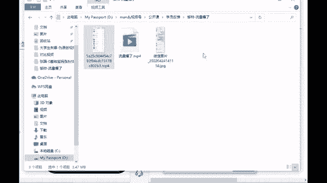

你像他们的话，只要你前面号养的好，我后面随便发几个作品，我账号都能够达到什么情况，我给你看一下这个同学啊，他就是当时在朋友圈发了他的一个账号的情况。

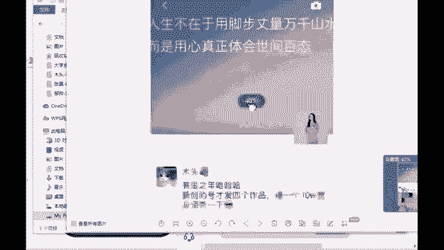

我刚好截下来，你看有生之年新创的号才发四个作品，报一个10万赞。

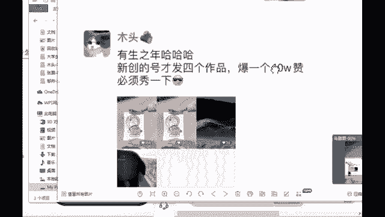

必须秀一下，10万个赞，就这个作品他发完这个视频直接一波回本啊，就这个视频啊，当时的话当时也是呃一点点去指导的好。

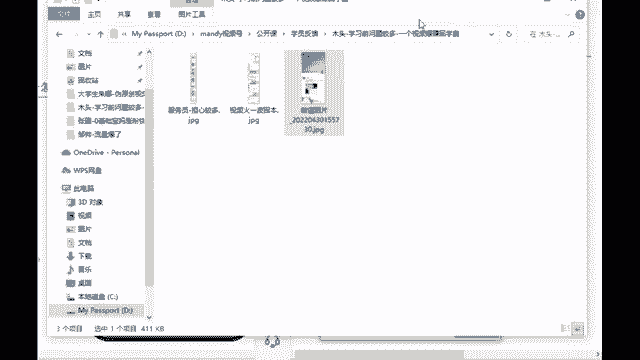

那我给你看一下啊，他当时如果说我们之后是10万赞呢，你再算算啊，再加个零是吧，10万个赞，那我现在再算高一点吧，如果说我的转化率在5%，我也不算10%，20%了，我就算50。05%吧，是不是啊。

我剩余五五千%份，我可以卖5000份产品，那我这里假设我卖的东西不是特别贵，我就乘以什么，比如说我乘这个吧，我算一个什么，算一个T恤吧，就是这个七块一毛一的，是不是我就乘以七块一毛1×7。11，好。

这里我卖5000份，我可以赚这么多，我又把是吧，我还把这个单价给压下去了啊，那你看一下这个是我在一个视频爆了之后，我如果说卖这个东西能够有这么多的收入，所以说其实呃我们后面就像我刚说的。

你持续的去完善你的作品，优化内容，后面的账号滚动起来以后，平台给你的流量是非常稳定的，那你后面流量越来越多，你账号越来越多，那你在跟加一起去做，你跟你老公老婆一起去做是吧，或者说你开工作室，你做举证。

你招人帮你做行不行，好，这就是我们现在他的一个优势所在了，嗯那其实我给大家看一下我之前的一个同学吧。

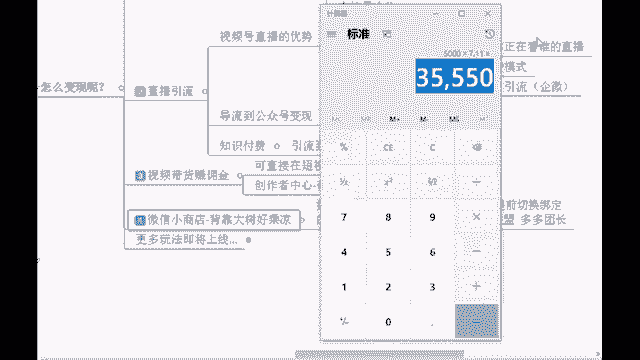

我想起来一个啊，他自己的话，就是当时他也没想到他能够做出这个成绩来啊，像这个胡明飞同学啊，他当时就是看到他朋友在做短视频，然后自己也有想法，但是他朋友是没有做起来的，之前我电话辅导他的时候。

他说我觉得这个互联网非常赚钱，我听说很赚钱，但是我不知道怎么去赚这笔钱，当时他比较迷茫啊。

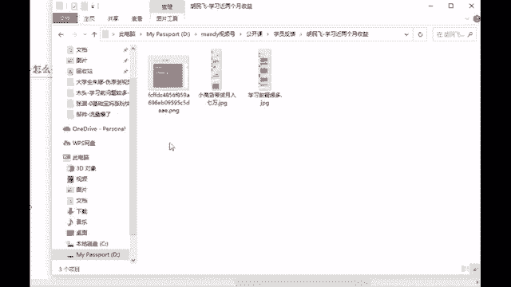

我给大家看一下当时的一个聊天记录，比较早期的嗯，你看飞哥我都叫了飞哥啊，你看看到朋友在搞啊，没搞起来，我从来没有接触过，能学吗啊，我相信很多同学。

应该刚开始都会有这么一个想法啊，但是你看做任何事情都是从0~1的过程，只要你有这个执行力，你愿意去学习，没有什么是学不了的，大家都是两个肩膀扛一个脑袋，为什么别人可以你不可以。

还有就是我当时因为他说他朋友啊，我就问了一嘴，我说你朋友是跟有结果的人在做呢，还是自己在摸索呢，他说自己在摸索吧，但是之前也做过抖音啊，但是你像啊，我当时我就知道什么情况了，我就心里有数了。

你看抖音和视频号对吧，它的玩法是很不一样的，有很多不一样的新的玩法。

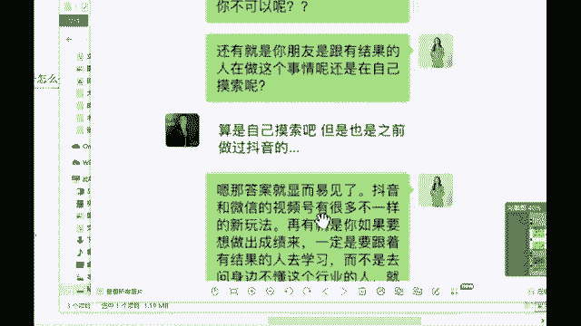

你像他们一个推荐模式都是不一样的，对不对，他注重这个社交属性啊，再有就是你如果说你想要去做出成绩来，一定是要跟着有结果的人去学习，而不是说你去问身边不懂这个行业的人，你就像你要去赚钱，你不可能去马路上。

你去问个乞丐，你去马路上问乞丐，他会告诉你，你问他，你说你你知道怎么赚钱吗，他给你个碗是吧，那你来你跟我一起吧，我也不知道我，我现在我就在做这个是不是好，所以说啊你要去赚钱的话，你肯定是能问马云。

你问马云啊啊你能问这个刘强东，你问刘强东能问这个巴菲特，问巴菲特呀，所以说这个就是你跟对人啊圈子，你所在的圈子它就决定了你发展的一个上限，想一想啊，好所以说这个是他当时的一个情况啊。

后面的话也是跟他说相信相信的力量。

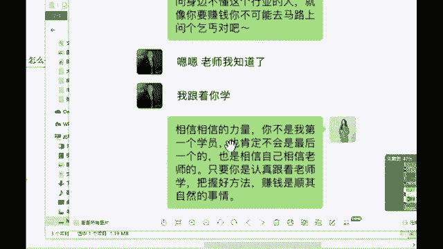

后面的话来我给大家看一下，他达到什么样的一个程度呢，本身他是做物业保安的。

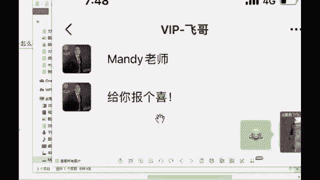

后面他是升了一个物业经理，然后每天就是岗亭啊，催催物业费什么的，平时他就这么一个工作，有一段时间就是疫情比较严重，他那个小区就整个疯掉了，然后就没有他就他就没有出门去工作了啊。

就在家里面研究这个视频号的一个玩法嘛。

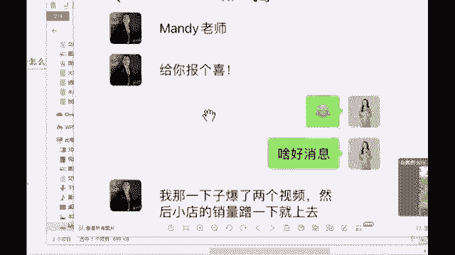

他摸索了一段时间，然后也是没太搞懂啊，后面就让我带了他，他也是没有这个货源。

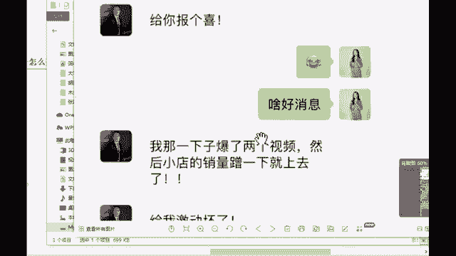

后面你看人家就是方法用对之后，一下子爆了两个视频，然后小店的销量一下子上去了。

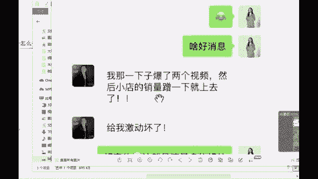

给我激动坏了，这就是流量多的一个好处，它现在平台就是在大量流量扶持。

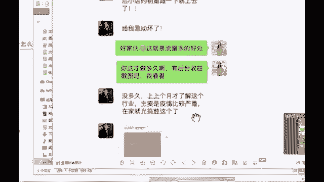

你看上上个月才了解到，他前前后后也就是做了两个月，不到两个月。

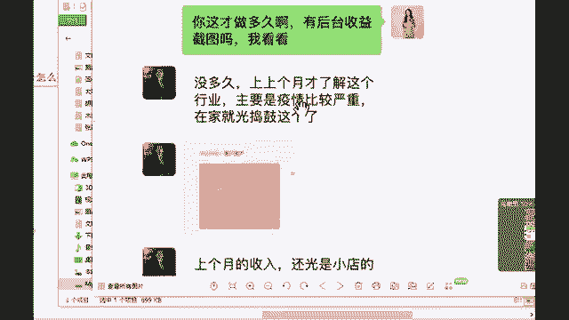

就是疫情比较严重，然后就在家里面捣鼓，上个月的收入还光是小店的看得清吗。

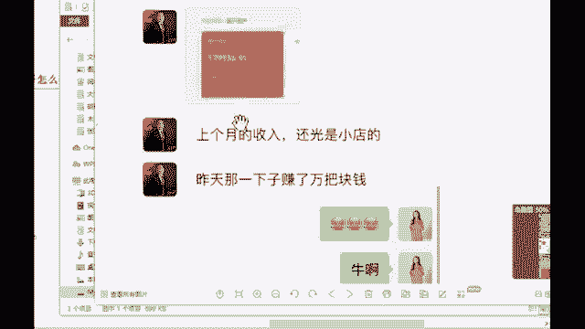

有多少看得清吗，昨天那一下子赚了万把块钱，直播方面也打算多研究了啊。

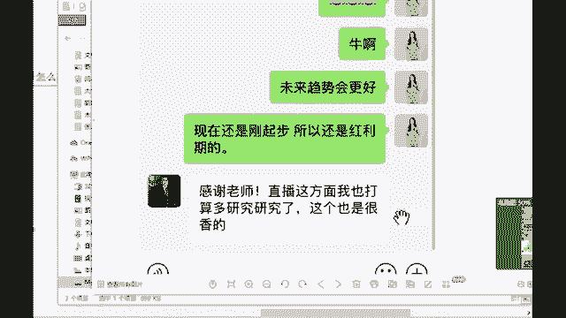

原来他自己他是对这个不感兴趣的，但是你看现在，一旦就是你已经获得一定的这个成果之后。

你是很有成就感的，后面他也打算研究这个直播了。

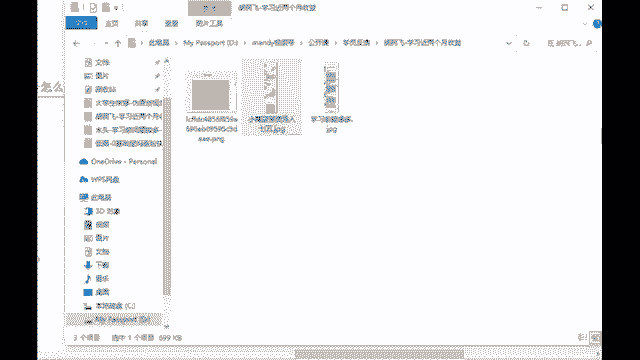

我给你看下当时的一个收入啊，嗯这是他当个月，就是那一个月给他带来的这么一个收入，他那是那个是一下子爆了两个视频，那两个视频的话是给他就是一下子赚了，有万把块钱啊，万把块钱，但是这个整个是他的一个小商店。

一整个月的一个收入，他一整个月的话是7万9，这7万9的话是相当于包括了他那一两个视频，报的，以及前前后后还有报了一些这个，其他的一些视频啊，所以说这个相当于什么，直接给大家带来五位数的收益。

顶他几个月的工资。

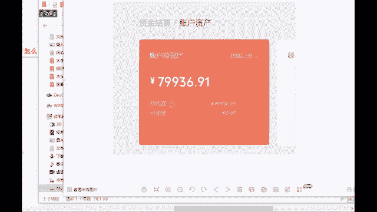

这个真的就顶他几个月的工资啊，所以说这就是马云啊，张一鸣啊，巴菲特这些企业家经常说的选择大于努力，如果说你在平台上你赚不到钱，你不要去怪平台，这是人的问题，技术的问题，你想一下别人都可以，你为什么不行。

差在哪里呢，好好想想这个问题啊，好当然还有什么具体更多的一些玩法啊。

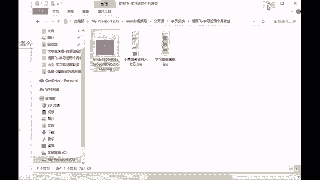

比如说咱们的一些这个啊广告推广啊，CPS带货呀，付费直播间啊，对不对，包括什么小任务啊，帮助创作者赚钱啊等等啊，这个的话其实都是我们更多的一些玩法啊，嗯来这个就是我们视频号变现。

它的非常多的一些优势所在，以及它的一些方式上面。

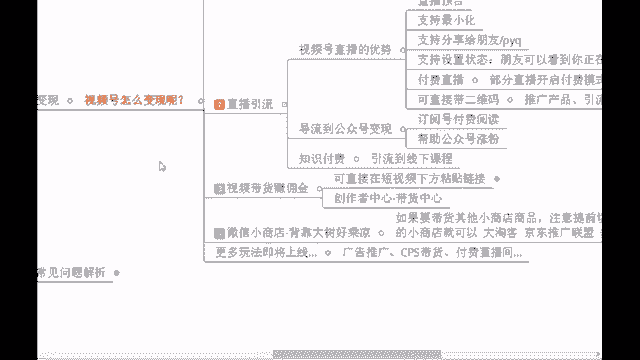