# 【2024版视频号运营教程】全B站最良心的视频号运营高阶教程合集！视频号运营 起号真的不难！ - P17：2.视频号基础功能讲解 - 鼓腹含和防护服 - BV1wDWheCEsK

好各位同学大家好啊，这节课开始给大家录制，2024年最新的视频号带货的教程啊，然后这节课主要讲这个基础篇啊，基础篇的话就是视频号里边这个头像简介啊，这些设置，还有一些功，一些按钮都是什么功能啊。

这个如果那个就是大家自己点开，能研究明白的话，就不需要看这节课啊，但是很多学员他是新手哦，我还是给大家录制一下，其实那个03年的那个课程，跟现在他也大差不差嗯，大同小异，但是本着对大家负责的态度态度。

我还是重新再录一遍啊，然后我们视频号这个进入的端口，就是在朋友圈下边有一个视频号的入口啊，从这点进去，第一位啊，这个是这样的，然后呃这是其中一个微信，另一个是这啊，我给大家看一下。

就是如果你的这个视频号开通了。

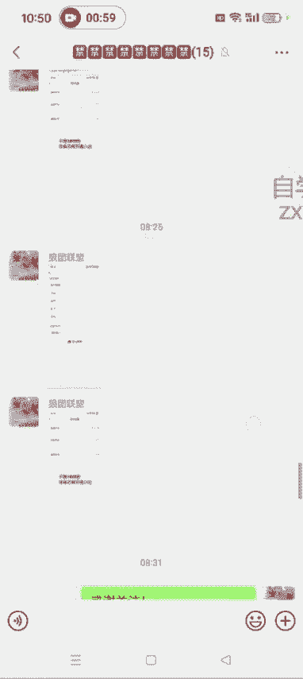

点开之后就是这种样式啊，就这样了。

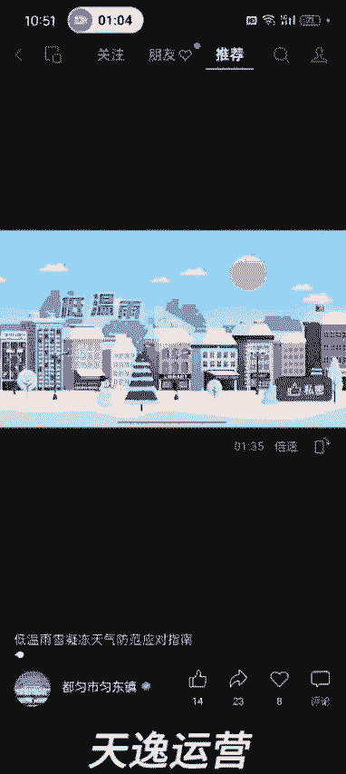

点到这它就这样了，如果你的视频号还没有开通的话，点开之后就这样了，明白了吧，然后你点那个发表视频，然后随便输入一个账号和名字，这个视频号就开通了，很多人视频号还没有开通啊，嗯没有开通，你也可以看。

这个并不影响嗯，这个事大家注意一下啊，然后我们进到这个视频号嗯，点进去之后啊，它就是这样的，然后从这个朋友圈下面这个入口进，如果你的朋友圈下面没有这个视频号的入口，你点开我的，然后点设置。

然后点通用发现页管理。

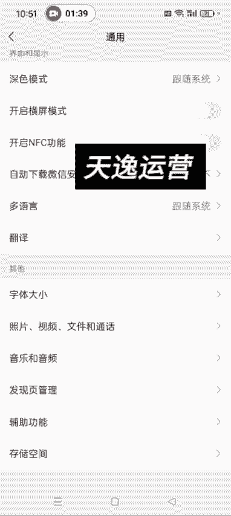

然后视频号从这打开就可以了啊。

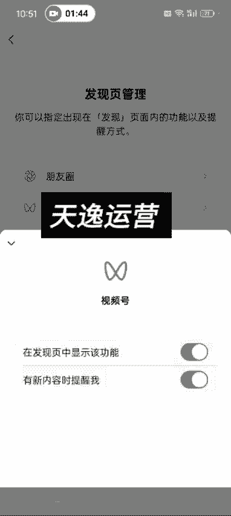

有的可能是没有打开，你看没有，如果我关了的话，就是朋友圈下面他就没有这个视频号的入口了，知道了吧，然后点设置通用发现页管理，然后视频号这然后让它显示出来，这样就可以了，直播这个端口道理是一样的啊。

也是这么去设置，这是你如果朋友圈下面没有视频号的话，就这么去设置，把它找出来。

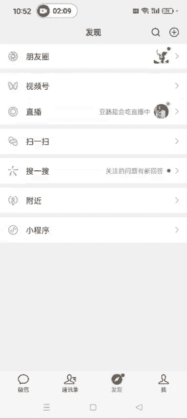

然后我们进到视频号这个页面之后，首先推荐给我们的。

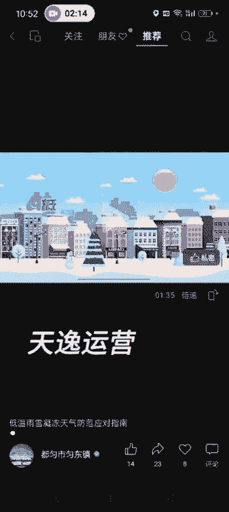

就是就是系统给我们推荐的视频啊，就是你平时喜欢看什么，他就给你会给你推送什么，知道了吧，然后这朋友点赞，朋友点赞的这个视频。

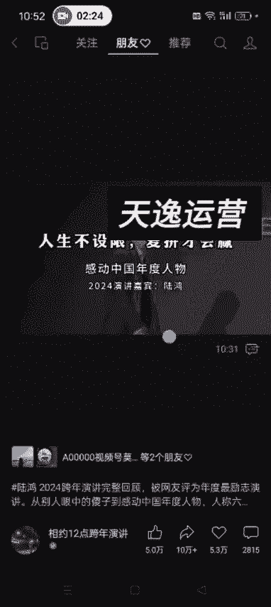

他是什么意思呢，就是说你哪一个朋友点赞过这个视频，他会给你在这推送出来，你买车干嘛，嗯你看就是我这个这几个朋友他们点赞过，就是你的微信好友，微信这个通讯录里边，这个微信好友点赞过的视频。

他会在这儿在这儿给你推送啊，知道了吧，文静谁点赞过某一个作品会在这推送，然后关注这个页面，关注这个页面就是你关注的一些视频号啊，他们发了视频，你可以在这儿去看他们最新发布的这个视频啊，知道了吧。

就是你关注的这些账号，然后这儿有一个放大镜可以搜索，搜索的话，你可以搜索某一个账号，也可以搜索某一个关键词，去找对标账号也可以啊，你比如说教皮皮教做菜，这个我们搜出来之后，你看这账号就是他这个账号是吧。

然后直接搜这个账号的名字，可以在这搜，或者说你搜某一个品的关键词，比如说保鲜膜可以直接输入啊，保鲜膜，然后点搜索，这样的话搜索出来有的人是讲保鲜膜的，有的是那个一些那个账号啊。

就是大家可以直接去里边选看哪一个呃，比如说后期我告诉大家，我们要带某一个品额，这个品的名字叫保鲜膜，你就想找对标账号的话，直接在这去搜就可以了啊，这个大家知道一下就OK了，然后我们点这个头像。

点开这个头像之后，这些额就赞收藏啊，这些是吧，包括关注啊，这个就是你关注的一些视频号消息是吧，这个是私信，就是你给别人发的这个私信什么的啊，然后隐私这隐私，这就是你比如说你点赞的某一个作品。

你不想让你的微信好友看到，你可以在这设置知道了吧，或者说你不想看谁点赞过的作品，你也可以看在这设置，比如说你想不想让谁看你的点赞过的作品啊，就你的好友啊或者亲戚朋友啊是吧，这些你都可以选择。

然后完成就OK了是吧，就是后续你带点赞的话，点赞的这个作品就别人就看不到了，你像我们点开视频号的这个首页之后，这就是朋友点赞过的作品，不是可以推送给我们吗是吧，然后你你在你的视频号设置了之后。

就是你点赞过的作品，你的微信某一个微信好友他是可以，他是看不到的，比如说你自己的视频号发了一个作品，有的时候我们需要自己先点赞一下嘛对吧，然后你不想让谁看到，你就可以在那设置一下啊，这是这个事。

然后我们点开我们自己的这个视频号，首页的话啊，点开首页呃，这个就是你的这个视频号的主页后台啊，然后右上角三个点资料设置这头像名字呃，性别地区简介这些啊就随便写，就直接参考对标账号就OK了。

然后简介怎么写啊，嗯我给大家弄好了一个那个话术，就直接参考这个就行了，视频同款购买方式，点下面的商品橱窗，找到你想要的商品下单即可，或者说你看别人怎么怎么写的，我们就直接模仿就OK了啊，这是那个简介。

这然后你就可以修改额无限次的修改，然后这个名字的话就一年可以修改五次啊，我这个视频号，这个是我发朋友圈用的啊，这个不是我带货的，是带货的账号，这个是我发朋友圈用的。

因为现在视频号那个因为现在发朋友圈的话，他有的时候会折叠嘛，就别人看不到你的朋友圈，它只显示一行字，这个就是被折叠了，所以我会通过视频号的方式去发朋友圈，这样的话他不折叠啊，这个账号就是我我我来演示的。

大家不用看我这个里面的内容，知道了吧，然后这有一个那个视频号的id，看到没，长按可以复制啊，已复制视频号id，这个id的作用是什么呀，就是后续如果呃我们跟商家商量好了，要那个你的这个就是开定向佣金的话。

他会需要用到这个视频号id，就是在这去找啊，长按复制发给对方，他会他那边会操作，然后会给你发一个那个定向佣金的那个邀请，你这边点同意就OK了，这个是视频号的id呃，这个是你的视频号的二维码。

然后隐私与权限这儿，这儿就是在你的这个个人名片展示视频号。

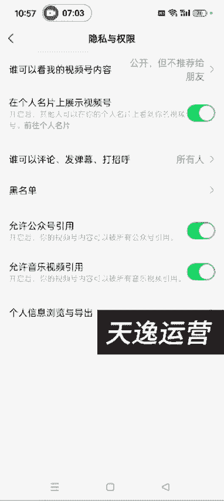

你看我这个它是可以展示出来啊。

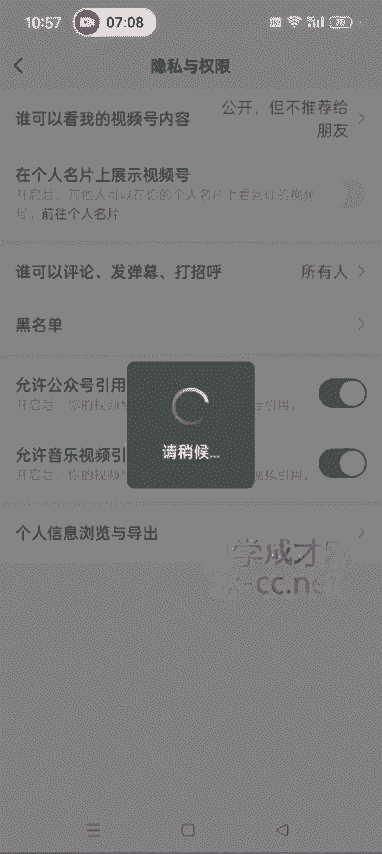

我现在设置的是可以展示出来，这个是我的一个大号，我我让大家看一下，现在是可以看到的，对不对，就是别人点开你的这个就是这个个人名片，这它可以显示出视频号来，如果你发了作品不想让别人看的话。

你可以把这关了啊，可以把这关了，这样的话别人就看不到了，我们再返回再进再点进去，你看现在就看不到了，对不对，呃很多人就是介意啊，很多人是介意，就是说亲戚朋友或者说自己的呃，领导看到自己在做视频号。

所以说你这不想展示的话，可以不展示，另外呃最上边这你可以让他选择公开啊，也可以说公开，但不推荐给朋友，就是说你发的这个作品你不想让谁看到呃，这个跟那个你点赞，刚才上面我们讲的那个就是你点赞过的作品。

那个它它不是一回事啊，就是你的作品你不想让谁看到的话，你可以在这选择，不想让谁看到是吧，哎比如说我随便点几个啊，然后把点完成，这样的话你再发了作品，这几个人是看不到的，明白了吧啊这是这个事。

然后下面这个黑名单啊，这这些啊，这这这些都不用讲了，无所谓啊，就是大家自己点点也也都能呃，那个也都能那个搞清楚是怎么回事，然后这个这边可以那个更换管理员啊，这个可以注销你的视频号，不想用了。

可以注销注销啊，但是注销的话他是需要有条件的，你看我现在他是注销不了的啊，保证金什么的，必须要提现了嗯，视频号解除了你的那个公众号的绑定什么的，这些啊，他才可以注销，到时候你们点开之后。

就按照他这个提示去搞搞就行了，一般现在账号他注销的时间也比较长，然后这儿有一个管理橱窗啊，管理橱窗就是你在后台点进去的话，它是直接显示的，他是直接能进到你的这个橱窗后台的啊，但是如果以，额这个看不到了。

你就随便点一个账号吧，比如说这个账号我们点开它的橱窗的话，你看就可以可以进到他这个橱窗，然后我们就可以下单去买了啊，然后你看他这个带货评分是4。51，然后已售2。4万呃，有很多人问我这个已收2。

4万是什么意思啊，就是说这个账号小海美食日常的橱窗，小海美食日常，他这个账号总的已经卖了2。4万商品了啊，就是所有的这些加起来，不管哪个品，他不是带了挺多品吗，所有的品加起来他一共卖了2。4万。

这个品你看这九块九的这个已售5。9万，这个啊就这个5。9万，这个这是人家这个这个品，一共可能很多达人在卖，他这个品一共卖了5。8万啊，是这么个意思，明白了吧，他跟这这个2。4万不是一回事。

大家需要搞清楚啊，已收2。4万，就是说他这个这个博主，他自己所有的品加起来一共卖了2。4万，照这个5。8万，5。9万，这啊这个是这个品，所有的博主，不管哪个博主，都可能很多博主在带这个品，一共是卖了5。

9万啊，这个需要注意一下，知道了吧，然后我们点开自己的这个视频号啊，点开你的视频号之后，你发了某一个作品是吧。

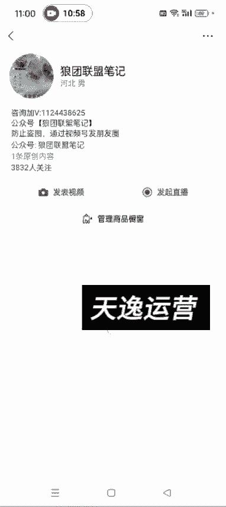

比如说这个作品，然后你想让他置顶，可以置顶，然后呃上热门，这是给自己的这个视频加热，这个是需要花钱的啊，嗯然后你这个评论不想让评别人评论的话，你可以把评论关了，然后仅自己可见。

就是说你这个动态就别人就看不到了，就你只有你自己可见，然后你打开也可以打开啊，然后也可以把它删除了，不想不想要这条视频了，然后可以删除，知道了吧，呃，也可以添加提示，什么就这个这个各种提示啊，这些啊。

呃，可这个这个其实我们一般发的时候是不加的啊，一般一般发的时候是不加的。

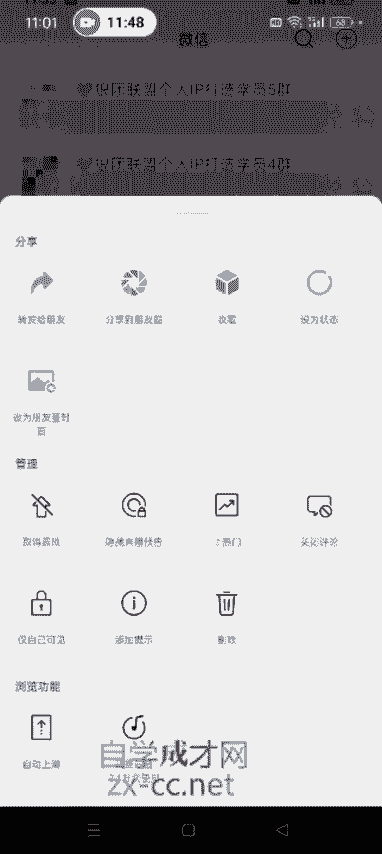

还有我们比如说，评论区我再讲一下这个评论区这个事啊，啊这个有评论，你比如说这个评论区对吧，呃评论区如果我们发了作品上了热门之后，很多人他可能有恶评。

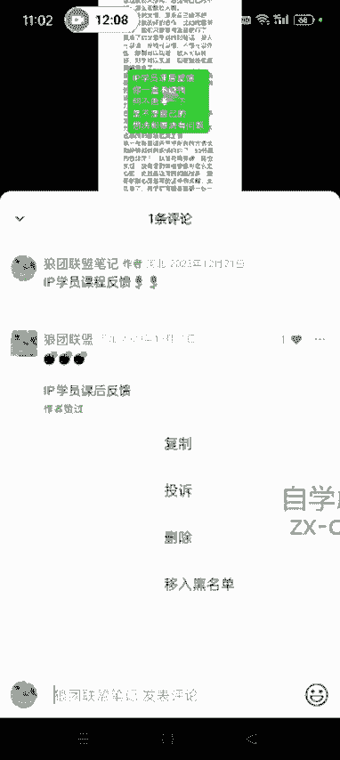

你如果不想让别人看到的话，你可以长按他这条评论啊，然后可以把它这个评论删除。

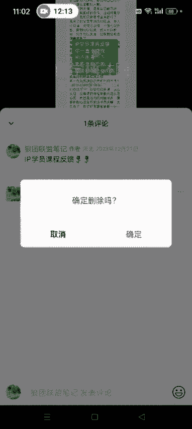

它知道了吧，然后你呃后续我们可能在评论区去引导，这个后面课程里边我会讲啊，就是你比如说你发了引导的这个。

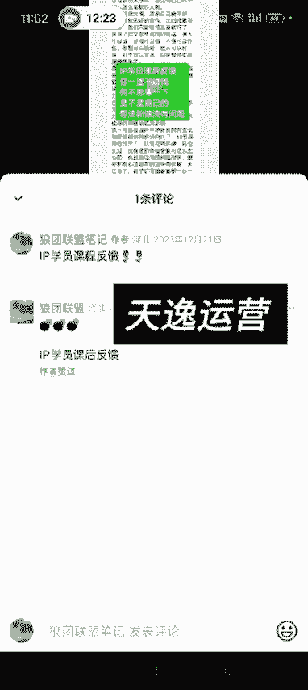

比如说让别人怎么下单的这个这种评论。

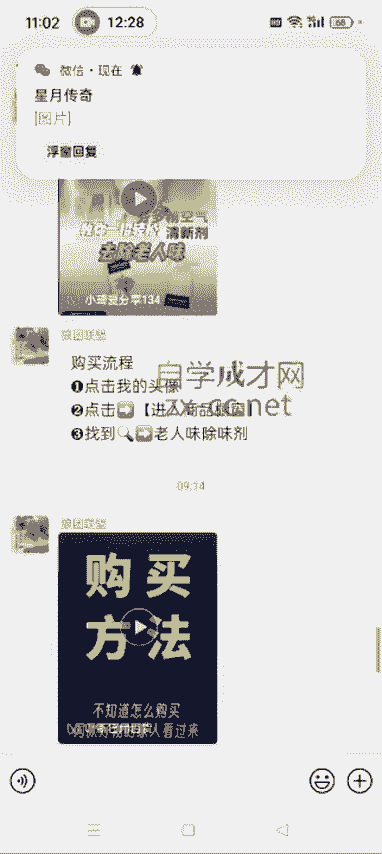

然后发了这种视频的，发了这种呃，这个引导下单的这种那个呃评论的话，额，现在视频号他是他这个评论是没有置顶的，这个功能的啊，评论是没有置顶的功能的，但是我们可以通过点赞的方式点赞越量越高，它是默认置顶的。

你可以找自己的小号或亲戚朋友，帮你把这个视频这个评论顶上去，这种情况就是指的你这个视频上大热门了，然后你可以找人把你这个评论呃点点赞，让他点赞量高一点，然后他就默认显示在评论区嘛。

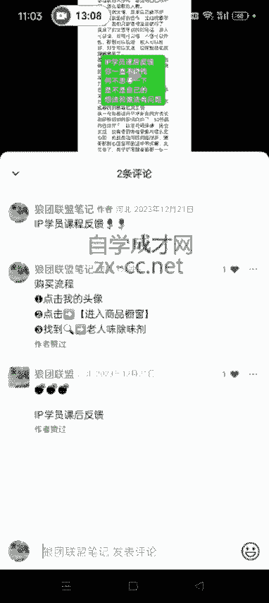

这样的话别人就是一点进来，就知道怎么去下单了，明白了吧，就是这个事啊，然后我们主页讲完了，额这节课录的时间不短了，就先关了吧，然后下次再录下节课再录吧，要不时间太长的话，呃很多人可能看不完。

我就把这个课程分段录出录出来吧。

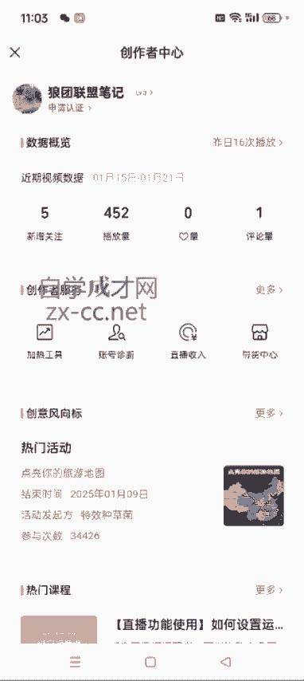