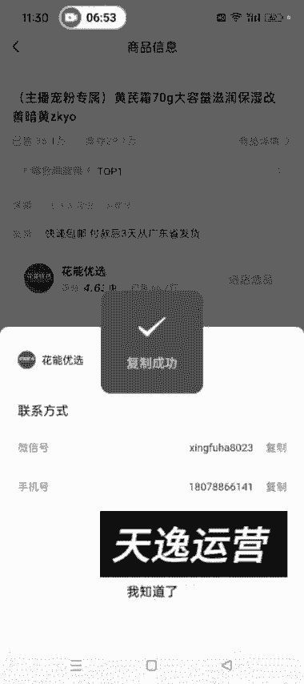

# 【2024版视频号运营教程】全B站最良心的视频号运营高阶教程合集！视频号运营 起号真的不难！ - P18：3.视频号的制作者分成讲解 - 鼓腹含和防护服 - BV1wDWheCEsK

好各位同学大家好啊，这节课呢我开始给大家讲这个视频号，创作创作者中心这个界面啊，然后我们点开创作者中心之后，然后就是首先映入眼帘的就是这个数据概览，这一块，就是我们可以看到自己这个账户的，这个额关注啊。

关注数据粉丝画像和这个播放量什么的啊，嗯然后下面有一个热门课程，这个有兴趣的可以看一下啊，他这个特别特别多，然后这有一个创意风向标，这个我们其实也不需要关注啊，这个我们也不需要关注呃。

重点看一下这个加热工具，这加热工具是什么呀，就类似抖音的那个抖加，他这个加热的话，就是说你给自己的视频付费去推广，他是需要花钱的啊，呃我们一般玩自然流也不需要用，这用到这个加热工具。

但是这个加热工具呢可以额就是帮助我们，就是提示我们，看一下我们自己的账号有没有那个违规啊，这种这种情况啊，呃一般这个有的时候，就是你你点开这个账号诊断，这它是并不准确的啊，账号诊断。

这说说你这个账号正常，如果是正常的话，它就是绿色的啊，看一下这个号嗯，你看账号状态正常，有的时候账号状态正常，但是他你这个视频他是依然不可以加热的啊，这个就说明我们这个账号他已经隐性限流了呃。

如果隐性限流了之后，我们可以去申诉，申诉的话，后面我会教方法啊，但是这个入口我告诉你怎么怎么去找入口，一个是你在这个，他这会让你带申诉或者去申诉这啊，你点点进去，点击此处深处看到了吧。

然后你就可以去申诉了啊，申诉这，然后提交你的这个申诉的内容，和这个证据照片什么的，就是在这个入口去申诉啊，还有一个入口是我们这个视频号私信，这他视频号团队给我们发的，你可以去申诉，看到没是吧。

不管你有什么违规，你就可以在这个地方去申诉，一共是额三个入口啊，今天先讲两个，还有一个入口，就是后面我会详细的给大家讲，那个关于如何申诉这个事啊，这个是申诉，然后我们点开带货中心去看带货中心这儿嗯。

这个数据就是你今天卖了一共卖了多少GMV，然后出了多少单嗯，卖的哪个商品，然后来源这些这都可以看到啊，然后商品橱窗这我这个号啊，这个号是已经交了保证金的，你点开之后它就是这个界面，如果没有交保证金的话。

点开你的那个视频号之后，它是这个界面，点开带货中心之后，他是这个界面，看到没是吧，暂无带货权限，然后我们点一下橱窗，这然后就前往缴纳就可以了，然后点充值缴纳，然后点去认证，选择个人啊，选择个人。

然后传你的身份证正反面呃，这儿这个身份证认证一定是你的这个，你的这个微信号啊，这个微信号实名认证的是谁的身份证和呃，谁的身份信息，你就上传谁的身份证正反面啊，输入名字，身份证号，然后这个身份日期。

然后勾选同意，然后点提交就行了，点完提交之后，大概等个10分钟左右，有的时候可能一两个小时啊，这个时间不等，就是大家再进去呃。

再再再点到这个界面，然后点充值缴纳，你就就不需要这个去认证了。

然后你因为已经已经认证通过了嘛，然后交上100块钱，你这个橱窗就打开了，然后开通之后就是我这个号的这种状态啊，然后我们就可以在里面去添加商品，其中去选品，这可以在点开这去选品，或者说点这去选品啊。

选品的话可以直接加橱窗对吧，然后你想带哪个商品直接加橱窗，或者说你搜啊，比如说保鲜膜，直接去搜就可以出来，然后高佣金啊，热销啊是吧，你就可以去搜出来。

把这些东西搜出来，然后去加橱窗，道理是一样的啊，这需要注意一下，点开去选品，如果能找直接主页，有的话直接去找，或者说这个爆款商品，这啊看哪一个商品卖的好是吧。

食品生鲜啊，他这个分类挺细的，现在宠物绿植这些爆款商品绑，这哎我们就可以直接加，就是如果他这个销量跟佣金什么的，佣金我们一般最少是选择30%以上的啊，选择这种的，你佣金太低的话，带它也没什么意思啊。

这是视频号橱窗如何添加商品，这呃一般是带这个爆款商品榜，或者说你直接在这个额选品中心里面去搜索，你想带的商品即可啊，然后我们添加到橱窗的这些东西，如果你不想带了，然后可以点这个管理，然后移除。

点完移除之后一定要点右上角的完成，看到没有，你点完完成之后，它才可以把它移除成功，如果你不点完成的话，它是移除不了的，知道了吧，点管理，比如说这个啊移除，然后你返回你看他你不点完成，他还是八个。

对不对啊，这是这，然后这个呃，上节课我不是讲了那个视频号的id吗，呃比如说你想带某一个商家的商品的话啊，想带某一个商家的商品，你感觉他这个佣金比较低是吧。

佣金比较低，我们可以联系商家。

你比如说这个对吧，你感觉他佣金低，我们可以在这去联系商家，直接复制他的微信号或者手机号。

到微信里面去添加他，跟他去谈就可以了啊，额如果谈好了，他给你开一个定向佣金，开定向佣金的话，然后我们就在这个合作管理这边去去找就行了，知道了吧，还有带货邀约，这去去找就行了，知道了吧，他给你。

你把id发给他，他会给你开一个定向佣金，然后我们在这边这个带货邀约或合作管理，这去去找如何呃，这个都有提示啊，会给你发通知，明白了吧，然后上面这这个这个带货评分，这个就是你橱窗的评分啊。

这个是这个保证金，点开之后，你交完之后，他就是这种状态，明白了吧，然后你的保证金如果提现的话，直接在这去提现，满足条件之后就可以提现了，哎你就可以提现啊，然后这个佣金这。

佣金这。

佣金证，他有的时候就是会提示又开那个联盟账户嘛，嗯这个号没有显示呃，我们不不需要开那个联盟账户啊，有的时候你们点进去之后，它这个界面会有一个联盟账户，让你去开通，那个你不需要开通联盟账户。

开通的话就是提现要收百扣6%的点嗯，可以可以不不弄啊，可以不弄啊，这是这个界面也没没有什么特别的需要讲的好。

