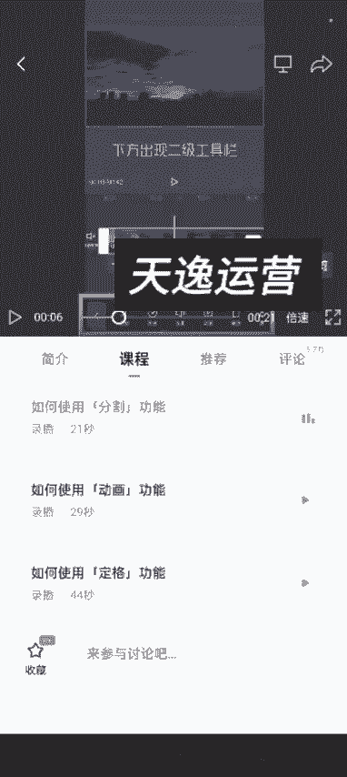
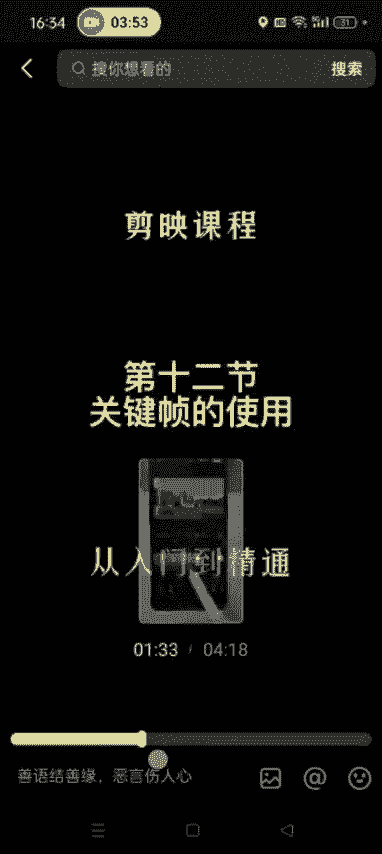

# 【2024版视频号运营教程】全B站最良心的视频号运营高阶教程合集！视频号运营 起号真的不难！ - P21：1.剪映全套教程 - 鼓腹含和防护服 - BV1wDWheCEsK

各位同学大家好啊，这节课给大家讲一下，就是呃如如何去自学剪辑教程呃，关于剪辑的话，其实很多人现在多多少少有一定的基础，因为短视频毕竟普及这么多年了啊，很多人多多少少都有一定的剪辑基础了。

然后如果大家呃从来没有使用过剪映的话，就是不会剪映的话啊，然后你就在那个应用商店下载一个剪映，就是这个呃这个这个学会了，你像必剪啊这些啊，这个跟剪映大同小异，然后用的最多的就是剪映啊。

这个就是抖音官方的一个剪辑软件，功能特别强大，然后大部分功能也都是免费的，而且我们用这个功能的话，基本上也已经够用了啊，不需要开会员，然后剪映的这个基础教程，我这边就是就是简单跟大家说一下。

你如何去自学，然后你打开剪映之后，打开剪映之后，首呃首页最下边有一个创作者课堂，看到没有点开，这然后在这个搜索框里面去搜剪映。

小助手，然后点搜索这儿有一个课程，然后这是用户，然后点用户，第一个就是官方的那个剪映官方的账号啊。

我们关注他，关注剪映官方的账号就可以了，然后他这有模板，有课程，有素材。

然后我们就点开这个课程，有付费的是吧，不需要啊，就只需要学习这个剪映功能大全，和新手常见问题，这个是87节课，这个是十节课，其实他那个虽然是87节课啊，但是他一节课的时间也就是有的几十秒。

有的也就一分钟呃，大概学完这个整套课程的话，也就是两个小时，你就可以从零基础到专业啊，如果自己以前没有剪辑基础的话，一定要把剪映的这个基础功能全部学完，然后再去实操啊。

点开之后进入视频编辑界面后，点击视频下方出现二级工具。

点开之后，你看他这个课程基本上就是二三十秒的。

几十秒的，最长的也就一分多钟啊，然后到这可以加载更多，长的也就是2分钟，两分多，基本上就是一分钟左右的啊，然后把这些课程全部学完就可以了，学完之后你就会如何使用剪映了。

这个是官方的，这个就剪映官方的一个那个账号啊，另外我们可以打开抖音。

然后直接搜剪剪映，全套学习，当你下班路上随手拍了几段，我不管你需不需要五块多钱，家人们，我就跟着这个，大家好，我是妮妮啊，这也可以关注一下这个人的账号啊，他这个视频就比较短。

就妮妮短视频可以复制他的这个抖音号，妮妮6868618，直接在抖音去搜他这个抖音号也可以啊，妮妮6868618去搜这个账号，他这个就相对来说比较短啊，就是基本上全套的都有了，你看第一节，第二节。

第三第四第五第六第七第八第九第十，把这些把这些看完啊，基本上也都不长，你看这个就是4分钟。

他找到呃，而且他讲的也比较细致啊，呃其实抖音上有很多在讲这个剪映的，这个课程啊，就是大家有很多，就是一个视频就能教会你的那种，这节课呢我们来了解一下剪映，告诉你怎么去搜啊，妮妮6868618。

直接搜索用户啊，这个就就能出来啊，搜他这个抖音号就能搜出他来，然后你就是去搜这个零基础学剪辑啊，这些有很多在在讲如何剪辑的这个账号，你只需要看他几个视频，基本上剪映的基础的这些功能，我们就都会用了啊。

嗯这个其实一点都不难，嗯然后看那个官方的那个教程也行，就是检验官方的这个啊，这个也可以把我推荐的这两两节课程看完呃。

然后就基本上就OK了，好吧，我们其实用的基本上也都是这个基础的，一些功能完全够用，好这节课就讲到这啊。

