# 【2024版视频号运营教程】全B站最良心的视频号运营高阶教程合集！视频号运营 起号真的不难！ - P23：5.搬运混剪方法二 - 怡宸WQ - BV1yhpjeKEnc

好，各位同学大家好啊，这节课给大家实操一下我们如何混解。呃，然后我们在做混剪视频之前呢，自己先出去拍一些就是自己的生活日常啊，或者说自拍，或者说家里的小孩啊这些啊。

或者说身边的公园的美景这些最少是混剪一个视频是需要4个你实拍视频的。这个是我们在添加画中画的时候用啊，呃，下面我就开始呃实操啊，我已我已经提前把那个视频。通那个去完水印了。

然后我们第一步要做的就是这个这个视频啊，就是抖音这个视频等下了。这个视频我已经去完水印了啊，在这儿。

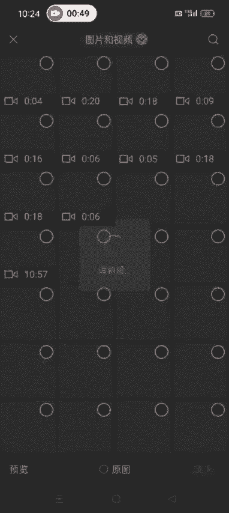

然后我们要做的是什么呀？我们要做的就是。先打开配音神器。然后修改一下这个视频的MD5。选择我们去完水印的这个视频，然后修改MD5，这是第一步啊。

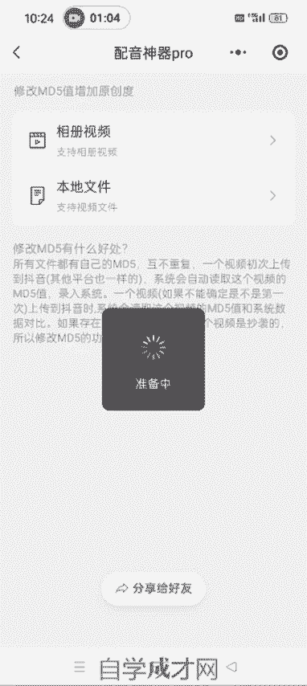

这个一定要修改一下。关于为什么要修改MD5，下面有啊修改MD5的好处，我就不多说了。然后我们打开剪映。把修改完MD5的这个视频导入进去啊这个。选择高清，然后添加。添加进去之后，我们一般的操作是掐头去尾。

就是视频的第一秒去掉它。分割，然后把这删除。最后一秒也去掉他。呃，不到一秒也行啊。撤销。

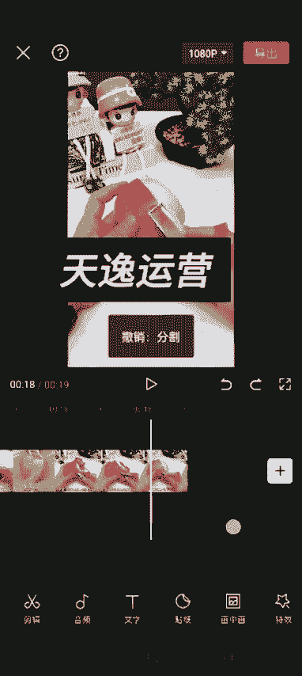

0。5秒也可以啊，掐球去尾。然后我们可以看到第二步就是修改它这个字幕。我们可以看到现在这个视频它是有这个白色的字幕的，对不对？我们有的时候。我们在做混检的时候，尽量的去生成自己的新的字幕。

还有的学员问我说这个他原来的字母怎么可以去掉啊，这个去掉的话也可以也很简单，选中我们这个视频，然后在二级菜单栏找到蒙版。然后点这个矩形蒙板，别的地方不要动啊，就点这个上下的箭头，把它。

这个高度调到跟这个呃视频原字幕差不多的地方，然后拉长。尽量的拉长一点。然后我们往下。还可以在。再低一点。哎，这样就OK了。

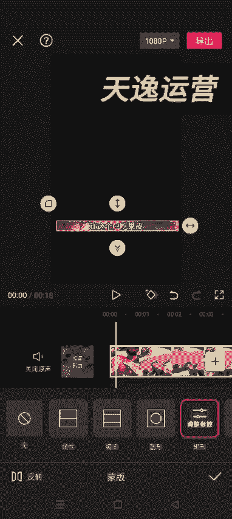

然后到这儿这一步直接点反转。然后点对勾啊，就按照我这个流程去走，不要点别的地方，我们返回找到背景，然后画布模糊，然后点一下。这样的话，他这个原字幕就遮盖住了，对不对？然后我们在。通过这个。

识别字幕的方式生成自己新的字幕。哎，这就O了。我们这个字幕往上调，然后可以调一下颜色。字体的样式啊，颜色都可以调啊啊画字、文字模板，包括动画。动画打字机吧。对勾，然后。颜色的话。用这个颜色吧。

然后点对勾。这就OK了啊。原字母就生成了。然后现在他这个视频是一个女是一个女生，对不对？然后。我们可以重新生成这个新的音频啊。诶。

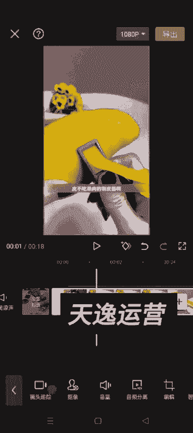

选中视频，然后找到。声音效果。比如说用这个台湾小哥这个。我们第三步啊第三。🎼不吃肉第一步修改MD5，第二步掐头去尾。第三步做新的第字幕。第四步就是修改这个呃视频的音频啊，就是他这个原来是女生。

我们把它比如说改成台湾小歌，或者其他的也是可以啊，就是只要听起来不是怪怪的就行。不吃果肉的削笔气啊不分享给你们，我先这样的话，他这个视频的原声就已经变了，对不对？我们可以通过剪映去变啊，也可以通过那个。

就是配音神器去变声，重新生成新的字幕。比如说我们生成新的字幕之后，它不是有一个视频吧，我们直接添加进去提取它这个视频的声音，这样也是可以的啊。这儿我就不讲了，然后把刚才这儿我就多做了一步。

然后把它删了啊。这样的话，视频变声也已经变了，对不对？我们整体的，然后再调节这个视频的参数。亮度。5、对比度。只要保持在5以内就可以啊，饱和度。左右5以内就可以光感。锐化所有的都给他调一下。哎。

这个有点多。3。点对勾曲线曲线这个可以不动啊，高光。er。Yingying。只要他有的啊，都给他调一下，反正左右5度就可以了。5度以内都行啊。然后这就OK了啊，这个视频这就OK了。

然后调节你感觉不行的话，可以新增调节啊，再调一次也行。知道吧。看到没？它下边又多了一个那个新增的这个调节。可以调节两次或者三次啊都行。我这就就演示一次吧。然后我们还可以调整个的调整一下这个视频的角度。

和镜像。调节完那个参数之之后啊，第六步我们开始调节这个呃。视频的镜像啊。有的视频你镜像完了之后，它那个就感觉跟原来不太一样了，那种的就不要镜像了。像这种的，我们可以镜像就镜像一下，然后点裁剪。

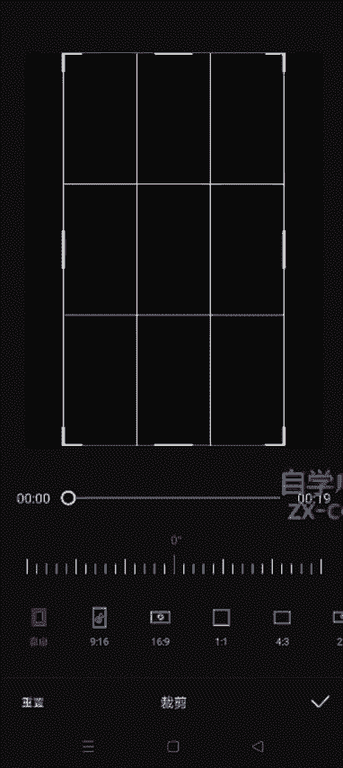

把这个。让它调一度调一度，你看看你原来那个字幕有没有影响，如果有影响的话，就不要调了啊，就撤销那个裁剪就OK了，好吧，然后镜像的话。能调的就基本上基本上我们把原字幕给它遮盖住了，这个视频都可以调镜像啊。

把镜像一定要调一下。然后我们开始添加这个视频的滤镜。滤镜新增滤镜。滤镜的话也可以多加几个啊，也是一样的道理，调到十几。然后继续新增滤镜。用那个免费的就可以了啊。

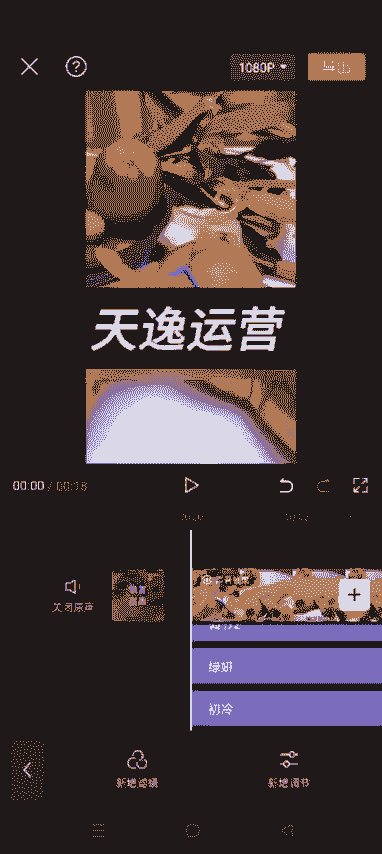

这个是它里边有那个美食的，我们就选择这个美食的就行。它还有很多分类啊。就根据自己的实视频的实际情况去选择就行了。如果这个你调的时候，这些东西它不满的话，一定要把它拉满啊。比如说这个是吧。

我们可以把它拉到跟这个一样的位置。如果正好是满的，就不用调了。这是添加了这个滤镜，然后我们开始添加特效。特效的话有画面特效，有人物特效。人物特效的话就是如果这个视频里面出现了人脸啊。

我们可以用这个人物的特效。如果没有人脸出现的话，就用这个画面特效就OK了啊。

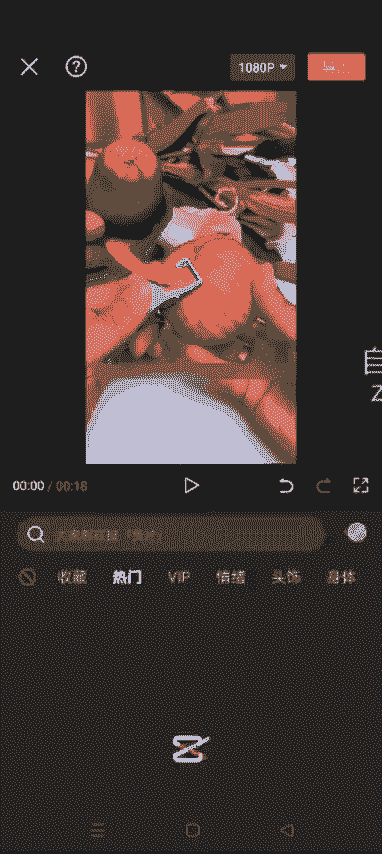

🎼鸡不吃果肉的削皮器啊。然后他这个参数你也可以调节啊。调整参数。不透明度。🎼让它调低一点，速度调一点，不吃果肉的削皮器啊，不分。然后再添加一个特效。🎼我肉的削皮器啊，不分享给你们。

我真怕你们随果也可以直接在他这个特效这儿。🎼调整他这个菜有的削笔器啊，我分享给你们，我真怕你们随。🎼有的时候稍微慢一点，我的削笔气啊不分享给你们，我真怕你们随。然后我们调整这个参数啊。好了。

🎼所有的削皮器啊，我们家的这些的削皮器啊做分享的，不要让它的削皮器啊，我分享给你们，我先怕你们随所有的我们家的这些东西尽量的不要让它影响这个整体视频的这个观感，让它看起来就特别不一样，稍微有一点不一样。

没有关系啊，不要让它特别不一样就没关系。然后我们把加的这些东西把它拉到选中，然后跟这个视频长度保持一致，然后返回这个刚加的这个也是一样的啊。哎，OK了，这是特效添加完了，然后我们开始添加贴纸。

贴纸的话啊呃最少是加4个，加到视频的上下左右。呃，这几个角呃，可以多加7个8个都行啊。こ。Okay。🎼尽量左肉的削皮器啊，不分享尽量选择那种动态的，不是肉的削皮器啊，不分享。大小我们也可以调。

然后把它拉到跟视频一样的长度。

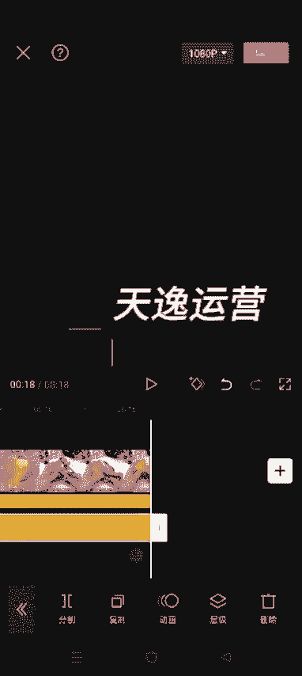

特效可以多呃，这个贴纸可以多加啊，我这儿就是以加4个为例，就给大家演示一下就行了。然后开始添加画中画。画中画就是刚才我说到的，就是我们这个视频里面添加画中画，我们需要提前试拍4个视频啊。

一定要保证是实拍的。

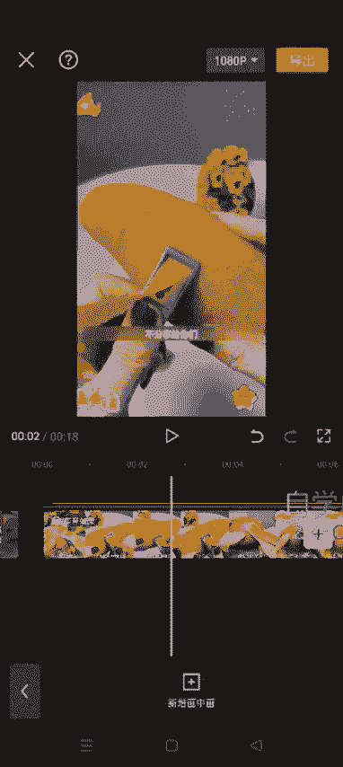

呃，你就出去10分钟可以拍拍出几十个视频出来，基本上就是十几秒的那种就行啊。视频这个我就添加这几个视频吧，这个是我刚才实拍的。你添两进去把它。拖到是。你这个原视频的四个角。盖住就OK了啊。然后我们。

选选中每一个视频，看它这个长度。比如说第一个是吧，长度如果不够长的话，我们通过变速选中它。变速常规变速。如果还不够的话，继续变。长了呢就把它切掉就OK了啊。

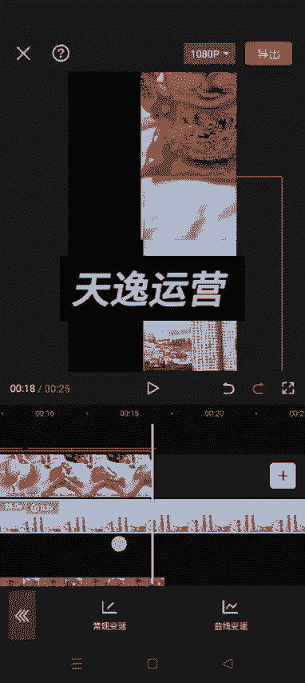

然后把这个视频的音量把它调到一或者2。🎼不要影响你原啊，然后点点这个混合模式，正常把它调到10左右。

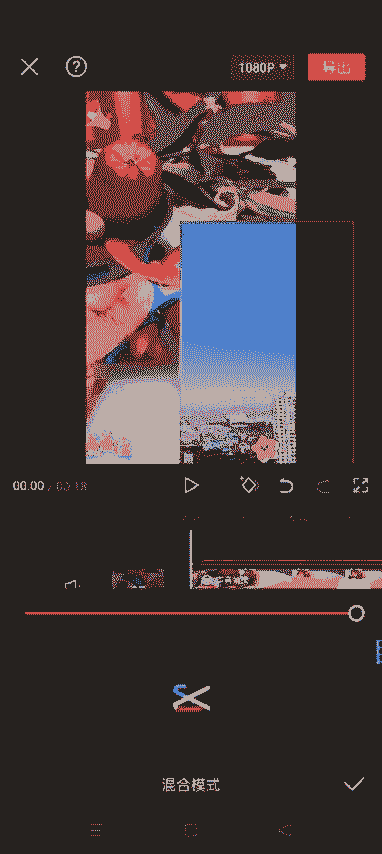

若隐若现的那种感觉啊。然后点对狗。然后开始弄第二个视频。先把它拖到这儿。同样我们调调节它这个变速。因为我这个视频都特别短啊，如果你们那个视频长度可以的话，你就不需要变速啊，直接切它就行了。

我这拍的都比较短，我们变一下速。多的我就把他。Qieu。然后视频的音量啊。🎼调到不吃果肉的削皮气啊，我分享给你。然后我们点这个模式增添叠底。也是让他若隐若现的感觉。然后这个视频。操作方式是一样的啊。

下边这两个视频我们不是添加了4个话乘话吗？方式是一样的。选中他。然后调一下，变一下速。峰割删除。音量调到一或者2。🎼你不吃果肉的削脾气啊，不分享，然后点这个混合模式，绿色。14万。这个音量。

🎼你不吃果肉的削脾气啊。变速。添加的这四个画中画都是一样的啊，操作方式都是一样的。混合模式争片叠底。调低一点吧。🎼你不吃果肉的削皮气。哎，这就OK了啊。🎼皮不吃果肉的消皮气啊，不分享给你们。

我真怕你们水果吃白瞎了。现在无论是老人还是小孩。😊，哎，然后我们做到这一步之后，然后我们开始添加一个动态的logo。有的时候我们看某些视频是吧？他们就是视频上有一个自己动态的那个logo。

这个其实我们自己也可以添加啊。然后比如说呃一般都是写你自己账号的名字，比如说我的名字是狼团联盟笔记，对吧？然后我输入文本。团联盟笔记。然后把它把这个时间轴拉到。拉满。然后我们。选择自己的这个。

把这个颜色啊什么的也都可以调啊。比如说我用白色的吧。你这个颜色吧。然点对勾大小也可以调啊，不要太大。好了，然后。我们选中他。在初始的位置打上一个关键针。然后我们左边滑。划一下，然后开始动。

拖动自己的这个名字，然后再滑继续拖动。Zihua。继续拖动。在华。继续拖动，你怎么拖动都行啊，就是让他意思就是让它动起来，就按照我这个操作方式去拖动就行了。这样的话，我们这个它就可以动起来了。

就随便去拖啊。🎼哎，这个时候我们在看这个记，不吃果肉的削皮器啊，我分享给你们，我真怕你们水果吃白虾了。现在我呃我这个调的它速度可能有点快，你们在调的时候可让它稍微慢一点也没事啊。🎼不论是老人还是小孩。

🎼吃水果的时候，唉，这就OK了。这个视频我们就混剪完成了，就是我做的这几步啊，就是大家可以调整顺序。比如说你呃上来就可以先添加logo，然后再去掐头去尾，这些也可以。这个顺序可以打打乱啊。

不不一定说非得按照我这这个步骤去搞，然后尽量的就是多做几步，我们做混剪的目的就是让它系统识别到我们这个视频跟原视频不一样嘛，对不对？大家把这个底层逻辑要搞清楚啊。然后我们开始导出。

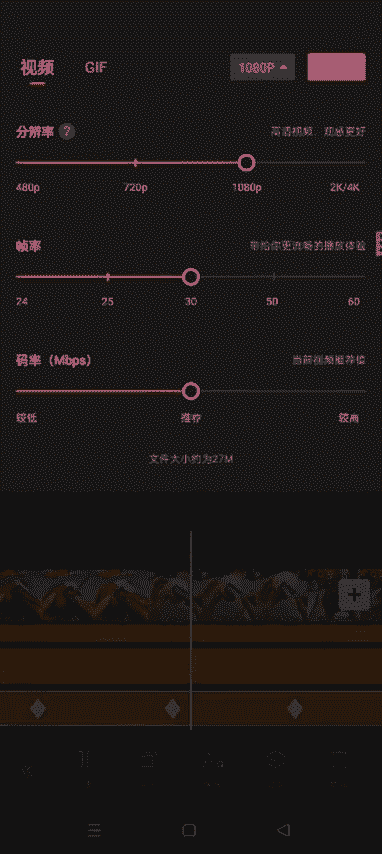

把帧率拉到60，其他的不用变，然后倒出就OK了。

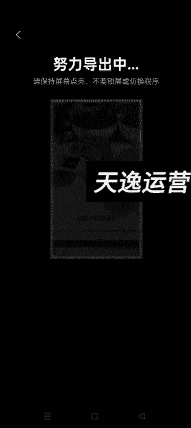

导出之后，然后我们再使用某秒剪，秒检就是视频号官方的一个剪辑工具。用描剪添加一个模板，然后再去发就可以了。我们就等着哈让它导出来。没有秒检的，就直接在那个应用商店去搜秒减就可以了。用搜出来之后直接下载。

然后就是我们做混检，做几步，这节课我会把这个呃每一步的这个步骤啊，就是以图片的形式发到这节课的这个呃评论区。大家到时候去那个看完视频之后，记得去把这个图片保存一下，再看看啊。哎，然后点完成。

这个时候我们打开秒剪。

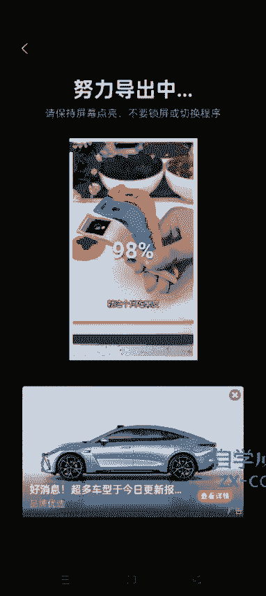

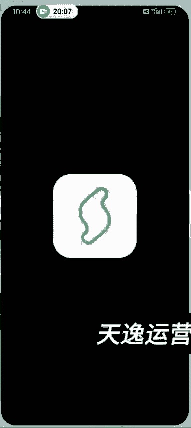

把刚才这个视频导入进去。

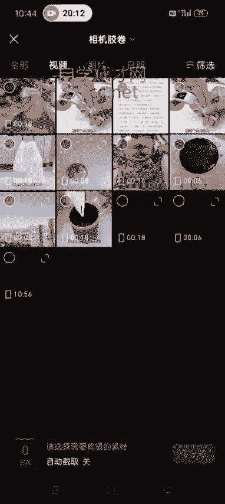

这个是我们刚才做完的这个视频，对吧？然后下一步。🎼不吃果肉的削皮气啊，不分享。🎼然后选择这个模板，用第一个治愈。

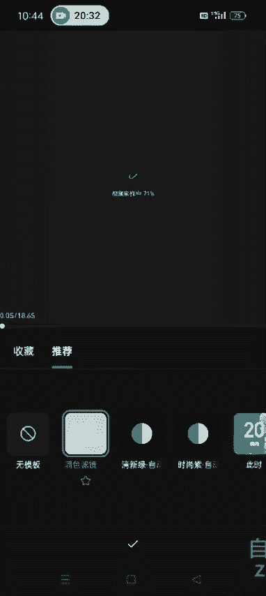

然后你用了它这个模板之后，会有它这个视频的这个音乐啊，把它是这个模板的音乐去掉，我们把自己视频的原声打开。🎼无论是老人还是小孩。嗯，这就OK了啊，然后我们可以在这个里面再添加一一次滤镜和贴纸什么的啊。

再添加一次，还有这个贴纸。呃，你要是会剪映了，他这个这个描剪的话，就自己捣鼓一下，就基本上也都会了啊。他就是这个每一个这个按钮的这个位置不太一样，其他的都差不多啊。

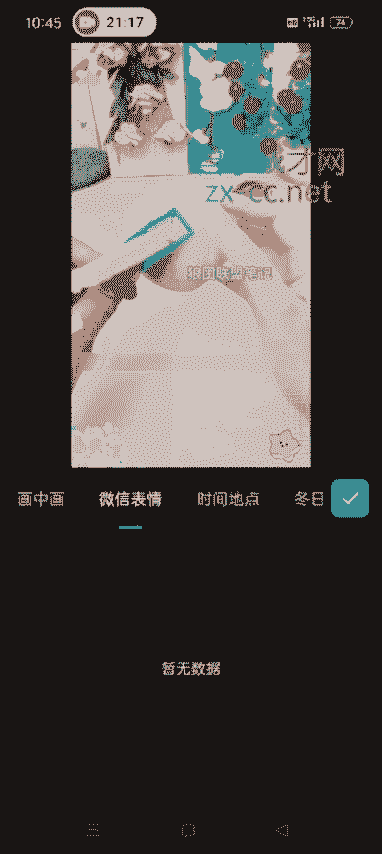

比如说我们加这个。操作方式一样的啊，然后把它拉到底。然后点对勾，然后再能才能加下一个啊。然后点一下制片尾，然后把它画到。箭头。然后继续添加啊。选择视频继续添加贴纸。我就给大家演示一下啊，然后点对勾。

它这个其实不像剪映那个需要。可以一下添加4个，它这个是需要一个一个去添加啊。搞完了之后，然后我们就把这个保存出来去发布就行了。然后就发到自己的视频号。然后秒减的话，它是可以绑定你的微信号的。

你绑定了微信号。然后到这儿，你可以直接点点视频号去发布啊。

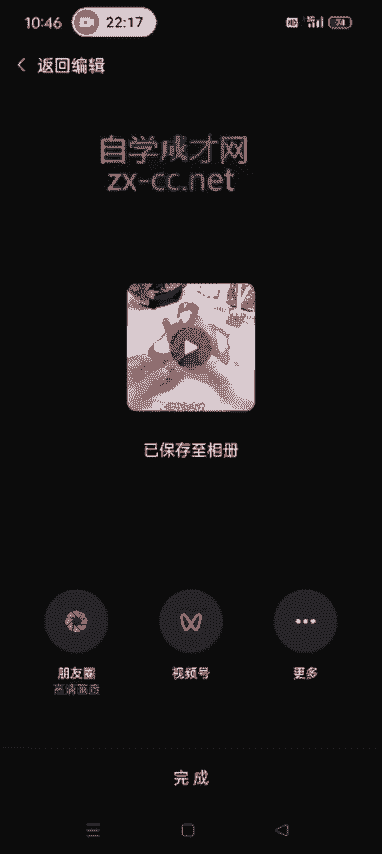

他就直接跳转到那个界面了，你把封面什么的改一下，或者说你到时候直接在这个相册里面啊，相册里面去发也行。

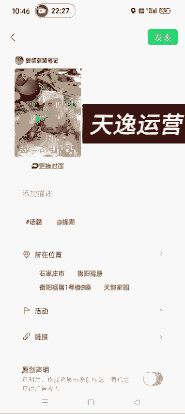

不保存。因为它导出的这个视频，现在已经存到你的相册里面了。你从这个相册里面去发也行。然后我们这个视频啊，就是他你看就是视频号发的一些视频。呃，有的就特别模糊，呃，有好多好多这些特效。

但是它并不影响你有流量啊，就稍微有一点不清楚也行。你要太清楚的话，就跟原视频一样了，那就没有去重的那个意义了嘛。混检的方法就是这么去混检，好吧，嗯，这个不管我们是做哪一类，不管你是做做直播带货也好。

或者说视频带货也好，混检的方法，就按照刚才我教的大家这个方法去混检就行了。好吧，就是我们混剪的视频可能不太一样，但是方法都是一样的啊。好，这节课就讲到这儿啊。

