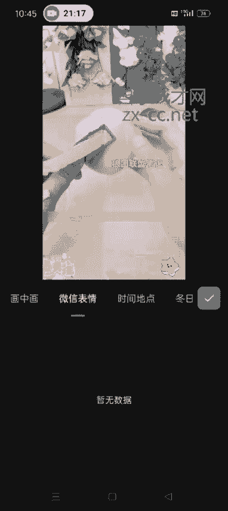

# 【2024版视频号运营教程】全B站最良心的视频号运营高阶教程合集！视频号运营 起号真的不难！ - P25：5.搬运混剪方法二 - 鼓腹含和防护服 - BV1wDWheCEsK

好各位同学大家好啊，这节课给大家实操一下我们如何混剪，呃，然后我们在做混剪视频之前呢，自己先出去拍一些就是自己的生活日常啊，或者说自拍，或者说家里的小孩啊这些啊，或者说身边的公园的美景。

这些最少是混剪一个视频，是需要四个你实拍视频的，这个是我们在添加画中画的时候用啊，呃下面我就开始呃实操啊，我已我已经提前把那个视频通那个去完水印了，然后我们第一步要做的就是这个这个视频啊，就抖音。

这个视频白瞎了，现在这个视频我已经去完水印了啊，在这。

然后我们要做的是什么呀，我们要做的就是先打开配音神器，然后修改一下这个视频的MD5，选择我们去完水印的这个视频，然后修改MD5。

这是第一步啊，这个一定要修改一下，关于为什么要修改MD5，下面有啊，修改MD5的好处我就不多说了，然后我们打开剪映，把修改完MD5的这个视频导入进去啊，这个选择高清，然后添加添加进去之后。

我们一般的操作是掐头去尾，就是视频的第一秒去掉它，分割，然后把这删除，最后一秒也去掉它，额不到一秒也行啊，撤销，0。5秒也可以啊，掐头去尾，然后我们可以看到第二步就是修改它这个字幕。

我们可以看到现在这个视频，他是有这个白色的字幕的，对不对，我们有的时候我们在做混剪的时候，尽量的去生成自己的新的字幕，还有的学员问我说，这个他原来的字母怎么可以去掉啊，这个去掉的话也可以也很简单。

选中我们这个视频，然后在二级菜单栏找到蒙版，然后点这个矩形蒙版，别的地方不要动啊，就点这个上下的箭头，把它这个高度调到跟这个呃，视频原字幕差不多的地方，然后拉长尽量的拉长一点，然后我们往下。

还可以再再低一点，哎这样就OK了。

然后到这这一步直接点反转，然后点对勾啊，就按照我这个流程去走，不要点别的地方，我们返回找到背景，然后画布模糊，然后点一下，这样的话他这个原字幕就遮盖住了，对不对，然后我们再通过这个识别字幕的方式。

生成自己新的字幕，哎这就OK了，我们这个字幕往上调，然后可以调一下颜色，字体的样式啊，颜色都可以调啊，嗯画字文字模板，包括动画，动画打字机吧，卫生有对勾，然后颜色的话，用这个颜色吧，然后点对勾。

这就OK了啊，原字幕就生成了，然后现在他这个视频是一个女，是一个女生，对不对，然后，我们可以重新生成这个新的音频啊，选中视频，然后找到声音效果，比如说用这个台湾小哥，这个，我们第三步啊，第三你不吃狗肉。

第一步修改MD5，第二步掐头去尾，第三步做新的D字幕，第四步就是修改这个呃视频的音频啊，就是她这个原来是女生，我们把她比如说改成台湾小哥，或者其他的也是可以啊，就是只要听起来不是怪怪的就行。

肉皮不吃果肉的削皮器啊，不分享给你们，我真怕这样的话，他这个视频的原声就已经变了，对不对，我们可以通过剪映去变啊，也可以通过那个就是配音神器去变声，重新生成新的字幕，比如说我们生成新的字幕之后。

他不是有一个视频吗，我们直接添加进去提取他这个视频的声音，这样也是可以的啊，这我就不讲了，然后把刚才这我就多做了一步，然后把它删了啊，这样的话视频变声也已经变了，对不对，我们整体的。

然后再调节这个视频的参数，亮度五对比度只要保持在五以内就可以啊，饱和度左右五以内就可以，光感锐化，所有的都给他调一下，哎这个有点多，三点对勾曲线曲线，这个可以不动啊，高光二阴影，只要他有的啊。

都给他调一下，反正左右五度就可以了，五度以内都行啊，然后这就OK了啊，这个视频就OK了，然后调节你感觉不行的话，可以新增调节啊，再调一次也行，知道吧，看到没，他下边又多了一个那个新增的这个调节。

可以调节两次或者三次啊都行，我这就就演示一次吧，然后我们还可以调整个的，调整一下这个视频的角度和镜像，调节完那个参数值之后啊，第六步我们开始调节这个呃，视频的镜像啊，有的视频你镜像完了之后。

他那个就感觉跟原来不太一样了，那种的就不要镜像了，像这种的我们可以镜像就镜像一下，然后点裁剪。

把这个让他调一度，调一度，你看看你原来那个字幕有没有影响，如果有影响的话，就不要调了啊，就撤销那个裁剪就OK了好吧，然后镜像的话能调的就，基本上基本上我们把原字幕给它遮盖住了，这个视频都可以调镜像啊。

把镜像一定要调一下，然后我们开始添加这个视频的滤镜，滤镜新增滤镜滤镜的话也可以多加几个啊，也是一样的道理，调到十几，然后继续新增滤镜，用那个免费的就可以了啊，这个是它里边有那个美食的。

我们就选择这个美食的就行，他还有很多分类啊，就根据自己的实视频的实际情况去选择就行了，如果这个你调的时候，这些东西他不满的话，一定要把他拉满啊，比如说这个是吧，我们可以把他拉到跟这个一样的位置。

如果正好是满的，就不用调了，这是添加了这个滤镜，然后我们开始添加特效，特效的话有画面特效，有人物特效，人物特效的话，就是如果这个视频里面出现了人脸啊，我们可以用这个人物的特效。

如果没有人脸出现的话，就用这个画面特效就OK了啊，你不吃果肉的削皮器啊，然后他这个参数你也可以调节啊，调整参数不透明度，让他调低一点速度调一点，不吃果肉的削皮器啊，不跟，然后再添加一个特效。

烤肉的削皮器啊，不分享给你们，我真怕你们，水果也可以直接在他这个特效这，调整他的消气啊，不分享给你们，我真怕你们随，有的时候稍微慢一点啊，不分享给你们，我真怕你们随，然后我们调整这个参数啊。

所有的脾气啊，我们家的这些的削皮器啊，不分享的，不要让他赢的气啊，不分享给你们，我真怕你们谁所有的我们加的这些东西，尽量的不要让它影响这个整体视频的这个观感，让它看起来就特别不一样，稍微有一点不一样。

没有关系啊，不要让它特别不一样，就没关系，然后我们把加的这些东西把它拉到选中，然后跟这个视频长度保持一致，然后返回这个刚加的这个也是一样的啊，哎OK了，这是特效添加完了，然后我们开始添加贴纸。

贴纸的话啊，额最少是加四个，加到视频的上下左右呃，这几个角呃可以多加七个，八个都行啊，皮皮皮不吃果肉的削皮器啊，不分享，尽量选择那种动态的，不吃果肉的削皮器啊，不分享给大小，我们也可以调。

然后把它拉到跟视频一样的长度，特效可以多呃，这个贴纸可以多加啊，我这就是以加四个为例，就给大家演示一下就行了，然后开始添加画中画，画中画就是刚才我说到的，就是我们这个视频里面添加画中画。

我们需要提前实拍四个视频啊，一定要保证是实拍的嗯，你就出去10分钟可以拍，拍出几十个视频出来，基本上就是十几秒的那种就行啊，视频这个我就添加这几个视频吧，这个是我刚才试拍的，我们添加进去，把它拖到是。

你这个原视频的四个角盖住就OK了啊，然后我们选选中每一个视频，看他这个长度，比如说第一个是吧，长度如果不够长的话，我们通过变速选中它变速，常规变速，如果还不够的话，继续变，长了的就把它切掉就OK了啊。

然后把这个视频的音量把它调到一或者二，不要影响你原视频啊，然后点点这个混合模式。

正常把它调到十左右，若隐若现的那种感觉啊，然后点对勾，然后开始弄第二个视频，先把它拖到这，同样我们调调节它这个变速，因为我这个视频都特别短啊，如果你们那个视频长度可以的话，你就不需要变速啊。

直接切它就行了，我这拍的都比较短，我变一下速多的，我就把它，切掉，然后视频的音量啊，调到不吃果肉的削皮器啊，不分享给你，然后我们点这个模式，正片叠底也是让他若隐若现的感觉，然后这个视频。

操作方式是一样的啊，下边这两个视频我们不是添加了四个画重画吗，方式是一样的，选中它，然后调一下变一下速，分割删除音量调到一或者二，皮不吃果肉的削皮器啊，不分享，然后点这个混合模式，绿色，14吧。

这个音量，皮不吃果肉的削皮器啊，严肃，添加的这四个画中画都是一样的啊，操作方式都是一样的，混合模式，正片叠底，调低一点吧，不吃果肉的削皮器，哎这就OK了啊，调皮不吃果肉的削皮器啊，不分享给你们。

我真怕你们水果吃白瞎了，现在无论是老人还是小孩诶，然后我们做到这一步之后，然后我们开始添加一个动态的logo，有的时候我们看某些视频是吧，他们就是视频上有一个自己动态的那个logo。

这个其实我们自己也可以添加啊，然后比如说额一般都是写你自己账号的名字，比如说我的名字是狼团联盟笔记对吧，然后我输入文本团联盟笔记，然后把它把这个时间轴拉到拉满，然后我们，选择自己的这个。

把这个颜色啊什么的也都可以调啊，比如说我用白色的吧，好用这个颜色吧，然后点对勾，大小也可以调啊，不要太大，好了，然后我们选中它，在初始的位置打上一个关键帧，然后我们左边滑滑一下。

然后开始动拖动自己的这个名字，然后再滑继续拖动，再滑继续拖动，再滑继续拖动，你怎么拖动都行啊，就是让它意思就是让它动起来，就按照我这个操作方式去拖动就行了，这样的话我们这个它就可以动起来了。

就随便去拖啊，哎这个时候我们在看这个题，不吃果肉的削皮器啊，不分享给你们，我真怕你们水果吃白瞎了，现在我呃我这个调的它速度可能有点快，你们在调的时候可让它稍微慢一点，也没事啊。

无论是老人还是小孩吃水果的时候，这就OK了，这个视频我们就混剪完成了，就是我做的这几步啊，就是大家可以调整顺序，比如说你是呃上来就可以先添加logo，然后再去掐头去尾，这些也可以，这个顺序可以打打乱啊。

不不一定说非得按照我这这个步骤去搞，然后尽量的就是多做几步，我们做混检的目的，就是让它系统识别到我们这个视频，跟原视频不一样嘛，对不对，大家把这个底层逻辑要搞清楚啊，然后我们开始导出。

把帧率拉到60，其他的不用变，然后导出就OK了。

导出之后，然后我们再使用模秒剪，秒剪就是视频号官方的一个剪辑工具，用秒剪添加一个模板，然后再去发就可以了，我们就等着哈，让它导出来，没有秒检的，就直接在那个应用商店去搜秒检就可以了啊。

用搜出来之后直接下载。

然后就是我们做混检做几步，这节课我会把这个呃每一步的这个步骤啊，就是以图片的形式发到这节课的这个呃评论区，大家到时候那个看完视频之后，记得去把这个图片保存一下再看看啊，哎然后点完成。

这个时候我们打开秒解。

把刚才这个视频导入进去。

这个是我们刚才做完的这个视频对吧，然后下一步，你不吃果肉的削皮器啊，不分享，然后选择这个模板，用第一个治愈。

Cause for me to lose my life found only time will，然后你用了他这个模板之后，会有他这个视频的这个音乐啊，把他视这个模板的音乐去掉。

我们把自己视频的原声打开，无论是老人还是小孩，哎这就OK了啊，然后我们可以在这个里面再添加一次，一次滤镜和贴纸什么的啊，再添加一次，还有这个贴纸，呃你要是会剪映了，他这个这个描剪的话，就自己捣鼓一下。

就基本上也都会了啊，他就是这个每一个数。

这个按钮的这个位置不太一样，其他的都差不多啊，比如说我们加这个腿操作方式一样的啊，然后把他拉到底，然后点对勾，然后才能才能加下一个啊，然后点一下制片尾，然后把它划到前头，然后继续添加啊，选择视频。

继续添加贴纸，我就给大家演示一下啊，然后点对勾，他这个贴纸不像剪映那个需要，可以一下添加四个，它这个是需要一个一个去添加啊，搞完了之后，然后我们就把这个保存出来去发布就行了，然后就发到自己的视频号。

然后秒剪的话，他是可以绑定你的微信号的，你绑定了微信号，然后到这儿你可以直接点点视频号去发布啊。

他就直接跳转到那个界面了，你把封面什么的改一下，或者说你到时候直接在这个相册里面啊，相册里面去发也行。

不保存，因为它导出的这个视频，现在已经存到你的相册里面了，你从这个相册里面去发也行，然后我们这个视频啊，就是他你看就是视频号发的一些视频嗯，有的就特别模糊呃，有好多好多这些特效。

但是它并不影响你有流量啊，就稍微有一点儿不清楚也行，你要太清楚的话，就跟原视频一样了，那就没有驱虫的那个意义了嘛，混剪的方法就是这么去混剪好吧，呃这个不管我们是做哪一类，不管你是做做直播带货也好。

或者说视频带货也好，混剪的方法，就按照刚才我教的大家这个方法去混剪就行了，好吧，就是我们混剪的视频可能不太一样，但是方法都是一样的啊。

