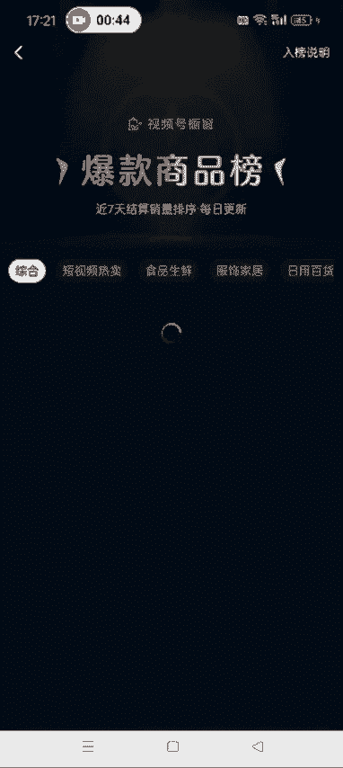

# 【2024版视频号运营教程】全B站最良心的视频号运营高阶教程合集！视频号运营 起号真的不难！ - P28：2.如何发布爆款视频 - 怡宸WQ - BV1yhpjeKEnc

好，各位同学大家好啊。这节课给大家讲一下，就是我们做纯视频带货的这种呃我们这个视频从哪找，然后发哪种视频以及带哪哪一种品啊。

另一个知识点就是给大家讲一下我们呃如何把这个就是我们我们找的那个原创的素材加到我们这个视频里面去啊。然后呃现在这个视频号的这个创作者中心啊。视频号创作者中心。大货中心。去选片。

然后选品中心这儿有一个爆款商品榜啊，现在这个商爆款商品榜，它这个分类比较细。你像这个短视频热卖、食品生鲜、福饰家居、日用百货、图书啊是吧，绿植这些都有啊。现在这个视频号的选品中心已经非常全面了。

然后我们做纯视频带货的这种学员呢呃。

跟品的话，我们就直接这儿有一个短视频热卖，看到没有？点开这个短视频热卖里面有几百个商品，这种呢就是通过视频呃带货，纯视频带货出的呃比较好出的这种这种品啊，然后我们就直接跟着带就行了。

你像它这里面有这个呃厨房用的吃的呀，喝的呀，呃，你像这个纸啊这种的对不？还有这个书籍什么的都有啊，牙膏。反正涵盖了这个方方面面啊，基本上都有。所以说我们就把这个账号做成这个呃。

就是反正你就发各种品都行啊，也不必说非得发一种。就是你这个视频里面我们就直接跟这个品，比如说今天发这两两款商品，然后明天发这两款商品。然后重要的是你把这个视频找好红剪好，然后呃发到视频号就可以了。

明白了吧？然后我们应该怎么做呢？就是比如说你打算带第一个，对吧？一个品点开之后，它这个品里面下面有这个相关视频。这种视频呢就是视频号里面呃卖这个货卖的比较好的这种账号啊。然后它有的品里面有相关视频。

有的品里面没有啊。你像这种的都有。那下面这种它可能就没有了。有的话我们就参考一下，没有的话也也就你就不用参考了啊。我们以第一个品为例。我们应该怎么做呢？这个逻辑就是先打开爆款商品榜。

然后确定你要带的这个品，然后到抖音去找相关的视频，见过图。抖音找相关视频，直接搜这个关键词就可以了啊。搜了关键词之后点视频，然后这儿有一个漏斗的装置，点一下。

点一天之内发布的啊点一天之内发布的就是这个选项一定要选择一下啊，点一天之内发布的。为什么要选一天之内发布的呢？因为这种视频它可能呃博主刚发布啊，然后这个被这个被搬运的次数还比较少。我们发这种。

这样的话我们再经过混检这个原创度就非常高啊，就不太容易被这个平台识别到我们搬运，你要是搬那些点单量最高的那种是吧？点单量最高的那种，他可能很多人都搬过了。后期的话，你无论怎么剪，他都可能被平台搬搬运。

所以我们在选择的时候就选择一天之内的这种啊，然后找到适合浪漫没找到适合的这个视频。然后我们去水印。下载下来就OK了啊。你看他这个视频也是带的这个椒盐粉，对不对？我们就直接搜这个品的名字。

在抖音去搜相关的视频就OK了。我这边已经提前把这个视频搞好了啊，我这边就呃不演示了。然后大家知道怎么做。第一步就是在抖音去找视频了啊。

然后下一步到打开拼多多也是啊到这个评论区去找买家秀的这个相关的视频啊。到评论区找买家秀的相关的这个视频，把这个视频下载下来。呃，实在不行，图片也行啊。就最好是找这个相关的视频啊，把这个视频下载下来。

方法的话，我这儿也不讲了啊，上节课已经讲了，不会的去看上节课的那个操作。然后我们找的这个视频呢，就是一定是像这种的。🎼最喜欢。最好不要找这种的，看到没？他这个是侧着的，然后你到时候你你混检的时候。

你还得调啊，它这个买家秀里边视频太多了。而且你像拼多多卖的，你像他这一个品是吧，咱就看他这一个品，你看多少家卖的呀，对不对？所以说买家秀的这个原创视频我们一点都不缺啊。嗯，大家尽量到拼多多去找。

这样就直接下载，能直接下载下来。等那个下载下来之后，然后我们打开剪映，把提前去完水印的那个视频添加进去啊，这个是我提前弄好的，我这就直接添加了啊。你看他这个视频。里面有这个相关的这个品。🎼调味放入。

对吧。然后我们把这个视频放大一点。嗯，大家记得啊，就是这个视频你切了几秒。切下来几秒啊，就是我们把这个原创素频呃原创的这个素材加进，再加进去几秒。比如说他这个视频。我们从25秒这开始切吧。分割，然后。

而7秒这结束。把这删掉。然后我们加这个原创的素材进去啊。是。嗯，这个是那个。然后这是这个那个原创的素材，我们切了两秒，对不对？然后我们加进去2秒，在两秒这分割。多余的删除。

这个是我我用的这个视频的开头这两秒啊。是吧然后中间还可以加个转场啊，这些啊可以加转场。视频的转场。幻灯片对吧？这行，可以加一下啊。🎼有手道也，瞧瞧。🎼煎至八面金黄调。

然后记得把这个视频加进去的这个视频的原声给它去掉啊。走。啊，忘了说一点啊，就是我们这个视频，你开始切割之前，一定要先把这个音频分离一下啊，先把这个音频分离一下，要不然你。

要不然到时候这个视频你看他这就就相当于就多了一点嘛，我把这删了吧。对不是音频分离。先把音频分离了之后，然后再去加啊。连到一块儿。这个时候我们再在这儿去加视频，切几秒加几秒啊。哎，加错了。原声去掉。

🎼蒜香椒盐粉吃过很多家。啊，这就OK了，好吧，然后后面再出现这个品的位置，我们继续切割。如果不出现的话，我们也可以加一加一点啊。在不影响这个原视频的情况下，也可以加一点。你切几秒就加几秒就行了，好吧。

峰哥。然我删除。哦，删除。如果那个操作错了，可以点撤销啊，然后继续加这个视频。刚才我用的视频前两秒，这儿我就用这个视频的后两秒。峰哥，然后把前面这些删除。🎼哦没有锅中油热下入土豆，中小火慢煎。

煎至8面金黄，蒜香椒盐粉，吃过很多家，还是他家的味道好，平时还可以做椒盐虾椒盐花菜都非常好吃入味。现在9。96袋还包邮到家，最后撒上韭菜段和洋葱丝大。这个视频的原声忘了去掉。大家一定要记得啊。

最后上你在像我这样操作的时候啊，这样就OK了。然后把这个视频呃，剩下的就该怎么混剪，就按照我混剪的那个教程去做混剪，最后然后再导出就OK了啊。嗯，拉到60帧，最后再导出，我这就不导出了。嗯，大家记得啊。

做这个视频的时候一定要怎么样啊，就是啊我刚才第一步操作错了。第一步就是先选中视频，把这个音频分离啊，先把音频分离出来，然后再去切割加你的原创素材啊。这个大家注意一下，我这就不重新录视频了。

就跟大家说一下。然后把这个视频导出来之后，我们就可以带视频号去发布了。发布的时候呢呃就是我们这个想到很多还可以这样做。

文案话题标签这个井号后面这个就是话题标签，文案话题标签直接复制原视频的过去。就可以了，然后放到视频号的这个发布的那个界面啊，好吧，嗯，然后记得发布的时候，不要勾选原创。其他的该怎么操作就怎么操作。

他这个文案怎么写，我们就直接用他这个文案，然后话题标签写加的是什么，我们就加什么，好吧，然后再发布就OK了啊。好，这节课就讲到这儿啊。

