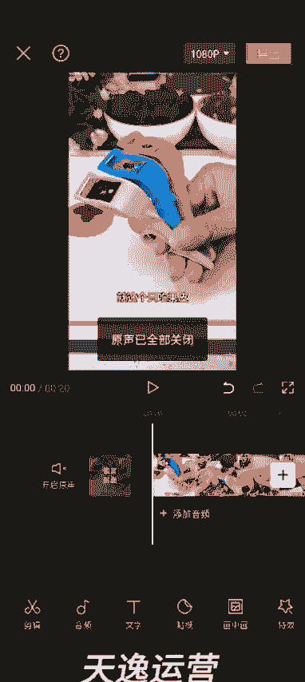

# 【2024版视频号运营教程】全B站最良心的视频号运营高阶教程合集！视频号运营 起号真的不难！ - P28：8.短视频变声，配音的两种方法 - 鼓腹含和防护服 - BV1wDWheCEsK

好各位同学大家好，这节课我给大家讲一下，就是我们呃在混剪视频的时候，如何给这个视频的声音去做驱虫啊，两种方式，一种方式是直接在剪映里面实现，第二种方式是用配音神神器重新生成新的配音，我先讲第一种啊。

就是我们今天上午做的这个视频，20秒的这个啊，然后高清添加进去，就这个只吃果皮不吃，然后他这个视频的原声是一个女生，对不对，然后我们选中这个视频左边滑动，找到声音效果，直接在剪映里面。

可以给他这个声音做一下变声啊，这个是圣诞老人的，这个是台湾小哥，就这个只吃果皮不吃果肉的削皮器啊，不分呃很多种选项啊，就是免费的完全够我们用，比如说这个男生的小狗只吃果皮，然后像这个男生的这种。

他还可以调节参数，做这个只吃果皮，不吃狗肉的消毒剂啊。

这样的话也可以做到这个声音的驱虫啊，嗯大家在做混剪的时候尽量都做一下，呃，这是一种方式，这种方式呢就是他这个声音变了，但是他这个视频的背景音乐是没有变的啊，还有一种方式，就是我们通把这个视频，通过呃。

配音神器去把他这个视频的文案提取出来，相册里边找到我们做的那个视频，这个20秒的这个，然后把文案提取出来，重新用配音神器去生成新的配音啊，然后这个文案文案的话，我建议大家简单的修改一下啊。

这样修改一下文案，就是他说的这些话，也可以做到这个驱虫的效果啊，呃修改文案的话，就是尽量的不要让它多字或者少字，你要是额多的话，多一个半个的也没事啊，尽量的不要多，你比如说里面这个老人，你给他换成大人。

然后就按照我说的这个逻辑啊去改就行了，大人给小孩啃皮的时候，我们还不放心，怎么办呢，怎么办呢，咋办呢是吧，改成咋办呢，不知道是谁研究了去皮器，直接把它放在水果上面转几圈，水果皮就下来了。

呃大概的话就是嗯水果皮就削，了啊就是大概就按照我这个逻辑去改就行了，改好了之后，我们把这个文案复制，重新用这个配音神器去生成新的配音就OK了啊，制作配音，然后把它粘贴进去，然后选择一个你喜欢的声音。

比如说我选择一个男生对吧，然后合成配音，就这个只吃果皮不吃果肉的小脾气啊，不分享给你们，然后导出配音，下载配音，保存。

哎这个时候我们打开剪映点开始创作，找到这个原来的这个视频高清添加进去，这个时候把原声关掉，然后添加音频提取音乐。

就是用我们刚才这个就可以了啊，就这个只吃果皮，不吃果肉的削皮鞋啊，不为哎，这样的话，他这个呃，原来视频的这个背景音乐什么的也都变了啊，这个时候我们可以添加自己的音乐进行。

我们都，然后这个音乐声音你可以给它调小一点，就这个只吃果皮，不吃果肉的小脾气啊，不分享给你们，我真怕你们水果吃白瞎啊，明白了吧，这个时候然后我们再可以把这个嗯，这让他识别出这个文案来啊。

再按照我们之前教的那个混剪的方法去搞，就可以了啊，好吧好，这节课就讲到这儿啊。