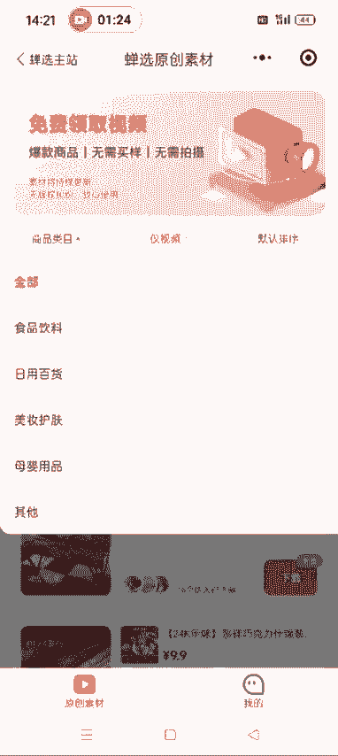
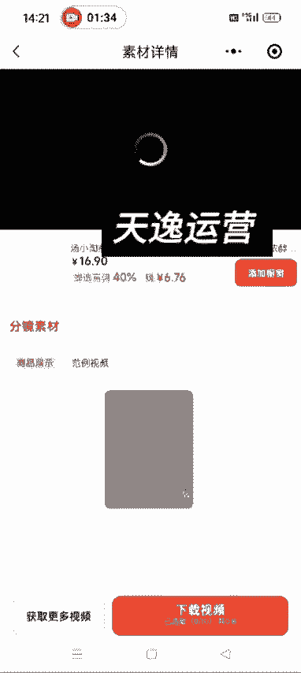
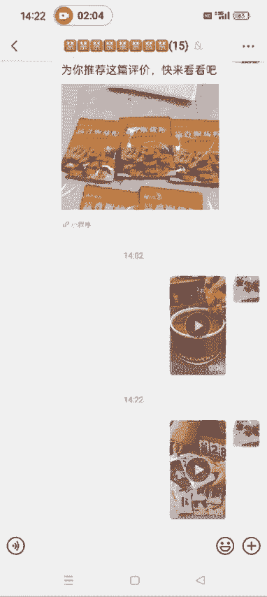
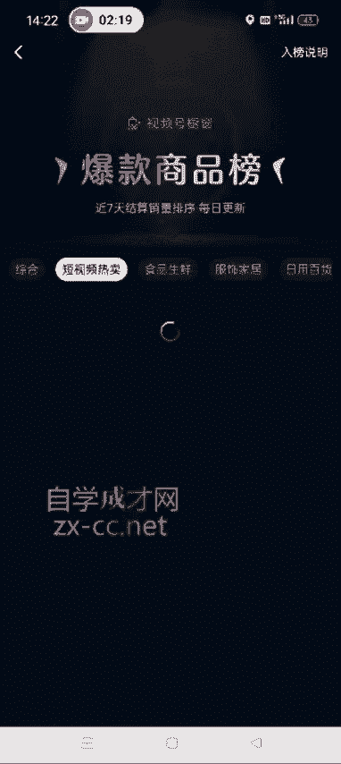
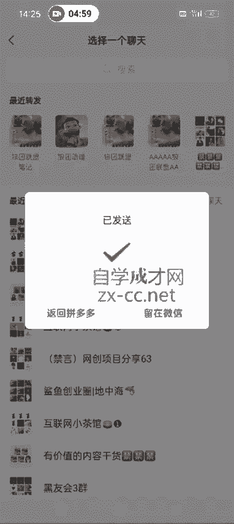
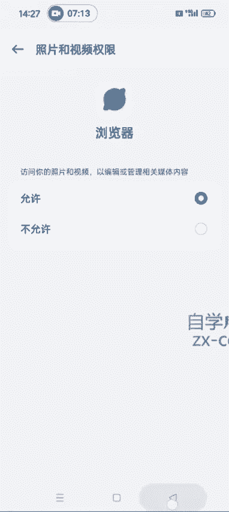

# 【2024版视频号运营教程】全B站最良心的视频号运营高阶教程合集！视频号运营 起号真的不难！ - P29：1.如何获取原创的实拍素材 - 鼓腹含和防护服 - BV1wDWheCEsK

好各位同学大家好啊，这节课给大家讲一下，我们如何获取原创的素材呃，就是我们在做搬运混剪的时候，可以把这些原创的素材添加进去，增加我们视频的原创度对吧，然后视频号现在除了做搬运混剪之外。

很多团队其实他们就是自己买样品，自己实拍，但是我们要是买样品自己实拍的话，成本太高了啊，所以说我们就想办法找一些原创的素材嗯，因为都搬运的话，又像抖音快手，很多人嗯他那个点赞量高的视频。

其实很多人都已经搬运过了，所以有些团队他们就自己去做实拍嗯，呃做实拍的好处，就是他视频号就是判你违规的几率，就相对来说比较小嘛，基本上不会判违规对吧，所以说我们呃也可以在混剪的时候。

添加一些原创的素材啊，原创素材的获取方式有两种，嗯先讲第一种啊，就是直接在微信里面搜产选原创素材，他跟那个配音神器还有青岛啊是一样的，都是都是一个小程序啊，我们点进去之后注册一个账号。

然后就呃这个让他那个绑定一下抖音，然后就可以在这里面去选择了啊，就很多类目，食品饮料啊，日用百货，美妆百货，美妆护肤，母婴用品都有啊。

这个里面有很多很多视频，我们想用哪一个啊，直接下载就行了啊，比如说第一个对吧，我们点下载。

想想下载哪一个视频啊，就直接选择它，然后下载就行了，然后点下载视频，这样的话就把这个视频下载下来了啊，嗯查选原创素材的好处是什么呀，好处就是说你看这是刚才下载的那个视频，好处。

就是说他这个他这个视频拍的，相对来说比较高清高清啊，就是专业的就是让这些达人用的它比较高清，不好的一点。

就是他那个里边素材相对来说可能比较少，我们一般做带货的话，就是根据视频号的选品中心，里边儿这个爆款榜啊，选品中心它不是最上面有一个爆款排行榜嘛，然后有一个短视频热卖。

这个里面哪一个卖的好，我们做纯视频带货的就可以直接带这个东西啊，比如说他第一个村庄农品对吧，你想带这个带这个视频，我们就可以呃，就是先在抖音或快手去根据这个森庄农品，蒜香椒盐粉这个关键词去搜索视频。

然后下呃，去完水印之后保存下来，然后再去混剪，混剪的时候加上一些我们这个原创的素材，原创的素材，第二种获取方式，就是说我们直接在淘宝或拼多多的这个，买家秀里面去去找啊，我们打开淘宝就是搜这个爆品啊。

森庄农品的蒜香椒盐粉，然后里边不是有很多嘛对吧，比如说我们点开以第一个为例啊，然后直接到他的评论区，找到有图和视频的这种，比如说这个对吧，像这个我们可以把这个买家秀实拍的这个视频，下载下来。

作为我们的原创素材啊，然后他这个淘宝的这个买家秀里边儿，这个视频电脑版的有很多软件可以下载，但是手机版的我找了好多都不行啊，所以我们可以通过录屏的方式，去把他这个视频录下来。

然后点开这个视频之后进入清屏模式啊，嗯点一下点一下旁边它就进到清屏模式了，记得把这个声音打开，然后再去录屏啊，声音打开再去录，听多了吧啊，这个是淘宝的这个评论区原创素材的获取啊，还有一个就是拼多多。

拼多多，我们相额那个方法一样啊，也是搜这个爆款排行榜里边，你想搜哪个，直接在拼多多里面去找，然后比如说这个对吧，点开了一个之后，我们还是在评论区去找啊。

图和视频往下翻，比如说这个又是这个红，这个拼多多，我们就不需要录屏了啊，然后他这有一个分享，你要录屏的话也录不了，因为他有这个字幕，也进入不了这个清屏模式啊，我们点分享随便发给一个微信好友。

或者说你自己建的这个群里面啊。

发送，然后留在微信点开，点开之后啊，这个时候可以这个时候就可以进到清屏模式，然后我们再去选择录屏啊，我这现在正在那个给大家录课，我就不给大家演示了啊，录屏的话手机上都自带这个功能。

就直接把他这个呃买家秀录制下来，然后我们呃混剪的时候，可以把他这个视频添加进去，一般选择的这个视频啊，你看他这个就是横着的啊，需要横过来，我们一般就选择竖屏的模式就可以了啊，啊我这就是给大家演示一下。

明白了吧啊，这是一个是那个把他这个评论区的视频发送给，发到微信，第二种这个保存方式就是复制他这个链接，打开QQ浏览器，必须是QQ浏览器，其他的浏览器不行，必须是QQ浏览器，然后我们打开QQ浏览器。

把这个网址粘贴进去，然后进入这个时候再去打开它这个视频，打开视频之后，这个时候右下角有三个点，看到没有，然后我们就可以点下载了，确认下载，这样的话，这个视频就可以下载到我们的这个手机相册，里面啊。

你看这是他那个视频就下载下来了，如果说你的QQ浏览器啊，他下载的这个视频不能保存到你的相册里面呃，剪映也好，秒剪也好，或者说其他的也好啊，就是你们弄的这个视频，它保存不到自己的相册里面。

我们打开设置有一个应用管理啊，应用应用管理把他那个权限打开啊，记得把权限打开，有很多人问过这个问题啊，我给大家说一下，这有一个权限管理，不同的手机它那个权限管理是不一样的啊，嗯你我这个是OPPO的。

然后把这个让他允许就可以了啊，让它允许，到时候你保存的这个视频。

它就可以直接保存到你的手机相册里面了啊，这个是两个原创素材获取的方式，一个是这个通过嗯参选原创素材，另一个是淘宝或拼多多的评论区去录屏，或者说直接下载啊，建议大家用拼多多啊，这个可以直接保存。

不需要录屏了，就直接保存，通过QQ浏览器再下载一下，好吧，这是我们这个原创素材，原创素材获取了之后，就是我们后续剪辑的时候可以用得到啊，嗯下节课我给大家录，就是我们如何发布一条带货视频啊，嗯那个是。

那那个时候我在讲，如何把这个原创素材剪到自己的，这个额搬运的视频里面啊。