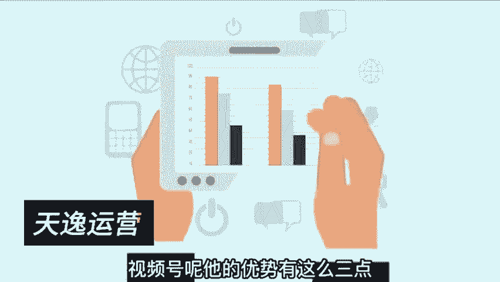
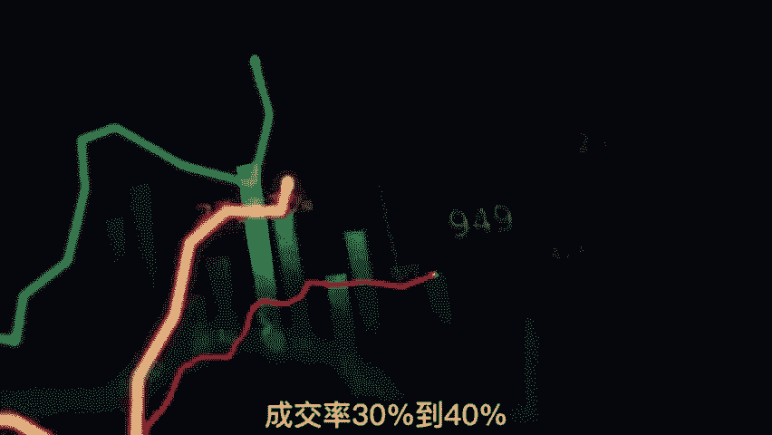
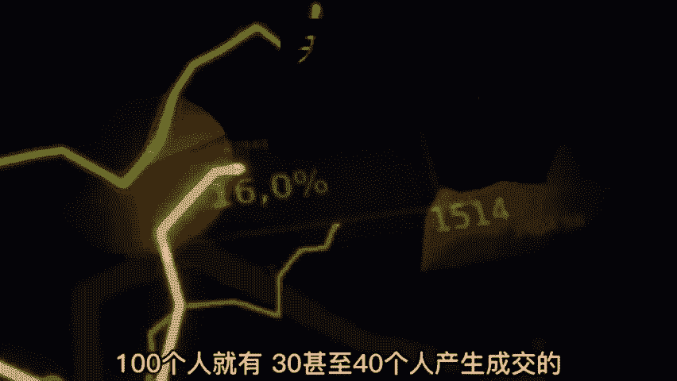

# 【2024版视频号运营教程】全B站最良心的视频号运营高阶教程合集！视频号运营 起号真的不难！ - P2：第一节：视频号属性~ - 鼓腹含和防护服 - BV1wDWheCEsK

视频号怎么做，太多的粉丝问我这个视频号整体的玩法和运营，说实话啊，我一直在考虑做不做这个系列教程，因为在抖音里面讲，竞争对手的一个平台运营的话，可能发不上去，如果能发上去，就纯粹是咱们缘分吧哈。

说明咱们啊还是有机会去学学，视频号和整体的玩法的，那视频号整个教程的话，我打算出一个系列，一共有五节，今天呢我们讲第一节视频号的属性比高，在视频号里面也玩了很多项目和操盘。

很多的内容也做出还不错的结果啊，所以我会用我的一些运营方式，我的运营方法以及我对视频号整体的了解，作为一个详细的教程啊，我希望你在看了这个教程之后呢，对视频号有一个初步的了解。

并且能够入局把视频号给他玩透，嗯首先我们了解啊它的整体属性吧，大体的来看视频号其实属于一个私域平台，什么叫私域平台呢，我们在个人IP私域那一块呢讲的非常清晰，就是海洋与池塘的一个区别。

公寓呢就相当于是海洋，比如说抖音，它就属于公寓平台，那在抖音的这个范围里面，没有说粉丝是谁的这个说法，你说你有1000万粉丝，抖音不给你推流啦，你啥都不是，你说你特别厉害，在抖音里面是一个网红。

一瞬间热度过了，跟你就没什么关系了，所以公寓的平台就像是一个海洋鱼一样，里面的鱼儿非常多非常多，但是啊不是你的，谁有能力哎，谁就捕鱼，谁有能力，谁就吃香的，喝辣的没有啊，甭管你什么董事长。

什么总裁在里面屁都捞不着是很正常的事，而池塘不一样，你有固有的池塘，你的池塘里面有鱼儿，那么你会根据你鱼儿的多少，来决定你的财富比例，特别是私欲这块呢，他是注重熟人社交，熟人关系。

所以这个平台呢它的本质是属于私欲的平台，然后在前两年，包括在今年啊，也有很多的博主啊，有很多做培训的，去宣扬视频号到底有多么多么好，思域是一定要做的，很多人借着这个势头在里面大肆的收割。

但是呢也有很多的人呢去做了，发现这个事啊没有那么简单，做不通，我见过很多个做线下实体的朋友啊，都是老板有钱，就是听着别人说私域一定要做，所以呢全力的扎进私域里面啊，各种视频呐，文章呐，然后朋友圈呐对吧。

布局的非常的好啊，确实很努力很努力，天天都在直播，天天都更新很多视频，甚至做了矩阵，但是一点用都没有，花了这么多时间，这么多的努力，这么多的勤奋，这么多的精力，但是呢不成正比，就是做不同。

这个时候我们来想一想池塘与海洋的区别，一下子你就明白这个事为什么做不通了，就好像是你这个池塘建的再好啊，什么宫殿级别的池塘对吧，你每天都给它放水，每天都给它疏通，把这个池塘做得非常好，非常好。

但是它只是一个池塘而已，如果你里面没有鱼儿的话，你再怎么打你这个池塘毫无意义，这也是为什么很多的人一头扎进视频号里面，又是直播，又是做视频啊，又是各种各种去做，但是没有效益没有用啊。

所以我们用这两个比喻打比方，你就能很好的理解公寓和私域的区别，公寓他的流量，他的鱼儿不属于任何人，它只属于有能力去捕捞他的人，公寓的流量分配始终是由平台来做分配的，而私域呢不一样。

私欲的话呢是你拥有了这些鱼儿，就等于你拥有了私有的数字资产，这两者一拉开一平摊出来，我们就一下子就了解公寓和私域的区别，一下子找准了视频号，在所有平台当中整体定位，那按道理说，如果他只是一个单纯的池塘。

我们就没必要用一个系列的教程去做教学了，它不止如此，所以呢我们通过五节，来把这整个流量市场给它打开，就是因为视频号它的定位很特殊，它是一个私域型的平台，同时他是私欲面向公寓，撕开了一条口子。

这个怎么理解呢，就是原本他的属性是属于一个封闭的一个池塘，但是呢腾讯想要通过这个池塘，去面向公寓的口子，公寓是什么，就是一些陌生人，一些没有见过的人，从私欲面向陌生人，我们可以简单的理解。

就是从一个熟人社交的平台面向陌生的触达，所以你会发现啊，它更新的一些功能，有的时候你可能看不懂，比如说什么看一看啊对吧，比如说嗯你的粉丝点赞之后，就会展现在他的一个范畴里面。

诶他为什么要去做这样的一个推荐体系，为什么要做这样的推荐机制，原因就是很简单，他正在从熟人社交转变成陌生出达，这就是相当于原本是做私域平台的，这么一个视频号，然后呢用力的撕开了新的一条口子。

所以你会发现啊，在你刷视频后的时候啊，有很多陌生的账号啊，有很多陌生的内容会推送在你的面前，诶虽然说这些内容啊并不是都是陌生的啊，他是有一定的几率穿插着腿，但是足以说明这从私域到公寓的一个啊关口。

出现了这么一条口子，而我们去运营它，无非就是要把这个口子撕的更大，我们要了解这个口子在哪里，我们要了解它的推流机制，我们要了解以什么的内容，什么的规则，才能够触及从熟人社交转变成陌生出达。

这个是我们整个系列教程要达到的，要做到的一个目的，那说了这么多啊，我相信您对他的整个属性啊有大概的了解，那做这个平台它的优势有哪些，以及它的劣势有哪些呢，以我们的运营经验啊，我们的一些运营经过。

我做了全面的数据统计，我把它的优势和劣势分别给你讲一讲，让你对它了解的更多更深一些，首先从优势来讲起，视频号呢它的优势有这么三点。

第一它的转粉率特别高，和抖音这种公益的平台比起来呢高出5~8倍，什么叫转粉率，比如说我转到私域的转粉，我现在通过一个资料的形式，先让大家在我的私域里面去领取资料，这个叫转粉率。

现在呢我1万次播放的转粉率，大概是30~45人左右啊，这个转粉率还算可以了吧，但视频号的转粉率会更高，因为啊它没有跨平台的行动成本，你现在要去另外一个平台去加我，来跟我建立沟通，你是需要跨一个平台的。

你还是需要有很多的行动成本的。

也导致转粉率不太理想，但是在一个PAPP里面，他的链接抓取以及一个APP里面，他的行动成本啊是非常低的，所以他的转粉率非常高，第二个优势成交率高啊，这个我就不得不说我们做了一个小项目。

我之前呢做那个U盘，就是做音乐号卖U盘，这个相信很多人都知道吧，他的成交率啊，比公寓的平台高出25%左右，这个是非常夸张的，比方说我们做音乐号，在抖音里面做了很多粉丝，然后呢。

我们把这个粉丝引导到我们思域做成交呃，成交率的话大概是5%到8%，也就是说100个人的话，可能有55~8个人会产生购买，而视频号完全不一样，我们做视频号，做了音乐类型的内容，发现凡是引导到私域啊。

然后建立成交的成交率，30%到40%。

这个数据是非常夸张的，100个人就有30甚至40个人产生成交的。

这个数据我没有做任何夸张啊，是我们在做了这个项目操盘之后，然后把数据罗列出来，做的统计，然后做的分析，第三个最大的优势就是，它是一个很好的成交场景，它具有很高的粘性，什么叫成交场景呢。

打个比方说如果我要卖课，我现在呢我在抖音里面卖，对吧啊，在抖音里面卖我的成交和我的整个初达啊，可能没有那么理想，当然也能卖出去，但如果说同样的人数啊，嗯抖音有100人在线，视频号也是有100人在线。

视频号的成交率大大高于抖音直播间的，这就是它的成交场景带来的高粘性，高触达，然后所带来的实际效果，这是它的三大点优势，只要你深入去运营，你一定会发现啊，这三点优势非常不错，就如比高说的这样，当然了。

它也有不少的劣势，这劣势的话让很多的新手朋友进去，抓不住门道啊，不知道怎么入局，劣势的话也有这么三点，首先第一点它的启动啊是需要基础流量来做，能启动的，什么意思呢，就是你一个新手入局。

你没有基础流量的话，你是做不出头的，这个你可能更新很久都不容易做出来，所以他对新手极其的不友好，第二个劣势是什么呢，是他的流量啊，都瓜分在了头部和埃文森机构的手里，所以这两点都对新手极其的不友好。

有很多人来做的内容确实很优质，确实很棒，但是发上去之后发现没有播放，然后又坚持坚持，坚持了很久还是没有播放，就是因为没有一个基础的能启动，你也不了解他的推荐机制，导致很难在里面做出来，第三个念是什么呢。

是这个平台的运营呀，特别的吃玩法和吃一些热点，比如说什么呢啊裂变式的玩法，刚刚我们谈到一个关键点啊，就是它的驱动啊，是需要有我们基础流量，基础用户的驱动，那这个时候我们要借助一些活动的玩法呀。

或者一些啊运营方式，然后产生裂变，把它放到更大的流量池对吧，对玩法的啊这种依赖性比较强，还有就是热点，比如说前两天呢我们有个群伙伴，就靠视频号直播上海买菜，再加上快团团的一个模式，诶。

上海买菜抢菜是一个很好的热点吧，他就靠这么一个热点，迅速的把直播间拉到1万人在线，这个数据非常的夸张，然后当天的成交在几10万，上百万这样的一个gm杯，所以整体下来你看玩法热烈啊，都是他比较依赖的。

这也导致很多伙伴呢在整个运营当中，根本不知道啊，他的属性是在这一块，也导致花费了很多精力啊，始终做不出来，当然了，在整个运营玩法以及内容，以及他的整个推荐机制呢，我会在接下来的几节。

