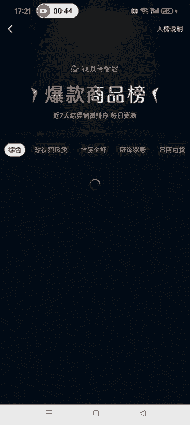
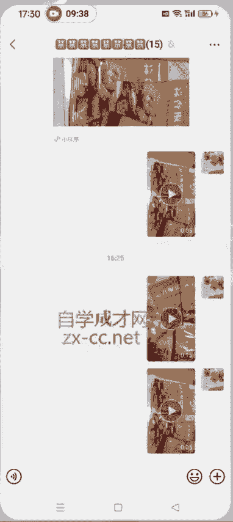

# 【2024版视频号运营教程】全B站最良心的视频号运营高阶教程合集！视频号运营 起号真的不难！ - P30：2.如何发布爆款视频 - 鼓腹含和防护服 - BV1wDWheCEsK

好各位同学大家好啊，这节课给大家讲一下，就是我们做纯视频带货的这种呃，我们这个视频从哪找，然后发哪种视频以及带哪哪一种品啊，另一个知识点就是给大家讲一下，我们额。

如何把这个就是我们我们找的那个原创的素材，加到我们这个视频里面去啊，然后额现在这个视频号的这个创作者中心啊，视频号创作者中心，带货中心去选品。

然后选品中心这有一个爆款商品榜啊，现在这个爆款商品榜它这个分类比较细。

你像这个短视频热卖食品，生鲜服饰，家居日用百货图书啊是吧，绿植这些都有啊，现在这个视频号的选品中心已经非常全面了，然后我们做纯视频带货的这种学员呢，呃跟品的话，我们就直接这有一个短视频热卖，看到没有。

点开这个短视频热卖里面有几百个商品，这种呢就是通过视频呃，带货，纯视频带货出的呃，比较好出的这种这种品啊，然后我们就直接跟着带就行了，你像他这里面有这个呃厨房用的吃的呀，喝的呀，嗯你像这个纸啊这种的。

对不对，还有这个书籍什么的都有啊，牙膏反正涵盖了这个方方面面啊，基本上都有，所以说我们就把这个账号做成这个呃，就是反正你就发各种品都行啊，也不必说非得发一种，就是你这个视频里面我们就直接跟这个频。

比如说今天发这两两款商品，然后明天发这两款商品，然后重要的是你把这个视频找好，混剪好，然后发到视频号就可以了，明白了吧，然后我们应该怎么做呢，就是比如说你打算带第一个对吧，第一个品点开之后。

它这个品里面下面有这个相关视频，这种视频呢就是视频号里面嗯，卖这个货卖的比较好的这种账号啊，然后他有的品里面有相关视频，有的品里面没有啊，你像这种的都有，那下面这种他可能就没有了，有的话我们就参考一下。

没有的话也也就你就不用参考了啊，我们以第一个品为例，我们应该怎么做呢，这个逻辑就是先打开爆款商品榜，然后确定你要带的这个品，然后到抖音去找相关的视频，见过图，抖音找相关视频，直接搜这个关键词就可以了啊。

搜了关键词之后点视频，然后这有一个漏斗的装置，点一下，点一天之内发布的啊，点一天之内发布的，就是这个选项，一定要选择一下啊，点一天之内发布的，为什么要选一天之内发布的呢。

因为这种视频他可能呃博主刚发布啊，然后这个被这个被搬运的次数还比较少，我们发这种，这样的话，我们再经过混剪，这个原创度就非常高昂，就不太容易被这个平台识别到，我们搬运，你要是搬那些点赞量最高的那种是吧。

点赞量最高的那种，他可能很多人都搬过了，后期的话你无论怎么减，他都可能被平台判搬运，所以我们在选择的时候，就选择一天之内的这种啊，然后找到适合，万万没想到找到适合的这个视频。

然后我们去水印下载下来就OK了啊，你看他这个视频也是带的这个椒盐粉，对不对，我们就直接搜这个品的名字，在抖音去搜相关的视频就OK了，我这边已经提前把这个视频搞好了啊，我这边就呃不演示了。

然后大家知道怎么做，第一步就是在抖音去找视频了啊，然后下一步到打开拼多多也是啊，到这个评论区去找买家秀的这个相关的视频啊，到评论区找买家秀的相关的这个视频，把这个视频下载下来，呃实在不行，图片也行啊。

就最好是找这个相关的视频啊，把这个视频下载下来，方法的话我这也不讲了啊，上节课已经讲了，不会的，去看上节课的那个操作，然后我们找的这个视频呢就是一定是像这种的，我最喜欢，你最好不要找这种的，看到没。

他这个是侧着的，然后你到时候你你混剪的时候，你还得调啊，他这个买家秀里边视频太多了，而且你像拼多多卖的，你像他这一个品是吧，咱就看他这一个品，你看多少家卖的呀，对不对，所以说买家秀的这个原创视频。

我们一点都不缺啊，嗯大家尽量到拼多多去找，这样就直接下载，能直接下载下来，等那个下载下来之后，我然后我们打开剪映，把提前去完水印的那个视频添加进去啊，这个是我提前弄好的，我这就直接添加了啊。

你看他这个视频里面有这个相关的这个品，调味放入对吧，然后我们把这个视频放大一点嗯，大家记得啊，就是这个视频你切了几秒，切下来几秒啊，就是我们把这个原创视频素呃，原创的这个素材加进，再加进去几秒。

你比如说他这个视频，我们从25秒这儿开始切吧分割，然后R17秒这结束，把这删掉，然后我们加这个原创的素材进去啊，啊这个是那个，然后这是这个原创的素材，我们切了两秒，对不对，然后我们加进去两秒。

这两秒这分割，多余的删除，这个是我我用的这个视频的开头这两秒啊是吧，然后中间还可以加个转场啊，这些啊可以加转场视频的转场幻灯片对吧，这些可以加一下啊，倒有调调，煎至八面金黄调。

然后记得把这个视频加进去的，这个视频的原声给它去掉啊，调，啊忘了说一点啊，就是我们这个视频你开始切割之前，一定要先把这个音频分离一下啊，先把这个音频分离一下，要不然你，要不然到时候这个视频。

你看他这就就相当于就多了一点嘛，我把这删了吧，这个音频分离，先把音频分离了之后，然后再去加啊，连到一块，这个时候我们再在这去加视频，前几秒加几秒啊，哎加错了，原声去掉，蒜香椒盐粉吃过很多家啊。

这就OK了好吧，然后后面再出现这个品的位置，我们继续切割，如果不出现的话，我们也可以加1+1点啊，在不影响这个原视频的情况下，也可以加一点，你切几秒就加几秒就行了好吧，分割，然后删除好删除。

如果那个操作错了，可以点撤销啊，然后继续加这个视频，刚才我用的视频前两秒，这儿我就用这个视频的后两秒，分割，然后把前面这些删除，都没有，锅中油热，下入土豆中小火慢煎，煎至八面金黄，蒜香椒盐粉。

吃过很多家，还是他家的味道好，平时还可以做椒盐虾，椒盐花菜都非常好吃入味，现在九块九六袋还包邮到家，最后撒上韭菜段和洋葱丝，大这个视频的原声忘了去掉，大家一定要记得啊，你在像我这样操作的时候啊。

这样就OK了，然后把这个视频额剩下的就该怎么混剪，就按照我混剪的那个教程去做混检，最后然后再导出就OK了啊，嗯拉到60帧，最后再导出，我这就不导出了，呃大家记得啊，做这个视频的时候一定要怎么样啊。

就是啊我刚才第一步操作错了，第一步就是先选中视频，把这个音频分离啊，先把音频分离出来，然后再去切割加你的原创素材啊，这个大家注意一下，我这就不重新录视频了，就跟大家说一下，然后把这个视频导出来之后。

我们就可以在视频号去发布了。

发布的时候呢，呃就是我们这个想到土豆还可以这样做文案，话题标签，这个井号后面这个就是话题标签，文案话题标签直接复制原视频的过去就可以了，然后放到视频号的这个发布的那个界面啊，好吧嗯。

然后记得发布的时候不要勾选原创，其他的该怎么操作就怎么操作，他这个文案怎么写，我们就直接用他这个文案，然后话题标签写加的是什么，我们就加什么好吧，然后再发布就OK了啊。

