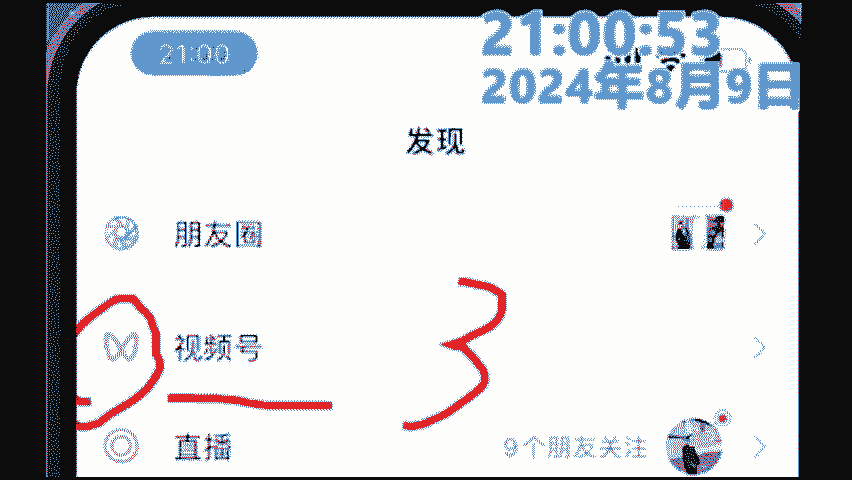
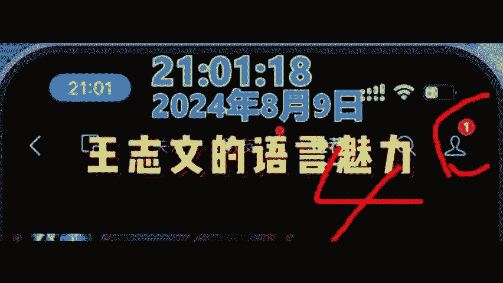
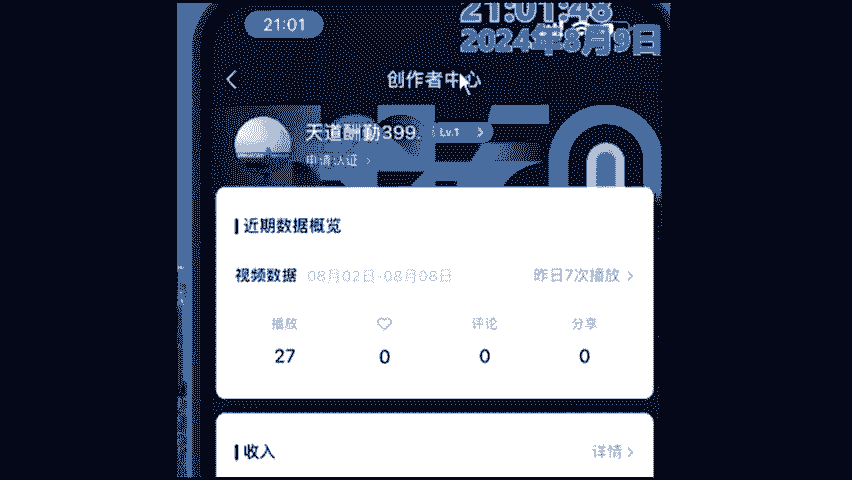
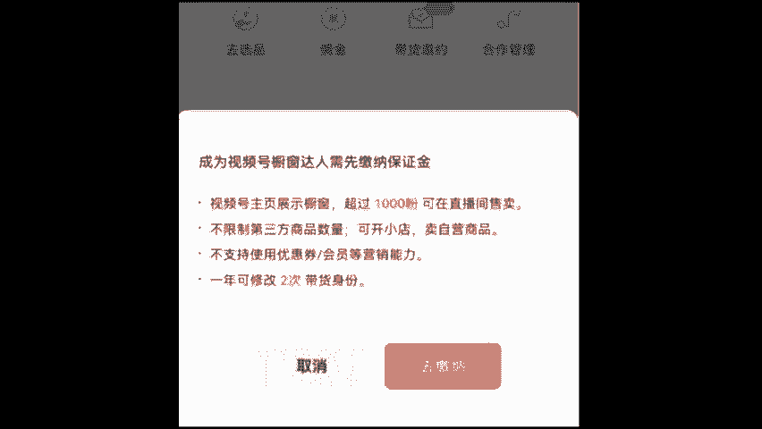
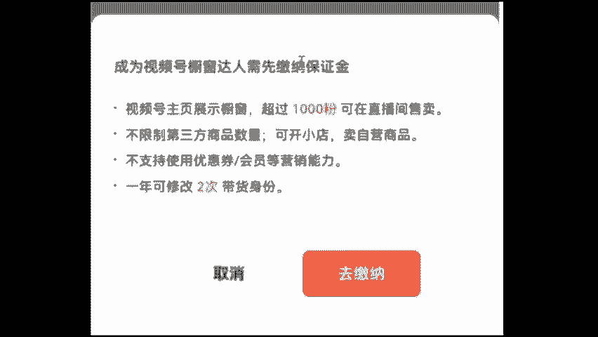

# 【2024版视频号运营教程】全B站最良心的视频号运营高阶教程合集！视频号运营 起号真的不难！ - P31：19.实操步骤 - bi逆风 - BV1Db4mekELD

啊，老师辛苦了啊，这个不是太辛苦了。我还是那句话，今天只要你们收获，对吧？那我就没有辜负官方的一个什么委托啊，我这节课就不算什么白讲，听懂没有？好吧，那实操什么东西呢？各位同学同样也是一样的，好吧。

怎么来操作，各位同学好好听啊，各位同学来好好听。😊，哼马上开干是吧？啊，张老师，我喝口水啊，稍等一下嗯。😊，首先老规矩啊，各位同学第一步来第一步啊，各位同学把三个八宝在公屏上啊上实操了啊，上实操了。

各位。😊，啊，上十3了各位。各位第一步干什么呢？第一步打开我们的微信，好吧，会不会能跟上同学给老师打上个数字一，第一步打开微信，因为打开微信，这一步就不需要张老师我的去教了吧。好吧，O打开咱们的微信。

这是第一步。好，第二步来点击我们的什么发现嗯。😊，能跟到同学给老师我打上一个什么数字啊，好吧，跟让同学给老师打上一个数字啊OK。😊，好，那接下来第三步找什么？我说了来把你的手机啊视线往上拉拿到这个地方。

看到没有？这个也叫视频号的。如果说你不认识字呢，找到这个黄黄的，像这蝴蝶，能个同学给老师打上一个什么数字3嗯。😊。

O对不对？然后点击进去，点击进去之后后看到没有？稍等一下啊。😊，我找一个稍微好一点的。🎼哎呀，再好，OK看到没有？这个地方找到哪里呢？找到这里，这个时候要找到右上角，看到没有？这边有一个人形头像。

看到没有？能跟的同学给老师打上一个数字4啊。😊。

嗯。

嗯。okK点击一下，点击一下之后，记着往下滑，往下滑滑到呢，滑到我们最下方啊，它有一个叫什么创作者中心的，对不对啊，能跟上同学给老师打上一个数字5。那有同学说老师我没有怎么办？没有，是因为你刚刚注册。

没有发布一条作品，等你发一条作品就可以了，来点击创作中心，点击创作中心之后，看到没有？从上到下呢长的是这个样子啊，同样在这这样看到没有？那，是不是8月2号到8月8号的一个数据，我们要找到什么东西呢？

找到这里面有一个叫做创作中心，因为这是一个新号，找到这个带货中心哈，能跟上同学给老师打上数字6。😊。

对，类似一个小卖部一样嗯。好，OK然后我就要去确认啊，各位你们有没有开通过我们视频号的橱窗权限，已经开通同学给老师打上数字一，没有开通同学给老师打出来一个数字2，好吧。好，看来呃只有嗯。

大多同学没有开通啊，那几位同学已经开通了。那同样的当老师，我还是两个一起讲，我先教怎么开通，再教怎么上架好不好？来，每位同学把三个8打在公屏上还是一样的，1。1点的来操作啊，1点点来操作，听懂没有嗯？

😊，OK好吧，那我们跟大家讲一下啊，其实它只有一个操作，听懂没有？就是呃你没有开通橱窗权手，当你点击它就会变成开通权限的操作。你如果开通了就变成上架了。好吧，会当我们点击我们的带货中心。

它会跳转在什么样一个界面呢？它就会跳转到开通权限的一个什么界面，来同学看清楚啊，这个界面长什么样的，长这个样子来同学他需要选择你的带货身份啊，第一种啊是我是商家，第二种我是达人。

第三种我是商家数联号跟同学记住选什么东西呢？选择这个我是达人各同学好吧，选二，听到没有？把332个打在公屏上。😊。

啊，把三个二个说打公屏上，同学听楚没有？😊，OK啊，是不是所以说有同人学老师我这边是什么东呢？老师，我我这边是厂家，这位同学记住也是选达人，先用官方会员的号。听没有？因为它产品是O的。

它的产品是O的跟学听清楚没有？好吧，你一个身份证啊，可以做两个账号，第二个账号再选择自己好吧，当你选择我是达人之后，接下来会跳转到一个什么样的界面呢同学看清楚会这样个界面，就是交纳我们保证金的一个界面。

听见没有？怎么去交纳我们的保证金呢，上面也讲的很清楚，很明白来，你只需要点击我们这里什么去交纳，然后就会跳转到微信里面扣100块钱就O了，看到没有？学会没有？来学会同学给大家打上一个惠字。

各位成为我们视频号达人没有？是不是你是开直播需要粉丝，现在不用开直吧，会吧？O就这么简单，来会同学打上会，不会同学打不会。😊。

好，嗯，OK都是会的那就很简单了。对，好，所以说各位看到没？那接下来教大家如何来进行一个什么上架那。😊，啊，还有几个别同学不会哈还有几个同学不会，那这样吧，我就再来第二遍好不好？各位张老师。

我再来第二遍，那会的同学呢就当复习了，不会同学呢再好好听，O不OK没有问题的话，把三个8打在公屏上，对不对？其实这个操作啊没有说特别复杂的东西啊，其实这个操作没有任何复杂东西，好吧，O。😊，好。

那第一步看清楚啊，刚才我说了整个的操作是什么样子呢？😊。

