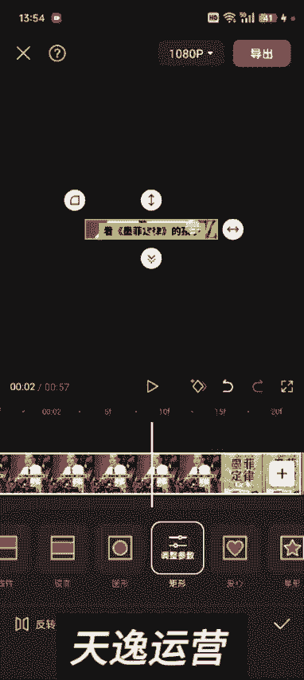
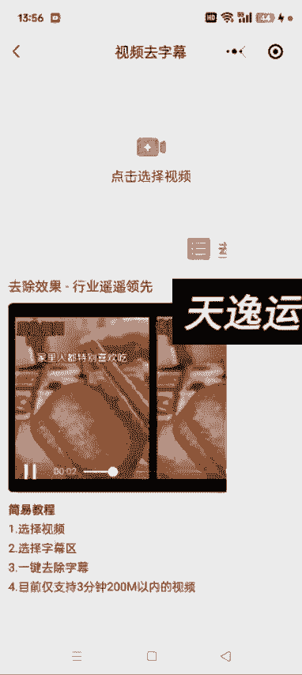

# 【2024版视频号运营教程】全B站最良心的视频号运营高阶教程合集！视频号运营 起号真的不难！ - P34：2.如何去视频里的字幕 - 鼓腹含和防护服 - BV1wDWheCEsK

好各位同学大家好啊，这节课给大家讲一下如何给这个视频去字幕，去字幕的话其实也有两种方式啊，就是我之前课程里边有讲过，就是我们把这个视频通过蒙版的方式，然后把它这个字幕去掉，你比如说这个视频对吧。

你看他这个额前半部分这个字幕在中间的地方，然后后面呢他这个字幕在下面的就是靠下一点，像这种的我们应该怎么怎么整呢，这种的其实你把它分割一下啊，你看他那个字幕在上面的在哪，然后我们把这个视频分割一段。

一段的去给他去啊，这样也可以，来在这儿给它分割，然后分割选中这这一段，然后我们就通过蒙版的方式给他去字幕，选择矩形，额跟之前的方法一样啊。

然后调到合适合适的位置，然后点反转，然后返回一级，找到背景，我们点画布模糊，哎，这样的话这个原字幕就去掉了，后面的这一部分呢，就是我们分割的这道理是一样的啊，然后我们选中它，如果就是他这个字。

有的字幕是一直在一个位置，像这种的我们就不需要分割，如果没有在一个位置的哎，然后我们就分割一下啊，分割一下，然后再就是逐断的去给他，通过蒙版的的方式去字幕啊，还有一种方式呢。

就是我们在微信里面去搜这个去字幕，它跟去水印道理差不多啊，去字幕也有额，去字幕视频，去字幕一一键去除的这种小程序，很多很多这种小程序啊，你看有很多很多是吧，然后呃好相对好用一点的，就是这个3D曲字幕哦。

跟那个去水印道理差不多，然后我们把这个视频选中，选中之后，我们进来之后啊，就是他这不是有个视频去字幕吗，然后点进去，点进去之后，把你想去字幕的这个视频导入进去就可以了啊，然后完成。

千万别让一说就掉眼泪的孩子读墨菲定律，不然他内心，然后这个哎我这个已经去过了啊，找个没有去的这个吧，千万别让一说就掉眼泪的孩子读墨菲定律，然后把这个位置调整一下，他这个可以调大小啊。

呃通过这个去字幕的这个小程序去的这个字幕，其实跟我们用蒙版去的差不多，我尝试了很多这种小程序，它多多少少会有一点痕迹，呃视频短的话效果相对来说比较好，如果你像超过一分钟的这种。

他去出来效果跟我们用蒙版的方式去差不多，如果碰到就是他这个字幕上下位置不一样的，这种，我们可以把视频分割，然后逐段的去通过这个小程序去水去水印啊，去这个字幕，然后这个位置可以调大小，也可以调。

你想弄到哪都可以啊，然后提交去字幕就行了，大概就是这么这么呃去实操啊，然后这这种情况下我们就直接去关了它就行了。

一会再进来去看就行了啊，然后用法呢跟我们其他的像像那个配音神器啊，这些一样，直接下拉微信，然后找到这个小程序就可以了啊，很多啊很多额，有的是收费的，像3D这个他还不收费，然后效果也差不了多少。

都差不了多少啊，好这是两种去字幕的方式啊。