# 【2024版视频号运营教程】全B站最良心的视频号运营高阶教程合集！视频号运营 起号真的不难！ - P34：4.二创书单制作方法一 - 怡宸WQ - BV1yhpjeKEnc

嗯。好，各位同学大家好啊。这节课我们接着讲，就是我们做不管是做哪一种视频类型，呃，剪辑是必备的技能。很多新手刚开始不熟悉，觉得看我的课程，觉得混剪啊，包括剪辑这些很难。其实就是根源是你剪辑零基础。

你自己先拿十几个视频练练手，熟能生巧。这个真的没有那么难，你花上一两个小时的时间去剪辑几个视频，你熟悉了每一个功能的作用，然后你再去看课程啊，你会发现一看就懂非常简单。呃。

第二个我要说的点就是我们呃我建议大家做纯视频带货的，你们可以尝试去做书单啊。嗯呃我就是你像我们之前是做俄罗斯带货的，还有书单，还有益智玩具啊，还有老照片修复的。但是书单这种类型，一直是常青术啊，呃。

只要学员认真做的这种基本上都有出单。然后书单的话就是我们。之前的课程不是讲的魂剪一魂剪二魂剪三嘛？呃，除了按照咱们之前的课程去混剪之外，我们还可以自己去进行二创。你会发现很多人做视频做的这个书单视频啊。

等你们多刷一些这些对外账号你就知道了。呃，其实都是二次创作的视频素材全部都是来源于网上，这些肯定不是自己实拍的。呃，二次创作呢，说白了就是啊各种视频素材打乱顺顺序重新组合。

这种方式呢肯定比拿一条视频混剪出来的原创度高。呃，我们如何去实操混剪啊，这节课就实操二创，我这节课就给大家讲一下，然后我们要做书单的话，我这儿给大家推荐了十几本，就是呃。我们就是比如说找素材的时候。

可以直接去搜这些书啊。呃，每一行就是一本书，孩子为自己读书，墨菲定律漫画版中国通史走遍中国，告别吼叫的养育话术。这些你直接搜这些关键词在抖音就可以了。然后找到这些对标账号之后。

除了我上面给大家发的这些呃书名之外，你可以看他们的橱窗啊，别人的橱窗里面带的，只要销量在几万以上的这种书，我们都可以去带。知道了吧。所以说理想状态下，我们不缺素材，更不缺你你卖哪本书。

如果你看完课程之后，你再过来跟跟我说，我不知道带哪个货，带哪个品，那就是你没有认真听我这节课啊，然后做书单账号的逻辑，说白了就是通过一个视频，影视影视剧电视剧片段或者一段小故事讲出一个道理。呃。

最后再把某一本书推荐出来，引起读者的购买欲，从而赚钱，你刷多了这种视频，你就明白其中的逻辑了。所以说大家先按照我上面发的这个书单去搜这些书，然后通过达人秀的方式，达人秀那一块去找一些这些对标账号。

然后自己刷刷。呃，找找感觉，然后你就明白了这种账号的底层逻辑。好吧，这种肯定是比直接呃我们像做好物的这种账号，就一上来就是呃这个保鲜膜怎怎么怎么好啊，这个呃垃圾袋怎么怎么好啊。啊。

比这种直接上来硬广的这种要好的多，好吧，然后这节课我我就给大家实操一下，就是我们具体的呃在二次创作的时候应该怎么去找啊？呃，然后我们打开抖音。然后直接去搜索，比如说搜索女孩儿要懂得保护自己。发现女儿恋。

啊，搜女孩要懂得保护自己这本书啊。然后我们搜出来之后点商品，然后点销量。一般这种几万以上的，肯定他这个这个商品下面都有达人秀。然后我们随便点开一个。然后找到达人秀啊，你看这个261个。

这个达人秀就是肯定是200多个卖家都在卖这本书，然后卖的都还不错。呃，你看这个点赞量，他这个视频青蓝图书，这个点赞量7。8万，这个是点赞量3。7万，对吧？然后像我们做二次创作的话，应该怎么做呢？呃。

除了按照我之前课程混剪一混剪2。🎼性教育的真，我们之前的这个操作方式就是把这个视频保存下来，通过添加画中画啊，或者说呃一些呃反转啊，还有呃反正各种吧，就是之前课程里边不是讲了八九部嘛，然后去混剪。

除了这种方式之外，我们可以二次创作，你像书丹的这种账号，你统一的把他这个视频看完之后，你会发现这种这种素材，我们完全他肯定不是自己的啊，你看你像这个育儿有方，这个他自己也没有真人出境，对吧？

所有的素材全部来是什么就是混剪的。然后我们把这段视把这个视频看完，性教育的知识，你不教给孩子，孩子他就会自己去学，到了一定阶段，你一定会对这些事情产生浓厚的兴趣。

你不教啊这个社会就会教他一些坏人就会去教他，他也会自己去寻找相应的知识去学习。但是你想想他会从哪学习呢学了。😊，🎼又会去哪实践呢？如果你不知道怎么去引导教育，有些话还不好意思开口。

你可以买本书放在孩子的书桌或者床头。它不光能让孩子把生理问题搞明白，还会给孩子一些青春期心理方面的建议，关于情感关于心理，还有该如何应对学习和考试的压力以及情商的培养。🎼性教育的真。

然后我们看完这段视频之后，就会发现它就是通过一段话啊，然后这些这些片段什么的，全部都是网上的素材，对吧？第一个片段，你看就是一个呃也可以说是女老师或者说做培训的对吧？她在这儿在给别人讲。

然后往后看真相是什么，他就会自己去学，这个就是呃学生在操场上，对吧？🎼，然后这个就是几个女生在这儿呃或者等车呀，或者说是在旅游啊是吧？这种片段开口。然后这个片段就是一个呃中学生啊，高中生啊，他在学习。

对不对？🎼方面的建议，最后才是这本书，它就是通过这么一句话把这堆这本书推荐出来。像这种的，我们除了按照之前的混剪方式混剪之外，我们还可以把里面的素材呃，这个把里面的素材可以替换掉啊，然后。

现在抖音复制链接的话，改成分享制了，然后我们点。分享制，这样的话就可以。把这个链接复制了，然后我们就把这个原视频保存下来，文案也要提取出来啊。然后取水印粘贴一键取水印。然后保存到相册。

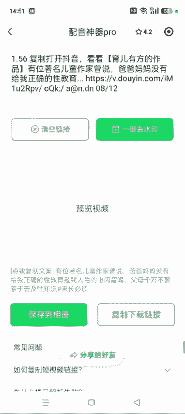

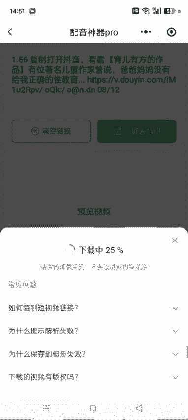

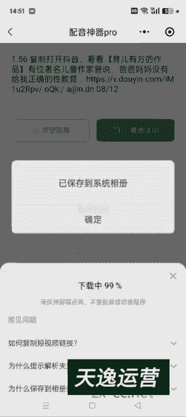

而确定。然后我们在文案提取。文案提取出来之后啊，我们做二创的话，建议呃自己重新生成新的配音和字幕，好吧，然后所以我们这儿就配一下音。然后配音的话就是你先看一下这个文案提取出来有没有错别字。

另外你让他呃你选择这个声音之后，比如说女生情感女生，对吧？那女子挽着如意双剂，姬发里面盘着一根鹅黄绒绳，不要乱战，等待时机，随时准备突围。和你聊天很舒服，比如说我用这个对吧？

然后用这个你可以自己先听一下，看他这个呃配音正常不正常啊。

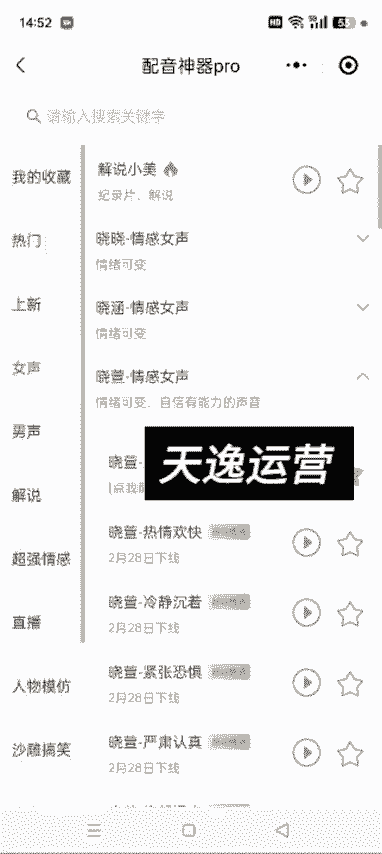

如果有错别字的话，就纠正一下错别字。性教育的知识，你不教给孩子，孩子他就会自己去学，那到了一定阶段，他一定会对这些事情产生浓厚的兴趣，你不教他然后听一下，如果某一段感觉他太快的话，我们可以停顿啊。

比如说比如说这儿你感觉他太快，然后让他停顿上几秒。比如1。5秒，对吧？然后让他重新去合成配音。性教育的真相是什么？性教育的知识，然后合成之后，我们把这个配音导出来，这儿我就不多讲了啊。

之前的课程里边都有讲。然后下载配件。然后保存。呃，这节课我主要给大家讲这么一个思路啊，就是。然后我们把刚才去完水印的这个视频。添加进来高清对吧？我们首先要做的是什么呀？就是呃向他抬头的性教育真相是什么？

家长应该如何引导孩子，这些我们可以用它的，也可以自己重新生成。我建议自己重新添加一下啊。然后这个字幕啊，看一下这个字幕。我们呃也可以重新生成，也可以就是把它原的原来的给它替换那个替换掉啊。遮盖一下蒙板。

矩形。方法呢，咱之前都讲过，我这就一笔带过了啊。系。然后反转。你的狗。然后返回。背景。画布模糊，哎，这样的话，这个字幕已经给它遮盖了，对吧？然后我把它它这个视频的原声给它去掉。视频原声去掉之后。

我们开始。找这个。片段啊，我们可以把这些片段给它替换掉。比如说第一个片段。啊，先别管元省了。性教育第一个片段就是。一个女老师在台上演讲，对吧？然后到这儿。那这个片段我们就完全可以给它切换掉。

然后点分割嘛。这儿呃可以直接从这儿去替换啊。

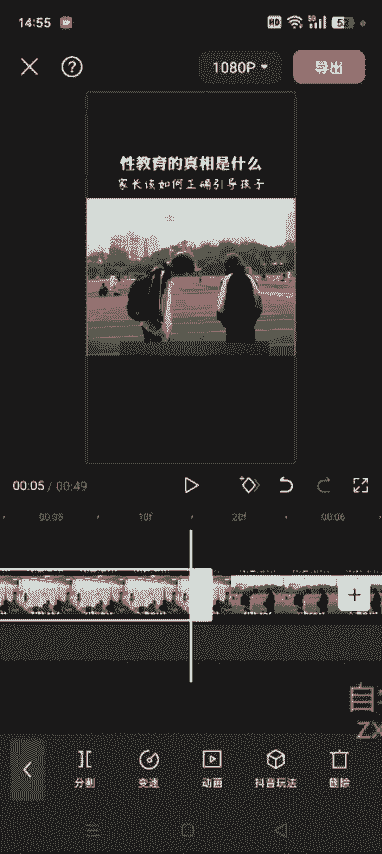

替换，然后这儿有一个素材库啊。老师。

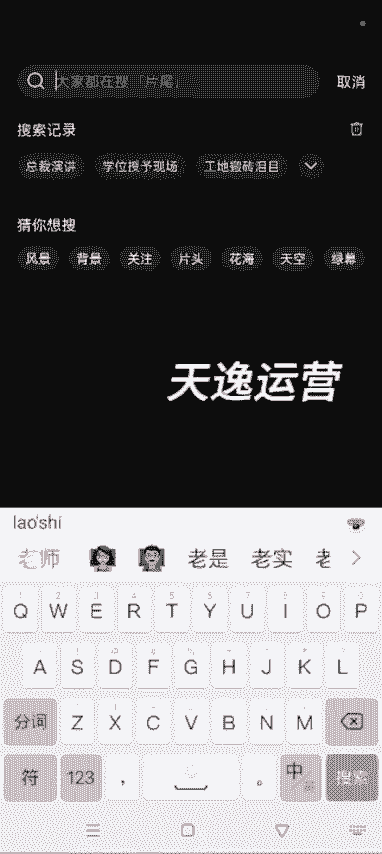

讲课。

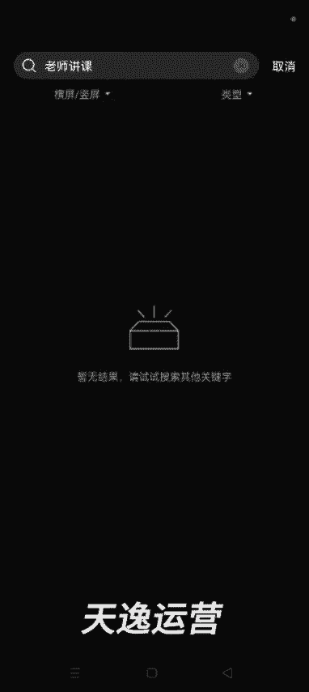

呃，然后没有这个素材老师。呃，女生台上发言吧，演讲也行。

然后这会出来很多很多素材，你看这个素材适不是适合在这个视频里面用啊，大概的看一下是不是适合。如果不适合的话，我们可以直接在抖音去找啊，然后在抖音里面去搜。比如说抖音关于情感。搜这个。呃，女生台上。

培训吧。女讲师。

培训视频。嗯，他这搜出来是商品，我们返回到青春期呢一般般人。女。讲师。培训。综合。逼着自己你逼什么。3分钟什么样的站姿，我不说话，我往这里。😡，哎，然后如果觉得这个这个片段可以。

然后我们就可以把这个视频保存下来，用它这个片段，对吧？呃，尽量找一些没有字幕的啊，他这个有字幕，然后我们就换一个或者说这个记住吗？给。🎼培训的。我只开口说两句话哎，然后这个可以是吧？

然后我们呃可以去一下水印，也可以尽量的去一下水印啊，我这就不去了，因为浪费时间啊，我看能直接保存吗，然后直接保存吧。哎，然后保存好了好吧，然后我们打开剪映剪映。😊，刚才我们在素材库里面没有。

然后我们就在这个。选择替换。找到刚才的这个视频，开口你看你我们刚才是选择了5。5秒，他这儿也给你替换5。5秒，对不对？然后就把这段视频替换掉了。呃，替换的话，它有一个跑的地方。

就是说我们之前这个字幕这儿有有一块阴影，对不对？它这个阴影是去不掉的。呃，除了替换的话，我们也可以把原来的视频删除。现在我返回啊。返回哎，这样的话就是刚才分割是在这儿分割的。分割，然后把前面这一段删掉。

删掉的话，我们可以重新加我们找到的这一段素材，对吧？然后我们直接点加号，你这个长的这个光标在哪，你这个视频就会加到哪儿啊？比如说我们点添加，然后高清。

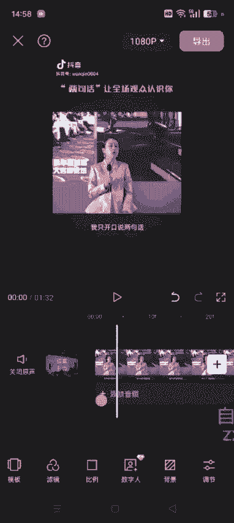

这样的话加进来了，加进来之后，刚才我们截了多少秒，你这儿就要多少秒，对吧？刚才是5。5秒，对不对？然后我们这儿就要5。5秒。呃，稍微有一点误差也没事儿啊，有一点误差也没事儿。然后我们调这个素材，选中它。

调整一下，它这个可以全屏，对吧？然后到时候再去加抬头，把它这个视频的原声关掉。音量关掉。这样的话，我们只用它这个片段，对不对？呃，你看这儿啊。这儿这不是出现了。出现了一段。呃，原来的那个画面呃。

我们尽量在找的截的时候啊，多截一段。出现的原来的这个画面，我们把它去掉啊。然后这儿分隔。把原来这一段去掉，这样的话哎。他就不影响了。然后这一段呢，我们也可以替换，也可以不替换啊。最后你看他这个视频。

其实呃片段并不太多，一个是女讲师在台上演讲，一个就是两个学生在操场，还有一个就是几个女生在这玩，对吧？最后就是这本书。然后还有一段就是这个学生在学习这个片段我们也可以替换掉啊，对吧？我们把它拉长。

然后点分割。看这一段有多少。分割，然后这一段我们可以把它删掉啊，也可以点替换。呃，建议大家是删掉，然后去找在抖音去找这种素材，就认识我，我上。

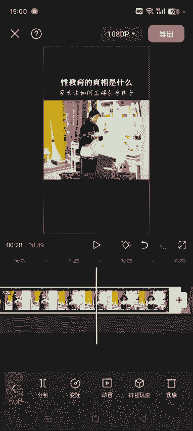

高中生。夜晚。呃，学习。叶晚努力学习吧。🎼那是代。你像这个它没有什么呃，也没有啥也没有字幕什么，我们就直接可以去完水印之后直接去用啊。然后用配音神器去一下水液。呃，大概的这么一个逻辑啊。

就是我刚才实操的这样，就是一些片段，其实我们可以重新打乱顺序，重新组合，或者说直接去其他的地方去找，或者在素材库里面去找啊。

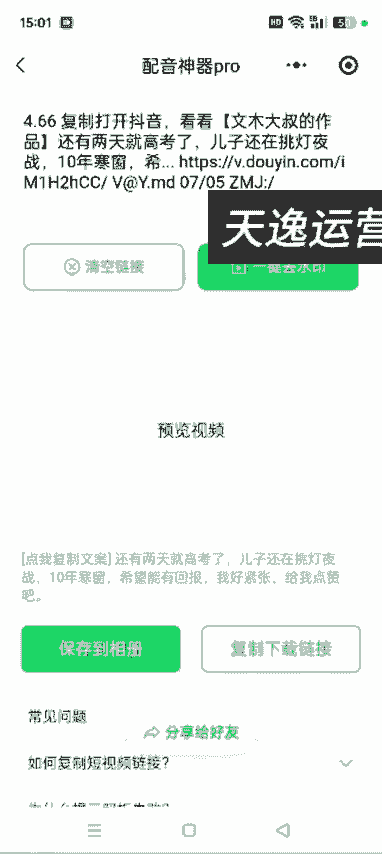

确定。然后我们继续打开剪映。嗯，刚才已经删了，先撤销删除，我看这一段有多长嗯，3。2秒，对不对？我们后面再用的添加的视频的话，我们也截取3。2秒就可以了，然后删掉它。

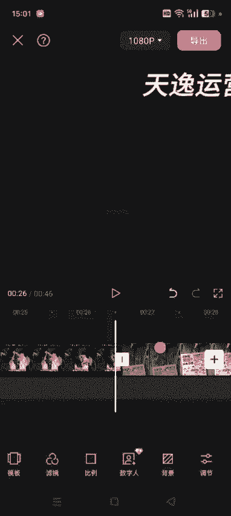

然后添加这是刚才那那个视频，对吧？我们用3。2秒。呃，这个是26秒半的地方，嗯，3。2秒就是29秒半的地方，我们把它分割，对吧？就用这点就行了。峰割，然后多余的地方把它删掉。🎼这样的话就OK了。

这个相当于这个画面又替换掉了，对不对？最后这个画面我们也可以给它替换掉。很多视频就是我们在这个抖音达人秀。商品。销量。🎼到了12岁之后到18岁，这就叫青春期了。青春期。达人秀里面很多视频都在讲。

这肯定是都在讲这本书，对吧？🎼然后我们刚才截取的不是这个视频，然后我们可以用这个视频的最后这个片段放到这个视频里面，等于说我们又组成了一个新的视频，对不对？然后到最后我们再。呃，所有的素材都替换完了。

都替换完了之后，我们再去添加音频。添加音频的话，就用刚才那个音频就可以了。如果它某一某一段不太好的话，就是跟这个原跟这个文案文字和这个视频，某些地方不太匹配的话，我们可以增加或者删除，也可以变一下速啊。

然后提取音乐，就把刚才我们配音神器里边生成的这个配音。搞出来导入就OK了。好哇。呃，然后这个视频如果你操作的时候就是添加或者呃。呃，就就是它如果中间有片段的话，我们这个音频也可以给它分割啊。

音频也可以给它分割，然后左右移动都可以，知道了吧？最后跟这个视频差不多能匹配上就可以了，好吧，呃，这是大概的一个思路啊，然后最后我们再添加上这个背景音乐音乐。选择一个差不多的音乐添加进去。啊。

这样的话就基本上是自己的一个原创的视频了。啊，好吧，呃，这个这时间的关系我就不1。1点的去去把这个视频调整好了啊。然后包括后期生成的这个字幕啊是吧？呃。

这些大家都把它这个原来的我们不替换掉的这些自己生成新的字母给它遮盖一下就好了。然后这个音频的话，呃导入的这个声音啊。

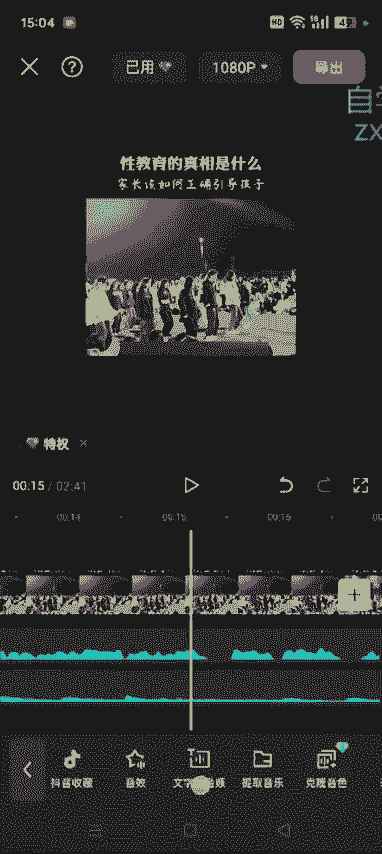

文本识别字幕，然后开始识别。这样的话，你这个新字幕就可以实现了。

然后把这个字幕调整到原来的这这个地方。

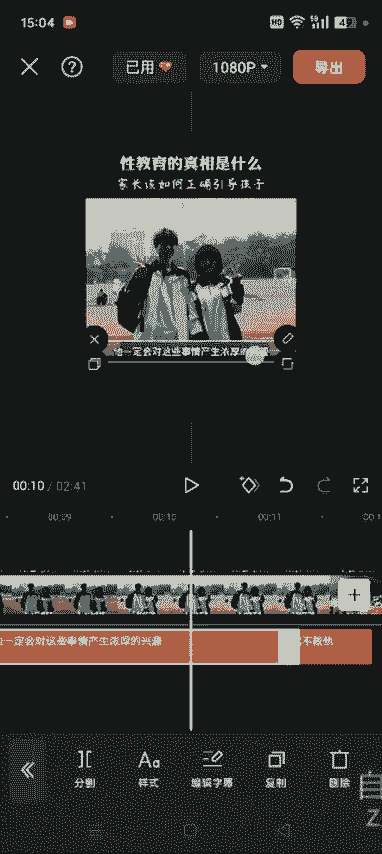

然后加上一些样式就可以了，好吧。

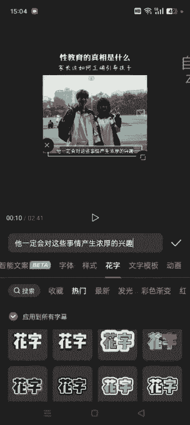

啊，比如说我用这个。哎，然后这样的话就应用到全局了。然后它原视频呃，这些地方都是用的什么字，我们就生成新的字幕，把它原字幕给它遮盖一下。然后这样的话再导出帧率调到60，导出就OK了。好吧。

这样的话就相相当于是自己的一个原创视频了。嗯，算是二创，嗯，原创度肯定比直接混剪的效果要好。好吧，这是一个大概的思路啊，嗯，我们就把里面的部分素材替换掉，替换的时候可以直接抖音去搜，好吧。

然后替换掉的这些字幕啊，这些视频记得把它这个原声去掉啊。🎼要不然跟这个后期的这个声音有冲突了。把它原声去掉，好吧。然后再导出就OK了啊，这个是整个的这个呃逻辑啊。好，这节课讲到这儿。

重在实操啊。

