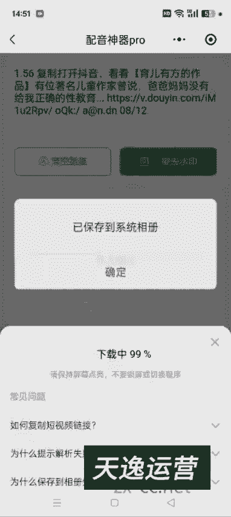
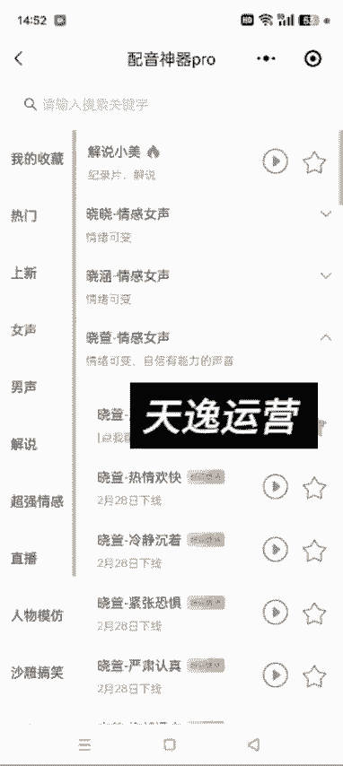
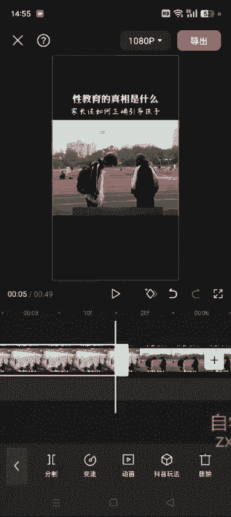
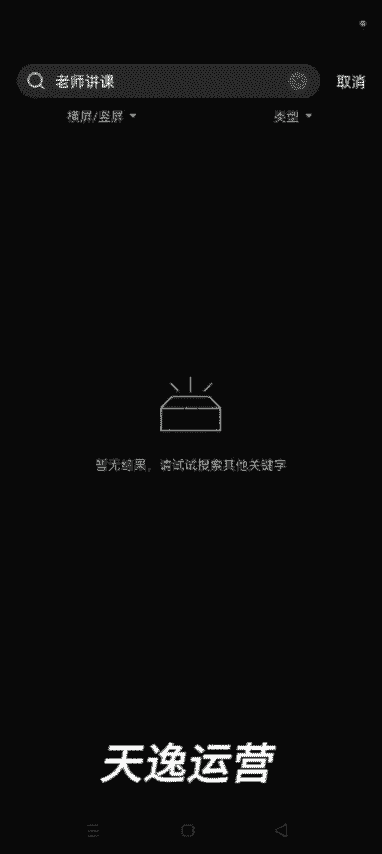
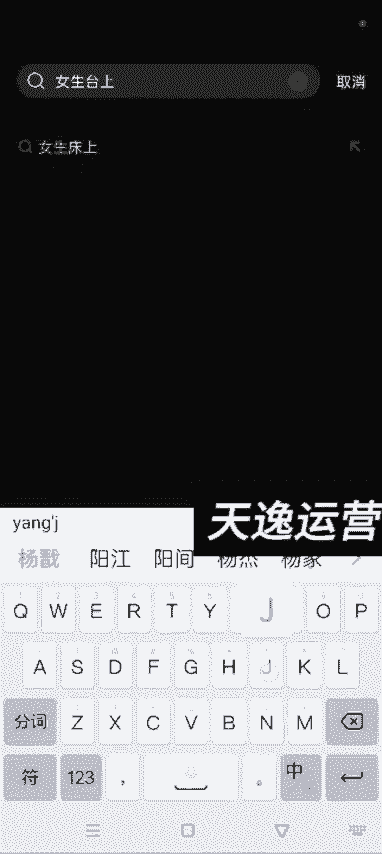
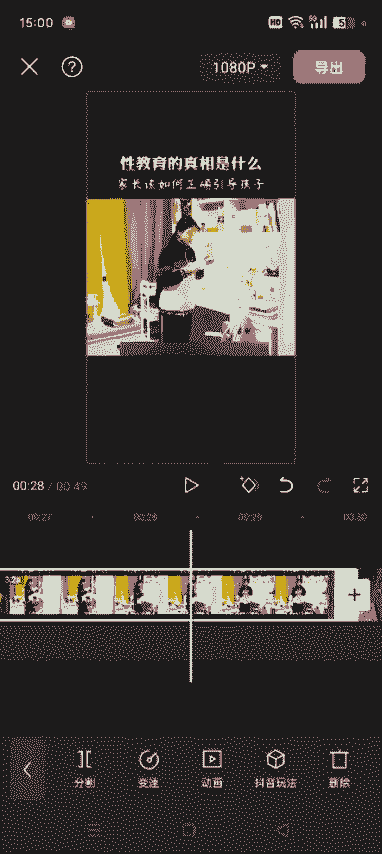
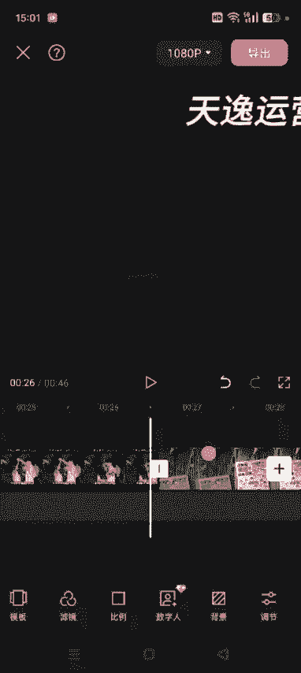
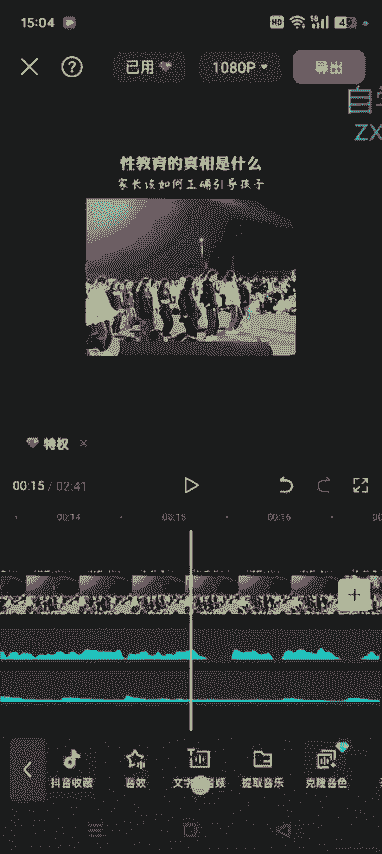
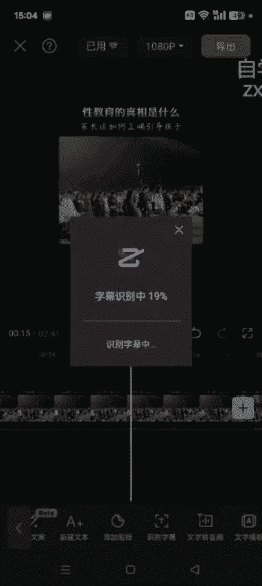
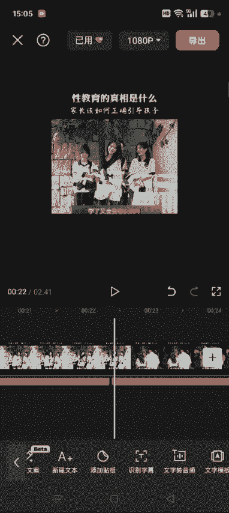

# 【2024版视频号运营教程】全B站最良心的视频号运营高阶教程合集！视频号运营 起号真的不难！ - P36：4.二创书单制作方法一 - 鼓腹含和防护服 - BV1wDWheCEsK

好各位同学大家好啊，这节课我们接着讲，就是我们做不管是做哪一种视频类型嗯，剪辑是必备的技能，很多新手刚开始不熟悉，觉得看我的课程，觉得混剪啊，包括剪辑这些很难，其实就是根源是你剪辑零基础。

你自己先拿十几个视频练练手，熟能生巧，这个真的没有那么难，你花上一两个小时的时间去剪辑几个视频，你熟悉了每一个功能的作用，然后你再去看课程啊，你会发现一看就懂，非常简单呃，第二个我要说的点就是。

我们呃我建议大家做纯视频带货的，你们可以尝试去做书单啊，呃呃我就是你像我们之前是做俄罗斯带货的，还有书单，还有益智玩具啊，还有老照片修复的，但是书单这种类型一直是常青树啊。

嗯只要学员认真做的这种基本上都有出单，然后书单的话就是我们之前的课程，不是讲的混剪一，混剪二混剪三嘛，呃除了按照咱们之前的课程去混剪之外，我们还可以自己去进行二创。

你会发现很多人做视频做的这个书单视频啊，等你们多刷一些这些对标账号，你就知道了，呃其实都是二次创作的，视频素材全部都是来源于网上，这些肯定不是自己实拍的，二次创作呢，说白了就是啊各种视频素材打乱顺序。

顺序重新组合，这种方式呢肯定比拿一条视频混剪出来的，原创度高，呃我们如何去实操混剪啊，这节课就是实操二创，我这节课就给大家讲一下，然后我们要做书单的话，我这儿给大家推荐了十几本。

就是我们就是比如说找素材的时候，可以直接去搜这些书啊，嗯每一行就是一本书，孩子为自己读书，墨菲定律，漫画版，中国通史，走遍中国，告别吼叫的养育话术，这些你直接搜这些关键词在抖音就可以了。

然后找到这些对标账号之后，除了我上面给大家发的这些呃书名之外，你可以看他们的橱窗啊，别人的橱窗里面带的，只要销量在几万以上的这种书，我们都可以去带，知道了吧，所以说理想状态下我们不缺素材，更不缺你。

你卖哪本书，如果你看完课程之后，你再过来跟我跟我说，我不知道带哪个货，带哪个品，那就是你没有认真听我这节课啊，然后做书单账号的逻辑，说白了就是通过一个视频，影视人，影视剧。

电视剧片段或者一段小故事讲出一个道理呃，最后再把某一本书推荐出来，引起读者的购买欲，从而赚钱，你刷多了这种视频，你就明白其中的逻辑了，所以说大家先按照我上面发的这个书单，去搜这些书。

然后通过达人秀的方式，达人秀那一块去找一些这些对标账号，然后自己刷刷呃，找找感觉，然后你就明白了这种账号的底层逻辑好吧，这种肯定是比直接呃，我们像做好物的这种账号。

就一上来就是啊这个保鲜膜怎么怎么怎么好啊，这个呃垃圾袋怎么怎么好啊，比这种直接上来硬广的这种要好得多好吧，然后这节课我我就给大家实操一下，就是我们具体的额在二次创作的时候，应该怎么去找啊。

呃然后我们打开抖音，然后直接去搜索，比如说搜索女孩要懂得保护自己，发现女儿早恋啊，搜女孩要懂得保护自己这本书啊，然后我们搜出来之后点商品，然后点销量，一般这种几万以上的。

肯定他这个这个商品下面都有达人秀，然后我们随便点开一个，然后找到达人秀啊，你看这个260一个，这个达人秀，就是肯定是200多个卖家都在卖这本书，然后卖的都还不错，你看这个点赞量。

他这个视频青蓝图书这个点赞量7。8万，这个是点赞量3。7万对吧，然后像我们做二次创作的话，应该怎么做呢，呃除了按照我之前课程混剪一，混剪二不是性教育的真相，我们之前的这个操作方式。

就是把这个视频保存下来，通过添加画中画啊，或者说呃一些呃反转啊，还有嗯反正各种吧，就是之前课程里面不是讲了八九步嘛，然后去混剪，除了这种方式之外，我们可以二次创作，你像书单的这种账号。

你统一的把他这个视频看完之后，你会发现这种这种素材，我们完全他肯定不是自己的啊，你看你像这个育儿有方，这个他也自己也没有真人出镜对吧，所有的素材全部来源于就是混剪的，然后我们把这段视把这个视频看完。

性教育的知识你不教给孩子，孩子他就会自己去学，那到了一定阶段，他一定会对这些事情产生浓厚的兴趣，你不教他，这个社会就会教他一些坏人，就会去教他，他也会自己去寻找相应的知识去学习。

但是你想想他会从哪学习呢，学了又会去哪实践呢，如果你不知道怎么去引导和教育，有些话还不好意思开口，你可以买本书放在孩子的书桌或者床头，它不光能让孩子把生理问题搞明白，还会给孩子一些青春期心理方面的建议。

关于情感，关于心理，还有该如何应对学习和考试的压力，以及情商的培养，性教育的真，然后我们看完这段视频之后，就会发现他就是通过一段话啊，然后这些这些片段什么的，全部都是网上的素材对吧。

第一个片段你看就是一个呃，也可以说是女老师或者说做培训的对吧，她在这儿在给别人讲，然后往后看真相是什么，他就会自己去学，这个就是呃学生在操场上对吧，你想想，然后这个就是几个女生在这呃或者等车呀。

或者说是在旅游啊是吧，这种片段不好意思开口，然后这个片段就是一个呃中学生啊，高中生啊，他在学习对不对，方面的建议，最后才是这本书，他就是通过这么一句话，把这对这本书推荐出来，像这种的。

我们除了按照之前的混剪方式混剪之外，我们还可以把里面的素材呃，这个把里面的素材可以替换掉啊，然后现在抖音复制链接的话改成分享制了，然后我们点分享制，这样的话就可以把这个链接复制了。

然后我们就把这个原视频保存下来，文案也要提取出来啊，然后去水印粘贴，一键去水印，然后保存到相册。

然后确定，然后我们在文案提取，文案提取出来之后啊，我们做二创的话，建议呃自己重新生成新的配音和字幕好吧，然后所以我们这儿就配一下音，然后配音的话就是你先看一下这个文案，提取出来有没有错别字。

另外你让他嗯你选择这个声音之后，比如说女生情感女声对吧，那女子挽着如意双髻季发。

里面盘着一根鹅黄绒绳，不要恋战，等待时机，随时准备突围，和你聊天很舒服，就比如说我用这个对吧，然后用这个你可以自己先听一下，看他这个呃配音正常不正常啊，如果有错别字的话，就纠正一下错别字，性教育的知识。

你不教给孩子，孩子他就会自己去学，那到了一定阶段，他一定会对这些事情产生浓厚的兴趣，你不教他这个社会，如果某一段感觉他太快的话，我们可以停顿啊，比如说比如说这你感觉他太快，然后让他停顿上几秒，比如1。

5秒对吧，然后让他重新去合成配音，性教育的真相是性教育的知识，然后合成之后，我们把这个配音导出来，这我就不多讲了啊，之前的课程里都有讲，然后下载配音，然后保存，额这节课我主要给大家讲这么一个思路啊。

就是然后我们把刚才去完水印的这个视频，添加进来，高清对吧，我们首先要做的是什么呀，就是呃像他抬头的性教育真相是什么，家长应该如何引导孩子，这些我们可以用它的，也可以自己重新生成。

我建议自己重新添加一下啊，然后这个字幕啊，看一下这个字幕，我们额也可以重新生成，也可以就是把它原的原来的给他替换，那个替换掉啊，遮盖一下蒙版，矩形方法呢咱之前都讲过，我这就一笔带过了啊，然后反转一对勾。

然后返回背景画布模糊，哎，这样的话这个字幕已经给他遮盖了对吧，然后我把他他这个视频的原声给他去掉，视频原声去掉之后，我们开始，找这个片段啊，我们可以把这些片段给它替换掉，比如说第一个片段。

啊先别关原声了，性教育第一个片段就是一个女老师在台上演讲，对吧，然后到这，那这个片段我们就完全可以给他替换掉，然后点分割嘛，这额可以直接从这去替换啊替换。

然后这有一个素材库，看老师讲课。

呃然后没有这个素材老师，女生台上发言吧，演讲也行。

然后这会出来很多很多素材，你看这个素材是不是适合在这个视频里面用啊，大概的看一下是不是适合，如果不适合的话，我们可以直接在抖音去找啊，然后在抖音里面去搜，比如说抖音关于情感，关于，搜这个呃。

女生台上培训吧，女讲师。

培训视频，嗯他这搜出来是商品，我们返回到青春期，一般般人，女讲师培训，综合逼着自己学习这3分钟什么样的站姿，我不说话，我往这一站哎，然后如果觉得这个这个片段可以，然后我们就可以把这个视频保存下来。

用他这个片段对吧，呃尽量找一些没有字幕的啊，他这个有字幕，然后我们就换一个或者说这个记录吗，给你听培训的时，我只开口说了两句话，全场诶，然后这个可以是吧，然后我们呃可以去一下水印。

也可以尽量的去一下水印啊，我这就不去了，因为浪费时间啊，我看能直接保存吗，然后直接保存吧，唉然后保存好了好吧，然后我们打开剪映，剪映刚才我们在素材库里面没有，然后我们就在这个选择替换。

找到刚才的这个视频，开口说，你看你我们刚才是选择了5。5秒，他这也给你替换5。5秒，对不对，然后就把这段视频替换掉了，呃替换的话它有一个好的地方，就是说我们之前这个字幕这有有一块阴影，对不对。

他这个阴影是去不掉的，呃，除了替换的话，我们也可以把原来的视频删除，现在我返回啊，返回哎，这样的话就是刚才分割是在这分割的分割，然后把前面这一段删掉，删掉的话，我们可以重新加我们找到的这一段素材对吧。

然后我们直接点加号，你这个长的这个光标在哪，你这个视频就会加到哪啊，比如说我们点添加，然后高清这样的话加进来了，加进来之后，刚才我们截了多少秒，你这就要多少秒对吧，刚才是5。5秒，对不对。

然后我们这就要5。5秒呃，稍微有一点误差也没事儿啊，有一点误差也没事，然后我们调这个素材，选中它，调整一下，他这个可以全屏对吧，然后到时候再去加抬头，把他这个视频的原声关掉，音量关掉。

这样的话我们只用他这个片段，对不对，额，你看这啊，这这不是出现了出现了一段呃，原来的那个画面呃，我们尽量在找的截的时候啊，多截一段出现的原来的这个画面，我们把它去掉啊，然后这分割把原来这一段去掉。

这样的话唉他就不影响了，然后这一段呢我们也可以替换，也可以不替换啊，最后你看他这个视频，其实呃片段并不太多，一个是女讲师在台上演讲，一个就是两个学生在操场，还有一个就是几个女生在这玩儿对吧。

最后就是这本书，然后还有一段就是这个学生在学习这个片段，我们也可以替换掉啊对吧，我们把它拉长，然后点分割，看这一段有多少，分割，然后这一段我们可以把它删掉啊，也可以点替换呃。

建议大家是删掉，然后去找在抖音去找这种素材场就认识我了，我上高中生，夜晚呃学习夜晚努力学习吧，白雪的，你像这个他没有什么呃，也没有啥也没有字幕什么的，我们就直接可以去完水印之后直接去用啊。

然后用配音神器去一下水印，呃大概的这么一个逻辑啊，就是我刚才实操的这样，就是一些片段，其实我们可以重新打乱数据重新组合，或者说直接去其他的地方去找，或者在素材库里面去找啊。

确定，然后我们继续打开剪映，嗯刚才已经删了。

先撤销删除，我看这一段有多长，3。2秒，对不对，我们后面再用的添加的视频的话，我们也截取3。2秒就可以了，然后删掉它，然后添加，这是刚才那个视频对吧，我们用3。2秒，额这个是26秒半的地方嗯，3。

2秒就是29秒半的地方，我们把它分割对吧，就用这点就行了分割，然后多余的地方把它删掉，这样的话就OK了，这个相当于这个画面又替换掉了，对不对，最后这个画面我们也可以给他替换掉很多视频。

就是我们在这个抖音达人秀里面，商品，销量到了12岁之后到18岁，这就叫青春期了，青春期达人秀里面很多视频都在讲，这肯定是都在讲这本书对吧，然后我们刚才截取的不是这个视频。

然后我们可以用这个视频的最后这个片段，放到这个视频里面，等于说我们又组成了一个新的视频，对不对，然后到最后我们再呃所有的素材都替换完，都替换完了之后，我们再去添加音频，添加音频的话。

就用刚才那个音频就可以了，如果他某一某一段不太好的话，就是跟那个原跟这个文案，文字和这个视频某些地方不太匹配的话，我们可以增加或者删除，也可以变一下速啊，然后提取音乐。

就把刚才我们配音神器里边生成的这个配音，搞出来，导入就OK了，好吧，呃然后这个视频如果你操作的时候就是添加，或者额呃，就就是他如果中间有片段的话，我们这个音频也可以给它分割啊，音频也可以给它分割。

然后左右移动都可以知道了吧，最后跟这个视频差不多能匹配上就可以了，好吧呃，这是大概的一个思路啊，然后最后我们再添加上这个背景音乐，音乐选择一个差不多的音乐添加进去啊，这样的话就基本上是自己的一个。

原创的视频了啊，好吧呃，这个时间的关系，我就不一点一点的去去把这个视频调整好了啊，然后包括后期生成的这个字幕啊是吧，额这些大家都可把它这个原来的，我们不替换掉的这些自己称成新的字母，给它遮盖一下就好了。

然后这个音频的话嗯导入的这个声音啊。

文本识别字幕，然后开始识别，这样的话你这个新字幕就可以实现了。

然后把这个字幕调整到原来的这个地方，然后加上一些样式就可以了，好吧，比如说我用这个哎，然后这样的话就应用到全局了，然后他原视频这些地方都是用的什么字，我们就生成新的字幕，把它原字幕给它遮盖一下。

然后这样的话再导出帧率调到60，导出就OK了好吧，这样的话就相相当于是自己的一个原创视频了，嗯算是二创，那原创度肯定比直接混剪的效果要好好吧，这是一个大概的思路啊，额我们就把里面的部分素材替换掉。

替换的时候可以直接抖音去搜好吧，然后替换掉的这些字幕啊，这些视频记得把他这个原声去掉啊，要不然跟这个后期的这个声音有冲突了，他把他原声去掉好吧，然后再导出就OK了啊。

这个是整个的这个呃逻辑啊。

