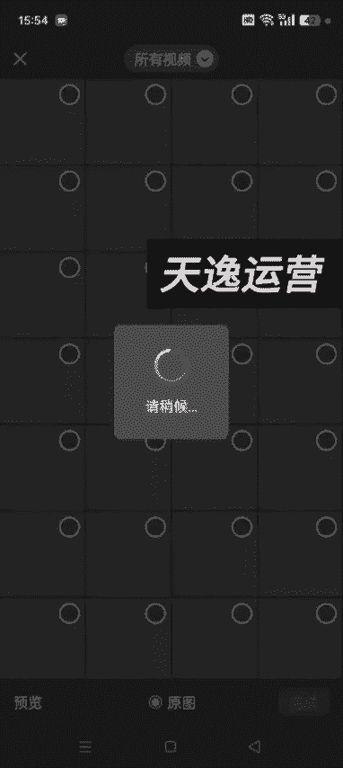
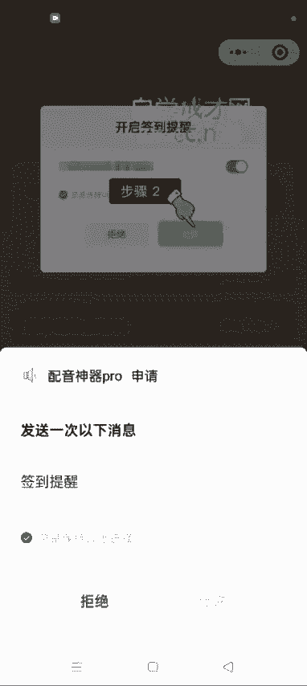
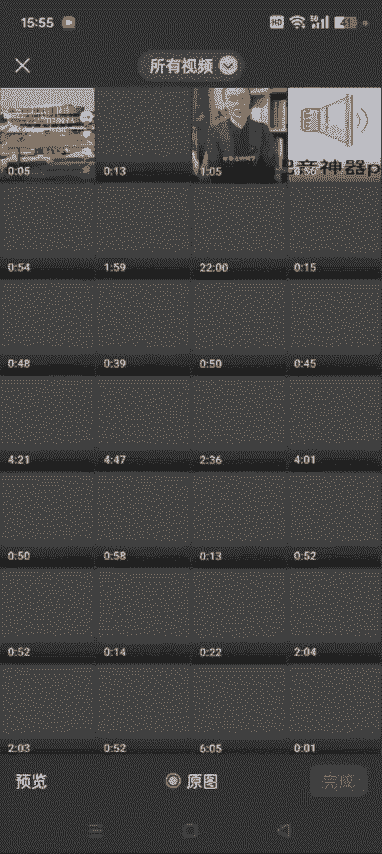
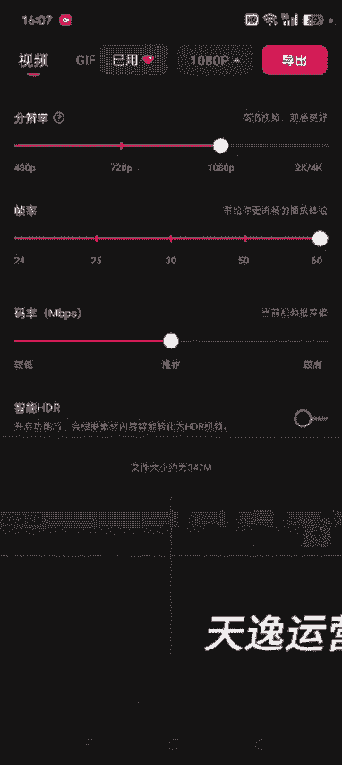

# 【2024版视频号运营教程】全B站最良心的视频号运营高阶教程合集！视频号运营 起号真的不难！ - P37：5.二创书单制作方法二 - 鼓腹含和防护服 - BV1wDWheCEsK

好各位同学接着给大家讲啊，就是如何做这个原创书单，额我们比如说就是走进大学城这这本书，然后我们直接抖音搜，然后选择商品，然后点销量，这就是不读书的人生，三个是我们在他这个达人秀里面去找视频。

比如说这个视频，这些大学上学就跟度假一样，一汕头大学这个视频总时长是1分58秒，然后能在孩子心里种种下大学梦，让他知道今天的努力决定他明天的去处，眼界和认知才是给孩子更好的礼物，我不会逼我的孩子读书。

但是我会告诉他，如果你喜欢玩游戏，就去传媒大学，那你定金专业的作业就是玩游戏，还能让你做出刺激，你像这个视频它前后是声音是不一样的，像这种的我们呃其实也可以做啊，也可以，只要前半部分也可以。

全部的视频都要怎么操作呢，嗯同样道理啊，就是复制链接去把这个视频让他去了水印，我这边已经去完了啊，我就不过多的操作了，然后打开剪映，把原来这个视频分割。

我们逐断的去提取它这个文案啊，这个是那个原视频，然后我们添加进来，添加进来，在这个声音不一样的地方给它分割掉，哇呃可以把这个视频拉长啊，拉长到每一帧，这样的话你截取的时候，他不会说出现重复的这个视频。

比如说应该是在这个地方五十三五十三秒的，这有这个时间啊，53秒的地方，然后我们把它分割呃，后面这半部分不要，然后我们要前半部分的这个文案，然后我们把它导出出来，我这边也已经导出了啊，我这边就不多操作了。

然后导出来之后在配音神器里面，配音神器里面可以，就是通过你的这个视频相册的视频。

去把这个文案提取出来啊，这个是我导出来的，然后一样可以提取文案啊。

要不换一个吧，配音神器，配音神器，这个如果你号多的话，你像我这样好几个微信是吧，这都无所谓，号少的话，你就每记得每天签到啊。

每日福利这去签一下，到签到的话，他有金币吗，不是啊。

然后我们把这个文案提取出来，通过相册的视频提取出来啊。

提取出来之后我们就开始配音就行了，我这边也已经提前配好了，为了节约时间啊，呃这些大家应该都会，然后就开始配音就行了，选择这个呃适合的这个文案，适合的这个声音，然后导出这个配音就行了，知道了吧啊。

我这不不过多的操作了，我重点讲一下在剪映里边怎么操作，然后这个如果你想要这个全视频的话啊，想要这个整个视频的话都行，或者说你只要前半段也行，我这这是全视频的，全视频的，这个我们就在这个分割的地方。

53秒的地方，给它分割掉，呃这半部分后面我后半部分我们在操作啊，这额操作方法跟上节课讲的一样，先把这个可以可以把这个字幕啊，字幕先用那个嗯蒙版给它去掉字幕，或者说你后期生成新的字幕。

把它原字幕遮盖一下也可以啊，呃我们这儿在这儿呃，在这替换一些画面，你像这个画面，我们把它拉到每一帧啊，把这个视频拉长，可以看到这个就是一群这个大学生，这个毕业典礼对吧。

然后我们在抖音去搜这个毕业典礼的这个视频，把这一块替换掉，分割你看这有几秒，这是三秒是吧，然后我们在抖音去搜啊的游戏，17岁的少年回到首页，从来没有去搜这个，我刚才也搜了，高校学生毕月川。

你像这个视频我们就可以直接用嘛对吧，然后我们保存下来，我这边也已经提前保存好了，然后打开剪映额，把选中的这个视频啊，就是你想替换的，把它删掉，然后添加进去添加，找我们选中的那个视频，哎我看看我这开口哦。

没找，我在下面前没下载下来，我们就呃去水印，我这边就不去了啊，我就直接保存了，和我说了两句话，然后我们把刚才这个视频哎，啊啊这是那个视频，添加进去我们只需要要三秒，因为我们删除了三秒。

然后我们这边也也只需要要三秒就行了啊，你要不要的太长，后面的话跟你原来的那个视频，他这个音频就配不上了，然后分割这删除，然后往后花三秒，六分半的时候到九分半，我们只要三秒，多余的删掉。

然后中间加一个转场，一般是加个叠化就行了啊，啊这也加一个电话，那本科是加了，然后把他这个是加的这一段，这个视频的原声给它关掉啊，音量调到零，然后这些也也给它关了啊，呃你像后面的这些画面啊。

这儿有一段打高尔夫的，这个我们也可以直接在抖音去搜美女，打高尔夫视频啊，然后把这一段给他替换掉，包括这些也可以替换掉啊，就是这个装修直接在抖音去搜，你比如说这段是吧，他这不是就是讲这个视频。

他这个宿舍是单间嘛，然后我们就直接在抖音去搜啊，就是装修好的室内格局的这个视频，然后把某一段给他截取掉换掉，这样的话等于说是我们二创嘛，然后素材替换一些啊，也可以留一些，你像这些这是一个女生在这儿呃。

看书啊，或者弹钢琴啊是吧，然后你这个就是大概的意思，跟他这个原视频差不多，额这个格调什么的都差不多的，我们就直接替换掉就OK了好吧，然后替换掉了之后，包括后面这这个推荐书的这段视频呃。

像达人秀里面很多的视频他都在有这本书啊，啊就是我们尽量的那个替换视频里，一到两个素材画面搞完了之后，然后我们再添加这个配音啊，把他这个所有的原视频都关掉，我们再添加我们这个刚才用配音神器配出来的。

这个音啊，我这边配好了，然后添加进去一汕头大学，又名免费大学，2019年对吧，这样就OK了，然后看一下这个声音，跟这个视频的长度是不是匹匹配，如果不匹配的话，长了或者短了。

如果你看现在这不是相当于这个呃音频长，但是视频短嘛，我们可以把这个呃再多加一些，可以根据他这个文案多加一些这个片段进去，或者说你把这个视频给他变一下速啊，常规变速，看这样差不多能对齐就可以啊，现在长了。

长了的话，我们再让它稍微短一点，这还是厂，二长你可以到时候可以截取那个删除一点啊，大概就这么个意思，不变速的话，你就呃如果就是太长的话，你就让它变慢一点，如果太短的话，你就让它变快一点啊。

或者说你添加一些素材，保证这个音频跟这个画面差不多，能匹配的时候就可以了啊，多余的部分把它删除呃，实操的时候大家根据每一个视频，肯定是每一个视频跟每一个视频都不太一样啊，到时候就是精准的调出来就OK了。

好吧就是这个意思，后面的话你看啊，后面这一段我们可以要他的视频原声，要他的视频原声，但是这个画面你可以换一下是吧，画面你可以换一下，你像这个就是一个成熟稳重的女性，在在这搅嘛对吧。

然后我们就根据他这个画面去提示，去去直接去搜就行了，成熟稳重的女性角色，这个时代不在意味是清纯，接下来我们要拍一群教教的，然后我们就直接用这段视频也行，但是这个画面尽量的让它短一点啊，尽量的短一点呃。

最好是不要过多的出现某一个人的这个脸啊，什么的，防止你像这种这种大号的，你像他这个粉丝特别多的这种啊，这个这个粉丝不是太多，有的粉丝可能几百万的这种，他有可能让你这个到时候人脸验证什么的。

我们尽量就是这个出现呃，鸣人的这个人脸的时候，我们尽量的就是让他画面稍微稍微少一些，啊啊这个是，你像这些地方对吧，你像他这个，这不是这个女的说话的时间挺长嘛对吧，然后这儿出现游戏。

你可以把某一个片段加上一些游戏的画面对吧，这样的话嗯跟你这个视频也就匹配了嘛对吧，然后整个的把这个视频导出来，这就是自己的原创视频了，对不对，好，那个，这就是整个的这个二创书单的这个玩法思路啊。

呃详细的就是大家找呃十个八个视频，你搞上搞上十个八个视频，然后你肯定就熟悉了，我就是大大概的这个视频，大概的把这个原思路给大家讲一下，其实我一边讲一边实操，比较慢，但是大家在实操的时候其实很快的知道吧。

就是56分钟你熟悉了之后，大概就是最多10分钟就能搞一个视频，如果前期慢，可能你一两个小时搞一个视频，刚开始都这样，知道吧，我刚开始学剪，学剪映的时候，我弄了三四天，我才慢慢的熟悉，有很多是零基础的。

但是你不要怕，这个就是熟能生巧，就跟我们走路一样，你刚开始走路，你走都走不稳，只会爬，对不对，后期你走稳了，然后又开始跑了，这不都是熟能生巧嘛，剪辑道理一样，知道吧，不要上来就抱怨他这个难啊。

或者说不好弄啊，那就是因为你零基础，你弄得多了，你那些天天干剪辑的，为什么他能够通过这个挣钱啊是吧，剪辑是一个月好几千甚至甚至好几万的，这种为什么能够挣钱啊，就是就是因为他熟悉了，你说这个东西他有什么。

又不是说让你研究原子弹的有多难啊，对不对，就是熟能生巧啊，不要再说不好弄不好弄，就是因为你太懒，你没有认真的去实操，你弄上100个视频，你看看你这个剪辑水平是不是会突风突飞猛进，对吧好。

这就是整个二创书单的这个思路啊，我们就是替换某些片段，然后最后呃把这个声音用配音神器重新生成，生成，生成生成之后，然后记得最后添加一个背景音乐啊，如果你用的这个视频。

它一般我们都是你像这一段儿送给孩子一套大，我们这不是用配音神器重新生成生成的嘛，然后这段它只有这个文字，就只有声音，但是没有背景音乐，我们记得添加一个背景音乐啊，添加一段音乐进去，添加音乐进去之后啊。

然后最后记得也生成那个文案，把他这个原生成字幕，把它原字幕遮盖一下，知道了吧，然后剪映会员的话其实也不贵，20块钱一个月额，建议是搞一个啊，然后我们在文本里面他有这个识别字幕的功能。

就是它可以直接识别字幕嘛，就把它原字幕遮盖一下，然后编辑样式，哎这样的话就把它原字幕遮盖住了，对不对，这些大学上学就，这些大学上学就跟度假一样，一汕头大学定名免费大学，2019年开始，所有本科。

然后长度也可以调啊，这些都可以调，后期大家就是制作视频的时候先练练手，然后后期你在一点一点的精准的去调就OK了，好吧，你像这段我添加进去的，我没有去水印，大家在实操的时候，你就去一下水印。

然后用其中的这某一个片段就OK了好吧，记得一定要不要让它出现抖音的水印啊，然后这个你如果不想去的话，你可以把它放大一下，把原字幕，把原来的那个水印给它遮盖住也行啊，不去水印也行，建议是去一下好吧。

然后最后选择呃60帧，然后分辨率1080P呃，码率这个就是推荐就行，然后导出就OK了，这就是自己原创的视频。

好吧好。