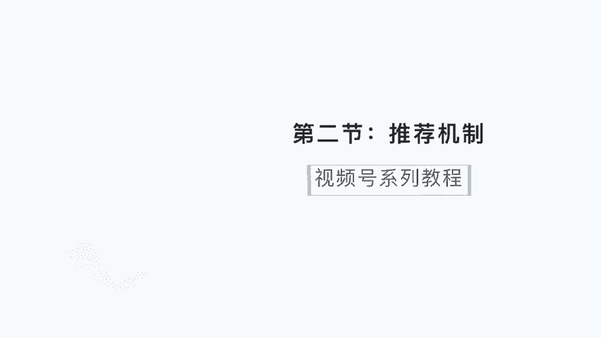
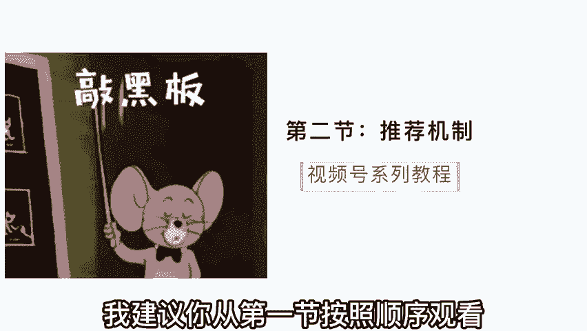
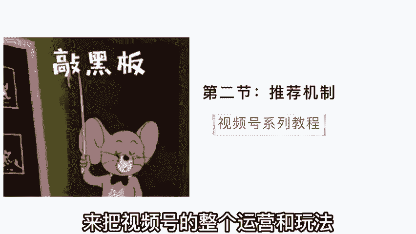
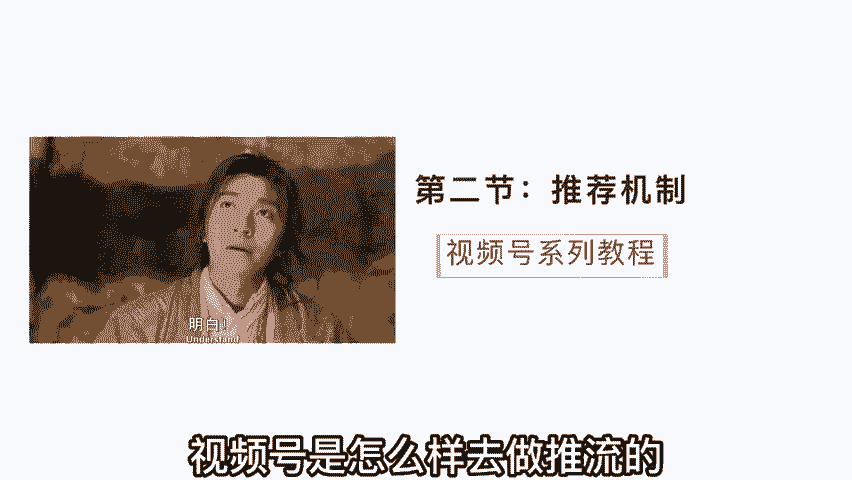
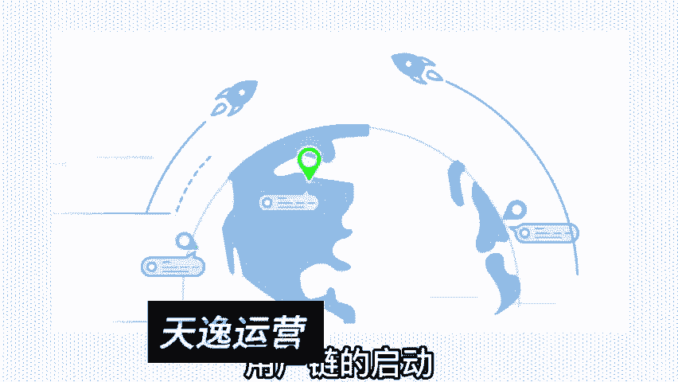
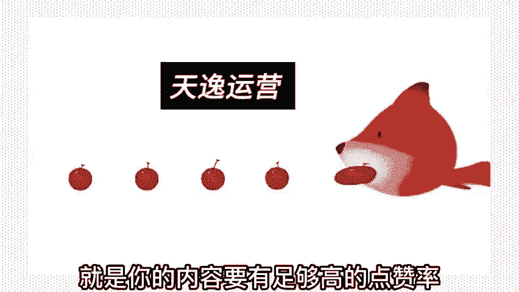
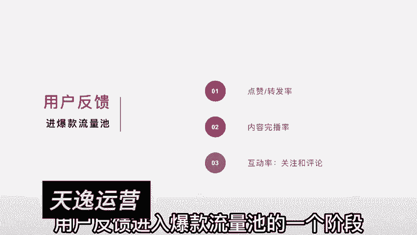
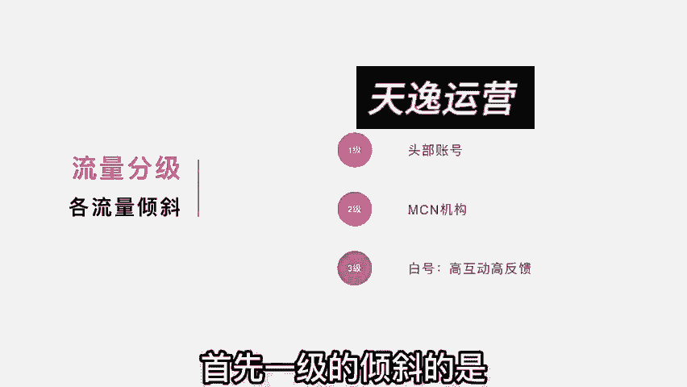
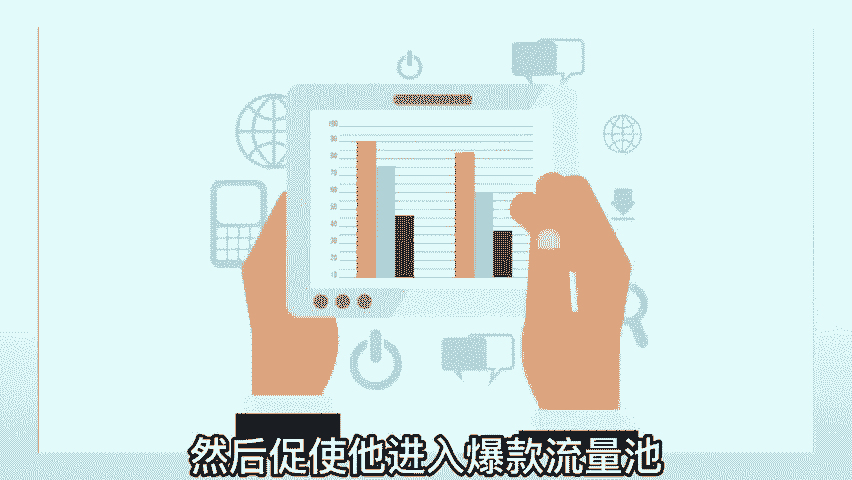
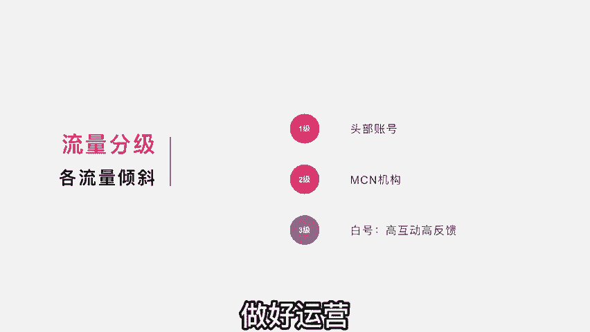

# 【2024版视频号运营教程】全B站最良心的视频号运营高阶教程合集！视频号运营 起号真的不难！ - P3：第二节：解剖推荐机制~ - 鼓腹含和防护服 - BV1wDWheCEsK

视频号怎么做，今天来到了第二节，如果你是空降的，这节的话，我建议你从第一节按照顺序观看。

我一共会出五节的教程，来把视频号的整个运营和玩法给他讲通透。

今天呢我们来讲推荐机制，推荐机制的话和抖音有不一样的啊，一些推流方式啊，所以我希望大家能够充分的理解。

视频号是怎么样去做推流的，千万不要拿抖音的那套推荐逻辑，用来放在视频号上面，因为呢在之前啊，我也看过有很多人在做视频号的培训，而且呢我也花了不少钱去听一些课，但实际上听的反馈非常差。

有很多人甚至直接把抖音的那一套换成视频号，直接开奖，实际上这是误导人的，特别是在这个底层逻辑误导性非常非常强，一旦从这块走岔了道，那么在之后啊基本上就是一步错瀑布座，那推荐机制是怎么回事呢。

首先啊视频号它的推荐机制与抖音不同的是，它是基于社交链来做强启动的，什么叫社交链呢，打个比方啊，现在呢你看到了一个视频，然后你点赞了这个视频，点赞之后呢，你的好友的那个男，都会看到你所点赞的视频内容。

你看这点和抖音就有很大的区别了对吧，抖音这块的话呢，你把你自己喜欢的那一个栏给它关掉，你点赞啊，个人的隐私比较重，别人呢也看不到对吧，也不可能分发给你的朋友，但是视频号不一样，为什么说它基于社交链启动。

就是因为在视频号里面你点赞了我的视频，这样呢你所有的好友都知道你点了这个视频，并且这个视频会推送到你的好友那一面，就开始循环的做了社交链，用户链的启动。

所以我们可以把它理解成三个板块，第一初始用户的冷启动，打个比方，你看到了我的视频，你是我的初始用户，你看到这条视频之后，你觉得诶这个视频讲的非常不错，非常认可，你觉得挺好的。

你可能会产生转发点赞这样的一个动作，一旦你点赞，那你的好友都会看到我这个视频，然后点赞之后呢就会辐射一环社交圈，你的好友看到这样视频觉得又很不错，你的好友点赞了，这样你好友的好友诶也会看到这个视频。

推送到更大的一个外环圈儿里面去了，所以你看看它基于一个点的社交来做延伸，然后无限延伸。

当然这里有一个前提，就是你的内容要有足够高的点赞率。

观众要认可啊，在这个认可这块的话，待会儿我会重点来讲一讲，当然呢他做这个推荐机制的目的是干嘛呢，是为了启动初始的流量，然后进入更大的一个公寓推荐，在第一节的时候呢，我们讲到他的具体属性啊。

我们也知道这个平台呢，是偏向于私域型的平台的，所以如果只是在一个私欲的一个池塘里面转，是没有太大意义的，都是那些人看对吧，所以你看当这个用户的一个数值，达到某一个阈值之后，这个阈值的话，根据不同的领域。

它的体量是不一样的啊，打个比方，我是属于知识博主，我这种内容呢，我的这个阈值是拥有啊200次点赞，然后辐射到2000次人观看，这是一个阈值，达到这个阈值之后呢，平台会认定这个内容是属于比较不错。

比较优质的内容，他会把我的内容放到公寓的一个池子里面，就会有很多的陌生人都能够接到，这样的内容推送，所以他的一个初始启动是从初始的用户做，能启动点赞后辐射一环的社交圈。

然后来做内容的反馈判定达到一个阈值之后呢，它会进入一个公寓流量，所以你在刷视频号的时候，你一定会发现有很多的视频是你的好友点赞的，推给了你对吧，但是呢还有很多视频啊是你的好友也没点赞，就是官方推给你的。

这个就是纯公寓，你要理解他的推荐机制，就是两个推荐机制结合，一个是由你的好友啊，由社交链来启动，然后再加上纯公寓的推荐，这两者在推荐机制里面是有很强的关联的，说到这呢，大家没有那么很容易理解对吧。

有点绕啊，呃我再简单的来去做一个解剖，我们可以把这个流量分为，一级流量和二级流量啊，从一级辐射到二级的传播，什么叫一级流量呢，就是比如说我的这个号里面有1万个粉丝，这1万个粉丝就属于一级流量。

当我的内容发布之后呢，就会推送给这1万个粉丝，那这1万个粉丝有的粉丝会点赞，有的粉丝会转发，你看他们在所做的互动的动作，就会引入到二级流量，比如说他点赞之后，他的好友就看到了。

哎你看好友就是属于二级流量，他的好友在点赞他的好友的好友又看到了，他好友的好友又点赞他的好友的好友，好友又看到了，所以是通过一级的辐射加二级的传播，这样去蔓延开来的，刚刚听得有点绕啊。

但是我相信你听到这里，大概的明白他的整个推荐逻辑，推荐机制是怎么样的啊，我们再回到内容层面，运营的层面来看待这个事，要想做出爆款，有一个很关键的点，就是点赞转发的这么一个动作。

而且呢平台也会根据用户的反馈来决定，这个内容会不会进入更大的一个公寓流量池，那用户的反馈有哪一些呢，首先排在第一个的一定是点赞和转发率，刚刚我们讲到了点赞的重要性，一旦点赞，那么他的好友都会收到推送啊。

这个权重是非常非常高的，第二个呢就是内容的完播率，这个我就不多提了，因为大家做抖音都知道完播率是什么意思，第三个呢是内容的互动率，互动率的话主要是在于评论和关注这块，你看这是一个用户反馈。

进入爆款流量池的一个阶段。

但是要想要获得点赞，高的转发高的啊，达到这样的一个阈值，是需要有很强的内容来做驱动的，你想想看，当你的观众看到你内容的时候，他为什么会点赞呢，你的点赞触及了他哪一个点，以我们在做视频号里面的经验来说啊。

有一个很关键很关键的点，对于点赞的促进来说是非常有用的，就是动情促进高互动，更易催生出爆款，什么叫动情呢，这个情啊有很多，比如说感动之情，我们看到一个做扶贫的，或者是一个做公益的哇。

他所做的一些行为让人特别感动对吧，或者是那种呃父母对孩子的爱让人很感动，或者是子女对父母的那种关心，那种爱意，很感动，以及夫妻之情的这种爱让人很感动，你看感动之情容易击破人的心理防线。

然后呢他就会产生点赞，产生高互动这样的一个行为，当然啦除了感动之情，还有很多的情呀，比如说骄傲之情，比方说咱们中国崛起啊，不再像以前那哇高铁各个基建做得非常棒，非常好，这让人振奋人心。

让我感觉到特别的骄傲，诶你看骄傲之情也是促进我们进行点赞，进行高互动的内容，还有什么呢，还有感性之情对吧，比如说一个女性啊，她看到关于女性为家庭付出了很多的内容啊，她会感同身受。

她会促进她的感性的那一面，然后他会觉得啊，这真的说出了我内心的想法，说出了我的心声，做女人啊太不容易啦，赶紧给他点个赞对吧，所以你会发现诶情是最容易促进高互动，而且更能催生出爆款的内容。

这也就解答了为什么在视频号里面的头部爆款，出的最多的永远是情感号，朋友们，你们现在可以去查一下数据，就是在视频号里面的啊，数据优秀的，然后经常上榜的这账号，你会发现十个账号当中。

至少有四个到五个都是情感领域的，因为情能够促进他们的搞互动，这也就是进一步的验证了，我刚刚所说的整个推荐机制和推荐逻辑，当然了，你光是做这个情感领域也不太理想，因为你还要了解他的整个流量分级。

和它的整个运营模式，并不代表你只要去做情感领域就一定会报，并不是这样的啊，那我们下一步来看看它的整个流量分级啊，分别倾斜了哪些板块呢，我们把流量这个整个分级分为三级啊，第一节倾斜的是最多的。

第二节是其次的，第三节倾斜的比较少的，所以我们按照这个依次的来去做一个分析，首先一级的倾斜的是头部的账号。

比如说啊一些情感类的大号，你会发现他每周都在榜首啊，每周都在前面，为什么呢，是因为平台本来就给了他们，很大很大的流量倾斜，这些头部账号会直接吃到公寓，流量很大的一个扶持，第二节呢是MCN机构啊。

MCN机构呢是给这种流量扶持，一般呢都会直接给流量包。

或者是一个流量倾斜包，MC旗下的一些账号，在发布作品之后会受到一部分的倾斜啊，当然这两者是有区别的啊，头部账号的话会得到大力的流量倾斜，给他灌进去，而MCN机构的话会给到一部分的流量倾斜。

然后看它的整体反馈来跑起来反馈好啊，可能会进入爆款或者是进入更大的流量池，三级流量呢主要是一些白号，比如说你这个账号呢不属于头部，也不属于某MCN机构旗下，也就是属于一个素人玩家的一个白号。

那你这个账号要想得到流量的加持，你就需要有高互动，高反馈，也就是我们刚刚所说的获得比较高的点赞，高的转发，那么这样子呢，你的内容就会有机会进入更大的一个流量池，成为爆款内容。

OK我们来回顾一下刚刚所讲的东西，视频号的推荐机制诶，它是由两部分组成，一部分是用户的初始流量来作为一个驱动，第二部分是用户驱动之后进入公寓流量池，这两者结合起来，这里有一个很大的问题就出来了。

就是我在没有用户做冷启动的时候，我的号怎么运营起来，这个问题呀是最终核心的问题啊，我做视频号，我建议这样子，就是你要先从公寓去把你的初始流量抓起来，什么意思呢，比如说我现在做视频号，我绝对不会傻乎乎的。

只在视频号里面生产内容，绝对不会，我会先从抖音这样的公益平台运营，去把这些流量抓取过来。

然后把这些流量抓取过来，作为我的初始流量，我拥有了这部分初始流量之后，然后我重点来拔高他的互动，点赞转发这样的一些维度，然后促使他进入爆款流量池。

获得更多的公寓流量，这才能够正确的理解视频号的定义，以及我们应该怎么去定位，做好视频号。

