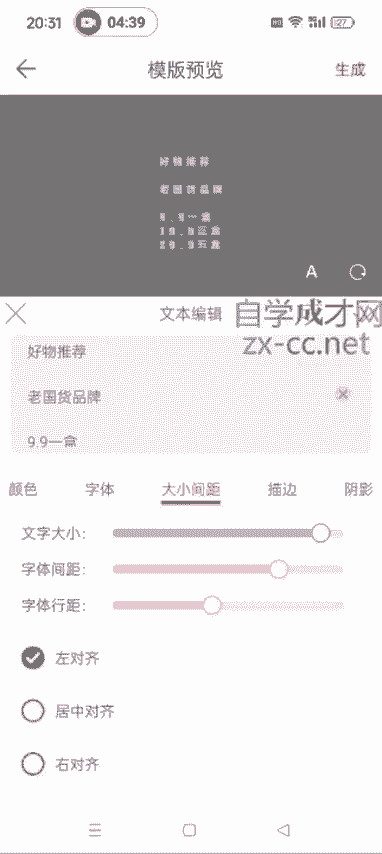

# 【2024版视频号运营教程】全B站最良心的视频号运营高阶教程合集！视频号运营 起号真的不难！ - P40：3.如何制作直播间贴图 - 鼓腹含和防护服 - BV1wDWheCEsK

好各位同学大家好啊，就是呃我给大家说一下，就是我们在开直播的时候，有的时候你看有的那些直播间，他会有这么一个贴图，就是好物推荐，老国货黄氏霜，九块九一盒，19块九三盒，29块九五盒。

像这种贴图他是怎么做的啊，这种贴图怎么做的，其实微商水印相机就可以做啊，大家在大家在应用商店下载一个微商啊，水印相机，现在他是叫那个微脉水印相机啊，之前是叫微商水印相机，大家直接搜。

就微麦水印相机进来之后，我们去找这个往下滑啊，不需要开会员啊，我们用那个不是会员的那个功能也可以完成，这儿有一个水印库，看到没，暂不开通，然后我们就点击更多水运，然后水印模板，在里面找到横竖文字。

比如说用第一个，这个是吧，然后我们就可以写上好物推荐，然后嗯老国货品牌，呃我这个是以这个他这个为例啊，就其他的品类，你看看别的直播间写的什么，你就直接模仿就行了，九块九一盒。

19块九两盒是19块九两盒吗，啊19块九三盒，29块九五盒啊，我就大概这么写一下，告诉大家是怎么做的，然后这个颜色可以变啊，好推荐，这个颜色可以变，你比如说你想要彩色的是吧，下边这种的都可以变啊。

知道了吧，粉色的也可以，然后字体也可以调，OK了是吧，然后这个呃最重要的是这个背景色啊，背景色这然后这儿可以调节这个背景色，背景色我们一定要选择这个啊，没有背景的，这儿有一个斜杠呢，这个看我点的这儿啊。

一定要点这，知道吧，不要选择这种有背景的，有背景的，到时候进去之后它就不是透明的了，知道了吧，它相当于是直播间呃，你这几个字后面还他不像他那种，就是呃全透明的，全透明的啊，一定要选择额，像这种透明的。

不显示背景的啊，不显示背景的都调到零，然后点一下这，然后点生成就OK了啊，到时候你就可以在你的直播间去加上这个图了，然后给大家演示一下啊，稍等。

然后比如说我们发起直播直播对吧。

然后这个画面里面加上这个贴图。

在选择这个手机相册的图片，我刚才没保存上，再保存一下啊，然后点开这个你刚才做好的这个，让它存入相册啊。

然后直播的时候用哈，画面贴图，手机相册选择确定。

哎，这样的话就加进去了，你可以调整啊，调整它这个大小，然后加到你的这个直播间就可以了，知道吧，如果字号太小的话，他这里面可以调节这个字号啊，我可以继续编辑它。

字体大小间距，文字大小，这个都可以调字体行距啊，都可以调，然后大家到时候需要的话，你就自己在这去搞一个贴图就行了啊，然后再点点生成啊。

