# 【2024版视频号运营教程】全B站最良心的视频号运营高阶教程合集！视频号运营 起号真的不难！ - P40：5.如何开启一场直播 - 怡宸WQ - BV1yhpjeKEnc

好，各位同学大家好啊，这节课给大家讲一下如何开始一场直播啊。然后我们就是你确定了好自己的品之后，发完视频之后，等视频有了不放量，1000左右，然后就提前准备好话术。

然后把那个要直播时如果万一没不进人的话，把那个提前要补发的视频提前准备好，准备到草稿箱，然后就可以去开播了。如果当时你没有时间直播，不方便的话，视频报了，如果不方便直播的话，一定要先创建一个直播预告啊。

比如说你哪哪哪会儿有时间提前创建好。这样的话，他们呃想看你直播的人，他会提前预约。呃，预约的预约好了之后，等你开这边开播的时候，他那边就会第一时间收到提醒啊。然后我们嗯点发起直播啊，然后点直播。

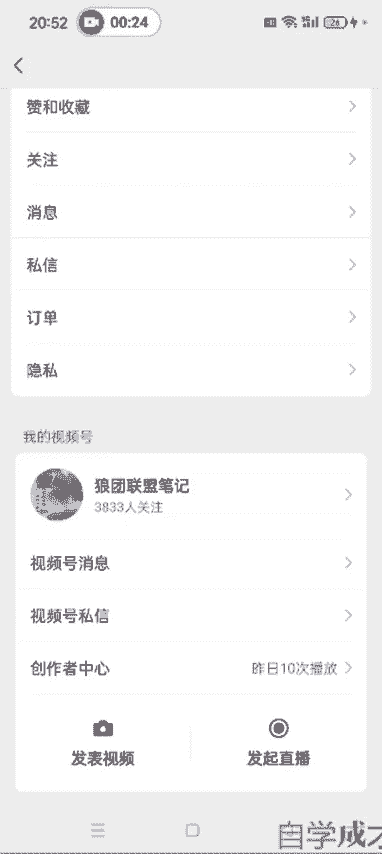

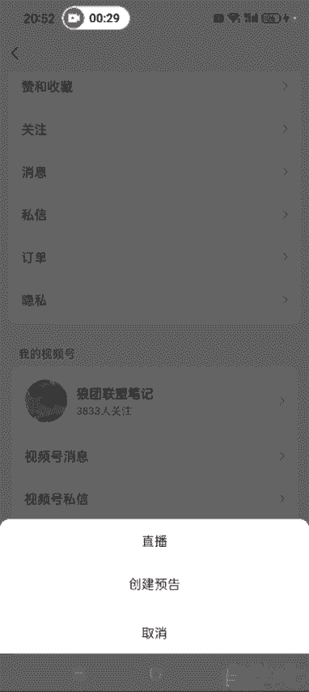

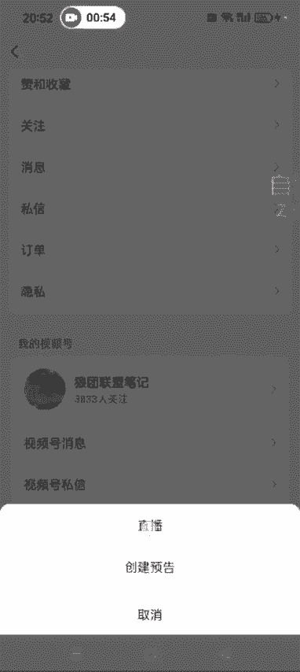

直播的话这个。主题一般就是说视频同款。热卖中。除了这个，然后别你看一下别人怎么写的，你你们也可以怎么写啊，然后就是这个。这个商品这儿提前把这个商品添加好啊，添加商品。

一般就是添加你想卖的这个品，单品也可以啊，然后添加好了之后。返回。然后这个画面这画面这儿就是呃可以美颜啊，滤镜什么的，人物特效，这些你想想搞的话也可以搞一下啊。然后这个贴图的话。

就是上节课我讲的就是大家用那个微微商水印相机可以做一个就是简单的介绍，嗯，也是参考对标账号，别人怎么做，你就怎么做就行了，是吧？啊，然后就可以开始直播了。

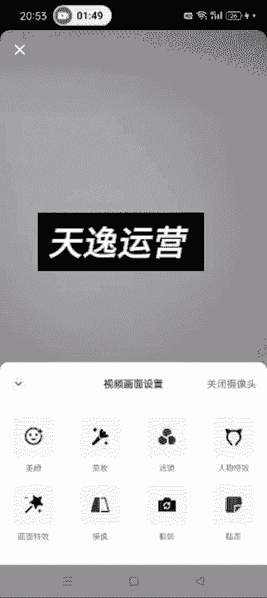

这个更多这啊有很多选项，就是我们这个不需要不需要搞啊，因为我们纯那个呃。

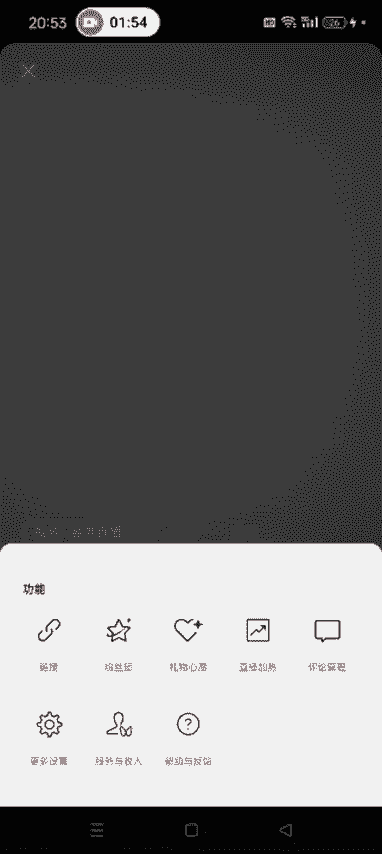

纯那个啥嘛，纯这个。

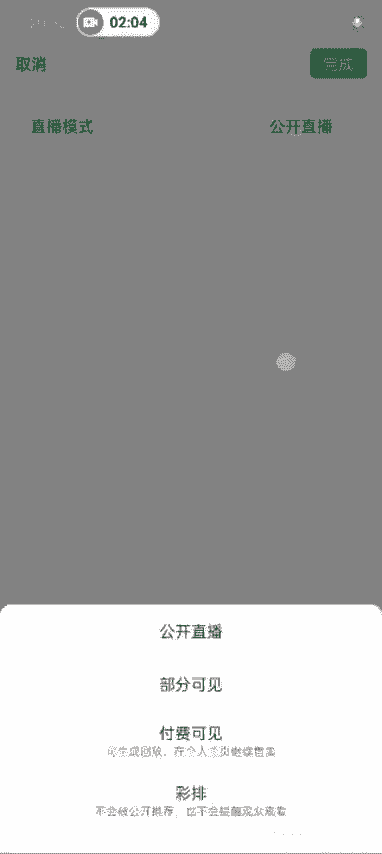

呃，相当于是那个卖卖货的嘛，我这边我把这个直播模式先改一下啊，要不然很多人会进来，你影响讲课。

部分可见。完成。

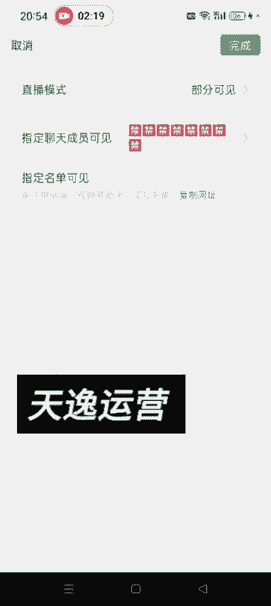

完成这样的话就是别人不进我直播间了。然后我们卖货的这种，他需要标志标记位置啊，就随便标记一个，然后点开始就可以了。

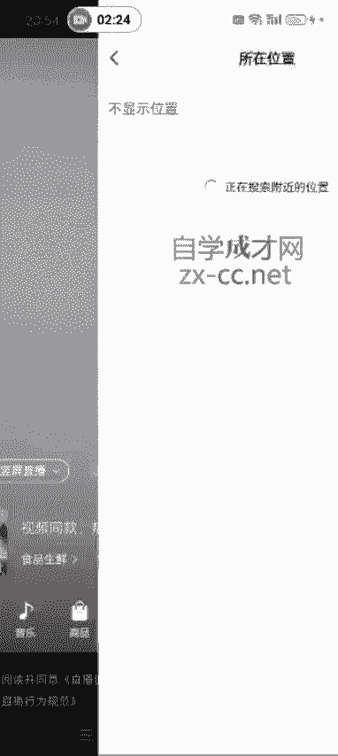

开始开始直播之后啊，开始直播之后，我们呃讲解的这个商品一定要点开你的这个呃购物车，然后。

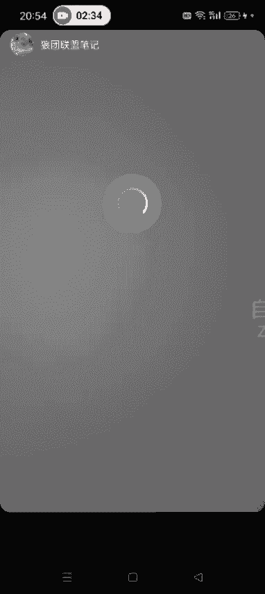

这样的话，别人在你那个。那才能看到这个商品的弹出这个。才能看到这个商品弹出来啊，呃就是提升我们的这个转化率。然后这个时候就是你像这些东西，我其实我们不需要管，就做好自己的话术就行了。然后你开播了之后。

这个贴图也可以搞啊，开播了之后贴图也可以去弄。嗯，另外一点就是你可以在直播的时候加上一些音乐啊，放一上放上一些音乐什么的也都不影响，知道了吧？另外还有一点就是我们比如说某一个观众他的那个评论。

你感觉特别好，对你有利，你可以长按他那个评论啊。

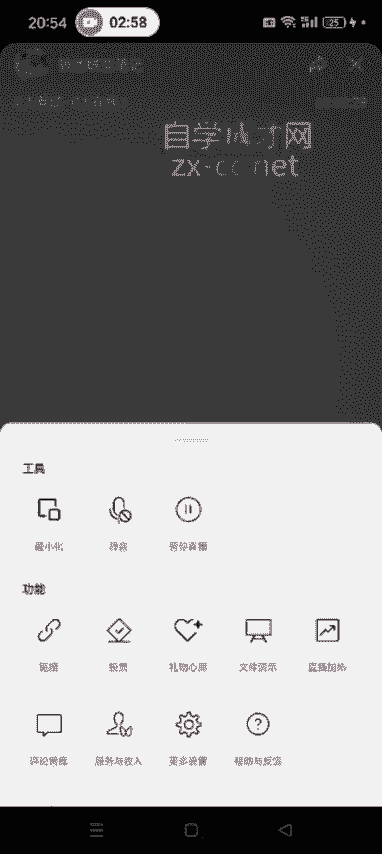

哎，点一下，然后点上墙，这样的话就是别人进来之后，他就可以看到了。点一下点上墙就可以了啊，这大概就是我们直播的时候，直播的时候尽量不要说一些违规词什么的啊。呃，时间关系我这边就不录了。

就是有那课程里边也分享了很多就是优秀的学员，他们那个直播时的那个实时录录屏，我大概就给大家讲一下，怎么去开始这个直播。等你直播完了之后，然后你就可以点右右上角这个叉号结束直播。然后另外你直播的时候。

还可以把你这个直播间发送给别人啊，发送给别人。然后点结束直播，呃，想生成这个直播回放也可以点生成啊，也可以点生成，知道吧？

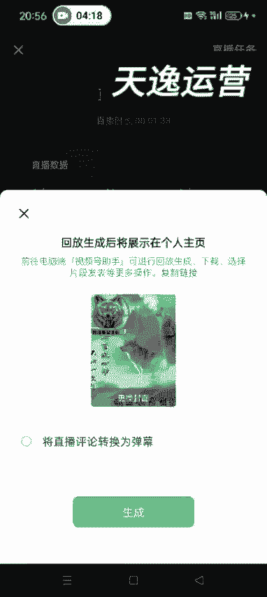

好，这节课就讲到这儿啊，大概就是这么回事儿。