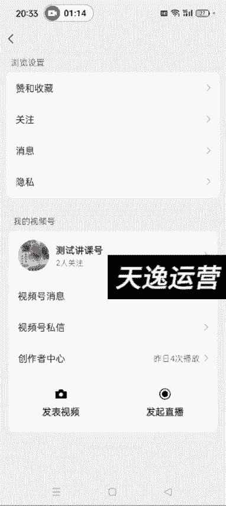
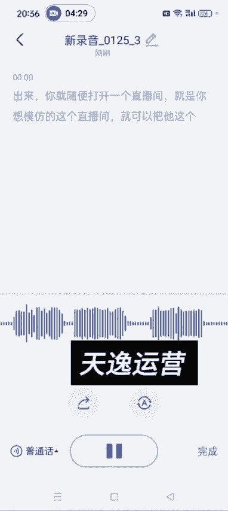

# 【2024版视频号运营教程】全B站最良心的视频号运营高阶教程合集！视频号运营 起号真的不难！ - P41：4.如何扒别人直播间话术 - 鼓腹含和防护服 - BV1wDWheCEsK

好各位同学大家好，这节课给大家讲一下，就是我们如何把别人直播间的这个话术啊，嗯通用的话术，就是看我课程里边给大家发的那个详细的，就是你比如说你看着某一个人他的直播间呃，卖的很好是吧。

然后他卖的那个品你也可以低成本的复制，然后他发的视频你也可以自己做他那种视频，唉剩下的就是呃看他这个直播话术了对吧，你像这些品，他有的时候可能这几这个月卖的好，下个月这这这个品卖的可能就不好了。

另外比如说过年的时候是吧，年货你像什么春联啊，这些他卖的好，然后你又不知道这个话术怎么去去搞，这个就是如何去扒别人直播间的话术啊，嗯需要用到的工具就是你下载一个飞书，然后工作台有一个点开这个工作台啊。

有一个飞书妙计，看到没有啊，飞书妙记，这我们可以去录别人直播间的这个话啊，比如说我随便点开一个直播。

随便点开一个直播啊。

学们切个椰子，这次考试韩语是没猜出来，嘿嘿草色遥看俊且无，最是一年春，好处绝胜，烟柳满皇都，现在几点，现在8。33，你有女朋友吗，你为什么要问这个问题。

Why do you have this kind of question，You know，请您一当一片三零包，三一包，一块两块三块对吧，既能切又能砍，一块两块三块四块五块六块七块铁板叠起来。

想怎么做就能买叶子好评，好几天没见了，尊都假都，人间4月芳菲，尽山寺，桃花始盛开，这把刀呢听下声音，专柜卖一看到没有，就是他这个可以实时的录这个直播间的车，这个声音啊，就包括我现在说话他也能录进来。

知道了吧，大概就是这么去用，然后他直播间的这个声音呃，大家大概就是呃用这个飞书妙计搞上15分钟，基本上你就知道他这个他是怎么介绍品的，怎么逼单的，然后你把这个弄完的这个话术导出来啊，导出来就可以了。

然后点完成，点完成之后，点开它，然后，这儿有一个分享啊，可编辑也行，可阅读也行啊，可编辑吧，然后你复制这个链接到微信聊天记录去打开它，打开之后就是他这个刚才说的这些话啊，你就可以复制出来。

然后看他是怎么说的，然后你提炼出来之后，形成自己的话术，就可以去开播开播了啊，它这个生成可能需要几分钟的时间啊，然后我这个那会儿录了一个其他的直播间啊，你像这种的是吧，然后分享，然后复制这个链接打开。

发到，发进来，然后点开对吧，你像他说的这些话，我们都可以复制下来嘛，然后复制发到微信聊天记录里边，你编辑一下，看看他应该怎么说是吧，你把这些话都编辑好，形成自己的话术，可以写在纸上。

也可以放到你的备忘录里面，开播的时候如果忘了，你可以对照着这个话术去念好吧，额方法呢就是嗯打开飞书之后，工作台工作台啊，最下边有个工作台，找到飞书妙计，然后点一下右下角这个语音，它就开始录了啊。

你就随便打开一个直播间，就是你想模仿的这个直播间，就可以把他这个话实时的呃录下来啊。

