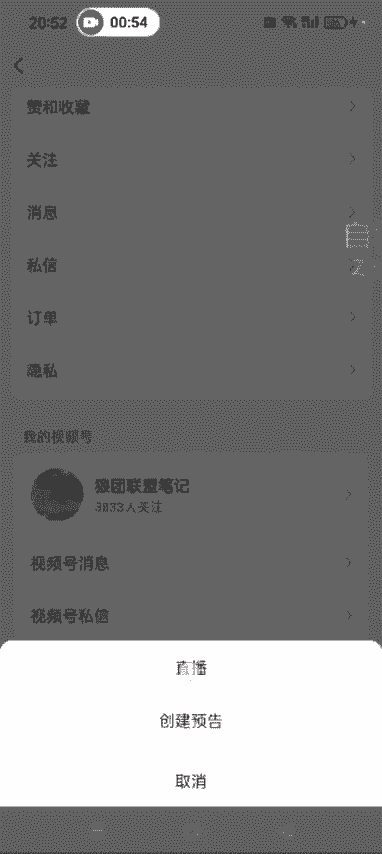
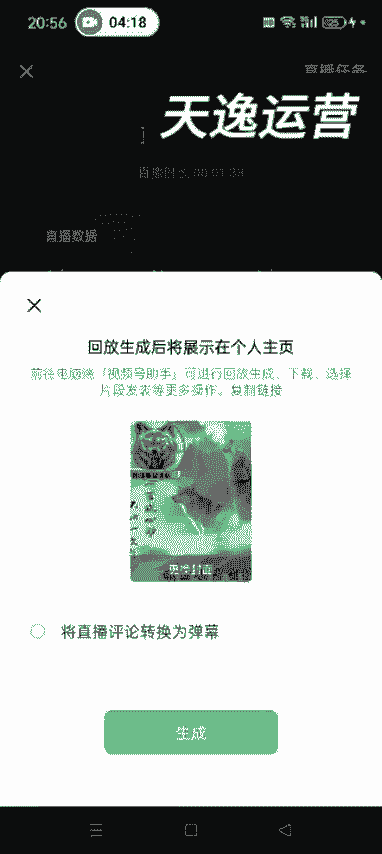

# 【2024版视频号运营教程】全B站最良心的视频号运营高阶教程合集！视频号运营 起号真的不难！ - P42：5.如何开启一场直播 - 鼓腹含和防护服 - BV1wDWheCEsK

好各位同学大家好啊，这节课给大家讲一下如何开始一场直播啊，然后我们就是你确定了好自己的品之后，发完视频之后，等视频有了播放量1000左右，然后就提前准备好话术，然后把那个要直播时，如果万一不进人的话。

把那个提前要补发的视频提前准备好。

准备到草稿箱，然后就可以去开播了，如果当时你没有时间直播。

不方便的话，视频爆了，如果不方便直播的话，一定要先创建一个直播预告啊，比如说你哪哪哪会儿有时间你提前创建好，这样的话他们呃想看你直播的人，他会提前预约呃，预约的，预约好了之后，等你开这边开播的时候。

他那边就会第一时间收到提醒啊。

然后我们嗯点发起直播啊，然后点直播。

直播的话，这个主题一般就是说视频同款热卖中，除了这个，然后别你看一下别人怎么写的，你们你们也可以怎么写啊，然后就是这个这个商品这儿，提前把这个商品添加好啊。

添加商品，一般就是添加你想卖的这个品单品也可以啊，然后添加好了之后返回，然后这个画面这画面这就是呃可以美颜啊，滤镜什么的，人物特效这些你想想搞的话也可以搞一下啊，然后这个贴图的话，就是上节课我讲的。

就是大家用那个微微商水印相机可以做一个，就是简单的介绍，也是参考对标账号，别人怎么做，你就怎么做就行了是吧啊。

然后就可以开始直播了，这个更多这啊有很多选项。

就是我们这个不需要不需要搞啊，因为我们纯那个额纯那个啥嘛，纯这个。

额相当于是那个卖卖货的嘛，我这边我把这个直播模式先改一下啊，要不然很多人会进来，你影响讲课部分。

可见，完成完成。

这样的话就是别人不进我直播间了，然后我们卖货的这种还需要标记标记位置啊。

你就随便标记一个，然后点开始就可以了，开始开始直播之后啊。

开始直播之后，我们嗯讲解的这个商品，一定要点开你的这个呃购物车，然后这样的话，别人在你那个才能看到这个商品的弹出，这个才能看到这个商品弹出来啊，嗯就是提升我们的这个转化率，然后这个时候就是你像这些东西。

我其实我们不需要管，就做好自己的话术就行了，然后你开播了之后，这个贴图也可以搞啊，开播了之后贴图也可以去弄嗯，另外一点就是你可以在直播的时候，加上一些音乐啊，放一放上一些音乐什么的，也都不影响。

知道了吧，另外还有一点就是我们比如说某一个观众，他的那个评论你感觉特别好，对你有利，你可以长按他那个评论啊，哎点一下，然后点上墙，这样的话就是别人进来之后，他就可以看到了，点一下点上墙就可以了啊。

这大概就是我们直播的时候，直播的时候尽量不要说一些违规词什么的啊，嗯时间关系我这边就不录了，就是有那课程里边也分享了很多，就是优秀的学员，他们那个直播时的那个实时录录屏。

我大概就给大家讲一下怎么去开始这个直播，等你直播完了之后，然后你就可以点右右右上角这个叉号结束直播，然后另外你直播的时候，还可以把你这个直播间发送给别人啊，发送给别人，然后点结束直播。

呃想生成这个直播回放，也可以点生成啊，也可以点生成。

知道吧好这节课就讲到这啊。