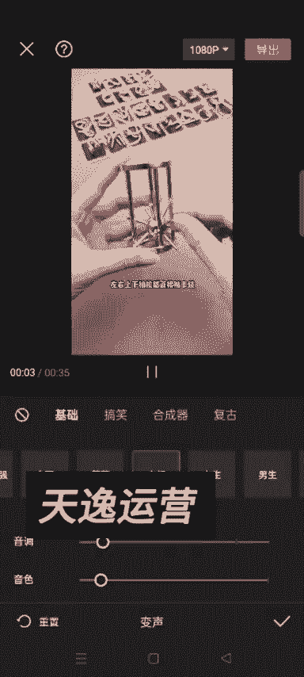
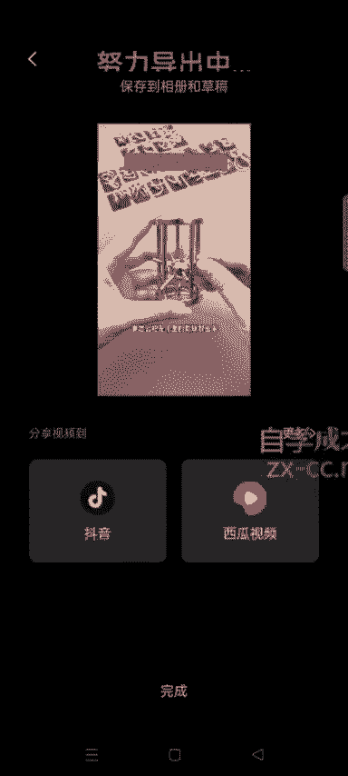

# 【2024版视频号运营教程】全B站最良心的视频号运营高阶教程合集！视频号运营 起号真的不难！ - P43：6.益智玩具账号玩法 - 鼓腹含和防护服 - BV1wDWheCEsK

各位同学大家好啊，这节课给大家讲一下，如何通过视频号去带这个益智玩具啊，然后我们应该在抖音也见过类似的视频啊，呃就是在正式讲之前呢，就是给大家复习一下，就是我们之前呃做书单号的话，我们是带书对吧。

然后做俄罗斯的账号，我们是带俄品，然后做怀旧童年的账号，我们是带那个怀旧的那种零食，然后这种益智玩具呢就是带这种益智的玩具，呃，然后这个呢就是因为它有很多，我们带的话就是带我视频里。

我等一下给大家演示的这种啊，我们打开抖音，仔细观察笼子结构，发现金属柱之间有一个间隙比其他都宽，然后你们可以看到这种呢，就是就是开发儿童智力的这种玩具呃，大家我不知道小时候有没有玩过啊。

然后抖音上有很多这种账号，我们去搜什么呃，玩具啊或益智玩具这种关键词，在抖音里边去搜，它会出来很多这种账号，然后我们可以看一下他的主页，是吧，这个很多很多这种这种视频啊，要怎么把笼子里。

然后呃在这儿呢给大家再复习一下，就是我们找同款视频的时候怎么找啊，然后可以点一下他这个井号后面这个关键词嗯，一智玩具，比如说点一下这个是吧宝宝。

然后点视频他会出来很多很多这种账号，一般就是选这种的，第二个这种的，还有这个这种的是吧，你像这种的我们就不要选了啊，这种就是嗯因为我们主打的这种玩具，就是就是我刚才给大家展示的这种像这种的啊。

还有这种的，像这种真人出镜了，我们就不要搬了，还有这种的是吧，有很多很多，对不对啊，这是通过这个额话题标签，去找这个同款的视频啊，刺球取出来就是点一下这个井号，后面他就会。

然后点视频就会出来很多类似的这种视频啊，知道了吧，这是一种找视频的方法，大家在找的时候可以像我这这种方法去找，然后点开这个人的主页，然后点一下关注，点一下关注之后，它下面会推荐你可能感兴趣的账号是吧。

有很多很多是吧，你能找到一个账号，就能找到很多个账号是吧，想找什么样的，你就直接关注就可以了，就是跟他的这个呃类型差不多的。

这个例题改变魔方，这是一个72种变化的魔方，我们就是关注一个这种账号，他会给我们推荐很多把龙字号啊，呃这就不多讲了，然后我们在呃比如说找这种视频，然后我们就直接比如说想搬这个视频是吧。

呃还有还有一个就是你看他这挂购物车，挂的这种东西，我们在视频号其实都可以搜到啊，就是直接搜他这个标题，什么九连环系列入门款解环解扣啊，就搜这个标题呃，视频号也有很多啊，然后我给大家演示。

我刚才挂到我的那个，真没想挂到我的这个商店了啊，就是这种的是吧，你看很多很多啊，我们就直接在视频号去呃，橱窗里面去搜就可以了，有很多，而且你看他这个销量都还可以啊，我随机搜了两个，这个已经收了3。7万。

加了我们最近测试的这个账号，他嗯流量还可以啊，只要你混剪的到位的话，流量还是可以的，知道了吧，嗯像这种嗯像这种账号的话，我们就是发我刚才给大家演示的这种视频啊，带的货的话，就是你看这个视频他带的是什么。

你看这个视频他带的是什么，我们就跟着带什么就可以了啊，就直接在就是点开他这个购物车之后，你就直接搜他这个卖的商品的这个这个标题，就直接在视频号的那个商品，橱窗里面去搜就可以了，好吧嗯，之前具体如何搜哦。

我之前给大家讲过啊，就是我这个账号他没有开通那个这个这个账号，没有没有交那个什么啊，没有交押金，所以橱窗是不能用的，嗯大概给大家说一下吧，你们这个橱窗如果交了保证金的话，他就是可以用的啊。

然后再去选品里面，然后他会出来这个那个视频号的，这个选品中心嘛，然后我们点右上角那个搜索，就直接搜这个标题，就会出来这些东西啊，然后就选择就行了，基本上就是选择那个佣金，40%以上的就可以了。

好吧呃这个是呃呃选视频和那个选商品啊，然后剩下的就是混剪，然后我们的做法就是复制链接嘛，啊复制链接，然后在这个，视频号里面呃，我一般是用青斗啊。

青岛去水印。

呃他这个老跳广告啊，我们就直接把它关了就可以了，你看很多人反馈说这个青斗广告多，但是青斗其实挺好用呃一天你要是用的话，就一天看一次视频就可以了，你看上30秒的视频就可以无限次的用。

然后把这个视频保存到相册，剩下的就是我们去混剪了，然后混剪的话其实也很简单啊，就是很多人呃搬来这个视频之后，他混剪的可能不到位，然后视频号会提示他呃有这个违规，然后你可以看一下。

我今天的这个混剪的一条视频啊，刚才我投抖家，而且也过了，额这个这个视频你看头都加过了，看到没，这就是今天混剪的一个，8。01的时候，我投的抖家，而且过了抖音的这个去这个查重机制也很严。

然后用我下面教的这个方法，你去混剪的话，肯定是能够过这个抖音的，抖那个审核视频号的审核更能过，知道吧，绝对是能过，然后我这个视频刚才我把它隐藏了私密。

你看这儿这个我把它给隐藏了，要怎么把这两个关了，要不然他把他那个那个斗家就会给我，把那个钱给烧完啊，我这个就是测试一下，看能不能过，绝对是能过啊，然后接下来我给大家演示一下实际的操作一下。

看我们这个是怎么去整啊。

然后我们点开始创作，把刚才这个视频添加进去，然后我们就是呃在混剪之前呢，你最好先把那个呃，先自己实拍一些美景的视频啊，到外面去实拍一些美景的视频，保存到你的相册里边，我们去备用啊，嗯后面我会讲到。

就是因为我们用这个实拍的视频嗯，到时候添加视频的画中画的时候会需要，嗯今天我这这个视频五五秒钟的，这个视频是我已经拍好的啊，然后我们选择高清，然后点击添加，添加进来之后呢是吧，首先要做的是什么呀。

我的做法一般就是先让他变声啊，变一下声，呃就是把他这个，先调一下那个什么也行，调一下它这个速度也行，常规变速是吧，让他稍微快一点，要怎么把笼子里的刺球取出来，左右上下抽拉，你变速之后。

他这个额整个视频也不大受影响啊，可以呃，就是少变1。1。1，或者稍微慢一点也可以，建议是快啊，然后接下来就是变声，变声的话，如果他是男生的话，我们就是大叔是吧，要怎么把笼子里的，要怎么把笼子里的刺激。

我要怎么要怎么把笼子里的刺球取出来，左右上下抽拉都直接被卡住。

仔细观察笼子结构，发现这样的话你会看到啊，他这个基本上这个声音是多少，有一点变化的是吧，然后下面就是呃就是文字，然后让它识别字幕，然后开始匹配，把它的原字幕用新的字母，新的生成的这个字幕给它遮挡一下。

然后调一下位置，调一下大小，然后右上角有一个比的这个标志啊，然后我们就是样式，他现在这不是有那个VIP的吗，你你要是开了VIP就用VIP的，没开的话就可以不用啊，然后字体字体的话，这个其实都无所谓啊。

然后点开这个样式之后，这不是有一个T吗，我们往后滑啊，这样的话调出来之后，他就可以把原来的那个全部盖住。

你看是吧，就把他原来的那个字幕彻底的遮挡住了是吧，这样的话就可以了，然后你这个还可以调大小额，基本上把他原来的那个字幕遮盖住就可以了啊，你看着如果有的地方没遮盖住的话，稍微调一下呃，就是它稍微漏一点。

其实也没事啊，我就是大概给大家演示一下，要怎么把笼子里的刺球取出来，哎这就OK了，然后选中这个视频返回，然后点击添加画中画。

新增画中画，我们先随便找一张图片啊，呃什么样的图片都可以，比如说这个，然后添加，然后把它拉到最大，然后调一下这个进度，让他跟这个视频一样长就可以了是吧，然后这儿有一个混合模式，点击混合模式正片叠加。

然后把它调到三四或者一二都可以啊，这样的话你看他这个相当于我们这这个底图，现在已经看不到了，呃，做混检的目的其实不是说让人看的，而是让那个视频号的机器看的，知道吧，就是规避检查，然后继续选择新增画中画。

这个时候我们添加一个视频，实拍的这个视频是吧，然后添加这个视频，他现在不是我这不是五秒吗，如果你能拍一个这个，我们这个想要搬运的这个视频，你看可以看到35秒，对不对，你也可以拍个长的，一分钟以上的。

多拍一点，如果短了的话，我们可以让它变速，常规变速，然后把它调，调，27秒，55秒是吧，这样的话这个视频就变长了，对不对，然后在这里面我们把它分割分割。

把多余的删除掉，这样的话就可以了是吧，然后继续选中你的这个视频，也也也把它放大，这个时候我们点混合模式，正常的这个呃变暗也行，或者说正常啊，或者说叠加这些都可以选啊，然后我们把它选到1233就可以了。

这样的话你这一块还是看不出来的，如果视频有声音的话，选中你这个呃画中画的这个视频，然后点音量，把音量调到要把龙水一出来，不影响原视频的声音就可以知道了吧，然后同样选中这个，然后新增画中画。

再找一个再找一个视频啊，呃如果是实拍的，最好不是实拍的话，比如说这个是吧，然后选一个其他的长的吧，看有没有长的呀，啊有长的，比如说这个吧是吧，呃如果是实拍的视频是最好的啊，同样的方法把它分割。

然后把多余的删掉。

还是一样，然后音量把这个视频你添加画中画的这个视频，原声给它调到最小。

要怎么把笼子里的刺球取出来，要怎么把笼子里的刺球取出来，左右上下抽拉都直接被卡住，仔细观察年轻人线清楚，柱之间有一个间隙，比其他都宽，尝试着把刺球从这里去转动它看，也把它拉到最大，越大越好啊。

嗯差不多只要把你这个原视频遮盖住就可以了，好吧，要怎么把笼子里的刺球取出来，左右上下抽拉都直接被卡住，仔细观察就可以了，嗯然后你我现在是不是相当于添加了一张图片，一张图片，两个视频嘛，你要感觉不可以。

你可以多添加多张图片，可以再加一个图片啊，然后新动画中画再加个图片，或者再加个视频啊是吧，然后把这个图片拉长，还是同样的方法，on混合模式，哎再把它放大，Ok，这个时候你看他上面不是有字吗是吧。

如果不想让这个字显出来的话，然后再再把它缩小一点，这样的话那个字可能就不清晰了啊，就就看不出来了，现在我这个视频，你看我把笼子里的刺球取出来，看到没有，左右上下抽拉都直接被卡住，仔细观察笼子结构。

这样的其实也不影响啊，不影响，知道没有，这样的话也不影响，然后我们想要在这个视频里面加上文字也可以，比如说，呃你绝对解不开啊，然后把它调到放到最上面，这样的话就是引起观众的好奇心嘛是吧，同样。

然后把它拉长，关于这个吸引人的这个文案具体怎么写啊，大家也可以那个呃参考，这个就是我们搬运的这个视频里边，这种视频我们就多刷一点啊，你们多刷一点，你就知道到底是怎么回事了，就是网感，这个东西真的是靠。

大家需要刷大量的视频才能培养出来啊，我这么跟你讲，其实讲不清，大家需要多刷一些视频，知道了吧，多刷一些视频，培养自己的网感好吧，然后如果你还想添加音音乐的话，你可以配上配上一些音乐啊，配上一些音乐。

然后把音乐的声音再调一下呃，调调调小一点，要怎么把笼子里的刺球取出来，左右上下抽拉都直接被卡住，仔细观察笼子结构，发现金属柱之间有一个间隙比其他都宽，还有就是如果你觉得这个他这个视频原声。

如果你不想变声的话，你还可以自己去配音，知道吧，你还可以自己去配音，比如说你就把这个原声关闭，然后我们点开音频，他这不是有录音吗，要怎么把笼子里的刺球取出来是吧，你就跟着他这个文案一点一点的去念。

但是你配音的话，可能需要的时间就比较长一点，这样的话你这个视频原创度更高一点，明白我这个意思了吧，好吧呃，我这儿就不配音了，因为呃配不配音，其实它都都可以过原创，但是如果你想精益求精的话。

你也可以自己去配音啊，或者说因为他这个这些东西其实都不贵啊，几十块钱你也可以自己把这个这些东西买回来，买回来自己去实拍视频，然后去用他这个原视频的声音，知道了吧，我们不是呃。

他这个就是我们给这个视频配配音的时候，他不是可以用那个什么吗，用他这个视频的原声，比如说提取音乐对吧，然后我想用这个视频的原声就可以哎，仅导入仅导入这个音频就可以了，知道吧，然后我不需要我就把他删了啊。

就是说呃你要是想用他原声的话，就是你需要自己去拍视频嘛，这个大家应该都能理解啊，因为你像我之前的那个书单号，包括俄品的话，嗯对这块已经讲的很详细了啊，这节课就是给大家简单的演示一下。

你知道怎么回事就可以了，然后把这个视频导出来就可以了好吧，然后去发到视频号，现在我们做视频号，发视频一定一定要混剪啊，一定一定要混剪，混剪一定要到位，你混剪不到位的话，就是嗯有可能会查查出来。

就是说你这个视频违规啊什么的，如果连续两三次违规的话，你这个账号就可能就废了，然后如果大家的这个账号啊。

如果大家的账号额不够用了，你们可以直接在淘宝去买那个注册号啊。

嗯我那个美妆带货里面有那个呃，怎么去嗯，买那个就是注册新微信的那个方法，如果大家不知道的话啊，呃私聊我要一下美妆带货，直播带货那节课呃，就是就是直播带货，不是2499嘛，然后是有一个交流群。

然后付1499的，这个呢我也可以把这个课程发给你们，就是没有交流群啊好吧，然后这节课就讲这么多，大家知道怎么回事了就行了好吧，然后相同的方法，我们如果想找对标账号的话，也是在视频号里面去搜啊。

搜这个关键词就可以了，跟那个鹅品啊什么的，其实道理是一样的。

就是说这个益智玩具这一块呢，因为他这个视频比较有看点啊，比较有看点，就是很多人可能会好奇，这个东西到底怎么解开啊是吧，他他有看点，所以说这种视频在视频号最近流量还可以啊，大家可以尝试一下好吧。

其他的这些东西你包括如何搬运啊，还有如何找对标账号啊，这些都跟之前的方法是一样的，如果不会的话，大家就好好看看我蓝海书单那节课，那节课讲了一个多小时，就是详细的把整个流程全部都涨下来了，你会了。

这会了这一种玩法，其他的其实道理是一样的，我们都是去搬运视频，去去混剪，只不过额所需要的不同的视频，他带的货是不一样的，知道了吧，合在一起了，然后这个这两天我关注的这几个账号啊，你看这几个。

孤儿乐玩具屋妍妍，还有一只魔术魔玩这个啊，据说看他们这些视频全部都是这些啊，据说时间也不长，就几十秒，举手上戴的那个东西是曹操送，看到了吗，而且在抖音销量都不错，7万多，像这种你要放到视频号的话。

很多人他喜呃，一般中老年人宝妈居多，视频号的人群对吧，然后他们会嗯买买回来给孩子本身，这个东西它也不贵嘛，十块八块的，有的贵的也就几十块钱是吧，开发儿童的智力嘛，其实这个道理就跟我们做那个书单号。

做那个影视混剪的书单号嗯，卖那个为自己读书啊，这种爆款书书书籍一样啊，这种的就是开发儿童智力的好吧。