# 【2024版视频号运营教程】全B站最良心的视频号运营高阶教程合集！视频号运营 起号真的不难！ - P4：第三节：账号运营~ - 鼓腹含和防护服 - BV1wDWheCEsK

视频号怎么运营，今天我们来到第三节，账号运营，整个系列呢我会抽到五节，如果你是空降到这一节的话，我建议你按照顺序观看，我相信对视频号的整体运营啊理解的更加透彻，账号的原因源于什么呢。

我们在前两节讲了个很关键的点，就是视频号，它的推荐机制的能启动是源于用户的点赞，你的用户点赞也就辐射到他的一个社交圈，以此这样类推。

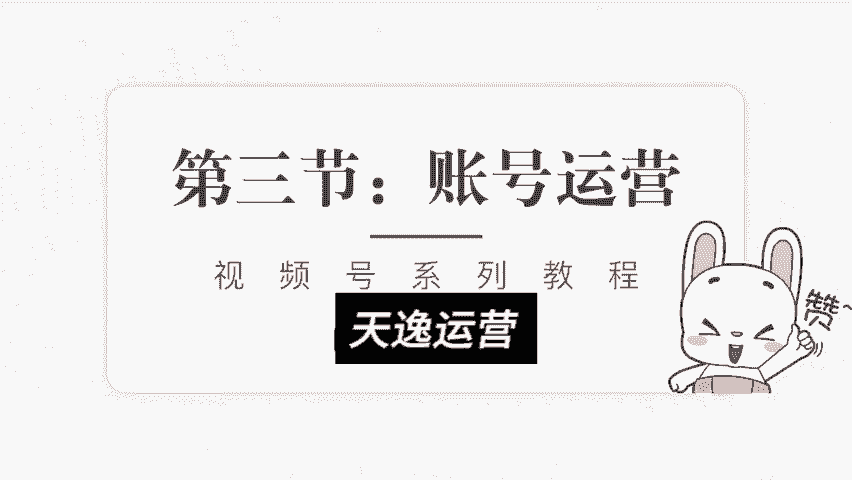

我们就知道点赞的重要性啊，实在太大了，在抖音里面，内容点赞呢它只是一个简单的用户认可，它会判定到用户认可的一个维度里面。

而视频号不一样啊，视频号点赞就是一个启动初期推流的一个根源，你要想你的内容进入更大的流量池，得到公寓流量的加持，那就意味着你要在初阶的能启动的。

这个范围里面把它做足，那点赞这块我们应该怎么针对性的运营呢。

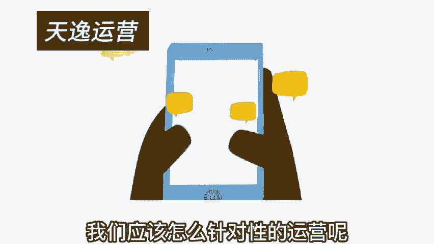

今天呢我把这块重点的来讲一讲啊，在点赞这块呢，我们需要做足这三个点啊。

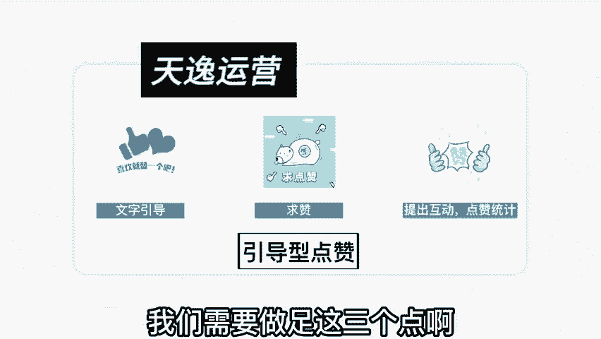

这是属于引导性的点赞，第一文字点赞，大家在看视频的时候一定会刷到哎，视频的中间啊，他放了一个点赞，有一个这样一个动态图的提示啊。

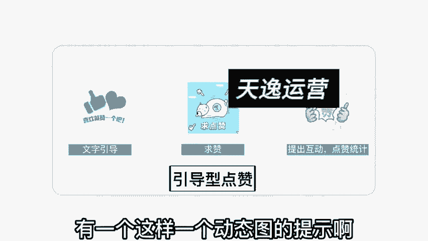

就是你喜欢哎，你觉得这个内容不错。

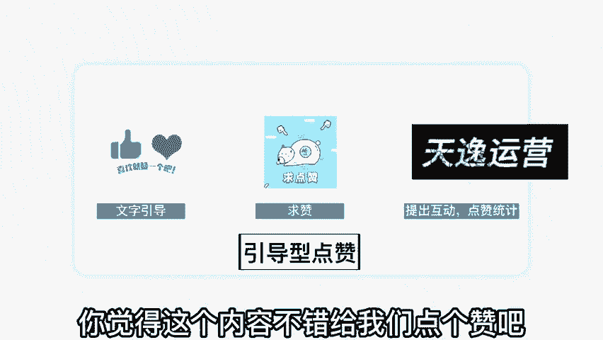

给我们点个赞吧，哎这个引导非常重要啊，特别是视频号针对的这种中老年的用户群体，蛮多的，你不要小看这么个引导动作啊，这么个引导动作，就决定了他是否就真的给了你一个赞，你就当是求赞赏的。

第二种方式呢是求赞的模式，对吧啊，反正意思是我们都讲到这儿啦，哎我都贡献出这么多了，你来帮我点个赞吧，哎呀我非常需要一个赞，怎么怎么怎么地诶，你可以通过一些话术型的东西进行求赞。

或者是通过互动型来点赞互动啊，比如我在内容里面这么引导啊，我说大家看到这里啊都不容易啊，我相信你是一个非常有品位的人，你在这块已经了解的非常通透了，你现在点个赞，我来统统计一下。

这个视频会有多少人真正的理解透了对吧，或者说大家听到这以后啊。

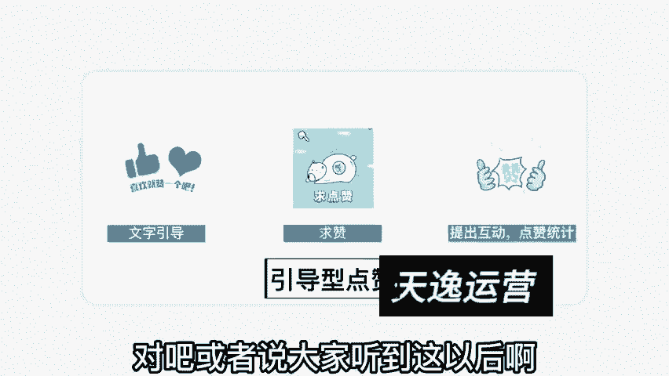

觉得理解的来点个赞，觉得学到的点个赞，我进行一个统计，看一下我们内容是否做得真的优质。

真的不错，用统计的形式提出互动，也能够引发观众的点赞。

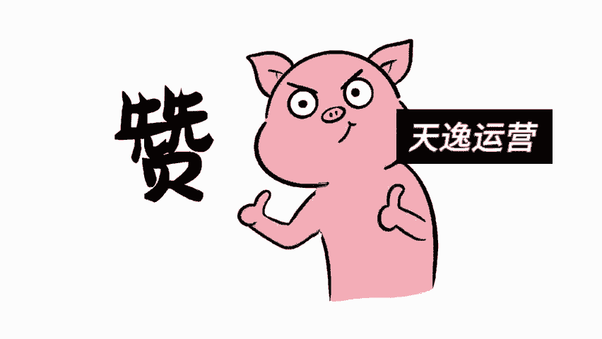

引导式的点赞，能帮助我们的内容进入更多更大的一个流量池，那引导点赞的话术，以及这些标识放在什么时候比较好一点呢，我在这建议啊，就是引导点赞呢是在播放的1/3的时候，最佳啊，一开始就引导点赞，完全没必要。

你想想一个观众会在刚看你的视频时候，就直接点赞吗，啊不太现实，放到最后的话呢，啊人家可能完播到不了，那你的点赞率就比较差，所以放在1/3这个时候啊，他能看到的一些东西，然后他也对你有一些兴趣。

愿意接着看下去，所以你这个时候引导点赞是最佳的，而且这个时候权重是比较高的，在整个推荐机制里面呢，点赞越晚，权重就越高，比如说这个人是看完了之后，点赞和刚开始看就点赞，他的权重是不一样的啊。

当然你不要拖得太晚，就像我刚刚说的，你放到最后让人家点赞完，播率到不了，那然后也错失了引导点赞的机会，所以我建议在1/3的时候引导一下点赞，在最后的时候再给他引导一下点赞啊，双重的引导。

尽量的把你的内容点赞这块给他放到最大，刚刚我们讲的是引导式点赞，还有的点赞是什么，点赞呢，就是带有很强目的性的。

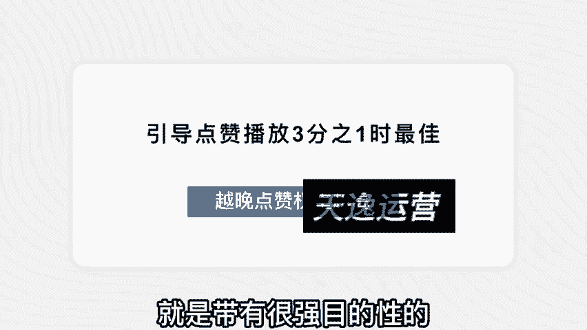

我称为强催式点赞，强推是点赞，什么意思呢，比方说点赞随机抽奖对吧啊，比如说比高的这个领域适合用什么来抽奖呢，我用一些课件啊，或者是我用一些教程对吧，哎我这个教程已经做好了，你在下方点一下赞。

然后我会随机的抽取，按照多少名多少名抽取来赠送这个奖励，以抽奖的形式激发他们的点赞，第二种方式呢是送资料啊，比如说啊我做一个什么教程，然后后续有什么软件搭配啊，一些什么资源资料的搭配诶。

我完全可以送资料，我直接告诉大家，凡是点赞的每一个人，我都会私信把资料全部送到你的手上，哎你看是不是很好，然后你想想这个内容特别有价值，我也想要个资料，顺手就点了，这种叫强推式点赞啊，还有呢。

你可以把点赞引导他当成一种收藏的价值。

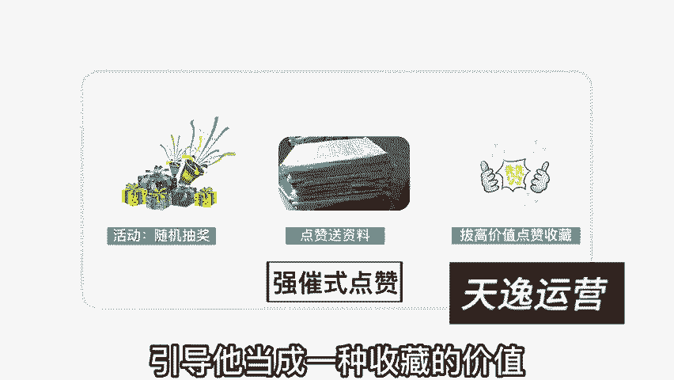

因为当他觉得这个内容好的时候，哎你要提醒他做收藏。

怎么收藏呢，他不可能把这个视频专门发到朋友圈。

或者是啊发到自己的好友那里对吧，会打扰到别人，他不想要分享给其他的人，但是他想收藏起来以后，要的时候慢慢看。

但是视频号没有下载的功能啊，啊它不像抖音啊，所以你可以提醒他喜欢的话点赞收藏啊，绝对有价值的话，点赞收藏提醒他点赞和收藏有个很强的挂钩，拔高这个点赞的价值。

通过这三种方式啊，我们可以有效的去引导我们的用户进行点赞，当然这些引导方式在视频号非常重要，而在抖音号里面去做这种运营就变得很low了。

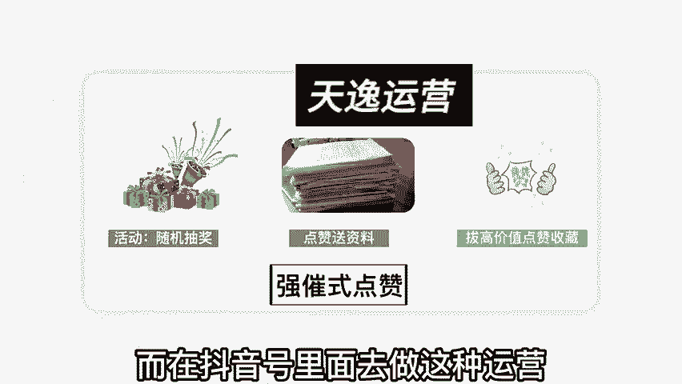

这也是很多运营抖音运营的特别厉害啊。

但是一运营视频号就运营不起来，是一样的道理，因为他们的运营逻辑不一样啊。

抖音的话呢，他的陌生关系啊，有能够有效的触达账号，打了标签之后，平台会给你很大的公益推流，所以你只要把内容做好啊。

能够服务好你的用户，相信持续的更新下去之后就能够做出来，视频号不一样啊，视频号里的内容做的再优质，但是你的运营这块不给力，发不上去，就是没有播放对吧，所以我们要把整个运营的体系逻辑，给它理解透彻。

那我们再回过头来看看。

其实视频号的整个推荐呢，它都是源于社交内的传播，我们为什么要引导我们的观众进行点赞，就是要让第一的人能启动跑起来，只有第N轮的能启动跑起来，才有机会得到更多的公寓推流。

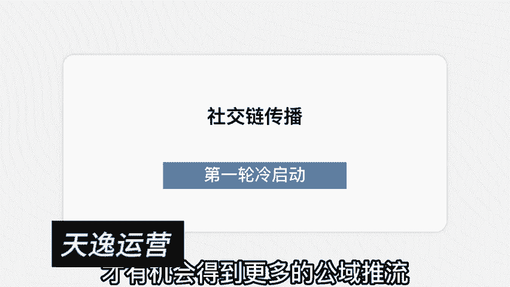

那运营视频号的目的是什么呢，可能有的人说哈，我就是为了赚钱，我们再给他细分一点再切入的，好好想想，你运营视频号的目的是什么。

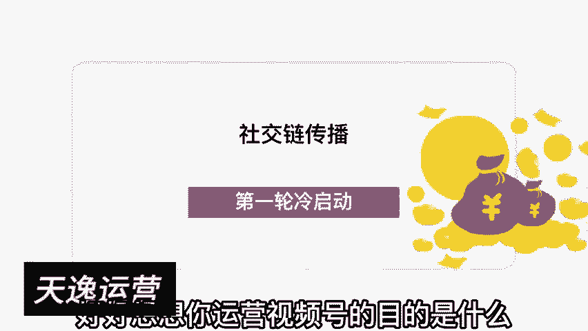

我认为运营视频号无非就这两块，第一个它是一个很好养用户的一个场景。

所以养用户粘性非常的不错，不管是你直播也好，发视频也好，他的整个触达是比较强效的。

第二个呢是思域的引流非常便捷，比如说我们在视频号里面做的内容，准备引到私域啊，也就地球号里面对吧，引到私域怎么办呢，哎有很多种引流方式啊，所以思域的引流是我们在操作视频号。

运营视频号的一个非常重要的一个大块，私域引流的话，我建议按照这三个步骤走，第一个先设置钩子啊，设置钩子就是引导引流的方式，比如说通过送资料的方式呀。

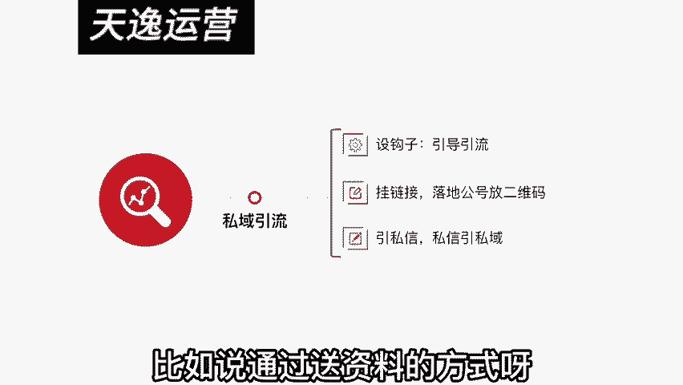

你要给对方一个添加你的理由，关于这个理由的话，你们可以看看我的视频啊。

我觉得我在引流这块还是不错的，你看下我每个视频是怎么样去设置。

一些引流方式的，最合理的方式是什么呢，就是在这个平台发不了这一些东西，要到另外一个平台去发，所以大家问我要一些资料啊，一些课件我在抖音里面是真的发不出来，我不可能直接给你发链接，我也发不了文件。

所以我让你在另外一个地方领取。

你看这就是一个引流方式，但是视频号还有个引流比较不错的，就是它可以直接挂链接，他可以直接挂公号链接。

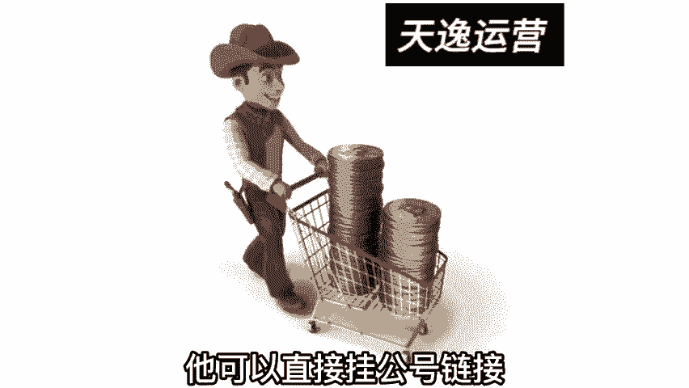

你只需要在这个链接里面落地，放上你的二维码，可以直接引流，这种方式在抖音里面是被封的，但是在视频号里面是没有问题啊，毕竟他们是自家产品嘛，对这个不排斥，第三种引流方式呢是从私信里面引，从私信引到私域。

你看我们在运营起来之后啊，设钩子，挂链接，隐私信这三个非常强效的触达，包括在直播里面也可以挂链接，直接做强效的引流，他的引流效率呢是比较不错的，我这在第一节的时候呢，我详细的给大家讲了。

关于引流的转化的一些数据啊，这是整个视频号我们运营需要做的一些基本功，当然视频号的运营远不止如此，我今天我没有把这个事讲的太过于复杂的，是希望大家能够去执行，然后能够简单地去理解它。

并且在接下来深入去做的时候呢。

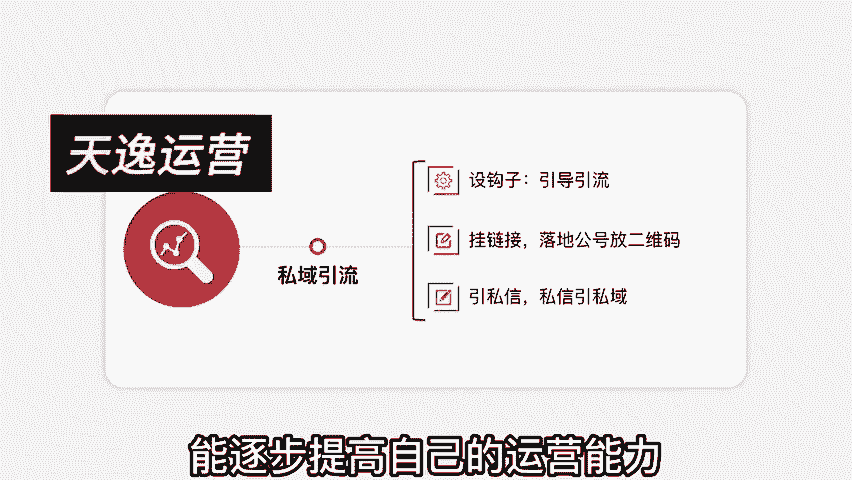