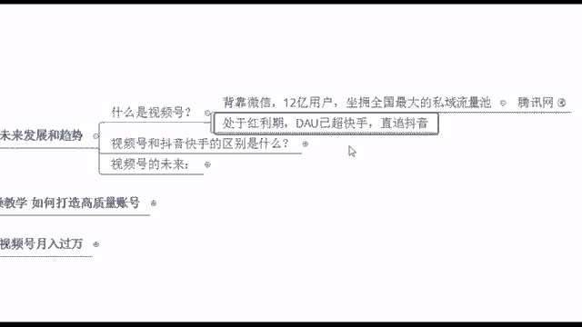
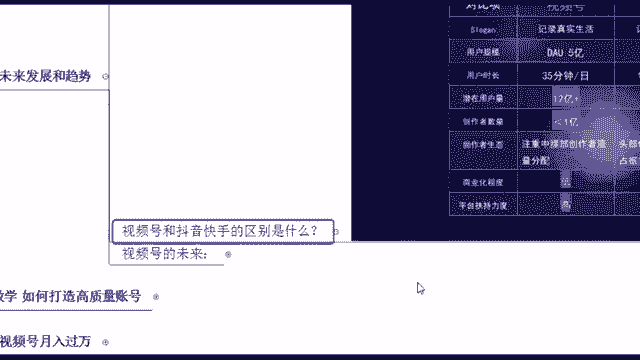
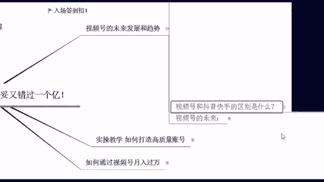

# 【2024版视频号运营教程】全B站最良心的视频号运营高阶教程合集！视频号运营 起号真的不难！ - P6：2.视频号未来发展趋势 - 鼓腹含和防护服 - BV1wDWheCEsK

啊，首先来看一下，就是我们视频号的未来发展趋势是怎么样的，当然现在的话，短视频行业内比较火的是抖音和快手，那这个的话呢也就能够看见视频号，它的一个潜力所在了，等你等到大家就是都在。

哗啦啦的刷这个视频号的时候，那你这个时候再去做肯定就晚了啊，所以说我们先来简单的看一下，那视频号唉到底是什么东西，它现在能够给我们带来什么样的一些好处呢，之后我们做这个东西，你首先自己要去啊。

会去刷一下啊，好视频号它是现在哪个平台下面的啊，背靠微信是不是它的背后是腾讯爸爸，是不是抖音，它的背后是字节跳动，那你像腾讯的话，它也是想要去分这么一杯羹啊，所以说你像视频号，它背靠微信。

它的一个优势就在于它有什么，全国最大的私域流量池，坐拥12亿用户，你想一下12亿人是不是微信用户，截至目前12亿人啊，我们中国最不缺的就是人了，一看都是人，你看什么你做什么都行，但是一看没有人的话呢。

做什么都不行的，所以说人流量这个才是商业的一个本质啊，你想一下，你有人啊，你的东西你才卖得出去，不管你是卖什么产品，即使你是嗯拿的是金碗和银碗，那你要是在沙漠里面，你也卖不出去啊，想想这个问题啊。

所以说这是我们现在它的一个比较好的一个点，就在这，他是坐拥全国最大的私域流量池，当然这个也不是说我受伤而已啊，给大家来看一下我们现在腾讯网官方的消息，你看2021年，微信的月活跃数量已经达到12。

682亿，有没有看到啊，这就是他当下的一个用户量，那其实现在在现场的同学的话呢，嗯可能不止你自己，你的手机里面即使没有QQ，也一定要有微信，包括你家里这个爷爷奶奶，他们也开始用这个微信了，很方便。

所以说这个就是他现在的一个用户量啊，是比较多的，那同时的话呢它现在是处于一个红利期，你们还记得是什么时候开始玩微信的吗，记不记得，你想一想啊，他现在处于红利期，他的DAAU已经抄了，快手直追抖音。

什么叫DAAU啊，就是它的一个日活用户，每天有多少人会去用这个视频号呢，用微信呢啊就这么多啊，所以说这个的话一会给你们看一下这个微信，他是从12年开始创立的，到现在的话整整是10年时间吧。

视频号它其实是从2020年的年底，悄咪咪的上线的，哎，那一个行业它的生存和发展，大概也就是需要经历一个10年时间啊，这个我跟大家说一下吧，其实像我们整个行业，不管你是短视频行业啊，还是说直播行业啊。

还是说你其他之前遇到的金融行业啊，保险啊等等这一些啊，它都是居需要经历一个10年时间，那一般来说在行业内第一年第2年的时候，它是称为一个起步期，在这个阶段呢核心工作一定是找方向啊，在这个阶段的话。

一般他是技术人员涌入，然后呢在里面去呃，找方向，我应该去把怎么样去把这个东西给做起来，搞事情嘛，那你在这个时候你去进入行业的话呢，呃咱们作为普通人来说，我是不建议的好吧。

因为这个时候你如果说没有技术的话，你去里面只能看个热闹了，那你到第3年哎，第4年到甚至你到这个第78年，你再去进去的时候，越早入啊，越有更多的一些机会，因为这段时间的话呢，它就是一个发展期和扩张期。

当然在这几年当中的话呢，也是获取红利的最佳时期啊，这个的话如果说你是越早了解到啊，越早入啊，当然你像最后两年，你到这个第9年，第10年，你再去等人家这个东西已经完善了，已经成熟了是吧。

你再去做这个东西不行了，这个节点已经变成红海了，红利期它就过去了嘛，是不是你再去的话，相当于什么吃冷饭了啊，所以说你想一想，我们现在刚好是视频号，它发展第几年，第几年是不是刚好是第3年啊。

腾讯他到底想干嘛呢，讲白了他肯定是想搞事情啊，他就是像我说的，他想跟这个抖音啊，跟字节跳动啊，去跟他去对标，去跟他去什么吸取这么一波流量，他也想要去抓取一波创作者，那也正是给到我们绝大多数普通人啊。

给到我们机会的时候了啊，那这个也是为什么就是我非常支持大家，你要去什么，抓住一些我们互联网当下比较新的一些东西啊，好那当然说到这个视频哈，有同学说老师这个就跟抖音快手一样。

我这样那样去发视频不就好了吗，来我先问一下吧。

就是咱们现场的同学，你们是零基础还是有基础的同学，零基础给老师打个零，有基础打个数字一啊，扣零的好多啊，那咱们现场大部分都是这个零基础嗯，我今天就讲细一点吧，咱们有没有这个已经在其他平台做过的。

有个别第一次知道好，那我想问你个问题啊，现在你觉得这个抖音和快手好做吗，好不好做啊，不好做了，是不是，是不是感觉这个抖音快手他已经人才济济了，你再去里面想要去分一杯羹，真的很难，你像现在抖音快手。

它的商业化气息很严重啊，动不动一个广告一个带货，那其实相对比起咱们的这个视频号来说，你会发现它好像比较干净一点，就没有什么太多的一些广告啊，没有什么带货这些的对吧，商业化气息没有那么严重啊。

所以说这个是我们现在就他当下的一个，能够看得到的一个发展趋势了，呃当然刚刚这个扣一的同学的话，如果说你是有账号的同学，其实你再去做这个视频哈，你有这个经验的话，你会有更大的一些优势。

因为短视频它的规则讲白了都是共通的，好比啊你去爬山啊，如果说你这座山你以前爬过，你登顶过，你再去爬一遍，是不是会更加的轻松一些，你知道在哪里可以歇一脚啊，哪里可以喝口水啊，休息一会儿是吧。

后面的话要不这个啊爬陡坡了，那我可以续一段力了，是不是，所以说你也可以更快速，在咱们视频号这里去获取一波流量啊，流量就是赚钱的本质嘛，好那刚刚这个咱们绝大部分扣零的同学，对于小白同学来说啊。

从来没有接触过，也没有关系啊，因为平台它的包容性是非常强的，现在平台本身它也在支持呃，就是没有基础的创作者，可以让你们更加拥有更多的一些流量，同样的我非常坚信一句话，大家都是两个肩膀扛一个脑袋。

别人可以的话，你为什么不行呢，千万不要怀疑自己啊，不要给自己设限。

