# 【2024版视频号运营教程】全B站最良心的视频号运营高阶教程合集！视频号运营 起号真的不难！ - P8：4.实操教学-视频号账号定位 - 惠格姆 - BV1hQtoekEfc

或者说你觉得这个值得的话呢，来跟上我的节奏啊，咱们接下来就进入我们视频号的一个实操教学了。当然在讲之前的话呢，也跟大家说一下，就是我为什么会来跟大家分享这么一堂课呢？

其实我自己现在是有在进行一个视频号的创收项目啊，现在的话也是受我们腾讯官方的邀请啊，到时候呢能够去给到大家，我们内部流量的倾斜。啊这个也是给到咱们今天来到这个课堂上。

真正的想要去做视频号的一些同学给到你们一些机会的。也先给大家看一下吧。呃首先给大家看一个我自己的账号啊，这个是我其中做的一个账号啊，那这是我昨天的一个数据，你们可以看竞增关注166新增流览7万多啊。

新增点赞34000，这是我昨天啊就我每天都有在更新作品啊，这个是我作为副业去做的啊，包括像小商店的话，我们现在就也有在视频号可以去带货了啊，可以去带货。一会我在后面详细说一下。

这个是我自己现在的一个小商店的数据。昨天我是纯利润，就是纯通过卖货赚了企业40。😊。

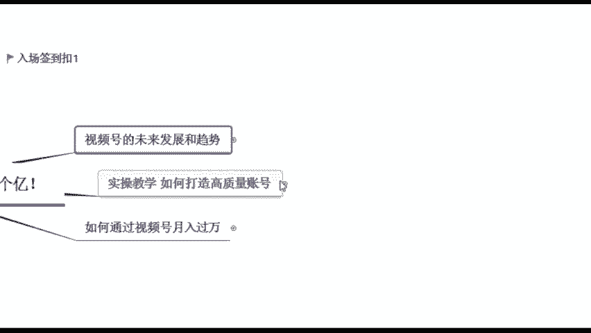

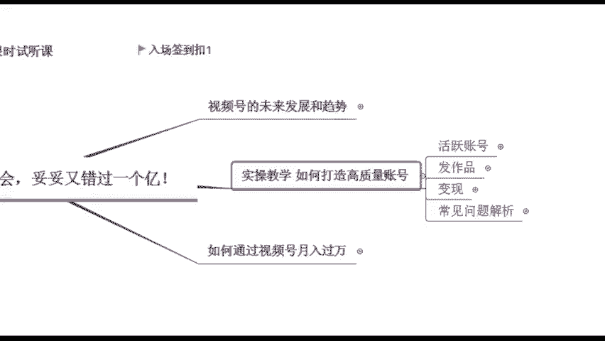

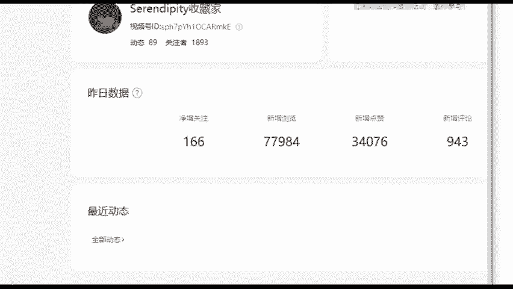

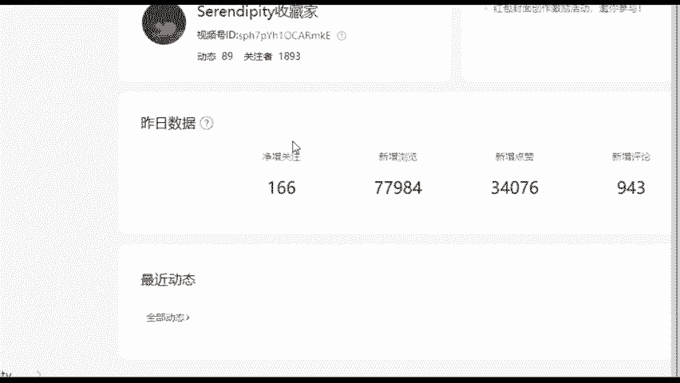

9将近5000块钱。然后今天的话稍微高一些。因为今天这个货的单价稍微高一些，然后卖了有7500。如果说能够持续稳定去发作品的话，都是能够有这么一个收入在的啊，这是我现在在做的一项事情啊。

包括如果说你们后面真的想要去做成这么一件事情的话呢，你跟着我的节奏来就好了。话不多说啊，也是从最基础的开始。因为本身我也是从零开始的啊，视频号的入口应该都知道吧，就在你的朋友圈下方，我刚已经讲过了啊。

它可以发什么短短视频，短视频之前它是只能发15秒，后面的话可以长一点发一分钟啊，到现在的话，它甚至可以发一个小时的视频了，视频可以发图片也可以发图片的话可以发9张啊，那当然我们做的是这个短视频啊。

上来你首先得给自己定个计划，给自己制的一个小目标，你要通过比如说先给自己挣个一个亿是吧？先给自己挣的一个小目标啊，你是冲着什么样的目的去做账号的。😊。

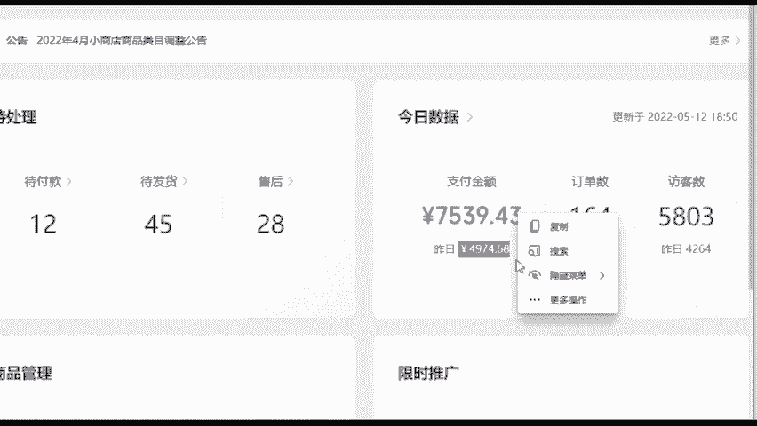

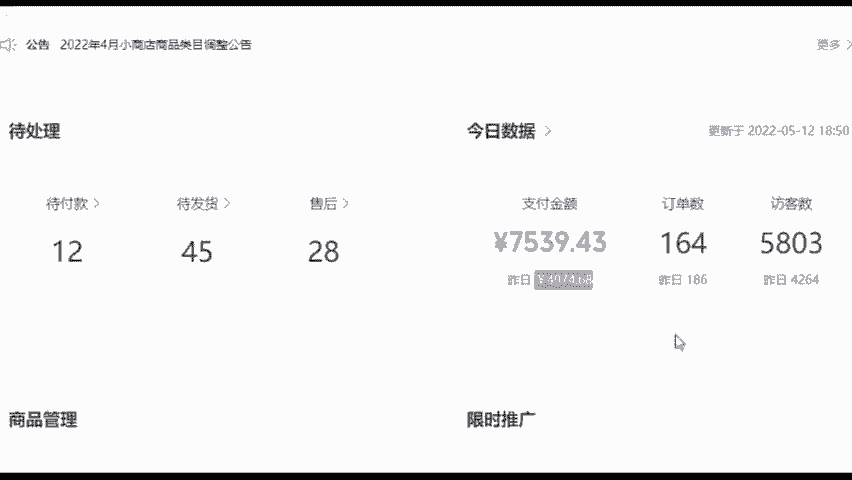

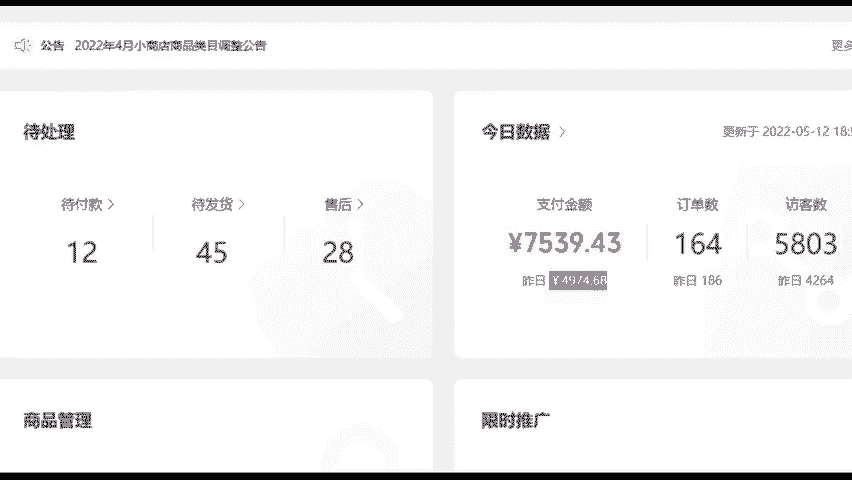

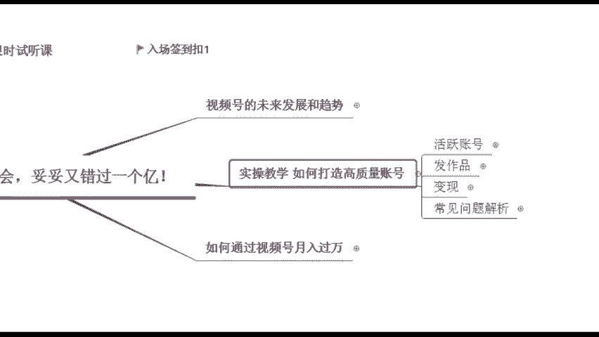

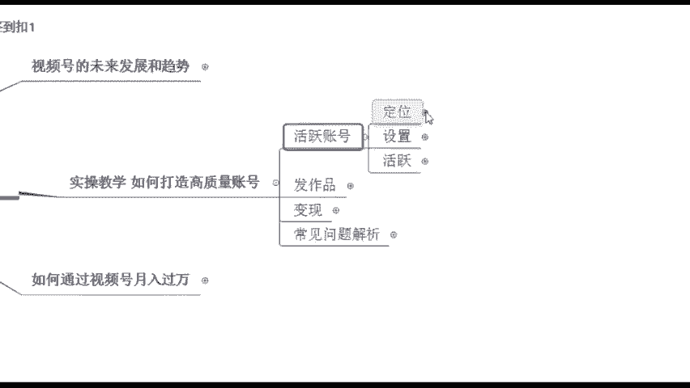

啊，如果说你是诚信去去玩视频号，那你要当成这个朋友圈去乱发作品，我觉得没有什么啊，你今天发作品，你今天发自拍，明天发文字，我后天发个搞笑视频啊，都可以啊，无所谓。如果说你是诚信去发，你就随便发就好了。

那如果说你是真的想要去通过这个东西去啊做这么一件事情去赚取这么一波流量。我想要去赚钱，我想要去把这个号给做起来，给别人带来一些什么东西，那这个你就好好的去给自己定个位了。😊，定位是第一步啊。

因为这个定位的话讲白了，它决定了你后期你是带什么样的货，你吸引什么样的一些人群。所以说这个定位一定要注意了啊。同样也说一下，如果说你在其他平台就是你有作品，你有这个做过账号，你直接搬过来就好了。

因为有些在抖音啊或者说在快手不火的一些内容，但是你发到视频号，它可能会什么就是突然就爆冷了啊，突然就爆了这个视频啊，一开始可能播放量不太好。但是你发到这个视频号，播放量它是非常明显肉眼可见的一个增长。

所以说这个是我们现在呃，如果说有作品的同学，你可以这么去发。那定位的话呢，我们来看一下定位有哪些类型啊，可以根据你们的兴趣爱好来。😊。

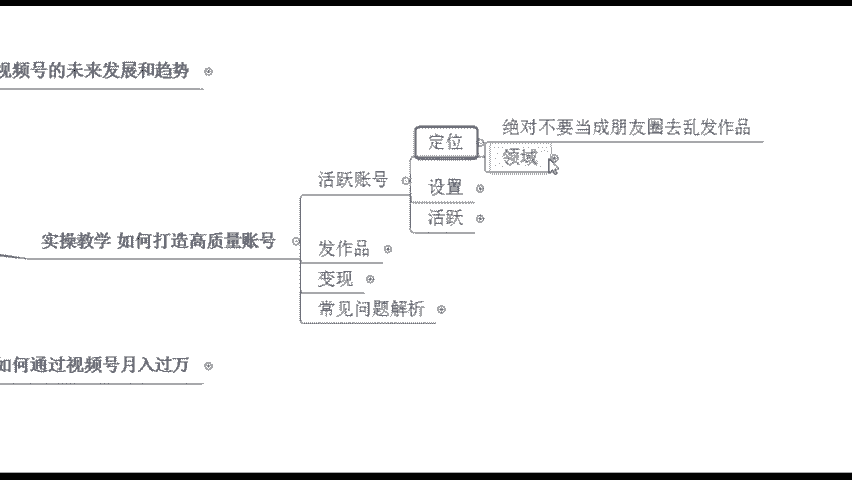

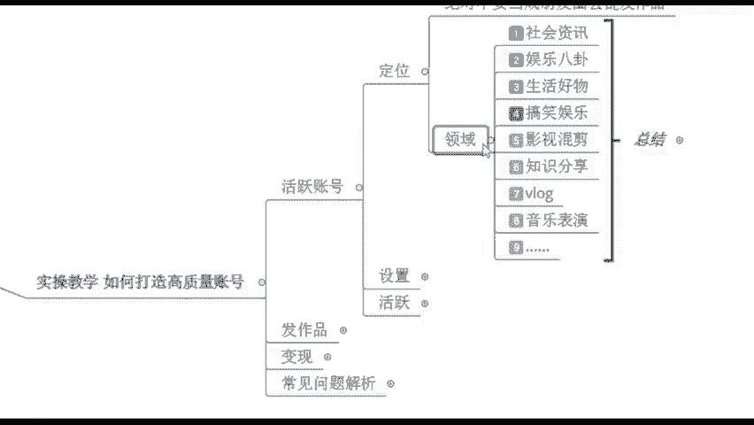

有没有自己想做的类型啊，可以扣相应的数字，或者说你可以直接打字也行。除了这些之外的，可以打字啊。像我这里的话是总结了一些比较好做的一些类型，想做这个音乐的是吗？还有呢好物分享啊，好物分享就生活好物类的。

是不是？😊，对，这个就是根据你的兴趣爱好来，或者是你根据你的特长来特长什么，腿特长也行。😊，是吧或者说你自己会唱歌啊，你唱歌还不错的话也行，或者说呢唉你这个会做饭是吧？这个也是特长啊啊。

就根据你的兴趣爱好来就行了。或者说你可以拍生活类的，你的生活比较精彩，也可以分享。那这个就是从你的兴趣爱好去下手，确定好之后，我们是不要去乱改的。好吧，确定好之后不要去乱改啊，因为我们之后发作品。

你一定要垂直去发垂直什么意思。我确定好我之后，我要发搞笑类的，我就天天发搞笑类的，我不能说我今天发搞笑的，明天我发给影视剪辑，后天发个音乐表演，那就乱套了，这样的话没有办法去吸引精准的客户。

所以说这个的话一定要稍微注意一下啊。如果说你不知道自己做什么，老师我从来没接触过，真的你让我想的话，我实在想不出来。好，没关系啊，我非常理解，那我这里的话呢，也给大家整理的一份。

就是咱们的账号定位表以及你的变现的建议啊，这个是根据我之前的学员，包括我自己做过哪些类型，我又给他总结出来了啊，总结了什么意思呢？就相当于。😊。

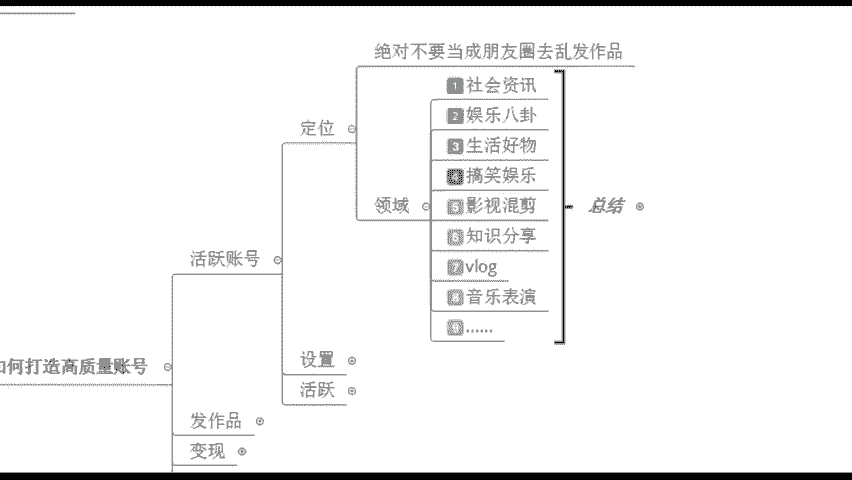

你可以去做这么一些类型，并且相应的我可以去出出产什么内容，产生什么内容。并且我在产生内容之后，我之后怎么样去变现啊，就是我们的视频的定位内容的方向以及变现的建议都给你总结出来了啊，都在这么一份表格里了。

这个就是我之前自己踩购的坑，包括我学员踩购的坑的话呢，都给你们给它排雷了啊，这个是为了帮助你们更好的去找这个方向。这个账号定位是第一步啊，我们确定好之后不要去乱更改。因为你之后是要垂直发布内容。

并且我们发布内容，你刚开始可以多发一点啊，可以多发一点。我如果说刚开始新创的账号，我在养好号之后，我每天发个5个视频啊，6个视频都行啊，那最少的话，你每天持续更新个一两个嘛。

这个的话就是我们需要去产生内容，这样的话，你才能够吸引用户啊。😊。

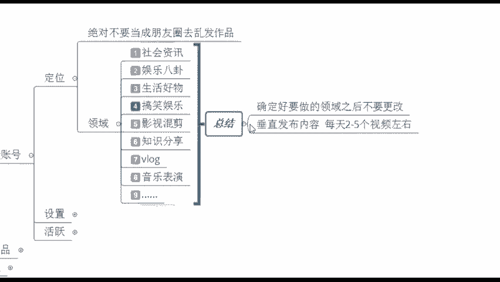

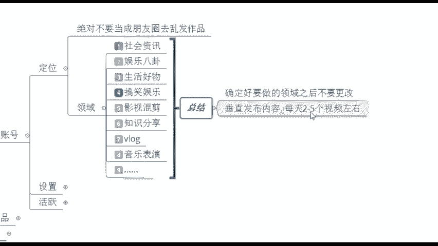