# 【2024版视频号运营教程】全B站最良心的视频号运营高阶教程合集！视频号运营 起号真的不难！ - P8：4.实操教学-视频号账号定位 - 鼓腹含和防护服 - BV1wDWheCEsK

可或者说你觉得这个值得的话呢，来跟上我的节奏啊，咱们接下来就进入我们视频号的一个。

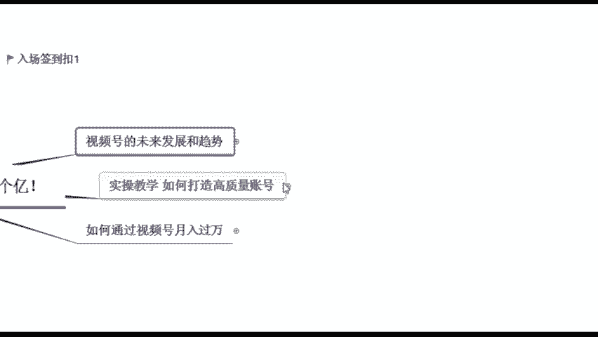

实操教学了，当然在讲之前的话呢也跟大家说一下，就是我为什么会来跟大家分享这么一堂课呢，其实我自己现在是有在进行一个，视频号的创收项目啊，现在的话也是受我们腾讯官方的邀请啊。

到时候呢能够去给到大家我们内部流量的倾斜，那这个也是就给到咱们今天来到这个课堂上。

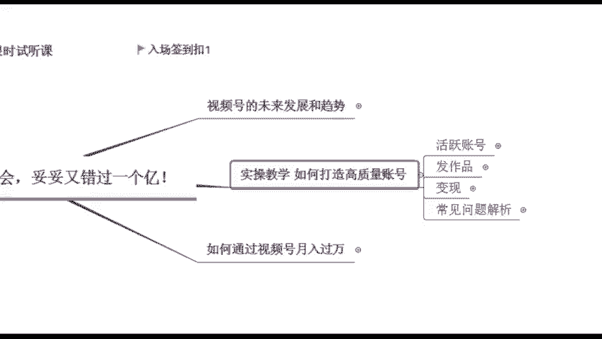

真正的想要去做视频，要的一些同学，给到你们一些机会的，也先给大家看一下吧，呃首先给大家看一个我自己的账号啊，这个是我其中做的一个账号啊。

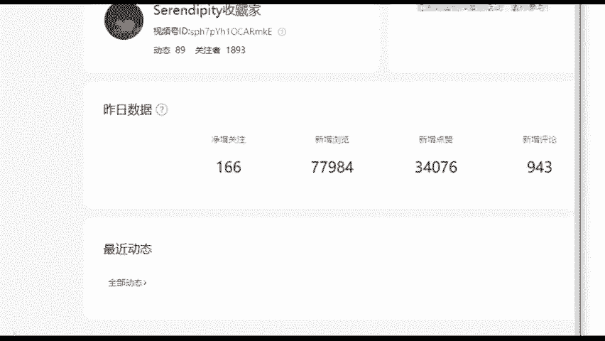

那这是我昨天的一个数据，你们可以看，净增关注166，新增浏览7万多啊，新增点赞3万4，这是我昨天啊，就我每天都有在更新作品啊，这个是我作为副业去做的啊。

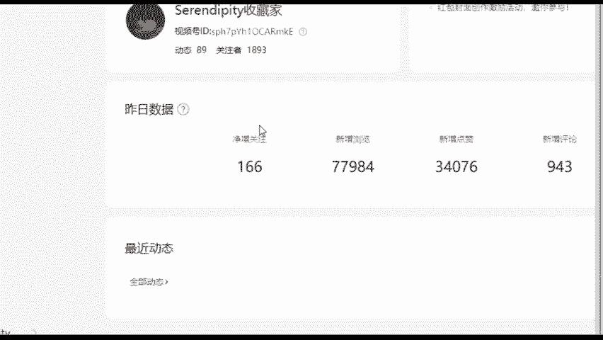

包括像小商店的话，我们现在就也有在视频号可以去带货了啊，可以去带货，一会我在后面详细说一下，这个是我自己现在的一个小商店的数据，昨天我是纯利润，就是纯通过卖货赚了企业4900，将近5000块钱。

然后今天的话稍微高一些，因为今天这个货的单价稍微高一些。

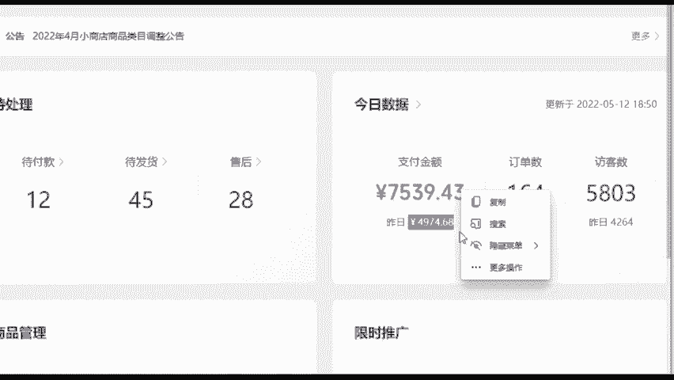

然后卖了有7500，如果说能够持续稳定去发作品的话，都是能够有这么一个收入在的啊。

这是我现在在做的一项事情啊，包括如果说你们后面真的想要去做成。

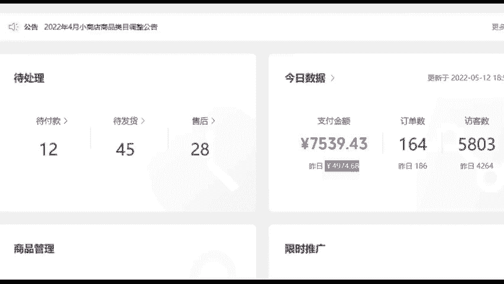

这么一件事情的话呢，你跟着我的节奏来就好了，话不多说啊，也是从最基础的开始。

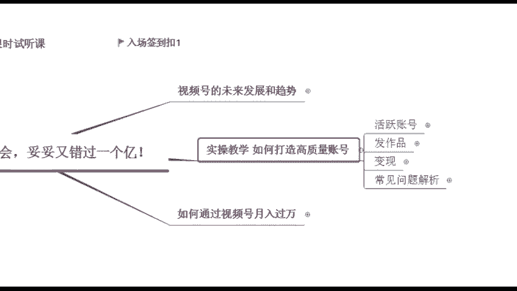

因为本身我也是从零开始的啊，视频号的入口应该都知道吧，就在你的朋友圈下方，我刚刚已经讲过了啊，他可以发什么短短视频，短视频之前它是只能发15秒，后面的话可以长一点发一分钟啊。

到现在的话他甚至可以发一个小时的视频了，视频可以发图片，也可以发图片的话可以发九张啊，那当然我们做的是这个短视频啊，上来你首先得给自己定个计划。

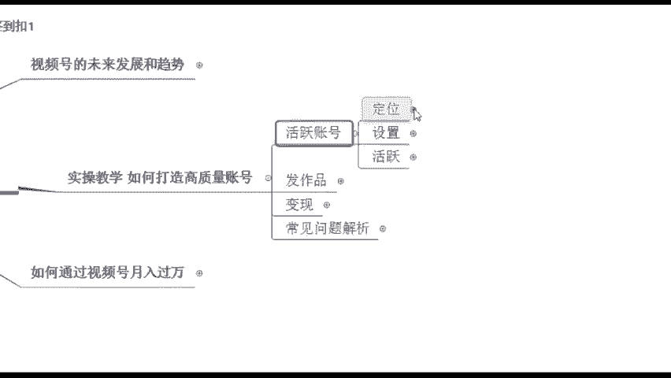

给自己制定一个小目标啊，你要通过比如说先给自己挣个一个亿是吧，先给自己制定一个小目标啊，你是冲着什么样的目的去做账号的啊，如果说你是纯兴趣去玩视频号，那你要当成这个朋友圈去乱发作品，我觉得没有什么啊。

你今天发作品，你今天发自拍，明天发文字，我后天发个搞笑视频啊，都可以啊，无所谓啊，如果说你是诚信去发，你就随便发就好了，那如果说你是真的想要去通过这个东西去啊，做这么一件事情，去赚取这么一波流量。

我想要去赚钱，我想要去把这个号给做起来，给别人带来一些什么东西，那这个你就好好的去给自己定个位了，定位是第一步啊，因为这个定位的话，讲白了它决定了你后期你是带什么样的货，你吸引什么样的一些人群。

所以说这个定位一定要注意了啊，同样也说一下，如果说你在其他平台就是你有作品，你有这个做过账号，你直接搬过来就好了，因为有些在抖音啊，或者说在快手不火的一些内容，但是你发到视频后，他可能会什么。

就是突然就爆冷了啊，突然就爆了这个视频啊，一开始可能播放量不太好，但是你发到这个视频后，播放量它是非常明显。

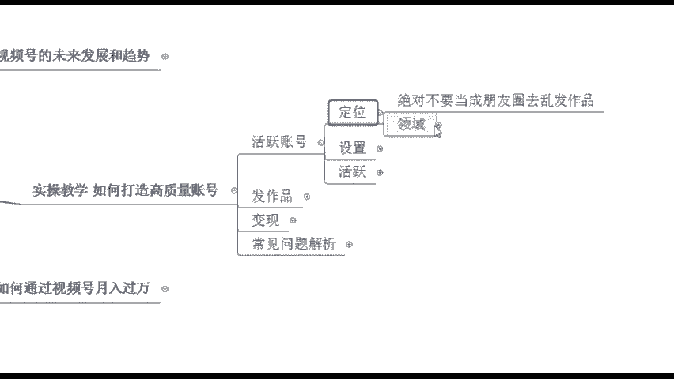

肉眼可见的一个增长，所以说这个是我们现在呃，如果说有作品的同学，你可以这么去发。

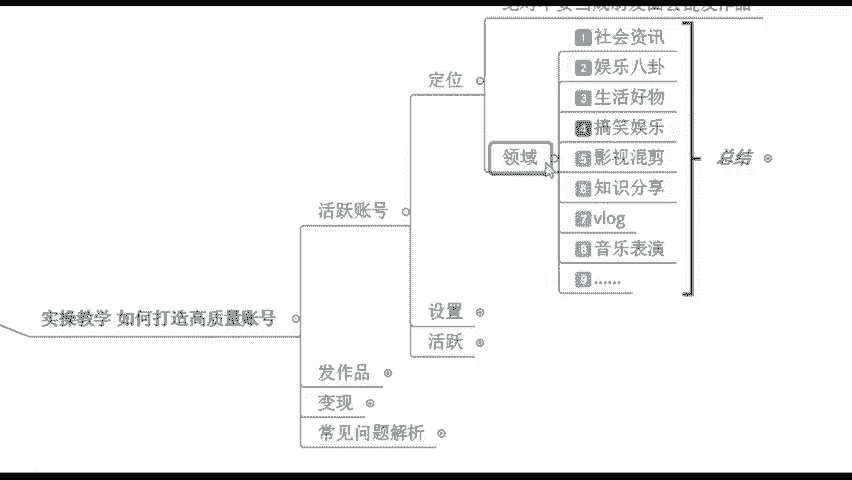

那定位的话呢，我们来看一下定位有哪些类型啊，可以根据你们的兴趣爱好来，有没有自己想做的类型啊，可以扣相应的数字，或者说你可以直接打字也行，除了这些之外的可以打字啊，像我这里的话是总结了一些比较好做的。

一些类型，想做这个音乐的是吗，还有呢好物分享啊，毫无分享就是生活好物类的，是不是嗯对这个就是根据你的兴趣爱好来，或者是你根据你的特长来，特长是什么，腿特长也行是吧，或者说你自己会唱歌啊。

你唱歌还不错的话也行，或者说呢哎你这个会做饭是吧，这个也是特长啊，啊就根据你的兴趣爱好来就行了，或者说你可以拍生活类的，你的生活比较精，也可以分享，那这个就是从你的兴趣爱好去下手，确定好之后。

我们是不要去乱改的，好吧，确定好之后不要去乱改啊，因为我们之后发作品你一定要垂直去发垂直，什么意思，我确定好我之后我要发搞笑类的，我就天天发搞笑类的，我不能说我今天发搞笑的，明天我发个影视剪辑。

后天发个音乐表演，那就乱套了，这样的话没有办法去吸引精准的客户，所以说这个的话一定要稍微注意一下啊，如果说你不知道自己做什么，老师，我从来没接触过，真的，你让我想的话，我实在想不出来好。

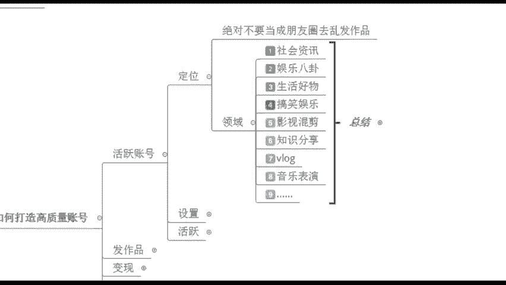

没关系啊，我非常理解，那我这里的话呢也给大家整理了一份，就是咱们的账号定位表，以及你的变现的建议啊，这个是根据我之前的学员，包括我自己做过哪些类型，我又给他总结出来了啊，总结了什么意思呢。

就相当于你可以去做这么一些类型，并且相应的我可以去出出产什么内容，产生什么内容，并且我在产生内容之后，我之后怎么样去变现啊，就是我们的视频的定位，内容的方向以及变现的建议，都给你总结出来了啊。

都在这么一份表格里了，这个就是我之前自己踩过的坑，包括我学员踩过的坑的话呢，都给你们给他排雷了啊，这个是为了帮助你们更好的去找这个方向，这个账号定位是第一步啊，我们确定好之后，不要去乱更改。

因为你之后是要垂直发布内容，并且我们发布内容，你刚开始可以多发一点啊，可以多发一点，我如果说刚开始新创的账号，我在养好号之后，我每天发个五个视频啊。

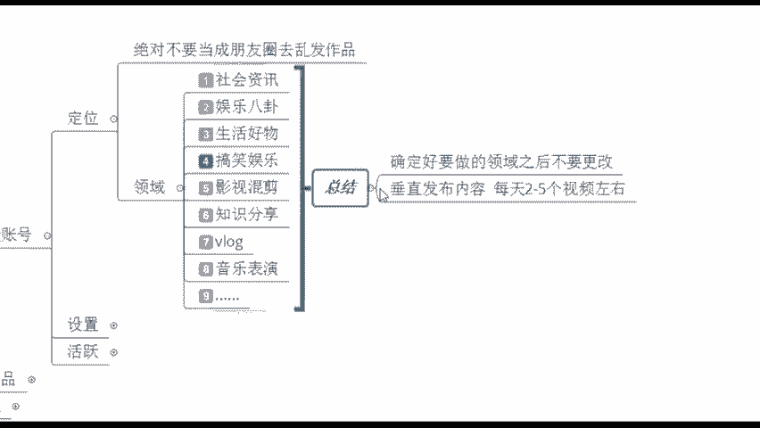

六个视频都行啊，那最少的话你每天持续更新个一两个吧。

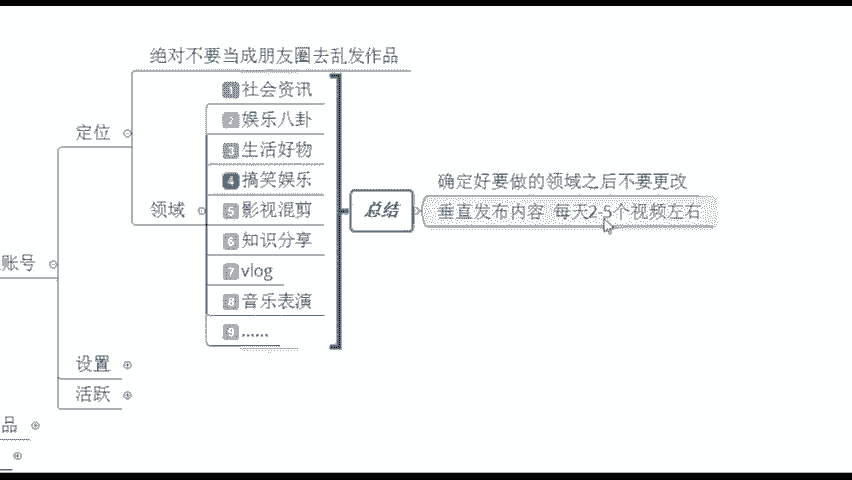

这个的话就是我们需要去产生内容。