# 【2024版视频号运营教程】全B站最良心的视频号运营高阶教程合集！起号真的不难！ - P11：8.视频号批量去水印 - 视频号教程9 - BV1pFyPYvEXU

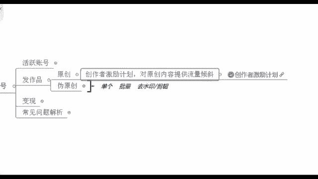

来看一下去水印，专门录了个视频给你们看啊，咱们来仔细看一看怎么去去水印呢？一步一步来。😊。

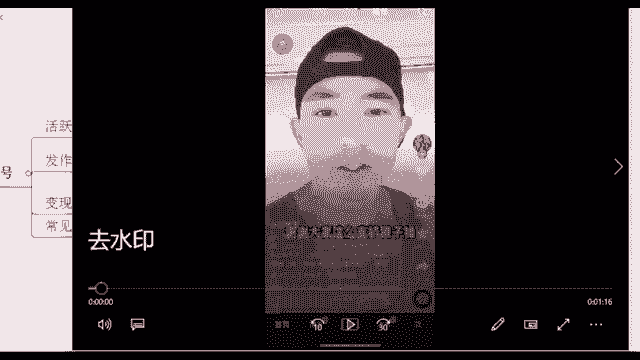

你看这个是假如说我们现在我找到这个账号叫做什么？😊，🎼啊，这个我搬了你们之后就不要去搬了，这个是我自己指导我学员去搬的这个作品，他已经搬过了，你不要去搬了啊。就这个宠物类的萌宠类的。好，那在这里的话呢。

你看呃我们这个播放量其实还不错，假有没看到他整体这个账号播放量还是不错的，就点赞啊，他的一个浏览量也还可以是吗？那我坚信如果说它作品没有问题的话，我同样的放到视频号去，其实我也能够哎有这么一波流量。好。

那在这里的话，我们去水印怎么去呢？右下角点转发，点完转发之后，不是说你让你直接去下载这个视频，你直接下载的话，我们在这个右视频的右下角或者说左上角你是能够看到什么它的一个作者的水印在的。

所以说不要直接去下载啊，我们是点击右边这个右边有一个有一个什么复制链接，我们直接去点击这个就好了。😊，好，复制链接之后，打开你的微信，打开微信之后呢，在里面去搜索一个东西叫做快抖工具箱。😊。

快乐的快抖音的抖这个东西它就是帮助我们去去水印的啊。你看我们现在就是在抖音复制，那我们就点这个抖音嘛，点开之后，在这个上方。好，那您看一下这里有什么粘贴链接，右边有一个点击解析，我们先点左边的粘贴链接。

点完之后立马点右边的点击解析就好了。😊，也有一些广告，你直接点掉就行了啊。嗯，快抖工具箱。对，这个就是一个小程序，你们直接先记住，然后下去之后能够搜到的啊。好，你看现在就是在解析中了。

我们只需要等待几秒钟。😊，这个时候他后台就在操作，就在给他去去水印嘛。你看好了，成功，请点击保存视频。那这里我们再去点击这个保存视频，你现在能够去下载下来的这个视频的话呢，它就已经去掉水印了。

保存成功是吧？已经到你的手机里面了。这里的话呢就是第一步操作叫做去水印，去水印快抖工具箱啊。那接下来我们再来看一下，在去完水印之后，我就直接发了吗？直接发也不行，平台它是管的很严格的啊，管的很严格。

所以说你直接发也有可能会被发现。那我们这个时候有看到吧？二次剪辑，我又录了个视频给你们看啊，二次剪辑去把原来的这个视频给它去稍微加工一下，给它改头换面一下，这样的话呢我们就不容易被这个后台去监测到了。

好，那在这里的话呢，怎么去二次剪辑，这里可以用到这么一个工具叫做剪印。😊。

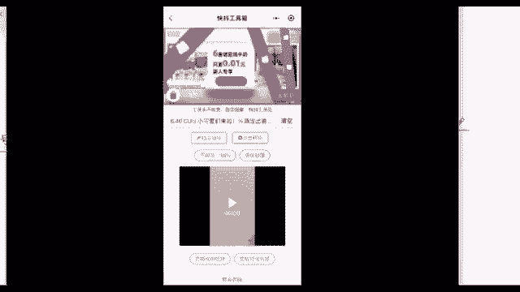

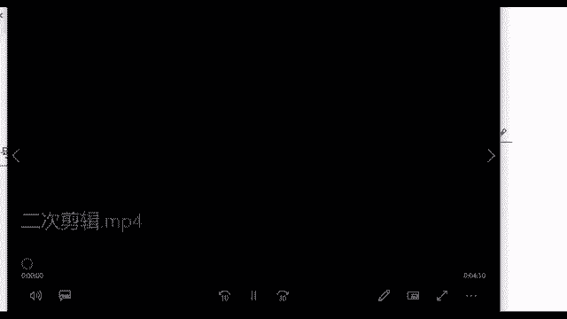

就这个东西，这个叫做剪映啊，剪映的话就是帮助我们怎么去剪辑视频的。包括像现在微信，它有专门自己出一个软件，叫做秒剪。😊，啊，秒剪这个东西秒剪的话也可以去剪视频啊，我经常我自己在用的就是这个剪映啊。

你们看自己操作是比较喜欢哪一款，好吧，你自己去挑就行了。那这个在里面的话，我们点开剪映，然后呢。😊。

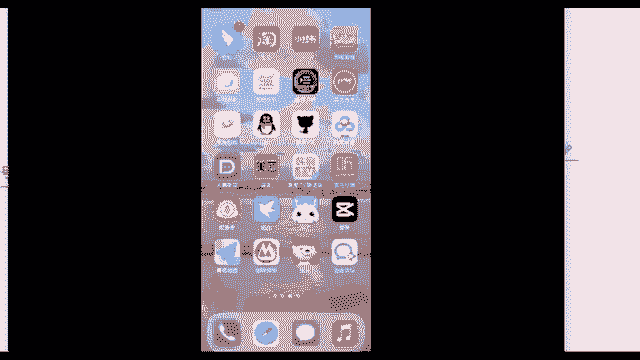

🎼对，点开简易。然后呢，我们在这个上方。😊。

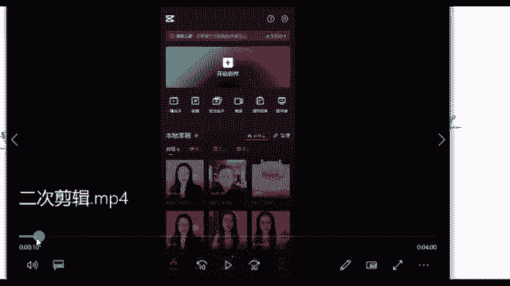

🎼上方它有一个开始创作，打开之后，它有个开始创作，直接点击点击之后，把我刚刚就是下载到我的相册里面，没有水印的那个视频，打开给什么加入进去导入进去。然后我再去操作嘛，再去剪辑它嘛。这个已经添加进去了好。

那我们在这里的话，你看这个是我们完整的一个没有水印的视频，左上角右下角都没有了。哎，这个右下角这个作者还留了个心眼呢？你看在这里的话是他还加了一个自己的一个小小标记啊，他自己的一个小水印。

那我们把这个去掉就行了啊，直接去掉，去掉的话，我可以通过什么方式呢？我们把这个视频去二次剪辑，其实也是改变它背后的一个数据。因为每一个视频背后，它其实就跟我们人一样，人的话都是有身份证的。

视频背后它也有它相对应的一个代码，程序员都会给他给他赋予一个代码，这个代码叫做MD5值啊，有没有听过这个东西的。MD5值。😊。

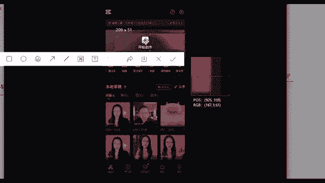

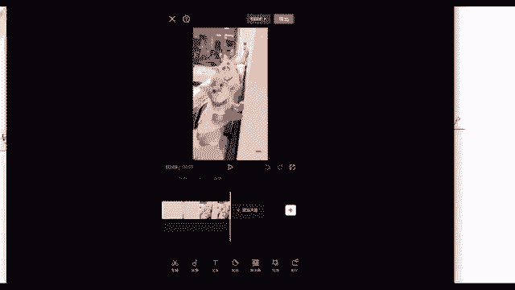

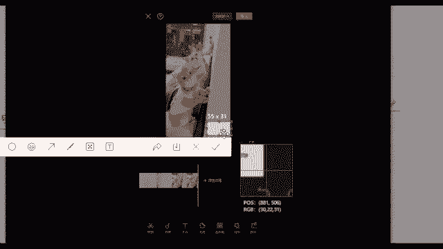

就它的一个数值啊，这个东西的话，我们现在进行这个操作，其实就是在改变它背后的1个MD物值啊，没听过。那我今天跟你先科普一下啊，咱们先了解一下就好了。那在这里我们只需要去对它进行一个更改。

改变这个数值之后，别人再去看的时候，他就不知道这个东西了呀，对不对他就呃觉得这个作品好像是你自己的对他就是你自己的啊啊，就是你自己的来，那这里我们再去剪辑的话，可以通过什么方式呢。😊，给你们看一下啊。

😊，有很多的方法，比如说你像这一步，我就是稍稍的把这个画面给它放大了，有没看见双手放大，你两个手指放在这里，然后呢，跟你放大图片一样，把它给放大就行了。放大一点点。但是其实我看的内容都是一样的。

我的内容是没有任何的改变的，是不是啊两根手指放在这样去放大就行了啊，包括这个是第一个操作。第一个操作我们放大的话，它能够把右下角这个水印给挡掉的。😊，好，同时我们还可以去对它进行一个什么叫做分段剪辑。

分段剪辑的话在这个地方啊，你会看到这里有一根小竖线，这个其实就跟咱们的菜刀是一个原理，你的竖线它是放在哪里的那这个刀它就切在哪里的对吧？你放在这儿，然后呢，我们再去点这个剪辑切割一下。哎。

这里这个视频的话，左边一部分右边一部分就把它给分开了，给它剪断了。所以说我们再去进行一个分段剪辑，这里我是分成了三段啊。😊，你看。😊，这里先切一刀，对不对？点分割，这里再切一刀，再点个分割啊。

分成三段了。好，分成三段之后的话呢，我们再去对它进行一个分段加滤镜啊，或者说分段调速，我们先来调速吧，调速的话也是在下方，你看这里你可以去尽情的去调速度，调一倍啊，或者说1。1倍1点2倍啊，是吧？

你不要调太多啊，你如果说调成二倍5倍10倍，那这个视频嗯本来它就只有8秒钟，你再调一下，人家看个什么呀，看个寂寞啊，所以说这个东西你调速度可以上微调，我们所有的数值它都是微调，你不要去大概啊。😊，呃。

大改了之后，这个内容也不一样，你看我调都是0。9倍是吧？或者说一倍两倍好，这个是分段调速度。它的话这个操作界面都是在下方都是在这个底下，这个底下它有非常多的一些按钮，你可以自己去看一看啊，你看。😊。

在这地方你可以给他剪辑，甚至你可以给他换个音频，我给他加一点字幕，我加上我自己的名字行不行？我就在这个地方我添加文字，加上啊，比如说什么什么萌宠是吧？这是我自己的账号嘛，我就加个名字行不行？也行啊。

包括给他加个贴纸啊，加个画中画啊，是吧？或者说加个特效啊，加个鼓掌的声音啊，加个比较好笑的声音啊也行。好，这就是呃我们去做的这么一些操作啊。😊，好，这个是分段调速。分段调速之后呢，我后面还可以通过什么？

比如说分段加滤镜，滤镜的话就跟你们平时自拍之后啊，自拍之后很多女孩子啊可能会去给自己去加一个美颜啊啊，加个什么就是双眼放大啊是吧？磨个皮呀啊，这个其实就是给她去改变她背后的一个数值。除此之外呢。

还有什么方式。😊，我还可以给它调亮度，调对比度，调这个饱和度。当然调数字的话呢，也不要去调太大。它的数值最大可以调到100嘛，那我就调个123行不行啊，调一点点，但是其实调这么一点点的话。

你的原视频跟我调过的视频，它基本上你看不出来，你调这么一点点数值调的跟没调一样啊，就是要有这个效果，我就是要调的跟没调一样。因为它原来的视频播放量很高，所以说我要确保它的一个播放量。

我确保这个视频的质量，我只能微调微整形一样，这个意思啊，好，这就是这么一些操作。你看这里就是加滤镜了，加滤镜呢后面的话也可以什么。😊，啊，这是调对比度亮度，以及还可以给它换音乐。好。

这个我们整体调完之后啊，你调完之后，直接在这个右上右上角有个导出红色的按钮，你点击导出这个视频二次剪辑，它就完成了。好吧啊，这个视频它就已经搞定了。来，这个看懂了吗？看懂同学，你给老师打上个懂了。😊。

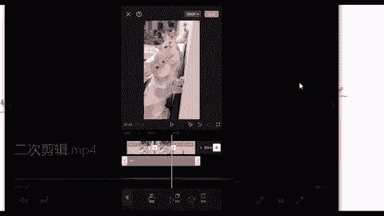

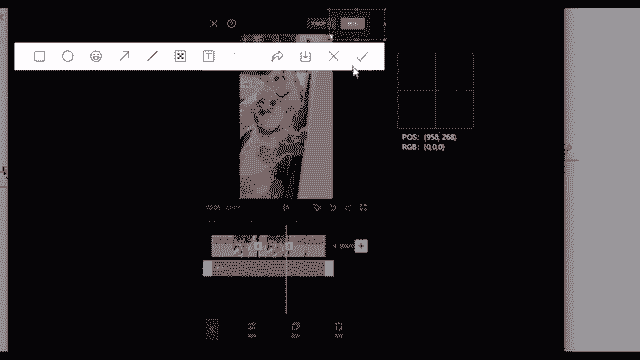

看懂的同学给老师拿个懂了。这个其实具体的操作的话，你们下去之后去下个简映，下个剪映，然后多操作几遍，这个就会了啊。我刚刚说的一一切的类型啊，你不管是调滤镜啊，调画面啊，调音乐啊，调速度啊，这个其实都行。

你根据你的喜欢的来就行了。😊，如果说还有哪部不懂的，也可以跟我说啊，我们做短视频，你肯定要学会这么一些东西学会了是吧？好，没关系啊。这个下去之后，如果说你看的不太清楚的话呢。

我在下面我可以把这个视频去发送给你好吧啊，如果说好简单，那说明你还是有一定基础的啊，这个就是我们去剪辑这个东西，因为咱们好多同学也是小白，所以说我也我也是尽量就是讲细一点给你们听吧。啊，懂了。

那我就快速过了，然后下去之后不懂的同学，我去呃把这个视频发给你也行啊。你找到你助教老师，我给他发好吧啊，这是二次剪辑。其实这个二次剪辑的话呢，就像我刚说的是帮助你去把这个视频，他原来的一个数据改掉。哎。

那我之后我再去发这个视频他绝对可以的啊，绝对可以报，绝对可以火的啊。那我们在这里的话，首先我们现在是单个去给他去剪辑，还记得吗？我刚刚说我们是要垂直发作品，垂直发作品，一个作品的话。

我可能如果说我刚开始上手慢，我半个小时花在这了。我如果说后面我剪5个视频呢，我一天我就全部在剪视频了，那。😊。

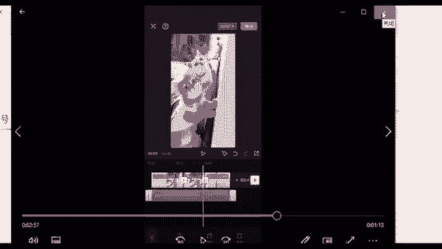

多浪费时间啊啊，你想一下，人家是怎么去做到，就是多个账号，一天发个四五个视频，发五六个这个视频还能够轻松自如呢。这里其实是有工具在的。😊。

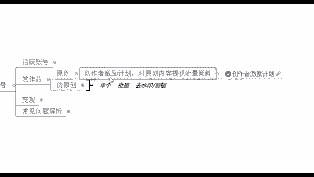