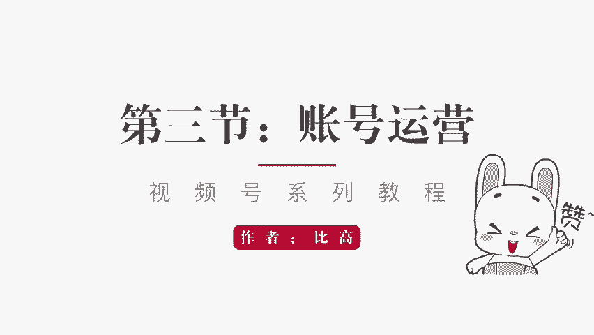
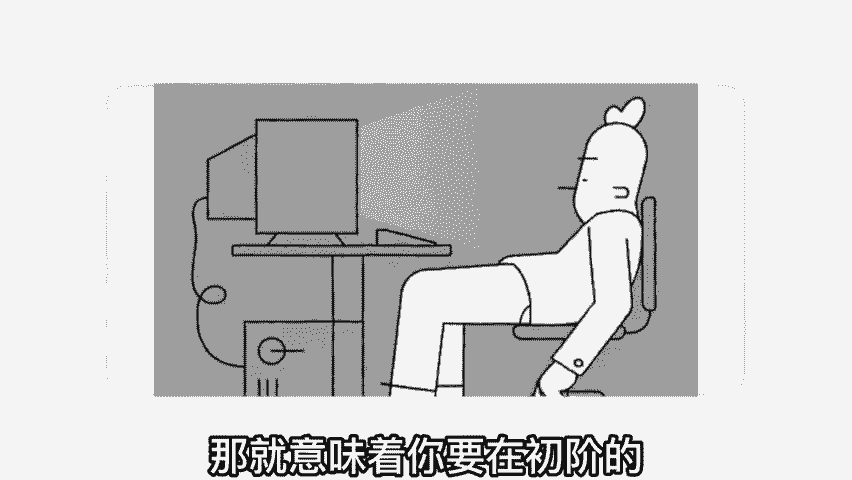
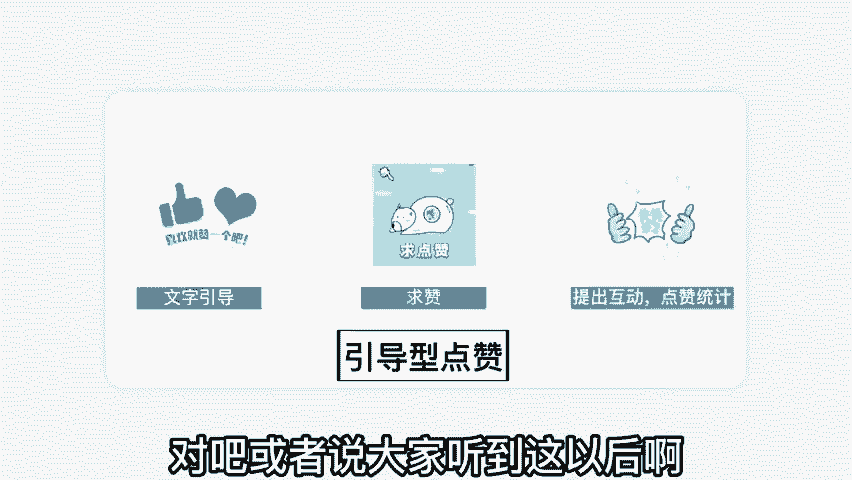
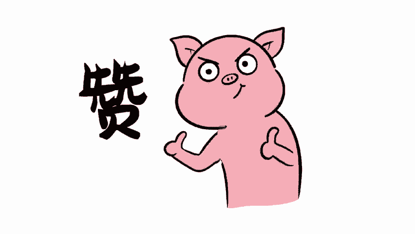
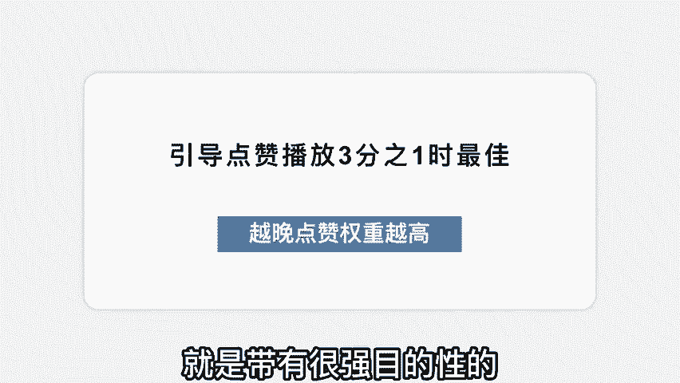
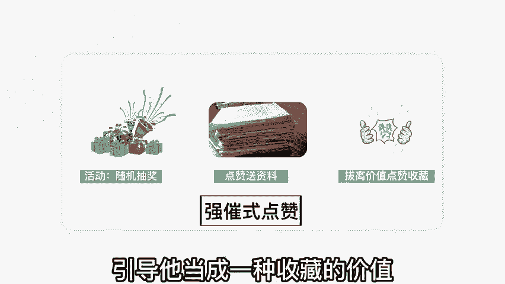
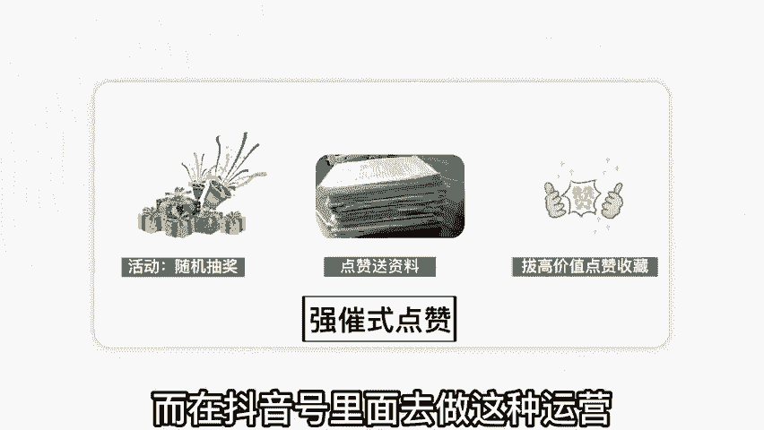
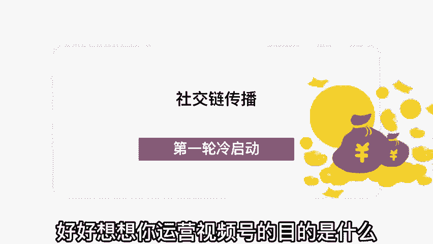
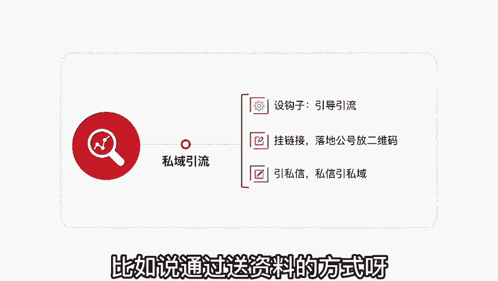
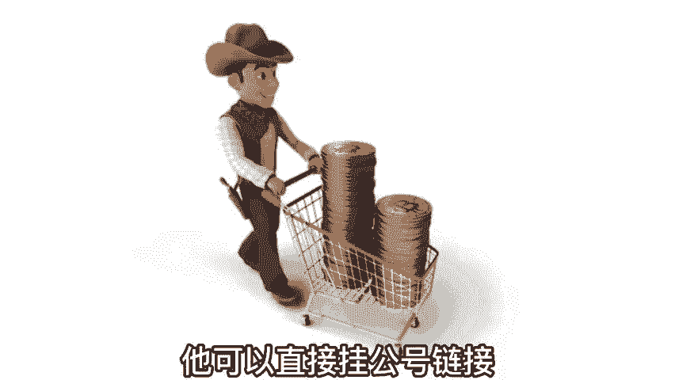

# 【2024版视频号运营教程】全B站最良心的视频号运营高阶教程合集！起号真的不难！ - P15：第三节：账号运营~ - 二号胡同 - BV1d2mEYgEWp

视频号怎么运营？今天我们来到第三节账号运营。整个系列呢我会出的五节。如果你是空降到这一节的话，我建议你按照顺序观看，我相信对视频号的整体运营啊理解的更加透彻。账号的运营运营什么呢？

我们在前两节讲的个很关键的点，就是视频号它的推荐机制的能启动是源于用户的点赞。你的用户点赞也就辐射到它的一个社交圈。以此这样类推我们就知道点赞的重要性啊实在太大了。在抖音里面内容点赞呢。

它只是一个简单的用户认可，它会判定到用户认可的一个维度里面。而视频号不一样啊。视频号点赞就是一个启动初期推流的一个根源。你要想你的内容进入更大的流量池，得到公益流量的加持。

那就意味着你要在初阶的能启动的这个范围里面把它做足。那点赞这块，我们应该怎么针对性的运营呢。今天呢我把这块重点的来讲一讲啊，在点赞这块呢，我们。

需要做足这三个点啊，这是属于引导型的点赞。第一，文字点赞。大家在看视频的时候，一定会刷到哎，视频的中间啊，它放了一个点赞，有一个这样一个动态图的提示啊，就是你喜欢哎，你觉得这个内容不错，给我们点个赞吧。

哎，这个引导非常重要啊。特别是视频号针对的这种中老年的用户群体蛮多的你不要小看这么一个引导动作啊，这么个引导动作就决定了他是否就真的给了你一个赞，你就当是求赞赏的。第二种方式呢是求赞的模式，对吧？啊。

反正意思是我们的讲到这儿了，哎，我都贡献出这么多了，你来帮我点个赞吧。哎呀，我非常需要一个赞，怎么怎么怎么的，哎，你可以通过一些话术型的东西进行求赞，或者是通过互动型来点赞互动啊。

比如我在内容里面这么引导啊，我说大家看到这里啊都不容易啊，我相信你是一个非常有品味的人，你在这块已经了解的非常通透了。你现在点个赞，我来统计。一下这个视频会有多少人真正的理解透了，对吧？

或者说大家听到这儿以后啊，觉得理解的来点个赞，觉得学到的点个赞，我进行个统计，看一下我们的内容是否做的真的优质，真的不错。用统计的形式提出互动，也能够引发观众的点赞。

引导式的点赞能帮助我们的内容进入更多更大的一个流量池。那引导点赞的话术，以及这些标识放在什么时候比较好一点呢？我在这儿建议啊就是引导点赞呢是在播放的3分之1的时候最佳。

啊，一开始就引导点赞，完全没必要。你想想一个观众会在刚看你的视频的时候就直接点赞吗？啊，不太现实。放到最后的话呢啊人家可能玩播到不了那儿，你的点赞率就比较差，所以放在3分之1，这个时候啊。

他能看到了一些东西然后他也对你有一些兴趣，愿意接着看下去。所以你这个时候引导点赞是最佳的，而且这个时候权重是比较高的。在整个推荐机制里面呢，点赞越晚，权重就越高。

比如说这个人是看完了之后点赞和刚开始看就点赞，他的权重是不一样的。啊，当然你不要拖的太晚。就像我刚刚说的，你放到最后人家点赞，玩播率到不了那儿，然后也错失了引导点赞的机会。

所以我建议在3分之1的时候引导一下点赞，在最后的时候再给他引导一下点赞啊，双重的引导，尽量的把你的内容点赞这块给他放到最大。刚刚我们讲的是引导是点赞，还有的点赞什么点赞呢？就是带有很强目的性的。

我称为强吹式点赞。强吹式点赞什么意思呢？比方说点赞随机抽奖，对吧？啊，比如说比高的这个领域适合用什么来抽奖呢？我用一些课件啊，或者是我用一些教程，对吧？哎，我这个教程已经做好了，你在下方点一下赞。

然后我会随机的抽取，按照多少名多少名抽取来赠送这个奖励，以抽奖的形式激发他们的点赞。第二种方式呢是送资料啊，比如说啊我做一个什么教程，然后后续有什么软件搭配啊，一些什么资源资料的搭配，哎。

我完全可以送资料，我直接告诉大家，凡是点赞的每一个人我都会私信把资料全部送到你的手上。哎，你看是不是很好，然后你想想这个内容特别有价值，我也想要一个资料，顺手就点了，这种叫强吹式点赞啊。

还有呢你可以把点赞引导他当成一种收藏的价值。因为当他觉得这个内容好的时候。

哎，你要提醒他做收藏，怎么收藏呢？他不可能把这个视频专门发到朋友圈，或者是啊发到自己的好友那里，对吧？会打扰到别人，他不想要分享给其他的人，但是他想收藏起来，以后要的时候慢慢看。

但是视频号没有下载的功能啊啊，他不像抖音啊，所以你可以提醒他喜欢的话，点赞收藏啊，绝对有价值的话，点赞收藏，提醒他点赞和收藏有个很强的挂钩，拔高这个点赞的价值，通过这三种方式啊。

我们可以有效的去引导我们的用户进行点赞。当然，这些引导方式在视频号非常重要。而在抖音号里面去做这种运营就变得很low了。这也是很多运营抖音运营的特别厉害啊，但是一运营视频号就运营不起来是一样的道理。

因为他们的运营逻辑不一样啊。

抖音的话呢，它的陌生关系啊有能够有效的触达账号打了标签之后，平台会给你很大的公益推流。所以你只要把内容做好啊，能够服务好你的用户，相信持续的更新下去之后就能够做出来。视频号不一样啊。

视频号里的内容做的再优质。但是你的运营这块不给你，发布上去就是没有播放，对吧？所以我们要把整个运营的体系逻辑给他理解透彻。那我们再回过头来看看，其实视频号的整个推荐呢，它都是源于社交链的传播。

我们为什么要引导我们的观众进行点赞。就是要让第一的人能启动跑起来。只有第一轮的能启动跑起来才有机会得到更多的公益推流。那运营视频号的目的是什么呢？可能有的人说啊我就是为了赚钱，我们再给他细分一点。

再切入的好好想想你运营视频号的目的是什么？我认为运营视频号无非就这2块。第一个它是一个很好养用户的一个。

场景，所以养用户粘性非常的不错。不管是你直播也好，发视频也好，它的整个触达是比较强效的。第二个呢是私域的引流非常便捷。比如说我们在视频号里面做的内容准备引到私域啊，也就地球号里面，对吧？

引到私域怎么办呢？哎，有很多种引流方式啊，所以私域的引流是我们在操作视频号运营视频号的一个非常重要的一个大块。私域引流的话，我建议按照这三个步骤走。第一个先设置钩子啊，设钩子就是引导引流的方式。

比如说通过送资料的方式呀，你要给对方一个添加你的理由。关于这个理由的话，你们可以看看我的视频啊，我觉得我在引流这块还是不错的。你看一下我每个视频是怎么样去设置一些引流方式的，最合理的方式什么呢？

就是在这个平台发不了这一些东西，要到另外一个平台去发。所以大家问我要一些资料啊，一些课件，我在抖音里面是真的发不出来。我不可能。

直接给你发链接，我也发不了文件，所以我让你在另外一个地方领取。你看这就是一个引流方式。但是视频号还有个引流比较不错的，就是他可以直接挂链接，它可以直接挂公号链接。

你只需要在这个链接里面落地放上你的二维码可以直接引流。这种方式在抖音里面是被封的，但是在视频号里面是没有问题啊，毕竟他们是自家产品嘛，对这个不排斥。第三种引流方式呢是从私信里面引从私信引到私域。

你看我们在运营起来之后啊，设钩子挂链接引私信，这三个非常强效的触达，包括在直播里面也可以挂链接，直接做强效的引流。它的引流效率呢是比较不错的。我这在第一节的时候呢，我详细的给大家讲了。

关于引流的转化的一些数据啊，这是整个视频号，我们运营需要做的一些基本功。当然视频号的运营远不止如此。我今天我没有把这个事讲的太过于复杂的，是希望大家。

能够去执行，然后能够简单的去理解它。并且在接下来深入去做的时候呢，能逐步提高自己的运营能力。那关于视频号的整个运营，我一共做了五节的新的教程。你在我的公众号比高回复视频号，我在更新完毕之后呢。

会全部推送出来，到时候呢认真的观看啊。好了，我们今天呢就讲到这儿，我们在下期再见吧。

