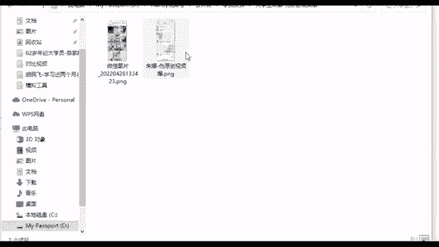
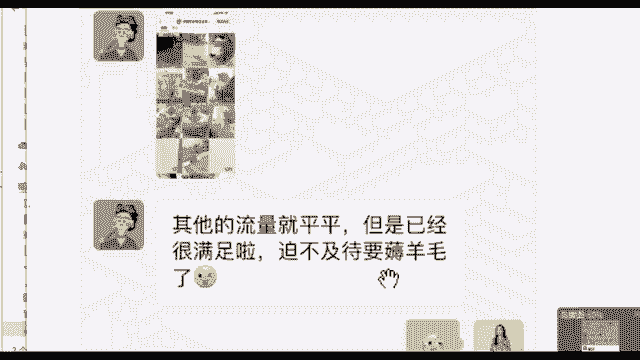
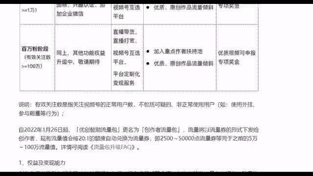
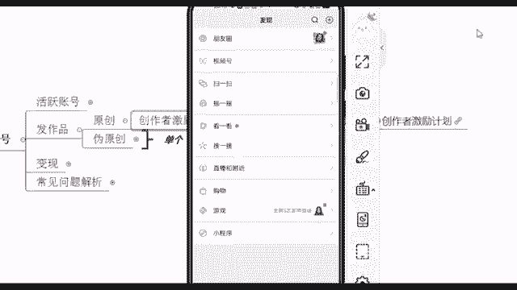
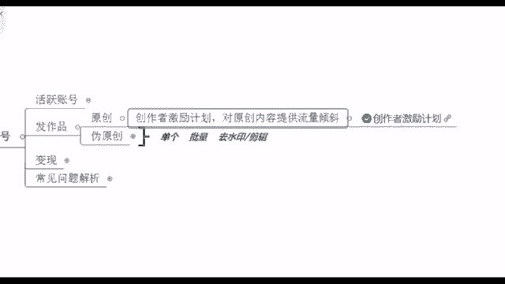

# 【2024版视频号运营教程】全B站最良心的视频号运营高阶教程合集！起号真的不难！ - P18：7.视频号如何伪原创 - 酱牛肉奶粉 - BV1Nb2GYvEYK

第二大步，我们已经到了这个发作品了，平台它本身也是支持原创的。😊，他有什么创作者激励计划，对原创内容是提供流量倾斜的。我给你看一下这个创作者激励计划，有流量扶持，包括呢让1000万的原创作者有流量。

并且让百万优质创作者有收入，以及呢我们在零粉阶段哎，他会给你什么？就是流量扶持，2500到5万点的流量券，给你送流量券，这就是给你送人去看。

包括呢千粉阶段好加入这个重点作者扶持时优质视频可以去申报专项奖金，你还有奖金可以拿做的好，以及呢万粉阶段，哎，我还可以去申报专项奖金是吧？百万份更多了。好。

所以说这个就是一级一级的给你推进这个流量池里面去啊，原创的话比较好啊。当然这个的话一定要靠你自己的一个技术了。😊，你有技术，比如说你会拍摄，你自己会编这个台本啊，那你去做原创应该比较方便的。

我看到好多同学说，老师，我想做这个为原创是吧？老师我自己知道我是什么情况，我没有做过这个原创。我如果说现在去做原创，的确会比较难。咱们包括我也看到就咱们现在的话很多大部分同学都是小白同学啊。

咱们今天重点来讲这个搬运。因为像原创的话呢，剧情类和搞笑类的，这个一般就是属于原创的，他的话一般都是团队来做。如果说你没有内容啊，我不知道怎么去做这个账号。

那我们可以去扒优质账号的爆款内容去进行一个二次创作。这样其实也行啊，也能够变成新的内容，也可以给大家就带来一波新的流量的福利嘛，我们不就是为了流量嘛。那这里的话呢，我们给大家来看一下搬运到底能不能行呢？

来看一下，像这个大学生中娜同学，他当时就是疫情。然后被封校了啊，疫情封效之后，他自己的话，就在宿舍，就没有什么事情做嘛。当时就是课的话也停了啊。然后当时的话他就在宿舍想要去导过这个视频号。😊。

结果自己捣鼓老半天也不会弄，不会弄。当时的话是也是了解了一下咱们这个视频号，当时是跟着我在学的那你像他后面就是一开始啊。😊。

他的一个账号，你看老师我账号报了，当时就是在指导下，你看去做着这个视频，其他的流量平民，但是已经很满足了，迫不及待要薅羊毛了啊，搬的不错，他这个就是搬运的，当时就蹭了一波热度啊。

这段时间比较火的这个刘根宏嘛，一直在火，是不是健子操嘛，也是因为疫情火起来的啊，这是他当时蹭的一个热度。所以说之后你们也可以去蹭热度这一方面啊，那你看他的一个作品。😊。

这是他自己的账号啊，你看他的作品，这是他搬运的9。4万。😊，同样的一个视频啊，就基本没有怎么改9。4万。然后这个的话也是搬过来的4。1万这两个置顶呢就是呃做的比较好的。然后像其他的也有这个流量频平的啊。

也有这个100多的赞的是吧？3。2万赞的，100多赞的，是不是持9赞，这是新发的啊。然后这个的话我们都能够看得到这个数据说明什么呢？搬运也能行，我们也能够就是获得流量。那当然这个搬运的话。

它是有一些流程的。你之后可以什么找到一些相关的平台给自己去找灵感，我给你们看一下啊，它有哪些平台可以去找灵感的。我刚刚有说到这个什么西瓜数据啊，有望数据，以及我刚刚给大家说那个微信指数都可以去找灵感。

那你像这里的话，哎我们可以看一看在它这个视频号里面，视频号的排行榜可以看到吧。你看比如说你要做影视剧的。😊。

我对比要看一下哪些账号是做的比较好的。然后我点进去看一下，我去看看人家账号好的地方在哪里，我去先学习一下，我先借鉴一下行不行啊，这就是给你找灵感的一些东西啊，包括你要做音乐类的啊，音乐类的就在这了。

我看一下哪些账号做的比较好的，这个是呃去给自己找灵感，看看什么内容比较容易火啊，叫做有望数据，就这个东西好，当然我们搬运的话，它是有一套流程的。我来说一下这个流程，我先说一下流程啊，首先你要去先选品。

你确定你要卖什么东西，确定好你要卖的货之后呢，我们再去找相关的视频，找到这个相关的视频啊，账号之后的话呢，我们再去搬他的作品，搬的时候是要进行什么去水印和二次剪辑的啊，搬的话。

不是说你直接我直接下载下来发到其他品牌。你还记得吗？我刚说了平台它是支持原创的那你这个时候你直接去搬，人家看到你的水印，又不是你自己的作作品，你这个账号怎么没的，都不知道。所以说一定要记得啊。

这个伪原创，咱们是需要去伪。😊，创了一下的，一步一步来，先从这个选品开始。在这里的话，我们右上角是不是有个小人头啊，这个小人头你直接点击进去。点击进去之后的话呢，这个是我自己新创新创的一个账号。

还没开始做的啊。在这底下有一个什么叫做创作者中心啊，就这个东西。我们现在找到它之后的话呢，然后你点进去。😊。

点进去，我们选品就在这去选，你先确定好你要去卖什么东西，或者说你去其他平台看也可以。比如说阿里巴巴的1688或者说这个。😊，拼多多的也有什么多多呃多多的一些平台，这个到时候都可以去看一。

就找到相应的平台。你确定要带什么货。假如说我要做这个音乐类的账号，我之后可以卖什么呀？可以去卖车载U盘吧，是不是车载这个音乐嘛，对不对？包括还有呢我可以去接这个音乐的广告啊啊，影视剧的可以干嘛呢？

也可以接广告啊，也可以去什么？就是呃新颖粉丝啊，包括去卖货。所以说这个的话就是我们根据你要卖的一些货去选择你定位的一些类型。😊，哎，对，卖教学也行。现在假设我要去卖一个宠物类东西嘛。

我这里的话刚好也录制了一个这个视频啊，刚好给你看一下，我们现在假设说我要去卖这个宠物类的一些产品，那我就先定位一个宠物类型的账号，那这个时候我们去可以去搬什么呢？我就搬宠物类型的一些东西。

我就搬这个宠物类的，那我们在搬的时候呢，是吧？我们可以先去平其他平台看一下。比如说我现在啊我在抖音啊，我看到一个平台，感觉还不错，我看到一个账号还不错，然后他这个作品的话呢，哎。

你看到这个账号还不错的时候，你还要去看一下他在视频号有没有人搬过他这个账账号，如果说有人搬过，你再去发，那就很尴尬了。这不就重复了。所以说你看一下他到底有没有人先去搬他的作品啊。

那假如说我现在看到没有人搬过，那我就确定这个账号嘛，啊，找到作品之后，我不是说直接去下载，我首先得给他去水印。😊。

