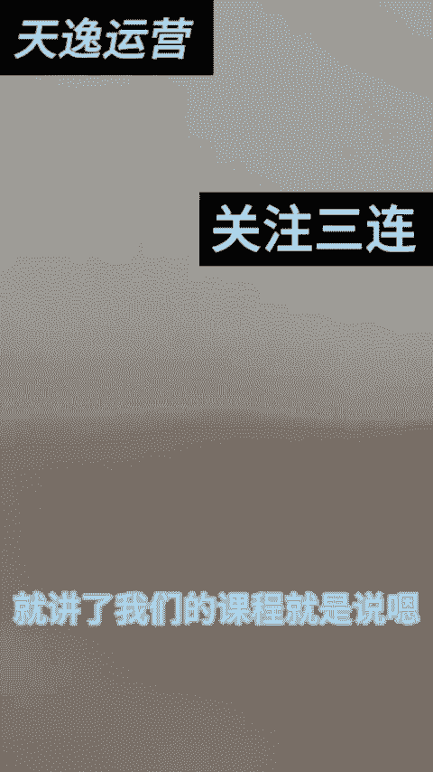

# 【2024版视频号运营教程】全B站最良心的视频号运营高阶教程合集！起号真的不难！ - P25：11-文字的编辑_1 - 视频号教程9 - BV1pFyPYvEXU

hello朋友们哈，上节课我跟大家讲了，对不对？就讲了我们的课程，就是说嗯我们先教大家如何去剪辑。那我第一今天来从第一步开始啊，我们先下载哈。可能呃这个视频是我第这个视频是我刚刚找的哈。

怎么找怎么找视频，大家都知道吧。😊。

明白吧，怎么找大家都明白哈，就搜那个民间故事会就行了哈。然后我就找到了这个视频，我们点击，然后复制链接，复制链接之后我来下载，对吧？😊，出水印，然后粘贴出水印。保存视频哈。😊，我的网速稍稍有一点点慢。

好。然后呢，我跟大家讲一下哈，什打开剪映，点开开始创作，点开这个视频添加上。来朋友们，我跟大家讲。第一步我跟大家讲什么叫呃文字吧。第一步一个一个的来哈，我们从这个地方一个来，什么叫文字？

这一步就是说文字，那文字哈我们分两种。第一种哈我们这干什么呢？点击添加。添加之后大家看到没有？有一个智能文案，智能包装新建文本哈来新建文本是吧？前面两个我们入不上哈，新建文本我们可以写一个剧情演绎。

剧情演绎是吧，请物模仿哈。是不是请勿模仿，对不对？是吧然后这种提示词嘛，对不对？我们可以给它放到这底下是吧？可以给它底下，这个字可以给它稍微的。给它缩小一点，对不对？缩小一点。那比如说编辑这个字母。

对吧？样式哎，什么样式，这底下都有描边粗体，对吧？花字。只要不是VIP的都可以选是吧？文字模板这里有选。然后动画是不是朋友们哈，这里都有选，对不对？怎么出。

你到时候你自己你自己去看你想要什么要什么要什么样的字体，对不对？是吧是不是都可以，对不对？嗯，我比如说我要竖竖的哈。竖一点的字，我想让这个竖成为竖版，对不对？那我就直接让它成为竖版的字。

这竖板子我们给它放到这儿行不行？朋友们，然后呢放到这个地方，然后我们这个文字不就添加上，然后我们直接给它拉到底。这个就是润润到全局上面了哈，运用到全局上面了。这个就叫文字哈这个就叫文字的添加。

那我每一个哈每一个朋友们每一个切记都给它拖到这个尾部，跟这个对齐哈，跟这个对齐，大家明白吗？好，来所有的朋友大家看到没有？这就是。这就添加文字。那这个文字你们大家觉得颜色深的话。

你们就把这个文字颜色稍微给它改改颜色，改淡一，颜色改改那个淡一点，然对你就。是吧怎么选都可以哈。对不对？是不是好，那我们接下来哈我们接下来干什么呢？接下来我们来干什么呢？😊，这个就叫文字，对不对？

文字分好多种哈，还有就是什么呢？识别字幕什么叫识别字幕呢？点开。这个识别字就是识别你整个视频的音，然我们剪视频。对吧。来，朋友们，你们自己去看字字幕识别中，字幕识别中。

就是说你想把这个字原体的这个字给它改变，这个就叫改变字，字幕识别中，这个就是改字哈。来，朋友们，大家看见没有？这个就是识别出来这些字，大家看吗？这个字。是吧这就识别出来。然后这个字怎么改变哈？

比如说我想改变，我们可以批量改变，我们可以编辑。然后想要红的变红的，想要黄的变黄的，想要绿的变绿的是吧？都可以，对吧？然后样式、背景、颜色、花字都接都可以，对不对？比如说我想变绿的是吧，都可以的哈。

这这都没有关系的，对不对？好，我们这里就是变字体哈。然后这个字呢，我们可以给他什么呢？就比如说这个字哈，我们可以给它。什么呢？调大哎，调小是不是调大调小。然后比如说我给它调小一点，我单做一个什么呢？

我就给它放到最底下也不碍事儿，是不是这也行，对吧？我放到最底下也不碍事儿，对吧？如果说您觉得不好的话，您可以把这个颜色给它稍稍调淡一点，对吧？编辑，然后呢不透明度，透明度给它拉低一点，对吧？这也行呀。

是不是这也可以啊，文字添加了，但是看不见是吧？也不影响我们整个视频的整个视频的什么进度，对吧？这就叫文字，这些也是防搬润的哈，防搬润的。😊，为了跟别人的视频不一样，来，这就叫文字哈。

然后这有文字模板识别歌词，对不对？来，这有识别，这里有文字模板模板的话，你随便加。比如说我想嗯这个这个视频里面哈，你可以加到什么模板，那我们就随便加，对吧？如果说你觉得不需要加的话，那你就不加。

比如说我加一个。我加一个什么呢？大家看见没有？加一个哎可怜的男人行不行？对吧把这个估莫鸡丁。对不对？可怜的男人，然后干什么的？给他放到这上面。对不对？给它放到这上面也不要紧的哈。

给它放到那个视频的这上面也不要紧，然后这个也是给它拖满。😊，最近就换了一个模板是吧？这个这个就是添加文字，文字识别字幕，然后添加字哈，这就叫文字的添加。每个视频都可以添加文字，你想怎么改怎么改就行。

大家明白吗？这就叫添加字幕，这就叫添加字幕，这就是文字里面的功能。我们能认得上的功能哈，能认得上功能。好，这就叫文字哈。

