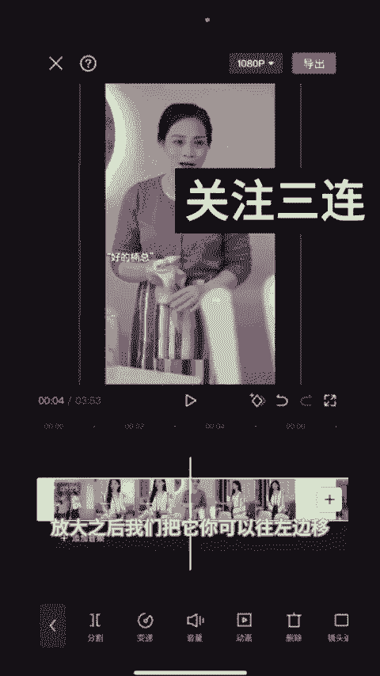
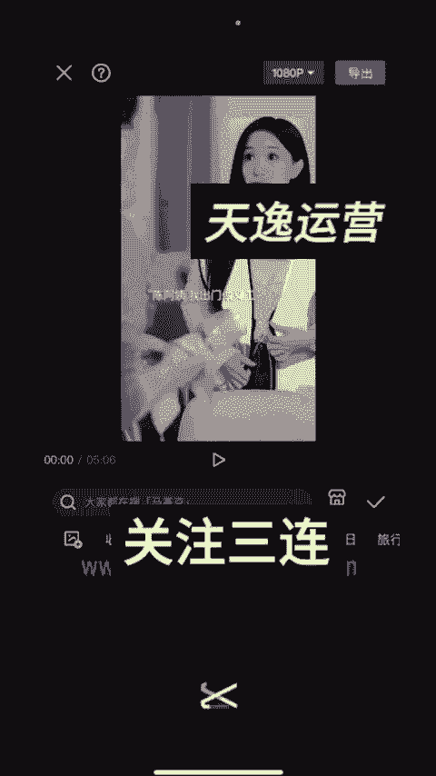
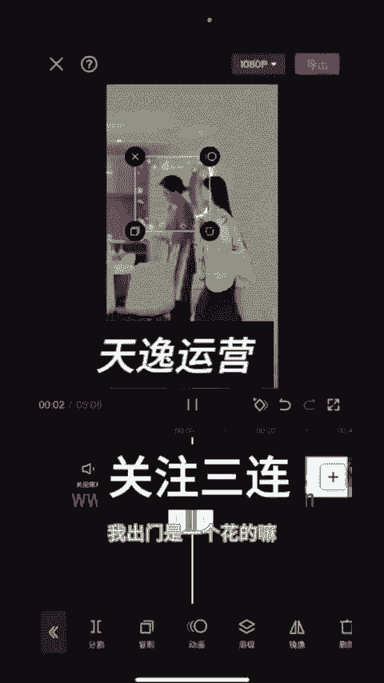
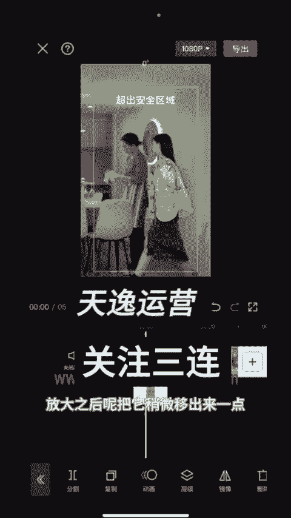

# 【2024版视频号运营教程】全B站最良心的视频号运营高阶教程合集！起号真的不难！ - P32：18-短剧硬插广告简单版_1 - 视频号教程9 - BV1pFyPYvEXU

给大家录制一下我平时怎么剪辑的，我们把要剪辑的广告，还有剧情都找好，去好水印之后，我们导入剪映，我们先导入剪映，对不对？我们比如说这个剧情我要剪这个剧情。然后首先我们我们导入进来。

第一步是选中它进行一个放大。放大之后，我们把它你可以往左边移。

然后呢，我们找到你不要管它，然后我们找到我们的剧情的一个精彩的一个部分。就是我们小时候看电视，大家都知道的，对不对？看到最精彩的时候呢，然后来就是突然给你来个广告那种感觉嘛。大概就是两分钟往后一点点。

他在打电话的时候，他说陈阿姨过来解释一下，对不对？这个就是精彩镜头的一个部分，然后点分割，然后呢，我们点加号插入自己要卖的广告，这些广告都是提前去好水印的，对不对？我们直接添加进来就可以了。

整个广告要在1分钟1分20秒左右，太短的话，转化率很差。然后我们导入进来之后。这边。我们刚开始放大，不是移了一个方向嘛，那我们现在给它调一个方向，就是它上半段，我们跟下半段。他的位置做一个。

参数的一个调整嘛，然后这样子整个视频就剪辑好了，然后再加贴纸。

🎼贴纸的话，我现在会加这种闪闪的发花的嘛，然后把它放大，放大之后呢，把它稍微移出来一点。

先对齐他，对齐他，我们再去移吧。然后稍微移出来一点，对不对？它这里就有了。🎼然后你再看一下然后这个贴纸加完之后，我们再去加那种4个闪闪的。比如这种带下的不明显的，我们把它对齐整个屏幕，对不对？

然后点复制123复制4个，因为我们要4个角落各放一个。然后这里还有一个。然后呢，我们再加一个那种类似于电影感的这种这种也可以。一般加个这个也可以，这个都随意随便你用那种电影杆的任意一个都可以。

然后也是对齐整个屏幕就好了。

然后我们再加一个画中画，画中画的话建议加自己的自拍。就比如说随便找一个，然后放大放大之后，我们点粉合模式，这里随便挑一个拉到5以内3，反正5以内都是可以的，然后对齐就可以了。

然后我们选108060帧导出就可以了。基本上这样去剪辑都能跑。

